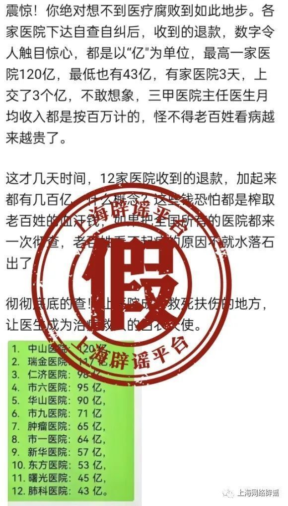

# 医疗反腐风暴下有医院收到数十亿退款？官方辟谣

近期，医药反腐备受关注。7月28日，中央纪委国家监委召开动员会，部署开展全国医药腐败问题集中整治。多地医疗机构迅速开启自查自纠，公布监督举报电话。在医疗领域反腐风暴下，上海辟谣平台注意到，不少自媒体账号开始大搞标题党，借医疗反腐之名蹭流量、带节奏，造谣生事、混淆视听，公众要注意辨别。

例如，账号“小唐35865B1k” “坐看云起的兔子”等账号传播一组所谓的上海众多医院“自查自纠”后的“退款数据”。

经上海辟谣平台核查比对，该组数据为自媒体账号拼凑编造。通过检索，可以发现其数据源头实际是人民日报健康客户端于4月份发布的文章《中国医院2023年收入预算前100公布》。该名单依据是全国各级政府部门发布的省属医院的2023年预算，由第三方机构“医院咨询绩效新知”聚合500多份预算数据得到的。由此可见，相关数据并非自媒体所称的“退款钱”。

截至发稿，上海辟谣平台获悉，经溯源调查，首发谣言的账号来自湖北一男性网民，公安和网信部门将对此账号依法严肃处理。

上海辟谣平台还注意到，自媒体账号为了博取流量、吸引眼球，还有“套路”：

首先，使用煽动字眼。这些自媒体大多以“反腐之士”自诩，在标题和行文中用“震惊”“绝对想不到”“不敢想象”“触目惊心”等用词引起读者注意。

其次，假装权威、移花接木。自媒体账号为了提高谣言传播量，会编造篡改官方报道内容，假扮成权威、捏造所谓的“内部消息”。以上述“上海医院自查自纠结果”谣言为例，自媒体故意篡改了人民日报健康客户端的报道，将原文掐头去尾，仅引用有助于谣言传播的数据，移花接木编造退款数。

 _人民日报健康客户原报道_

最后，主观臆断。综观各种自媒体的谣言，行文中通常没有任何证据材料，只有臆测，却动辄使用“怪不得”“恐怕都是”“不就水落石出了”等语句，似乎作者掌握了医疗反腐的关键信息。殊不知，他们的这些做法只是用接地气的词汇来降低信息理解难度，利用公众对医疗腐败的深恶痛绝，引发共鸣，来提高其谣言的传播量。

必须看到，这段时间，多地医疗机构已通过自查自纠，公布多起案例，反腐已在医疗系统形成广泛共识。在这样的背景下，部分自媒体借助“医疗反腐”的名义捏造事实、造谣传谣，扰乱公共秩序，不仅无助于医疗反腐，而且利用公众为自身谋利。建议网友仔细甄别，不要轻信各种没有依据和来源的“反腐报料”。

（来源：上海网络辟谣）

