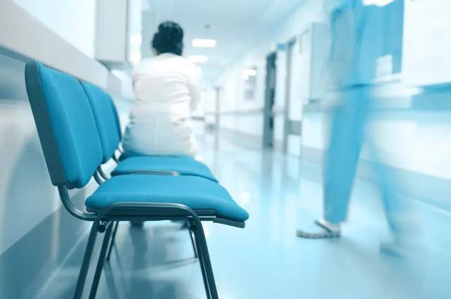
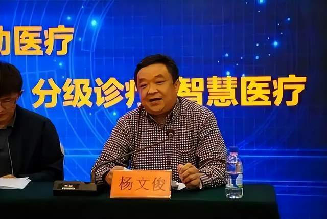
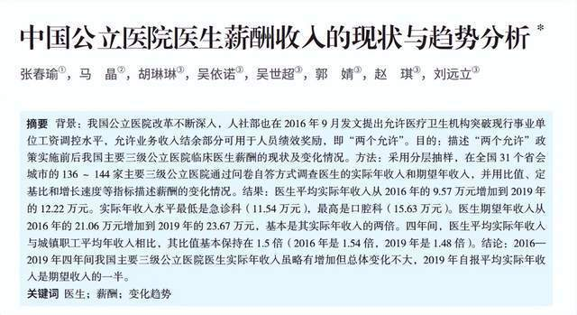
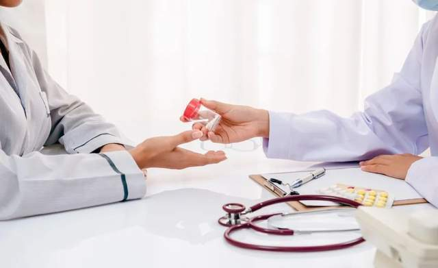

# 医疗反腐风暴发酵，媒体：还是想为医护人员说几句话

**医疗反腐，不应也不会只是一场风暴，也是一个深化医疗改革、重塑医生形象、修复医患关系的契机。**

**撰稿丨龙之朱**

8月以来，最引人瞩目的，或许就是医疗反腐了。

风暴起，整个行业都察觉到森森寒意。各种学术会议延迟了，不少医院开始鼓励医生主动退赃了，资本市场也受到波及了……

也有担忧的声音出现。

8月10日，北京大学人民医院心内科主任医师孙宁玲教授在社交媒体上发文称，坚决拥护医疗反腐，但别打击一大片，“似乎医生们都失去了医疗道德，给患者开好药，用进口的设备进行检查和治疗是为了拿回扣，事事都在侵害群众利益。”“使得医疗行业人人自危，形成患者对医生不信任感增加。”

_图/网络_

纷纷扰扰中，社会当听得进这些似乎“不中听”的声音，有果决有审慎，于当下虑长远。医疗反腐，自要除恶务尽，也要注意别一刀切加剧医患对立。

01

**何以院长**

最近两天，有两条院长腐败的新闻被反复征引。

一是云南省普洱市人民医院原党委副书记、院长杨文俊无视其他领导反对，以3520万元购进一台进口价1500万元的医疗器械，杨文俊吃掉1600万元回扣。

再就是中山市坦洲人民医院原党总支书记、院长罗勇收受病人红包、医药代表回扣，收取设备代理商高额回扣，涉案金额2980多万元。据统计，
**罗勇被抓后，中山市坦洲人民医院今年1-5月人均就医成本下降1400余元。**

考虑到截至8月12日，全国已有176名院长被查，举一隅而三隅反，可知此一腐败之恶、反腐效果之显，触目惊心背后，就是“早该如此”。

_▲杨文俊（图/网络）_

不过，纵观这些落马院长书记的作为，尽管其贪腐范围在医在药在设备， **但根本特征却仍为滥权。**

何以如此？

其一，在当下的医院收支、分配体系中，院长、书记拥有很大的决策权以及自由裁量权。他们中间很多人当然还顶着专家教授的头衔，也可能会参加手术或医学研究，但其角色定位则更接近官员。
**所犯之事，多为职务侵占、权钱交易、利益输送等，与一般滥权官员并无二致。**

其二，医院院长书记兼有为单位搞钱的身份，也加剧了其滥权程度。目前，我国公立医院走的是“以药养医”的“市场化”路线。公立医院的政府投入在10%左右，而90%的收入都要医院自己去创收，国家基本上是不管医院的投入运营和分配的。这些权力相当一部分归于院长书记。

概言之，每一个院长书记出事，都与权力缺乏监督有关。打掉一批院长，医护人员是欢迎的，理论上处境也会更好的。

02

**何以医生**

不过，也不一定。

因为要搞创收，要“以药养医”，医院会给每一个科室和医生下达指标，开药也好、检查也罢，医疗活动都与创收、与绩效分配密切相关。但在分配时，普通医护往往并无太多话语权。

武汉大学健康研究院副院长孙菊曾指出，即便是在发达城市的医院，医务人员的薪酬支出也只占总支出的30%左右（国外占到了60%），
**医务人员待遇水平普遍较低。**

不仅如此，因为医护人员与病患直接接触，往往会承受最直接的压力。

这也是很多分析人士指出的，正因为收入偏低，导致医生追求药品、耗材回扣和红包等灰色收入问题时有发生。但现实地看，这些年红包的情况好了很多，剩下的药品耗材回扣，大部分其实仍归到了医院创收的大池子里，为权力之手予取予夺。

这样讲，并非是为医生辩护，不过是把江湖这点事掰开了说道说道而已。

而从大的环境看， **医生知识技术与收入回报，也不匹配。**

据第一财经报道，一个医学大学生，要经过规培（住院医师规范化培训）、住院医生阶段才能一步步晋升为主治医生、副主任医师、主任医师，一位医生介绍，
**硕士规培属于最底层，干着最繁琐的工作，可能每个月到手工资只有1600元。**

中日友好医院等单位的作者曾在2020年发表的一项《中国公立医院医生薪酬收入的现状与趋势分析》研究显示，我国主要三级公立医院医生平均实际年收入从2016年的9.57万元增加到2019年的12.22万元。2016—2019年四年间我国主要三级公立医院医生实际年收入虽略有增加但总体变化不大。

_▲研究论文《中国公立医院医生薪酬收入的现状与趋势分析》（图/《中国研究型医院》2020年第1期）_

医学是实践科学，要不断操作才不至于手生，还要继续学习，追踪最新的技术。国内有医生发文称，“医务人员是最苦最累又最受气的一群人，工作量和风险比起外国同行而言只高不低，而薪水却远远低于后者。”

现实地看，当下的医疗反腐如果不去改变基层医生的薪酬体系，不求破解过于集中的政治和学术权力， **不仅难以改变医生处境，恐怕也很难真正提高普通民众的福祉。**

事实上，已有人表示，通过此次反腐，“可能会因为各种改革导致医生的工作量拉高，使用药品的种类缩窄，权限降低。”而这些代价，说到底，还是要老百姓来承担。

03

**关键还是制度**

一场轰轰烈烈的反腐行动，一旦让人产生“洪洞县里无好人”的观感，加剧医患之间的撕裂，无疑会很麻烦，也不符合民众的意愿和这个社会的公共利益。

作为一个知识浓度、实践技术“双高”的群体，医护人员的重要性无需多言，如何在铲除脓疮、泼掉脏水的同时，留住新鲜的血肉，呵护医生的元气，显然是当下亟需解决的问题。

**这就需要，有破亦有立** ，既要拔掉眼中钉，解决恶性个案问题，也要立足长远，着眼常态化制度建设。

要破除医疗机构“一把手”或关键岗位过于集中的权力，破除在医药采购、设备引进等方面的暗箱操作；推进公立医院的预决算公开，药品和医疗器械实现大规模集采，扩大信息透明。

要降低与业务量挂钩的奖金比重甚至取消该类奖金；提高医务人员基础薪酬待遇，体现医术的价值，允许医生多点执业，允许符合条件的一线医药从业者参与到药品研发并获取报酬。

要治理种种假学术之名的利益输送，但也要明确参与学术活动和药品推广交流活动的规范，不能一刀切。

要依法查处涉利益输送、行贿的“医药代表”，但也要区分正常的商业推销，评估设备、药品、耗材等交易中的合理销售费用。

 _图/图虫创意_

**制度逼人作恶，制度也引人向善。** 这中间的关键，是决策的科学公平，是利益的公共取向。

举个小例子，有网友说，不少医院在高干病房上的装修配套上做到极致，可普通群众却一床难求。还有个别干部也许并不需要住院，却依旧占着公共资源，反正又不用花钱。
**这算不算是“医疗腐败”呢？**

无论如何，医疗反腐，不应也不会只是一场风暴，也是一个深化医疗改革、重塑医生形象、修复医患关系的契机。

惟有解决好药品设备采购、医疗保险监管、公立医院补偿、医务人员薪酬待遇激励等一系列问题， **从制度、机制层面上完善监督、服务、保障体系，才能把事情办好。**

循此，让医院和医护人员拥有阳光体面的收入，让医疗回归医者仁心、救死扶伤的本质和初心，方能让老百姓真正受益。

