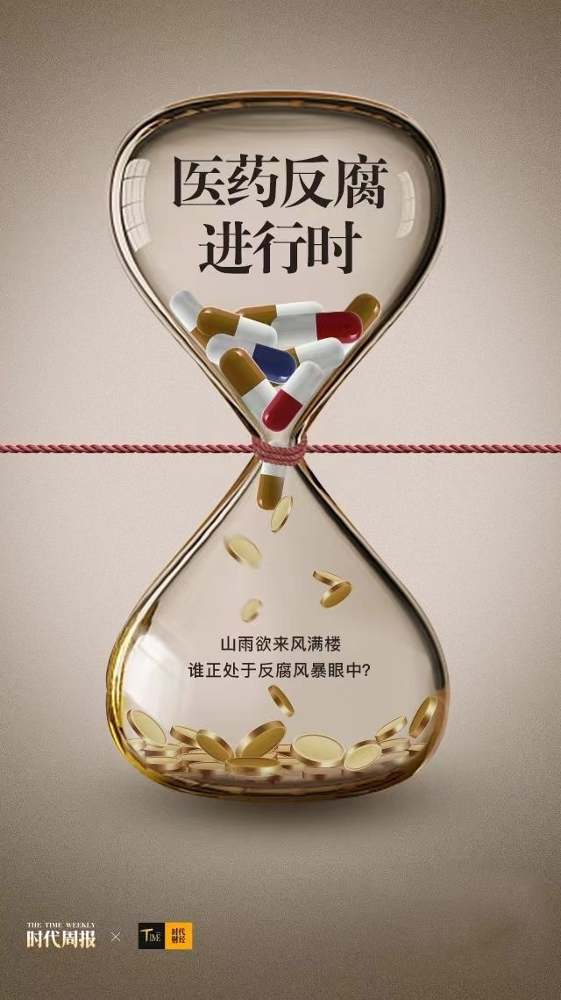

# 反腐风暴下的医院：医生减少手术并删医代微信，学术会议赞助费引争议

本文来源：时代周报 作者：杜苏敏

医药反腐风暴汹涌。

这一轮风暴已经酝酿多时。7月28日，纪检监察机关配合开展全国医药领域腐败问题集中整治工作动员部署视频会议在北京召开。这次会议指出，要深入开展医药行业全领域、全链条、全覆盖的系统治理。加大执纪执法力度，紧盯领导干部和关键岗位人员，坚持受贿行贿一起查，集中力量查处一批医药领域腐败案件，形成声势震慑。

业内人士普遍认为，这一轮医药领域的反腐，力度罕见，堪称“最强医药反腐”。

紧张气氛很快在全行业蔓延开来。在资本市场上，医药股遭遇“黑色星期一”，在业内，医药代表解散工作群、居家“放假”，多场学术会议宣布延期，有医院要求药企开除药代，有院长、书记、药企高管相继被查……新闻一个接一个曝出。

与此同时，广东、广西、海南、山东、湖北等省份陆续发声，要求集中整治医药领域腐败乱象。据不完全统计，近日，已有北京、四川、福建、内蒙古等近十个省市卫健委公布了医药领域腐败问题集中整治工作期间的举报电话。

**医代休假，有采购项目暂停**

医药反腐行动持续推进，医药代表成为舆论关注核心。

有医药代表向时代周报记者直言，由于当下情况严峻，公司要求他们先居家办公半个月。另有医药代表也表示，现在情况非常紧张，医院的医生、主任都不让联系了，“都把我微信删了，（我们只能）原地休假”。

一名正在实习的医药代表向赵蕊（化名）也向时代周报记者透露，原先工作是每天在医院帮着主任们维持秩序，8月4日开始被告知不再需要去医院。医药反腐风暴下，她开始动摇，“我打算干完这个月就离职”。

反腐行动常态化加之集采全面落地过后，不少医药代表的职业生涯岌岌可危。今年以来，药企裁员的消息不绝于耳，尤其是跨国药企巨头。裁员潮中，首当其冲往往是医药代表。有业内人士指出，随着医药反腐持续推进，医药行业的裁员潮或会来得更猛烈。

此外，药企也更加重视对医药代表的合规管理。近来网上流传的多份药企内部通知都要求药代出行需备案登记，也有药企要求药代的所有拜访均改为院外拜访、家访和宴请，并确保合规拜访。

医疗设备的采购、药品的进院也可能在短期内受到一定程度的影响。一家医疗设备厂商的相关负责人林明（化名）向时代周报记者介绍称，“当前医药反腐的主要维度分别是院内反腐和学术端反腐。院内反腐涉及药品、耗材、设备等（购销环节），这方面其实一直都在做；学术方面，业内对于合规的标准尚不清晰，目前还在等待更明确的政策。”

该负责人坦言，这次反腐对于设备厂商和代理来说，肯定会有影响，“本来项目要采购了，由于还没确定方向，项目就先暂停了。”

医院采购的完整流程需要进行招投标。林明解释道，一般来说，医疗设备的招标涉及金额比较大，目前很多采购项目暂停了，也就到不了招投标阶段，企业的招投标受到较大影响。“企业要养人，要支出，成本很高。如果暂停的时间太长，企业会面临收入压力，可能会慢慢减少人员。”

一台医疗设备要进入医院，过程并不容易。据林明介绍，设备首先要经过试用，看是否能够满足临床需求；之后医院方面再进行设备调研，看市场上有哪些同类设备，各自优劣势如何；调研后再进行招投标的参数设定，招投标根据是否达到参数进行加分、扣分，谁的分数高，最终在招投标中胜出。关于采购的方式，林明介绍，医院方面可能会以科室联名的方式进行采购，不过市面上仍以单个科室单独采购居多。

在林明看来，医疗设备进入医院的每个环节都可能存在腐败，也可能存在操控。常见的即“定制式”招投标，通过巧设“技术参数”“药效参数”等特定条件，打着“科技”“药效”幌子，加码“定制”招投标筛选规则，变相达到与“指定”医药公司长期合作、双向受益的目的。

**漩涡中的医护人员**

医院似乎成为反腐风暴漩涡。然而，受波及程度不同的影响，不同地区、科室的医护人员的反应也不一。

本轮反腐风暴迅速刮向全国各省，而广东的反腐力度尤为明显。据媒体报道，截至8月7日，本月至少已经有10名医疗领域人士被宣布接受调查，其中广东查处5人。而从2023年初至8月6日，广东已查处医院院长、书记41人；同期，全国已公开通报被查的医院院长、书记达168人。

也有省份主动公布今年的反腐成果。8月11日，“陕西纪检监察”微信公众号发布消息，截至8月上旬，全省各级共收到专项整治问题线索2521件，办结2371件，处理人员937人。47件问题线索移交至纪检监察机关。累计组织32476家行业行政部门、医疗卫生机构开展自查自纠，医院排查临床科室和职能科室23331个，自查发现问题7994个，已整改问题7390个，其余问题加快整改中。此外，其还披露，今年以来，通过主动归还、冲抵住院费等形式，累计退还患者及家属“红包”3470个。

 _图源：图虫_

除了少数被调查或本身存在问题的人，对于多数普通的医生来说，即便是纪委入驻调查，他们更在乎的还是先做好本职工作，出诊、查房、给患者做检查、进行手术等等，每天要做的工作实在太多。

广东一家三甲医院的医生刘馨（化名）向时代周报记者透露，其所在医院对于此次反腐工作特别重视，“上周连续三天学习，全体党员、中层干部（都要参加）。”不过，话还没说完，这名医生又忙着查房去了。时代周报记者在走访广东地区的某三甲医院时发现，即便过了中午十二点，个别科室的医生仍在叫号，给病人看诊。

对此，刘馨已习以为常。“医生坐诊到中午都是家常便饭，你可能还没见过我们病房的医生从早干到晚，有人下了夜班本来八点钟可以走的，实在忙不过来也不能走，这个都不算什么。”

另一名胃肠外科的主任医师在谈到近来的反腐工作时也显得十分淡定，医院发文是有一些，但自己没太关注。在他看来，普通医护人员也没什么可紧张的，还不是照样干活。“有些人要紧张，只能是有事儿的医生或领导才会紧张。一般的医生也只是普通老百姓。”他表示。

从业已有十年的基层医护人员张励（化名）也能明显体会到这次医药反腐力度的加强。而她所在的医院近期就反腐工作多次召开会议，“这在一定程度上也影响了我们的工作节奏，因为工作仍然是排班制，（每天）超负荷工作。”

除此之外，也有医生放缓了工作节奏。8月10日，中南大学湘雅三医院的医生李威（化名）告诉时代周报记者，近期医生确实都不愿意做手术。

就在采访李威的同一日，湘雅三医院9名医务人员实名举报呼吸与危重症医学科主任。据人民网报道，8月10日湖南省卫健委、中南大学联合发布情况通报称，湖南省卫健委与中南大学高度重视，已成立联合调查组，正对相关情况逐一进行核实。一经查实，将依法依规严肃处理。

南方某省省会城市三甲医院医生在接受媒体采访时也提到，医院的骨科和眼科手术量大幅下降，原来可做可不做的手术，现在一律不做。

“受环境影响，现在医院内部质控严格，往往一台手术下来，医生挣得还没被罚得多。再加上骨科和心内科使用的耗材和药品量大，现在查得严，医生做个手术畏手畏脚，也害怕出错。”该医生透露，如今各个医院都有调查组进驻，审计账目、院内巡查，“在我们医院，一些科室的医生最近轮着休假，按时下班，这在之前十分罕见。”

**学术会议是与非**

此外，“学术会议”也引起了业内激烈的讨论。或受医药反腐持续高压影响，8月以来，已有至少10场即将举办的医药行业学术会议、论坛等宣布延期。此外，还有部分学习班、培训班也在近日宣布延期举办。

8月10日，北京大学人民医院心血管高血压科主任医师孙宁玲教授在网络平台上通过个人账号发文称，学术会议是医生们医疗信息交流，新知识传播，疑难医学问题商讨的平台，是促进医生技能提高的重要一部分，在政府不出资的情况下，以医学学会和协会平台在企业赞助下开展这些学术活动，这本是好事。

她指出，但在本次医药反腐中，把企业赞助开学术会议说成腐败、专家拿讲课费是腐败，往返交通，住宿自己不付也是腐败。“进行学术会议和交流不是全球的惯例吗？不是每个行业的惯例吗？规范的、按照国家的要求举办会议领取费用是合理的，要打击的是那些不规范利用学术会议套取经费为己用的不法行为和个人。”孙宁玲称。

李威也对此表示不解，“我们是教学医院，给学生或者同行正常讲课，又不是打广告，没有退的道理吧？”

事实上，随着药品和医疗设备的日新月异，临床医生并不总是了解每一款新药或设备的使用，加上医护人员每年继续医学教育、修学分的要求，也让学术会议发挥了一定的作用。但现实情况存在灰色地带，的确有企业打着学术推广的名义，在医药领域进行利益输送、实施商业贿赂。

据相关规定，医护人员每年需要继续医学教育学分且不低于25学分，参与学术交流活动可获取学分，但需要缴交注册费用。张励给时代周报记者算了一笔账，自己平均每年要参加8-10场会议，每场会议的报名费在500-1000元不等，有些会议科室可以报销报名费。差旅方面，因为基本在市内参会，不涉及这部分支出。

“培训会的水平参差不齐，取消较低水平、重复课程的培训，能一定程度减轻基层医护人员负担。”她表示。

林明透露，对医药行业来说，举办学术会议是一种传播的形式，需要一定费用，医院科室经费有限，难以承担这一费用。“企业赞助也是其中的一个解决费用的方法，目前需要去调查其中违规的部分。”林明说。

**有多少腐败的空间？**

监管部门早已关注到医药领域商业贿赂问题。

2023年1月3日，中央纪委国家监委发布的文章指出，以医疗领域为例，随着对商业贿赂案件查处力度不断加大，一些医药企业采取更为隐蔽、复杂的手段，为其贿赂行为披上“合法外衣”。如有的在医药购销环节给付医院工作人员回扣；有的通过生产环节虚高价格采购原料药、流通环节虚假交易等方式套取资金进行贿赂；有的通过生产环节虚抬药品价格、流通环节虚假交易等方式套取资金进行贿赂。

2月6日，中央纪委国家监委又发布《深度关注|严查医疗领域隐蔽利益输送》，强调要深挖彻查隐蔽利益输送，持续纠治医疗领域腐败和作风问题。

5月10日，国家卫健委、公安部、财政部等联合印发《关于印发2023年纠正医药购销领域和医疗服务中不正之风工作要点的通知》（下称“《通知》”），要求切实推进全行业“受贿行贿一起查”。

7月21日，国家卫健委会同教育部、公安部、审计署等联合召开视频会议，明确部署开展为期1年的全国医药领域腐败问题集中整治工作。这次会议也被视作本轮反腐大幕拉开的标志。直到7月28日，由中央纪委国家监委牵头部署的全国医药领域腐败问题集中整治工作会议召开后，反腐之风愈刮愈烈。

_图源：中央纪委国家监委_

此前，医药领域的反腐工作一直在开展。

《中国卫生事业管理》发布的相关论文显示，通过分析2013-2021年裁判文书网以及相关行政部门提供的公立医院医疗腐败刑事判决书1952份发现，2013年至2017年，披露的医院腐败案件的数量基本呈现逐年增长的趋势，到2017年达到了峰值，2018年大幅度减少，2019年又有回涨，2020年以后逐年减少。

该论文指出，医院内的腐败所涉及的环节主要有医疗器械、药品、耗材、医保、基建，这当中，基层公立医院的腐败较容易发生在药品环节，二级以上公立医院的腐败较容易发生在医疗器械环节。

北京大学中国健康发展研究中心主任、权威医改专家李玲教授在接受媒体采访时提到，医疗腐败其实是和创收连在一起的，这背后其实是机制的问题，医院拥有较大的自主权。据其介绍，公立医院的运营并非由政府完全负责，大多需要医院自己去创收。

“公立医院基本上归院长管，医院的日常运营得自己创收，给医生护士发多少工资，基本上都是医院内部做决定，所以可以想象这里面有多少腐败的空间。”她表示。

2019年《廉政瞭望》杂志发表的文章也指出，一些公立医院只重视收益，忽视医院的管理，尤其是“以药养医”、药品购销不公开、药物流通环节过多、医务人员的薪酬与激励制度不合理等这些因素，严重危及到我国医疗卫生体系的建设和发展。

对此次医药反腐风暴，李玲直言：“医药反腐要治本，就是真正地让医务人员有阳光体面的收入，让腐败的成本极高。”

