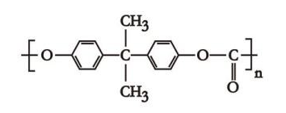

# 商务部：对原产于台湾地区的进口聚碳酸酯征收保证金

来源：商务部网站

根据《中华人民共和国反倾销条例》（以下简称《反倾销条例》）的规定，2022年11月30日，商务部（以下称调查机关）发布2022年第35号公告，决定对原产于台湾地区的进口聚碳酸酯（以下称被调查产品）进行反倾销立案调查。

调查机关对被调查产品是否存在倾销和倾销幅度、被调查产品是否对大陆聚碳酸酯产业造成损害及损害程度以及倾销与损害之间的因果关系进行了调查。根据调查结果和《反倾销条例》第二十四条的规定，调查机关作出初步裁定（见附件）。现将有关事项公告如下：

一、初步裁定

调查机关初步认定，被调查产品存在倾销，大陆聚碳酸酯产业受到实质损害，而且倾销与实质损害之间存在因果关系。

二、征收保证金

根据《反倾销条例》第二十八条和第二十九条的规定，调查机关决定采用保证金形式实施临时反倾销措施。自2023年8月15日起，进口经营者在进口各公司生产的被调查产品时，应依据本初裁决定所确定的各公司的保证金比率向中华人民共和国海关提供相应的保证金。

被调查产品的具体描述如下：

调查范围：原产于台湾地区的进口聚碳酸酯。

被调查产品名称：聚碳酸酯。

英文名称：Polycarbonate，简称PC。

结构式：

物化特性：被调查产品是分子主链含双酚A型碳酸酯基结构的高分子聚合物，外观通常为透明的圆柱状或球形粒子或固体粉末，具有抗冲击强度高、加工性能好、透光率高、耐热及耐寒性好等性能。

主要用途：聚碳酸酯可用于电子电器、板材/薄膜、汽车、光学、包装、医疗器械、安全防护等诸多领域。

对台湾地区公司征收的保证金比率如下：

1\. 台湾化学纤维股份有限公司 16.9%

(FORMOSA CHEMICALS & FIBRE CORP.)

2\. 台湾出光石油化学股份有限公司 16.9%

(IDEMITSU CHEMICALS TAIWAN CORPORATION)

3\. 奇美实业股份有限公司 17.0%

(CHIMEI CORPORATION)

4\. 奇菱科技股份有限公司 17.0%

(CHILIN TECHNOLOGY CO.,LTD.)

5\. 其他台湾地区公司 22.4%

三、征收保证金的方法

自2023年8月15日起，进口经营者在进口原产于台湾地区的聚碳酸酯时，应依据本初裁决定所确定的各公司的保证金比率向中华人民共和国海关提供相应的保证金。保证金以海关审定的完税价格从价计征，计算公式为：保证金金额=（海关审定的完税价格×保证金征收比率）×（1+进口环节增值税税率）。

四、评论

各利害关系方在本公告发布之日起10天内，可向调查机关提交书面评论意见。

中华人民共和国商务部

2023年8月14日

