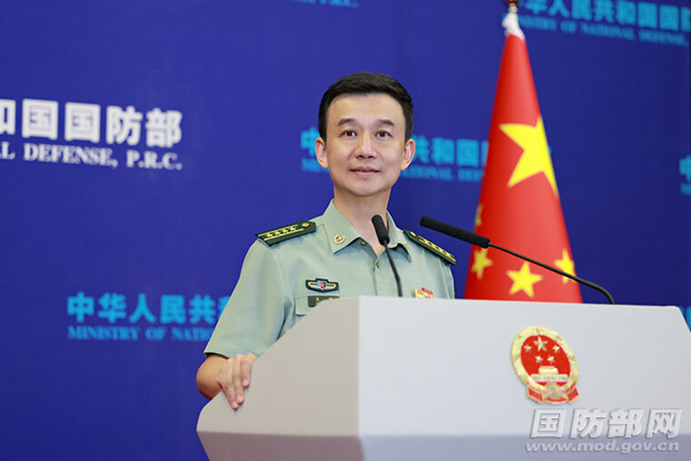

# 李尚福将赴俄罗斯出席第十一届莫斯科国际安全会议、访问白俄罗斯

8月14日下午，国防部新闻局局长、国防部新闻发言人吴谦大校就近期涉军问题发布信息。

应俄罗斯国防部长绍伊古、白俄罗斯国防部长赫列宁邀请，国务委员兼国防部长李尚福将于8月14日至19日赴俄罗斯出席第十一届莫斯科国际安全会议、访问白俄罗斯。在俄期间，李尚福部长将在莫斯科国际安全会议作大会发言，会见俄罗斯等国防务部门领导；访白期间，将与白国家和军队领导人举行会见、会谈，参访白军事单位。

来源：国防部网 责任编辑：李庆桐

