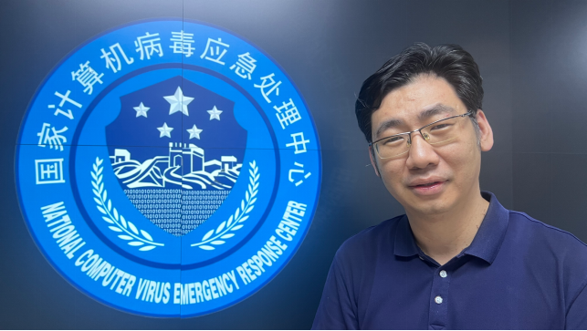

# 武汉地震监测中心被网攻“幕后黑手”已锁定 美国神秘侦察系统即将被曝光

【环球时报-环球网报道
特约记者袁宏】《环球时报》记者14日获悉，针对武汉市应急管理局地震监测中心的网络攻击事件，国家计算机病毒应急处理中心和360公司组成的联合调查组已取得新进展，发现了符合美国情报机构特征的后门恶意软件。下一步有关机构将向外界公开披露美国政府一直处于高度保密的某全球侦察系统，其对我国和世界各国国家安全和世界的和平安全都构成严重安全威胁。

7月26日，武汉市应急管理局地震监测中心报警称，该中心发现部分地震速报数据前端台站采集点网络设备被植入后门程序，此事引起外界广泛关注。国家计算机病毒应急处理中心和360公司随即组成联合调查组赴武汉调查取证。国家计算机病毒应急处理中心高级工程师杜振华对《环球时报》记者表示，目前，联合调查组已经在受害单位的网络中发现了技术非常复杂的后门恶意软件，符合美国情报机构特征，具有很强的隐蔽性，并且通过恶意软件的功能和受影响的系统判断，攻击者的目的是窃取地震监测相关数据，而且具有明显的军事侦察目的。

_杜振华_

**美国情报机构为什么锁定地震监测系统？**

地震之后，各国相关机构会对外公布发布震源位置、震级、深度等相关数据，作为一项民用基础设施，地震监测系统为什么会成为美国情报机构军事侦察的目标呢？杜振华介绍，我国是遭受地震灾害最为严重的国家之一，多次发生造成严重人员和财产损失的地震灾害。“因此我国高度重视地震监测和地震预警工作，为了提高地质灾害的监测预警能力，地震监测数据并不限于震级震源等基本信息，还包括地表变形监测数据、水文监测数据等丰富的地理地质数据；这些数据同时也是具有很高价值的军事情报数据。因此，美国情报机构对地震监测中心的网络攻击是一次有计划有预谋的网络军事侦察行动。”

全国政协委员，安天集团董事长、首席技术架构师肖新光接受《环球时报》记者采访时进一步解释说，震源位置、震级、深度虽然是公开发布的信息，但这是基于多传感器的一个感知计算结果，“这些传感器所感知采集的综合震动声波数据，尤其是次声波数据，对研判地质地形、分析武器系统试验、核试验等均有重要情报价值。”

 _肖新光_

而且这只是美将网络目标对准地震监测等系统的原因之一，肖新光还分析说，当前这部分信息获取只是相关行为体已被曝光出来的行为活动，还有很多针对其他领域的信息窃取尚未浮出水面。凭借其本身对全球的综合探测能力，加之多方位的入侵窃取和其它综合手段运用，获取我方各种各类遥测数据，再综合其他多源辅助数据，就形成了对我方经济社会运行甚至军事行动的分析、研判、归因、定位等能力。

**若攻击者篡改地震监测数据触发误报警，或导致社会恐慌**

专家们认为，针对包括地震监测系统在内的民用基础设施遭受到网络攻击也一样会导致非常严重的后果。

杜振华举例说，如果此次攻击者对地震监测系统进行了恶意破坏，当地震发生时，系统就无法有效提供准确数据，影响地震预警和灾害评估工作，进而导致更加严重的人员财产损失，“更加危险的是，如果攻击者篡改地震监测数据，触发误报警，可能导致社会恐慌和秩序混乱，造成无辜群众伤亡。”

肖新光也表示，遥感遥测体系和数据是必须重点保护的国家战略资源。这些数据能从宏观到微观展示我国经济社会的基本运行，是综合决策、应急响应的综合支撑，是国土安全和国家安全的支撑资源。

“美方情报机构不仅针对各种信号情报进行主动采集，也长期以来通过多种方式获取他国地形、地质、地球物理、气象、水文等综合地球系统科学遥感遥测数据作为战略情报，获取手段包括通过盟友情报机制共享，胁迫高科技公司提供，以及利用学术、科研活动套取等。”肖新光表示，此次武汉监测站事件的发现不是偶然的，由此可以判断，网络攻击入侵窃取已成为美方获取他国遥感遥测数据的最低成本途径。美方建设了一系列信号情报采集分析处理系统，如针对电磁信号监听获取的“梯队”项目、针对电信运营商的“主干道”项目、针对美大型IT和互联网厂商的超级访问接口“棱镜”项目等。

肖新光还透露，“我们会同有关部门经过多年持续跟踪，近期将对美国政府的某全球侦察系统进行公开披露，它对我国和世界各国的国家安全和世界的和平安全都构成了严重安全威胁，对此，必须高度警惕、严密防范。”

**美对民用设施发动网络攻击违反国际法**

事实上，在“棱镜门”、“影子经纪人”和“维基解密”等事件中曝光的美国国家安全局（NSA）、中央情报局（CIA）大量内部文件表明，美国作为名副其实的“黑客帝国”“窃密帝国”，其网络情报收集活动的目标是“无差别”的（包括其盟友），全球范围内的民事机构和个人都是其网络攻击的对象，充分暴露了美国在人权问题上的双重标准和虚伪面孔。

杜振华进一步表示，美国军事情报机构利用自身信息技术优势针对民用基础设施发动网络攻击是明显违反国际法的犯罪行为，严重侵害了我国国家安全和社会公共利益。“事实上，长期以来，美国对我国关键信息基础设施的网络攻击是全方位的，政府机构、高校、科研单位、大型企业都是其网络间谍活动的目标。美国妄图通过这种不正当的手段，全面窃取我国政治、经济、军事、外交等敏感情报，以遏制我国的发展进步，维持美国的世界霸权。”

长期从事计算机病毒防治技术研究工作和应急处置工作的专家杜振华建议，一旦我国关键信息基础设施遭受到有国家背景的网络攻击，相关单位必须第一时间向主管部门报告遭网络攻击情况；严格依据《网络关键设备和网络安全专用产品目录》开展网络安全能力建设；加强供应链安全管理，提高自主可控能力；定期开展网络安全演练，提高应急处置和恢复能力。

肖新光认为，中国网络安全整体产业体系虽然目前市场规模依然较小，但整体上从加密认证、威胁检测防护、系统防护、流量安全等基础能力频谱上来看，技术门类齐全，没有明显短板，“在与威胁的持续对抗，特别是发现、分析、曝光包括美方在内的高级持续性网络攻击方面，中国多家优秀的网络安全企业已经展示了自身的能力，成为了保障国家安全、捍卫网络空间命运共同体安全的产业支撑力量。”

他还表示，在网络安全能力上中国没有必要妄自菲薄，我们可以建立更具备进取性的目标，成为国家治理体系中的能力长板，成为相较于主要地缘竞合方的能力优势，在应对霸权国家综合打压，甚至面临高烈度安全冲突过程中不会成为重大制约和风险软肋，“我们可以通过强化网络安全的公共服务属性建设，通过加强对共性安全能力、弹性机制和网络安全基础设施的建设，达成网络安全风险整体基本可控、增量收敛的目标状态。”

