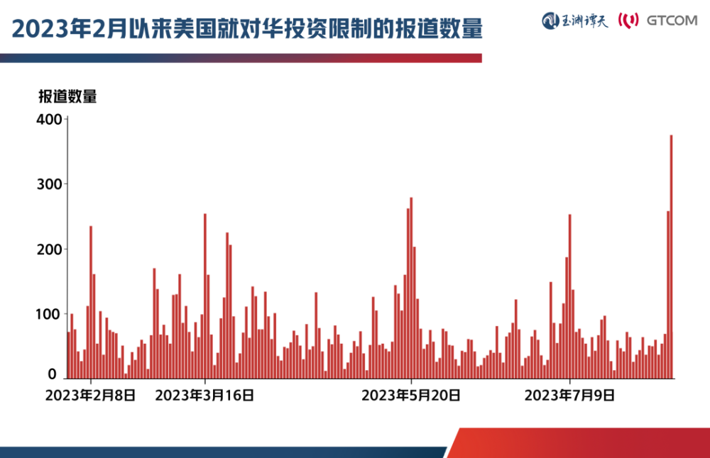
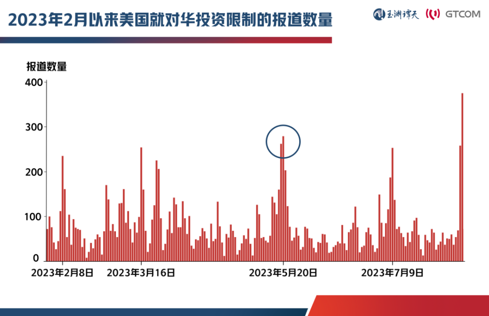

# 美国展开对华“攻心战”：经济领域营造“山雨欲来”，妄图一箭双雕

​这几天，谭主独家起底了境外势力。很多媒体在转载时引用了文章里的一个关键词，攻心战。围绕诸多领域，美国都在展开对华“攻心战”，其中，在经济领域发起的攻势格外突出。

谭主用大数据手段，挖掘了美国专门用来释放对华消息的所谓“知情人士”的发言。我们发现今年以来，有一个议题，美国每个月都会操弄，就是“中国经济”。

经济行为，不论是消费还是投资，都受到“预期”的影响，然而这个特点，却恰恰成为了美国借以影响认知，试图破坏中国经济预期和信心的武器。

最近，美国又采取了新的行动。美国总统拜登签署行政令，设立对外投资审查机制，限制美国企业投资中国半导体和微电子、量子信息技术和人工智能领域。

按照行政令的内容，这一审查机制的具体措施要落地实行，预计要到明年。但早在这项行政令出台之前，美国几乎每个月都要大篇幅报道对华投资限制政策要出台的消息。从外媒到境内媒体，报道中还充斥着“史无前例”这样的描述。

美国刻意营造“山雨欲来”的氛围，背后有着“一剑双雕”的企图：大肆向美国企业、盟友预告在华投资将会面临的风险，与此同时，要给中国人制造恐慌。

这种攻心术，比投资限制令本身，更值得警惕。

01 见事生风

其实，拜登政府从2022年就开始考虑对华投资限制了，但透过美国相关报道数量的变化，不难发现，对华投资限制开始成为媒体报道的热词，是在今年2月、3月、5月和7月。

既然美国一直都在酝酿，为什么在这些节点会变得备受热议？

先看3月中下旬和7月中旬这两个时间段，同时还发生了两件事：

3月中旬开始，美国企业高管掀起“访华热”，其中不乏苹果这样的高科技企业；

7月6日-9日，美国财政部长耶伦访华。

这两个节骨眼上，热炒对华投资限制，恰好跟美国民间和官方对华交流的两条行动线重合，只是巧合吗？

并非如此。实际上，美国在对华投资限制问题上，一直存在巨大的内部分歧。

为了能够尽快克服阻力，推动措施落地，今年3月，以美国总统国家安全事务助理沙利文为首的安全部门官员，就在极力推动拜登签署行政命令，但却遭到了财政部和商务部的反对。

就在同一时间，美媒开始大肆炒作“对华投资限制令”，同时在报道中强调对华投资限制的规模将会是“史无前例”的。

美媒偏偏要踩在美企加密同中国交流的节点上释放消息，就是为了先把“寒气”传递到美企身上——营造出投资限制令势在必行的声势，提前预告在华投资未来可能面临审查的风险，给不情愿离开中国市场的美国企业施压，让其有心理准备、早做打算。

要知道，在华投资的美国企业，对于所谓的对华投资限制政策向来是高度敏感的。

中国美国商会今年的一份报告显示，有66%的受访美企表示，“日益紧张的中美关系”是首要挑战。此前的报告中也显示，在技术和资源行业中，这种担忧更甚，超过三分之二的受访企业认为这是首要挑战。

压力之下，美国企业的信心倘若动摇，就必然会传导回美国财政部和商务部，干扰他们的立场和决策。

不过，这个阶段的“攻心战”并没有使各方的拉锯速战速决，美国财政部仍然坚决反对。

沙利文想的是把所谓威胁国家安全的领域尽可能多地列上，而耶伦希望更有针对性，避免对美国企业的在华投资产生广泛影响。

在最初沙利文提出的版本中，投资限制涉及的领域包含了 **芯片、人工智能、量子计算、生物技术和清洁能源** 。

最新的版本中却只剩了三个： **芯片、人工智能和量子计算** 。

财政部坚持去掉的两个领域，中美之间的合作之深，影响后果难以估计。

中美是世界上两个最大的清洁能源投资国。就在今年年初，美国知名车企福特公司宣布了与中企的合作，将投入至少35亿美元的资金，寻求与中国开展新能源电池新技术合作。

美国决策层的拉锯一直到了7月份，耶伦开启了访华行程。在同中方的会见中，耶伦表示，美方不寻求“脱钩断链”，无意阻碍中国现代化进程。

美国舆论风向随即发生了转变。之前一直渲染投资限制令“史无前例”的美媒，忽然口风一转，专门挑出了耶伦释放信息中的一句话“有针对性地收窄投资限制令的范围”放大报道，让这个亟待出炉的行政令，看上去“温和”了不少。

直到8月9日，这场拉锯以投资限制令的“靴子落地”告终。谭主在美媒的报道中又关注到了一个新的细节：投资审查的具体措施不会立刻生效。

对外经济贸易大学教授崔凡第一时间细致研究了行政令以及美国财政部相关文件的文本内容，跟谭主解释，
**行政令授权美国财政部牵头制定具体规则，而美国财政部在行政令颁布当天已经将自己制定具体规则的要点进行了公布并征求公众意见，在45天内接受初步评议，随后将在多轮评议后发布正式的规则提案。整个措施落地实施的时间预计将到明年，这期间相关规则细节还可能存在变数。**

显然，财政部团队虽然没能阻止投资限制的出台，但还是在极力缝缝补补，减少美国自身损失。

这个细节，暴露了美国的“攻心术”，先玩弄了一番“极尽渲染风险”的话术，试图统一内部共识；然后“再给点心理安慰”，在行政令出台后弱化给自身带来的危害影响。

02 偷换概念

出台这个投资行政令，除了希望统一内部政府各部门和企业的共识，美国还希望能在外部得到盟友的支持。

有美国官员说过，希望一旦华盛顿带头，其他国家就会采取行动。因为如果没有盟友支持，美国的行政令可能只会限制美国公司自己的投资，反而让盟友的公司趁虚而入赚取利润。

美中贸易全国委员会在行政令颁布之后就发表了声明，称希望政府能与美国的盟友取得更多进展，防止美国的单边政策不利于美国公司与外国竞争对手之间的竞争。

减弱自身竞争力，显然不是拜登政府想看到的。所以，拜登政府费尽心思力劝盟友国家建立联合投资审查机制。

这一联合审查计划原本计划是在今年5月日本广岛G7会议前后启动的。5月，同样也是拜登政府炒作投资限令台的高峰期之一。

在G7会议之前，拜登政府近乎直白地表示，美国在考虑对中国的投资进行限制，希望跟盟友们认真研究此事，达成共识，让限令发挥最大的作用。

怎么才能赢得盟友的支持，美国在认知层面，也想了个招数，移花接木——先潜移默化让大家形成认知共识，然后再引导大家采取共同的投资限制措施。

今年以来，美国在表述对华经贸关系时，一直在使用一个新概念，“去风险”。

不过，这个词，最早是欧盟委员会主席冯德莱恩提出的，当时冯德莱恩格说这话的语境，是欧洲过去一段时间，受俄乌冲突、金融风险等外部因素的影响，经济安全深陷困境。

沙利文不仅马上抄来了冯德莱恩的“新词”，还在对华政策的演讲中，特别表达了对冯德莱恩的认同，这是别有一番用心的。在沙利文的演讲中，美国所谓的“去风险”，直指中国带来的威胁。

做过一番铺垫之后，G7峰会，就到了美国该实现下一步目标，联合盟友推动投资审查的关键时刻了。要知道，G7当中，有四个都是欧洲国家，若能取得跟欧洲的共鸣，联合投资审查机制达成共识就会容易许多。

于是，美国媒体开始集中发力，为了防止盟友们不能理解美国说“去风险”的意图。5月份的美国《外交事务》杂志专门刊发了一篇解释“去风险”的文章，上来就明明白白地写着，“去风险”就是要限制中国芯片半导体等高科技领域的发展。

在G7会议期间，美国总统拜登首次公开提到了“去风险”这个词，具体表述跟沙利文几乎一样。

不过，这样的“攻心术”，效用却不及预期。

G7公报中最终并未出现对华投资限制，还格外提及了“与中国保持合作是十分必要的”。

德国总理朔尔茨专门在G7峰会期间表态，像是在羞辱美国，称将继续对华投资。今年一季度，G7国家中，德国等5个国家对华投资都在同比增长，甚至是暴增。

法国：增长635.5%

德国：增长60.8%

英国：增长680.3%

加拿大：增长179.7%

日本：增长47.7%

德国同比增长60.8%，相比自己的邻居，确实还有空间。

美国盟友为什么在投资中国上做出理性选择？除了实实在在的收益，更是早已熟悉了美国对盟友“攻心”之后，反坑一把的路数。

美国的所有对华限制措施，没有哪一个不想叫盟友一起，但是真一起之后，美国一直都是最占便宜的那个。

在对华投资限制之前，美国对华最主要的限制措施就是高科技领域的出口管制，为了劝说日本、韩国配合，史无前例要搞一场三国峰会，给足了面子。

里子呢？

上个月，日本落实与美国达成的协议，限制对华芯片出口。谭主从内部人士处了解到，日本这次限制的制程范围可能比美国还大。

这意味着，管制生效后，日本的设备进不到中国市场，美国就可以蚕食掉日本在华的这部分市场。日本替美国承受额外损失，还被美国反敲一笔。

欧洲也对这样的故事模式格外熟悉，一通配合之后，迎来的是《通胀削减法案》里，美国在一些高科技领域高高建起的贸易保护壁垒。

尽管美国一再游说，但无论日本官员，还是欧盟委员会都没有明确表示要和美国采取相似的对外投资审查措施。

当然，我们心里也要清楚，美国虽然还没有等到盟友对投资限制的支持，但还在继续炮制话语陷阱，试图让盟友国家乃至全世界都潜移默化地使用“去风险”的概念，加入“去中国”的行动。这场“攻心战”中，美国试图拉入更多的人，营造“狐假虎威”的认知效果。

只是一次次被美国背刺的现实结果，应该让真正的明白人，越来越清醒。

03 反制攻心

其实，美国攻心术，更大的目标，仍在动摇中国人的信心。

再回看美国最初开始炒作对华投资限制的时间，是在今年2月，也是中国刚刚度过春节，防疫转段后经济复苏的关键起步期。

这样的手段，美国从5年前就开始使用了。2018年美国掀起贸易战，同时就在跟中国进行一场心理的较量。五年前，可能还有人会紧张，会说赶紧妥协吧。

如果站在未来书写今天的中美历史，美国这次行动，确实也可以称得上美国对华科技战的一个新节点。不过，再面对美国的心理施压，我们的心态应该更从容了。

五年过去，我们发现，“纸老虎”的说法依然成立。

美国声势那么大，但五年贸易战下来，美国想切断中国与世界间联系的目标并没有实现，中国还是那个中国，中国还是120多个国家和地区的第一大贸易伙伴。

具体到科技领域，美国政府一直穷凶极恶，从出口管制到投资限制，未来不知道还有什么，越来越不讲道理，越来越没有底线，美国最想看到的，就是我们自己吓自己。但面对野蛮，不是只有野蛮一种办法。

就在美国努力劝说盟友们搞投资限制的同时，欧盟、加拿大、日本这些美国的盟友却在跟中国一起，推动全球多边投资规则的谈判——《投资便利化协定》。

参与这场谈判的成员涵盖了许多发达经济体在内的110多个世贸组织成员。上个月，这一全球首个多边投资协定的文本谈判，成功完成。

深度参与谈判过程的商务部原副部长、世界贸易组织副总干事易小准跟谭主讲述了这其中的艰难：

**要知道，在世界贸易组织几十年的历史中，欧盟、日本等一些发达国家曾提出过多边投资协定的议题，却因为其在投资准入和投资保护上的要求，跟发展中国家存在严重分歧，难以推进。**

这次文本谈判成功完成，是在中国等发展中国家的牵头协调下，历时6年才实现的。相关机构测算，《投资便利化协定》若顺利生效实施，可以为全球带来高达1万亿美元的经济增长收益。

6年，这个时间长度覆盖了这一轮美国对中国遏制打压的全过程。

当有人在怀疑全球合作，有人在唱衰全球化，也有人在坚定推动全球化。促成《投资便利化协定》，正发生在了美国对华投资限制之前。这对那些动辄就要妥协、放弃的人，无疑是一记耳光。

**谁说的美国要搞什么世界就要搞什么。‍**

**放眼世界经济，早已不是一言堂。**

新兴经济体和发展中国家对世界经济增长的拉动作用，在2001年就超过了发达经济体。

当越来越多发展中国家得以凭借自身的优势要素，进入全球价值链，自然也开始更多地成为被外资青睐的新目的地。

到2022年，发达国家吸引外资大幅下滑37%至3780亿美元，流入发展中国家的资金则上升4%至9160亿美元。发展中国家吸引外资的规模已经将近发达国家的2.5倍，且增长势头正盛。

不仅如此，发展中国家也开始更多地向外投资。这也正是中国得以推动《投资便利化协定》、捍卫全球化背后深刻的结构性力量。

西安交通大学法学院院长单文华，全程参与了中国常驻世贸组织代表团《投资便利化协定》谈判的工作。

单文华跟谭主提到，
**发展中国家吸引的投资和对外投资中，科技领域都占据着重要的比重。技术资本，包括科研企业和研究机构的科研投入、技术创新和知识产权。技术资本在全球更流畅地流动，本身就会给投资方和被投资方带来双向福利的增长，《投资便利化协定》创造的就是这样一个流通更加畅通的环境。**

美国也曾是全球化的受益者，只不过，当全球发展的利益与美国维护自身全球霸主的利益发生冲突时，美国的态度是“合则用，不合则弃”。

正如商务部8月11日发布的《美国履行世贸规则义务情况报告》中对美国行径的定义：多边贸易体制破坏者、单边主义霸凌行径实施者、产业政策双重标准操纵者、全球产业链供应链扰乱者。

美国正在放弃自己曾经走过的路，只基于自身绝对利益，做出选择，甚至为打压对手而到了杯弓蛇影、歇斯底里的地步。这恐怕是人们对今天的美国越来越感到迷惑和担忧的主要原因吧。

然而，当全世界所有国家一个个发展的诉求，变成具体行动，全球化就仍然有着绵绵不绝的动力。用口舌散布的迷雾，花样百出的“攻心计”，不应也不会阻挡这些实实在在的渴望与扎实的脚步。

正如习近平主席所说，
**人类历史告诉我们，有问题不可怕，可怕的是不敢直面问题，找不到解决问题的思路。面对经济全球化带来的机遇和挑战，正确的选择是，充分利用一切机遇，合作应对一切挑战，引导好经济全球化走向。**

面对问题，我们要敢于用勇气和智慧，作难而正确的选择。

