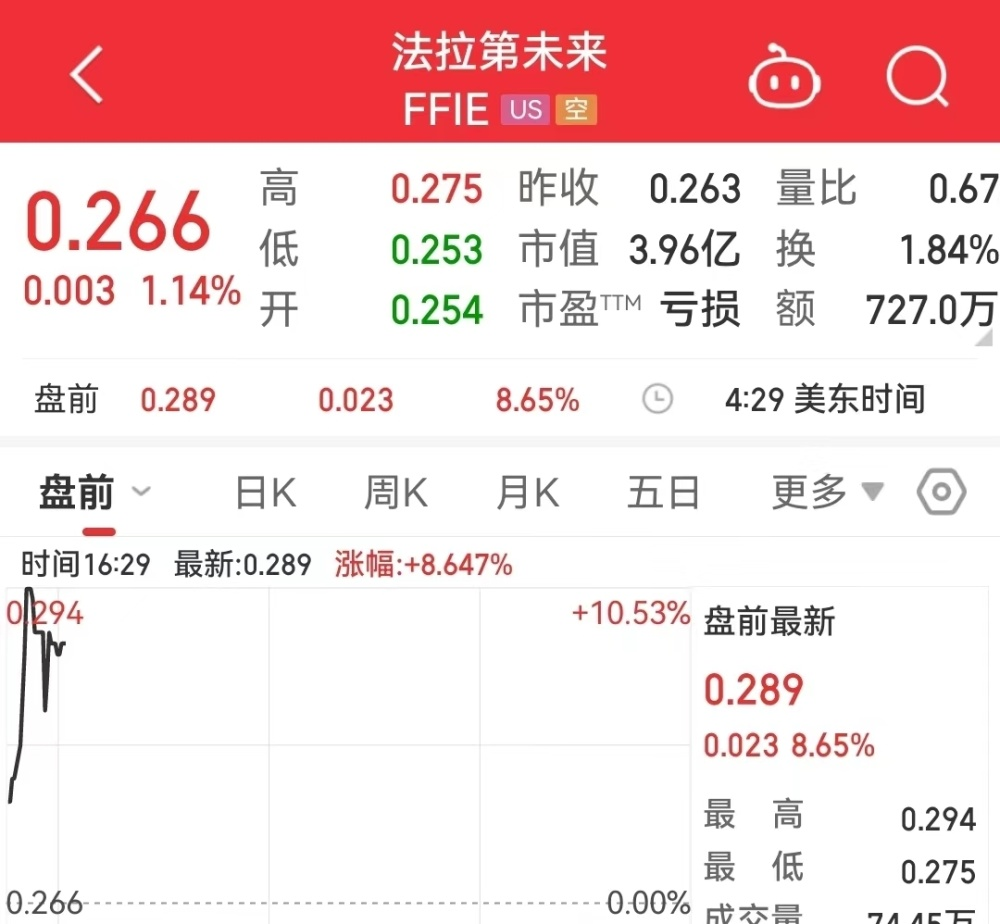

# 贾跃亭终于圆梦！亲手交付首辆FF91，法拉第未来盘前大涨9%

每经编辑：李泽东

据Faraday Future微信号消息，8月14日，Faraday Future（FF）宣布， **贾跃亭驾驶FF 91将新车交付给用户**
，作为南加州最大的豪华汽车经销商之一， **“Private Collection Motors”是FF的首个新车交付用户！**

**这是FF首次进入营收阶段并正式进入完整经营闭环阶段的标志性重大拐点。**

_图片来源：Faraday Future 微信号_

市场方面，法拉第未来（FFIE，股价0.266美元，市值3.96亿美元）美股盘前涨幅一度扩大至9%。

据介绍，8月12日，举行了新车首位塔尖用户交付仪式。

FF创始人兼首席产品与用户生态官贾跃亭、产品执行高级副总裁Matthias Aydt、产品市场总监与交付大使Scott Wang以及Private
Collection Motors的代表出席了此次活动。 **贾跃亭亲自驾驶FF 91 2.0 Futurist Alliance将新车交付给用户。**

_图片来源：Faraday Future 微信号_

与此同时，FF开发者共创节系列活动正式启动，在Monterey Car
Week期间开展一系列开发者共创活动将成为FF开发者共创节的一部分。FF将参加8月16日至17日的“FuelRun”活动以及8月16日的“Motorlux”活动。

FF将邀请开发者共创参与者，包括第二阶段共创交付的首批用户，以及开发者共创候选人参加8月17日的开发者共创签约仪式。

据介绍，FF还将与更多潜在用户和共创开发者签署FF 91 2.0 Futurist
Alliance的购车协议。公司期待很快宣布第二阶段共创交付的第二批用户的首位FF 91 2.0 Futurist Alliance车主。

 _图片来源：Faraday Future 微信号_

另据Faraday
Future微信号此前报道，在第二阶段开发者共创交付启动的同时，公司还计划通过推荐和邀请机制来招募更多共创参与者。潜在的共创开发者必须获得至少一位现有FF共创开发者或FF预订用户的推荐。此外，共创开发者需通过公司评估，才能在随后的第二阶段开发者共创中有资格成为车主。

 _图片来源：Faraday Future 微信号_

“在成功开启第一阶段共创交付之后，我们很高兴正式开启第二阶段共创交付"，FF创始人兼首席产品和用户生态官 **贾跃亭**
表示，“我们已经与来自各行各业的杰出人士签约，参与FF开发者共创项目。他们将为FF提供宝贵的反馈意见。我们相信，这体现了FF共创交付战略的创新性。
**随着第二阶段共创交付的启动，我们将向更多共创用户交付极智科技顶奢的FF 91 2.0 Futurist
Alliance。这是FF九年发展史上的重要里程碑** 。”

“FF 91 2.0 Futurist
Alliance的交付是FF发展的转折点。在我们庆祝公司产生营业收入、进入全新发展阶段的同时，我们期待在电动汽车市场开启更多新的可能性，进而增加FF的影响力。”陈雪峰补充道。

**据了解，FF 91 2.0 Futurist Alliance售价达30.9万美元（约合人民币224万元），全球限量300台。**

_图片来源：法拉第未来官网_

每日经济新闻综合Faraday Future微信号

每日经济新闻

