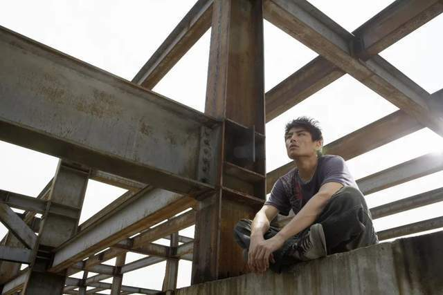

# 那些选择不交社保的年轻人

7月以来，全国绝大多数省份都公布了2023年度社会保险缴费基数，上海以12183元的缴费基数和7310元的基数下限高居全国第一，这也意味着，如果一个在上海工作生活的人想交社保，不管收入多少，都得负担至少2558.5元的基本养老保险和医疗保险费用。

社保，本来是给每个人托底的保障。有全职工作的人通常不会为社保烦恼，单位会承担大部分费用，然而，一旦失去工作，社保就需要花费精力和金钱才能继续维持。有人采取各种方式，挂靠、办理灵活就业，甚至自己开个公司，而现在，随着全国各地社保基数连年上涨，没有固定工作的人们，身上的负担又要加重。

为此，许多暂时没有稳定工作的年轻人和自由职业者，开始权衡交社保到底有没有用，对于他们来说，退休还很遥远，社保最大的作用是和这个城市的连接——买房、买车，过上稳定的生活，社保都是一个基础。而现在，他们觉得，这个连接，似乎也没那么重要。

**文 |** 曹婷婷

**编辑 |** 赵磊

**运营 |** 栗子

**社保涨了**

冉冉今年24岁，工作了两年，有10万存款。6月份，她裸辞了，想给自己一个gap year，体验一下自己喜欢的生活。

一番盘算后，存款还是够用一年的。但没了工作，社保也会跟着断，好在5月初，上海放开了灵活就业的户籍要求，她可以以灵活就业的身份自己交社保，每个月2282元，一年两万七千多，她把这笔钱预留了出来。

计划赶不上变化。7月1日，上海社保基数提高，灵活就业者每个月需要缴纳2558.5元。多出近三百块，都快赶上上海的最低工资标准了，这让她犹豫起来。“太高了，以后我不在上海长期发展的话，其实也不是必须在上海交社保。”在上海交一年社保，意味着存款会缩水三成，最终，她选择回家乡安徽交社保，每月只要1200多元。

在上海，如果没有一个固定的单位，又想交社保，那2558.5元将是每个月的固定开支，再算上两千元的房租、一两千元的餐饮和其他开支，6000元，是一个基础的生活成本。而在上海，有大约300万灵活就业人员，分布在网约送餐、快递物流、家政保洁、建筑装潢、网络电商等行业，大部分灵活就业者的月收入都不高，也就六七千元，而且并不稳定。

因此，即便灵活就业也可以自己交社保，很多打零工的人，也没有考虑在上海交社保或在上海退休，赚一些钱回老家，是更普遍的想法。根据上海市人保局公布的数据，截至2022年12月，包括离退休人员在内，全市参与职工基本养老保险1536万人，而在七普数据里，上海常住人口2487万，0-14岁非劳动人口243万，再除去在校大学生55万人、交了城乡居民保险的近100万人和已经到了退休年龄但没有养老金的老人，在上海可能仍有四五百万的劳动人口并没有参与社保。

根据上海人保局公布的数据，今年以来，上海社保参保人数已经出现下滑趋势，3月末比去年末减少10万人，5月份放开外地户籍灵活就业参保后，6月末回升了3万人。越来越多的年轻人，不知道自己未来会不会留在上海，对社保也犹豫起来。没有固定工作的，更是非常佛系，有钱就交，没钱就不交，管不了那么多，社保一涨价，就更不想交了。

27岁的上海人蔡旻旻，最近几个月正在全职备考专升本。备考间隙，她在奶茶店兼职，一周去三天，每个月能赚七八百块，勉强够生活开支。蔡旻旻的社保已经断缴一个多月了，考试在10月底结束，她准备找到下一份工作再尝试能否补缴。她听说，断缴社保可能影响以后的养老金数额，但因为社保“太贵了”，几乎是她目前打零工月收入的三倍，没有犹豫就断缴了。

而25岁的内蒙人金昊，两年前大学毕业带着两万块钱来到上海，一直以零工为生。幸好大学时在家里要求下，考下了建筑行业证书，遇到项目，他去公司挂靠一阵，能交上几个月社保，没项目时，社保就中断。他不追求连续缴纳社保，因为压根儿没考虑过在上海买房买车的事情。

_▲ 图 / 视觉中国_

年轻人们还有很多选择，但对于已经交了很多年的中年人来说，即便突然没有了固定工作，也不能轻易断缴社保，沉没成本太高了，只能选择继续“熬”。

收到社保局寄来的信函时，徐文禾感觉，失业中年人的焦虑又糊一层。信里头提示她，7月起社保基数提高了。“这笔逐渐增加的硬成本啊，为了养老却不得不交。”

徐文禾今年38岁，年初从互联网公司离职。算起来，她的社保已经缴够了15年，可以享受在上海的退休待遇。但徐文禾不放心，她决定交满20年。她担心等到自己退休时，年限还可能延长。这种不安全感来自父辈的经历。徐文禾的父亲户口从农村转到城市后，开始缴纳城市社保，等到快满六十岁，才发现缴纳年限不够，只好一次性补缴了好几年的社保。

如果还能找到工作，许多中年人不会优先考虑办理灵活就业。原本，徐文禾想着，等处理完家事，自己还要回归职场，她先在朋友的公司做了代缴，保证社保的连续性。等到五月，又决定生二胎，她判断自己往后很难再找到工作，才转成了灵活就业。

和徐文禾一样，35岁的陈怡，交社保已经13年，准备再自己交两年，至少凑够15年。今年四月，她从行政岗位上被裁员。因为找不到工作，为了医保不断缴，她只能办理了灵活就业。

对于突然失业的中年人来说，多出两千多元的社保支出，生活的负重又增加了，他们也不知道，下一份工作能不能找到，什么时候找到，相比社保，找工作才是最重要的事。

_▲ 2023年7月19日，成都市，市民在社会保险事业管理局服务大厅办理社保业务。图 / 视觉中国_

**不稳定的工作**

拥有一份稳定的工作，往往就不用担心社保的问题，但对于一部分人来说，拥有一份稳定的工作是非常困难的，年轻人天然不稳定，容易跳来跳去，而中年人，则随时背负着失业的风险。

2021年，冉冉大学还没毕业，就进了这家公司实习。那时，因为“一体化管理”，她也被卷入公司的加班风气中。早上九点打卡上班，下班卡到能赶上地铁末班车为止，能延则延。最麻烦的是，公司规定一个项目组要一起下班，冉冉的时间常常耗费在等待组员的过程中。不加班的日子又都在出差，最久的一次，她在外地待了三四个月，每天的生活只剩下办公室、食堂、酒店三点一线。

冉冉是安徽人，地理位置的接近，让上海成为一线城市中，最顺理成章的选择。初来上海，陆家嘴的繁华也触动过她，但在相册里留下的光鲜很快就消散了。单程通勤超过1小时，“路上的繁华是一种与我无关的繁华”。

工作不止占据了她全部的时间，也开始侵蚀她的身体。有几次熬夜，心脏开始出现针扎一样的刺痛感。有一回在公司，她忍不住和熟悉的同事们抱怨，“加班太久了，心脏不舒服”。结果领导说了句，“正常，熬夜就会这样”，轻飘飘地回应盖住了心脏疼痛的恐慌。而领导自己也有类似症状，冉冉一时间不知道该怎么接话，但她知道，“这个环境把病态的事情当成正常，那只能说环境本身是病态的”。

想离职的念头越积越沉，直到今年3月，一次大面积返工，让她下定决心。“我不想一直等，我不可能永远二十多岁，还是想试试有生命气息的生活。”

_▲ 通勤路上“与我无关的繁华”。图 / 受访者提供_

陈怡原本没想过办理灵活就业。那是一家互联网医疗公司，她是待了七年的老员工。年初，领导曾经提醒她，今年会有裁员。“最后一天”来得很快，公司对所有处于哺乳期和休产假的员工进行了梳理，分别进行谈话协商。陈怡考虑，“过了哺乳期，保不准公司还会有下一波裁员，可能马上也轮到我。”她没有选择留下，拿了八九个月的赔偿，离开了公司。

早早拿赔偿走人，也是想抓住金三银四，迅速找到下家入职。尽管有心理准备，但找工作的难度仍然超出了陈怡想象，面试基本没有到过第二轮。还有一些刺痛她的对话会反复发生：

“孩子多大？”

“1岁，我们家三个老人带孩子，完全不用我操心孩子的问题。”

对方会追问：“这种情况下你能接受加班吗？”

陈怡明白，对方这么问，已经表明了公司可能工作量特别大。她只好降低找工作的标准，也开始投递前台等岗位，但连简历关都过不去，“对方觉得太资深了，超出条件”。

没办法，陈怡只能考虑转行。她去一家中介机构当起了兼职，每租售出一套房，就能获得提成。虽然目前只成交了一单。但这成为了她的新事业，兼职不需要坐班，她仍然每天准时出现在公司。

也有很多人主动选择灵活就业。在上海的自由职业者中，年轻群体越来越多。摄影师、撰稿人、画师，算是薪酬偏高的工种，没有中间商赚差价，工资并不一定比在公司少太多。但风险也很明显：接单量并不稳定。

金昊是模特，主要接一些淘宝商演、展会等活动。他明显感觉到，市场竞争越来越大了。以往，他每个月平均能拿到1万左右的工资，但现在错过一单，就可能一两个月没有收入。光景好的时候，他的日程表上，未来几个月都被提前预约了。到了今年，朝不保夕的不安感越来越强，开始出现空档现象。

工作机会缩减的同时，竞争对象也变多了。刚入行时，遇到活动招募模特，10个人里头选5个。到最近，变成了50个人中选5个。一些奢侈品活动，被选中的难度会更大。今年三月，宝格丽展会选模特，100个人中选出8个。候选人要经历三道关卡，先筛选个人资料，再线上面试选出20个，最后线下定最终的八个名额。金昊被卡在线上面试，错失了1000块钱一天，持续40天的大单。

除了订单量不稳定，灵活就业者还需要自己承担所有的经营风险。

艾影今年26岁，在决定成为一位自由摄影师前，她待过两家公司，最后实在不想上班，“坐在那里很占用自己的空间和时间，还有创造力”。因为喜欢摄影，理工科专业出身的她，转行到摄影。为了抵抗风险，她同时还在网上做家居博主，也接一些运营工作。她觉得自己属于幸运的那类，刚转行，就有朋友帮忙介绍客户，她也顺利得到了第一波客户的认可。

但一旦遇到变量，就可能意味着没有收入。去年初，她和男友在上海市区租了一间工作室，每个月房租一万五，押一付三，几乎搭进去了两人全部积蓄。结果遇到疫情，关门两个月，那期间没有任何收入，只能靠父母支持生活。

租下工作室后，两人注册了一个公司，社保虽然是以公司的形式交，但也是自己出，涨价后一个月5700块钱，还增加了许多开公司的隐形成本。

在不稳定的状态下，人本身都是随波逐流，交不交社保，也变成一件随缘的事情。

_▲ 图 / 视觉中国_

**断开与城市的连接**

社保是最基本的生存保障，但对于年轻人来说，对医保的需求还不紧迫，退休又太过遥远，更多时候，社保只是一种与城市的连接，与买房买车、子女入学绑定，是他们在当地建立起稳定生活的基础。也有很多年轻人，他们早早就判断出，留下的可能性渺茫，对于社保也没有执念，有些人甚至想办法尽量少交乃至不交社保，希望现在拿到手里的钱更多一些。

刚开始工作，和公司的前辈聊过几次，冉冉就明白，留在上海的可能性微乎其微。昂贵的房价，以及积分落户的艰难，都不是能轻易跨越的屏障。

像冉冉这样，金昊也知道自己早晚有离开上海的一天。社保并不影响他对于工作的选择，只有眼下的收入才能决定命运走向。为了给自己留下撤出上海的退路，他决定找一份全职工作。今年六月，他进了一家广告公司当HR。

在上海，没有工作的人们，想和城市建立起最基础的联系，可以通过灵活就业的形式交社保，但只能交养老保险和医保，且不能单独交其中一项。这意味着，如果不在上海退休，按照上海的标准缴纳养老金，最终并不能领取同等标准的退休金。

对于来上海短暂停留的年轻人而言，既然提前放弃了留在这里的想象。最让他们在意的，只有医保。但随着社保压力上涨，一些自由职业者秉承“小病看得起，大病无所谓”的心态，彻底放弃社保，与城市连接的脐带一旦断裂，逃离成为一件随时发生的大概率事件。

虽然是上海本地人，蔡旻旻未来也考虑离开上海了。原因无他，主要是“上海房价太贵”。她甚至考虑过把户口迁到房价更便宜的城市。现在，社保涨价让她的这个想法更牢固了。

只有摆脱零工状态，全职为自己的事业和梦想工作，收入达到稳定状态的自由职业者，才不用忧愁社保。但这样的人，在上海也并不算多。

36岁的宋葳蕤是自由撰稿人。她曾经在杂志社工作了六七年，因着兴趣，转成了自由撰稿，以灵活就业方式缴纳社保已经四年多了。

但她几乎从来没考虑过社保涨价的问题。对于未来能不能拿到养老金，社保是否又涨价了，宋葳蕤也没有太关注。她保留着不那么“现实”的理想，觉得在“乐观又焦躁又矛盾又绷紧了状态下，更重要的是保留现在这一刻”。说这句话时，窗外即将飘起大雨，风穿过窗隙一点点推到她的脸上，“我不知道能不能拿到养老金，但是我如果现在就去这样思考，我每一天怎么办”。

宋葳蕤能把注意力放在自己真正关心的部分，也得益于她拥有的现实基础。前两年，她撰稿月收入平均有两万左右，今年，她加入了新的项目。丈夫有比较稳定的工作，作为上海本地人，他们没有房贷，也没有养孩子的费用。生活开支保持着良性循环。

各人有各人的选择。陈怡曾经想过，要不要申请领失业金，这样每个月不仅省下了2558元的社保，还能领到2000多块钱，一进一出能有近5000元，但为了确保缴费年限，她还是放弃了。

不过，继续交下去，过几年也可以享受当地的“4050”政策，女性年满40周岁，男性年满50周岁时，没有单位交社保的灵活就业者，可以申请并参加国家给予的社会保险补贴。

这个月底，冉冉在上海的房子就到租期了。这两个月，她先完成了职业领域的一门考试，给以后回归职场做准备。接下来，她准备从上海出发，前往四川的雪山，以义工的形式换取住宿，过自己喜欢的生活。

决定离职后，最后一次出差，冉冉拍下人来人往的高铁站。即将迎接渴望已久的自由，那一刻，她觉得自己“特别想哭”。她期待奔向人生旷野的这一年，“有很多困难也没关系，穷一点也没关系”。至于退休和养老，仍然是遥远的事物。

_▲ 离职前，冉冉最后一次出差。图 / 受访者提供_

（文中人物均为化名）

**文章为每日人物原创，侵权必究。**

