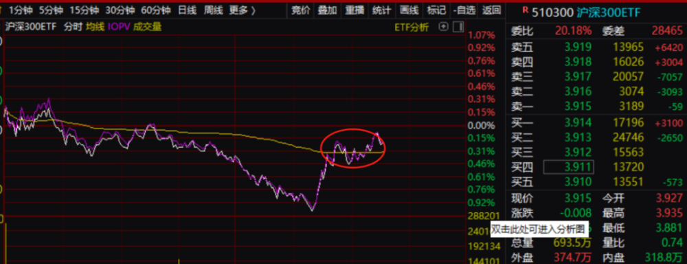

# "印花税小作文"刷屏，A股午后大反攻！承接盘持续涌现，行情能否持续？

今天午后，沪指一度大跌超30点，但在下午1：40之后，买盘突然涌现，各大指数直线反攻，跌幅很快收窄。与此同时，也可以明显看到有主力资金持续涌现，而且承接力度非常大。

那么，究竟发生了什么？从传闻来看，彭博社突然传来关于印花税的“小作文”，这也是市场期盼已久的搞活资本市场的大招。此前早盘，央行超预期“降息”并未撬动多头，但午后的传闻却带来了较大提振。那么，A股市场能否来一段持续性较强的市场呢？

**A股午后绝地大反攻**

今天午后，沪指一度大跌超30点，但在下午1：40之后，买盘突然涌现，各大指数直线反攻，跌幅很快收窄。从结构来看，银行和券商依然是市场主力，券商股午后反弹，华林证券涨停，中银证券涨超7%，兴业证券、首创证券、太平洋等纷纷跟涨。

从上涨的节奏来看，在反弹过程当中，亦出现了较为明显的承接盘。值得一提的是，上述行情发生时，外资的参与力度并不大，可以说这是一次由内资主导的行情。

从事件驱动来看，市场突然大反攻可能与一则传闻有关。据彭博社消息，中国据悉考虑降低股票交易印花税以重振疲软的股市。据知情人士透露，中国当局正在考虑下调股票交易印花税税率。如果传闻属实，这将是2008年以来的首次下调，也是提振全球第二大股市信心的重大举措。

上述因事未公开而不愿具名的人士称，根据国务院指示，包括财政部在内的监管机构正在讨论起草方案。他们还称，有关下调时机和幅度的细节尚未确定，也不能保证高层领导人会批准该方案。财政部和证监会未回应彭博社的置评请求。目前，中国的股票交易印花税税率为0.1%。而中国股市对影响市场流动性的政策变化高度敏感，进一步调降税率，或在这个9.9万亿美元的市场中引发本能的上涨反应。

昨天，北京商报发布评论称，香港证券业发声要求撤销股票印花税，A股也可以考虑取消印花税。证券交易印花税对于总税收而言影响并不大，但是却一定程度上阻碍了资本市场的活跃，彻底取消证券交易印花税有利于股市的发展和活跃，是股民期待的好事。

评论称，税收的目的是什么？是为了均衡收入、抑制行业过热。但是现在的股市早已不是过去暴富的代言人，也不再是过热的投机场所。散户投资者赚钱的难度很高，股市交投也没有预期中的那么活跃。连大型银行股为代表的中特估概念股也长期估值偏低，国家需要股市恢复活力，种种的因素，让市场呼唤着彻底取消印花税，就像过去取消农业税那样，这样才能让股市迎来新的发展阶段，走出投资者真正需要的慢牛行情。

**行情能否持续？**

那么，这种反弹行情能否持续呢？分析人士认为，在目前情况下并不宜过于悲观，有调整都可能是买入机会。

中信建投首席策略官陈果表示，“活跃牛”正在孕育中，活跃资本市场是盘活当前局面的重要手段。活跃资本市场可以有效增加居民财富效应。除了直接的财富效应，股市还具有间接的扭转居民经济预期的效应。同时，站在当下这个经济旧动能向新动能转换的关键时刻，活跃资本市场对经济结构转型的重要性也不言而喻。

此外，活跃资本市场、吸引增量资金入场也是全面注册制顺利开展的必要前提。经过过去几年的调整，当前市场的估值已经偏低，资本市场政策的出台正当其时，并不是将市场引向泡沫，而更多是实现价值回归。今年以来，我国资本市场政策加速推进，后续重磅政策的推出值得期待，我们预计伴随着资本市场改革红利的释放、A股财富效应的彰显和市场信心的逐步修复，A股市场有望迎来一轮“活跃牛”。

民生证券牟一凌表示，上周五市场在大量风险与利空事件冲击下，主要宽基指数跌幅均在2%以上。这是市场自上月底政治局会议后开启修复行情以来的第一个大跌，这引发了大量投资者对本轮反弹行情已经结束的担忧。然而从历史上看，在前期极致悲观的预期扭转带来的底部修复行情伊始，基本面尚未出现显著改善的信号，市场向上共识也同样尚未完全形成，在风险事件冲击下出现较大的波动与短暂的回调并不是偶然现象。仅在2022年，开始于4月末与10月底两段市场预期底部反转的反弹行情中，便分别在5月初与12月中受事件冲击影响均出现过大幅回调的情况，然而最终均随着基本面的改善与风险冲击的弱化，修复行情得以延续。如果相信防范系统性风险依然是决策层的底线，那么风险事件的出现似乎更像是周期底部的一种体现，对于当下市场关注度较高的“碧桂园债务危机”，我们从历史经验中可以看到：2020年6月既是
“恒大债务事件”的序幕掀起时刻，也同样是当年顺周期行情启动的节点。

在过去的一段时间里，经济结构上改善的信号同样在密集出现：价格视角来看，对制造业需求更为敏感的大宗商品价格不断抬升；需求端来看，消费景气度依然高企，且仍在不断改善之中；而地产销售面积在8月份也出现了一定的企稳迹象；与此同时，近期港口集运价格的回升一定程度上也表明着出口景气度的边际回暖。美国宽财政+紧货币的作用下，美元的脱虚入实的过程在加快，货币流通速度正在加速，这将对全球制造业复苏构成支撑。重点是，当下已经进入了中美PPI同步回升的区间，这对于大宗商品、制造业都是积极的信号，而当下大宗商品供给端瓶颈约束依然存在，现有库存水平却处于历史低位，当下大宗商品海运价已然抬升，伴随美国长期通胀中枢上移的最终确认，美元从通胀稳定型货币走向通胀偏好型货币的新特征将被定价，大宗商品新一轮历史级别的机遇将徐徐展开。

