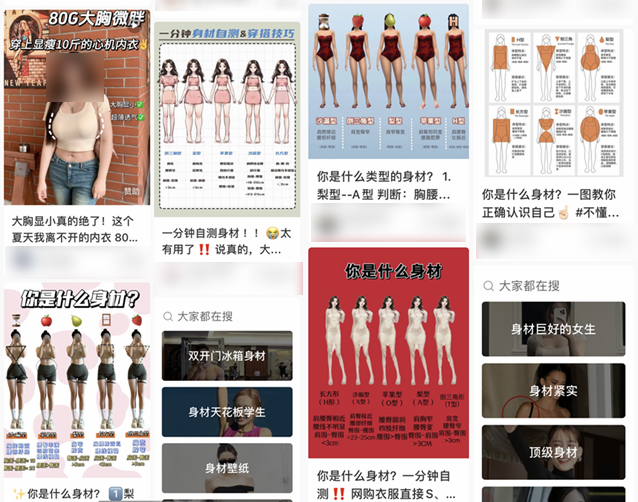
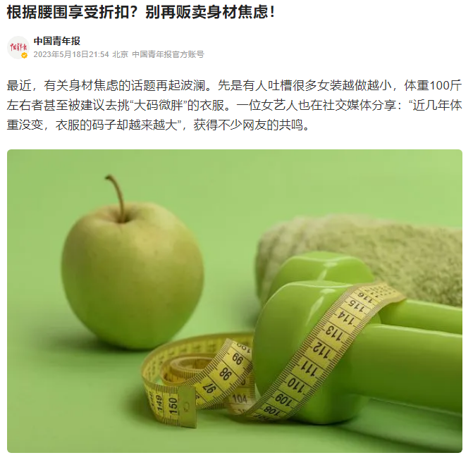
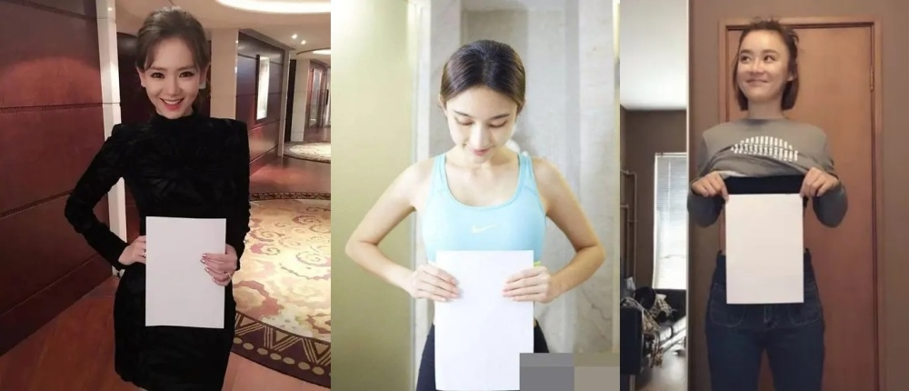

# 别吵了！吴宣仪张馨予们不该为“女装尺码越做越小”买单

**娱鉴丨第12期**

**文丨许云泽**

**编辑丨艾略**

  * _1_ 当下的女装尺码到底是大了还是小了，不应该与女性价值捆绑。不管是大了、还是小了，都会潜在制造焦虑。制造焦虑的重要方法之一，就是制造关于“正常和不正常”的标准。
  * _2_ 打破身材焦虑的第一步是高矮美丑不能被任何一种潜在的视角去定义、消解掉“正常和不正常”的分界，哪怕它是对“白瘦幼”审美的反抗。而在当下，女性解放、个性伸张的话语遇上男性主导、物化女性的历史包袱，将女性身体身材从一种凝视放置到另一种凝视当中。
  * _3_ 国内女装市场，受制于知识和品牌产权的模糊，抄版、贴牌、代加工的基本生产模式，总体来说，几乎能够覆盖女性群体极其细化的穿衣需求。”穿不上”会导致高退货率，女装尺码是不是过大或过小本身是一个市场伪命题，人们热议的其实是对女性与身材焦虑的敏感度，并受大众传媒推波助澜形成了爆款话题。

女星张馨予，官方身高169cm，体重51kg；她于某女装店试穿一件上衣，并表示，最大码（均码）都穿不上，批判当下女装做得太小了；我推测，她指的应该是主打千禧辣妹风、y2k、小吊带小抹胸短紧露风格的某CHUU或者某BM（注：两个品牌）。

女星吴宣仪，官方身高166cm，体重42.5kg；她于某女装店购入一条牛裤子，并表示，最小码都显得过于肥大，呼吁品牌方做点小码衣服；同样是推测，我觉得她买的应该是欧美设计、欧美版型、欧美尺寸的某zara某hm（注：两个品牌）。

单从身高体重数据看，张馨予和吴宣仪基本都处于成年女性身材比例当中“偏瘦”那个坐标段，但她们两人各自的现身说法，好像在说着两种完全矛盾的事实：
**女装的尺码到底大还是小？**

_吴宣仪吐槽裤子尺码太大_

_张馨予吐槽裤子尺码太小_

事实是多面的。这使得这个人人有发言机会的时代，越多的事实，造成的矛盾越多、而共识却越少。舆论显示，张馨予受到了大部分女性网友的支持，这背后有一种心态，即连女明星这种很瘦的瘦子都忍不了了、连女明星都站出来帮普通女性说话了、连瘦子都站到我们阵营来了。而吴宣仪目前为止却招致了大量反对，理由是她凡尔赛，变相晒自己身材瘦，给别人制造身材焦虑，这背后恐怕又隐含另一种心态，即瘦子就别蹭这个话题了、瘦子跟我们根本不是一个阵营。

因为一个女装尺码，女性人群产生了如此巨大的分野，这恐怕是当下，介入和谈论女性主义最好的一个选题。

谁制造了女性的身材焦虑？

用基本的逻辑分析，在当下有一个特别特别火的话题 **“女装尺码越做越小”** ，这个句子是在陈述一个事实。在此之上，还有
**“对女性身材要求太苛刻了”、“对女性身材or外貌的PUA太严重了”** 等，这是一些认知、判断。在此之上，则还有
**女性人群“太焦虑了”、“太难了”** 等情绪，事实-认知-情绪，无论哪一层，放在社交媒体里，都是爆款话题。

在这个话题里，任何人，当TA上网，刷到任何一条相关的内容，TA必定会看到如下话语现象：如果女性博主敢于首先报出自己的身高体重三围尺码，那她无论说什么，一定会面临来自广大网友的：

1、博主“凡尔赛、你这算什么胖、你根本无须焦虑、我才是真的胖”的质询；

2、你是不是谎报、我跟你数据一样、我看起来比你胖/比你瘦、我有一个朋友比你还胖/比你还瘦的怀疑；

3、你虽然体重大但是你头小/有锁骨/有腰/腿细胳膊细/甚至你肚脐眼膝盖手腕脚踝的骨头长得挺好看的啊而我哪哪都胖你根本无须焦虑我才真的焦虑的列文虎克；

4、艾特自己的男性友人前来评评理：“男人是不是就喜欢微胖的、男人其实不喜欢瘦子、男人到底喜欢什么样的”的雌竞现场。

而无论哪种反应，又可笑又真实，又矛盾但又非常同源，都鲜明地呈现着女性关乎身材外貌的深切焦虑。

_社交平台上俯拾即是的身材贴_

前段时间（事实上一直在延续的）关于白瘦幼和白瘦幼审美和批判白瘦幼审美的大讨论期间，我曾经想和一个女性朋友探讨此事，对方半开玩笑地说：我提醒你一下，我有115斤，我跟你之间差着30个阶层，我们不是一个阵营的，聊这个很危险。

友人的玩笑说出了某种现象， **女性人群当中，仅仅因为体重身材，就可以产生无数的“阵营”**
，胖一斤、瘦一斤，悲欢都无法相通，还可以区别出：易胖体质和易瘦体质、节食派和运动派、外胚型和内胚型、骨架派和体脂派，梨形H型苹果型，等等。
**在很多宏大话题上相互团结相互联结的女性，可以因为体重身材话题，随随便便就撕裂。**

女性人群如此大面积如此深重的身材焦虑，社会文化无处不在的PUA难辞其咎。聚光灯下的女明星们越来越卷，怀孕除了肚子竟无一处变胖，生完孩子20天马甲线再现；为了流量，女性博主一个比一个更拼命，自媒体拿着体重秤在街头随机拦截女性称重；商家为了噱头，制造那种让女性“钻杆过去”以测定胖瘦的羞辱式道具，品牌为了营销，设置从女神到女屌丝的身材标准线；人们用九头身黄金比例的模特去展示服装，衣服的背后一定要再用夹子夹起来最大程度展示模特的细腰，引导消费者购买的同时早已完成了两百年潜移默化的“瘦才是美”的教化，；而从瘦腰拉腿的滤镜到AI换头的魔术，
**人人都可以看到那个完美自我的幻象，与现实对比造成的失落和分裂，则构成了当下数码复制时代审美权力对每个人日常生活的潜在的驱使。**

_《中国青年报》批评“好身材打折”式促销贩卖焦虑_

反对身材焦虑，谁受伤，谁受益？

女性因为身材焦虑、内卷、雌竞，又有反焦虑、反内卷、反雌竞，又有对反焦虑反内卷反雌竞的利用、同时又有对利用反焦虑反内卷反雌竞进行PUA、内卷和雌竞的揭穿，以上种种，使得我们经常需要发问，我们到底应该批判什么，最终又应该争取谁的利益？

如果我们能读懂那些艾特男性友人前来评理，或者自己就可以下判断“男人其实喜欢微胖女孩”的女性同胞，我们就能知道，男性主导、男性视角、男性利益——无论男性究竟爱好白皮肤还是嘟嘟唇，A4腰还是蜜桃臀，或者进一步说，哪怕白皮肤嘟嘟唇A4腰蜜桃臀或其他，每个具体的审美乃至于性的偏好指征，实际都并不来自具体的男性——都才是房间里那个真正长久始终存在的大象。
**男性主导男性视角男性利益的整体，构成对于女性身体女性言行女性审美的整体的规训——时至今日，这才是女性焦虑、内卷、雌竞扯头花的真相。**

_曾风靡一时的A4腰挑战，许多女明星均参与其中_

从这个意义上来说，女性身份和利益共同体的达成，需要甩掉的远非或大或小的衣服，远非或胖或瘦的审美。尽管大家在表面上都维持一个穿衣自由、反对凝视的和平，但是如果悦己还是悦人的价值逻辑不改变，从“瘦才是美”到“胖也是美”，看似完成一些松绑，一些解放，实际上轻易就可以扩大化到“胖才是美”，并滑向“瘦真是丑”。
**女性解放、个性伸张的话语遇上男性主导、物化女性的历史包袱，将女性身体身材从一种凝视放置到另一种凝视当中，吊诡地促进了新的审判；反对身材焦虑的话题底下大量的言论展示和制造着更多的焦虑。**
小麦肤色是不是迎合西方审美？甜妹和辣妹究竟谁更媚男？柔弱和健美究竟谁能代言新女性？人们在一堆又一堆的话语垃圾当中，不断寻找猎巫对象，总要把一种人指为敌人。

**当我们轰轰烈烈、热热闹闹、吵吵嚷嚷、叽叽喳喳地进行了无数批判，无数呼吁之后，应该回头看一看，女装尺码统一度量衡，我们的穿衣自由就能达成了吗？**
争出个高矮胖瘦的标准，我们的生存境遇会变得更好吗，我们的审美变得更包容了吗，我们对自己身体的认识接纳喜爱提高了吗，对身体大胆自信的展示或内敛温和的保护能够和平并行吗，我们内心的个性真的受到解放了吗？

我们该往哪种结果去？

娱乐圈隔一段时间就会出现怀旧风。对于男明星，我们怀念过去的剑眉星目英气十足，对于女明星，我们怀念过去的大气端庄百花齐放。社交媒体上隔一段时间就会推出一个新的话题，从国泰民安长相到珠圆玉润身材，并告诉大家这才是真正的美。除了美，我们也不断推出关于健康的标准，胖影响健康，瘦也影响健康，女性太瘦不能生育，有小肚子是为了保护子宫。穿搭博主推出微胖女孩或大码女孩
OOTD
指南，归根结底却还是打着“如何显瘦遮肉、秒变魔鬼身材”的旗号；兜售健身课程的则话风一转，从教你如何7天减掉15斤，变成宝贝，相信我，160cm就是要110斤才算正常。

_称霸B站的港风、古风男星_

这当然也有对于当下审美过度单一化的反抗，但 **我们似乎陷入了一个怪圈，打倒一种霸权的方式，要么是制造一个新的霸权，要么是召回一个旧的霸权。**
男星阳刚与否曾经是高热和敏感的话题，背后的一系列审美和意识形态演变先不细说；张馨予试穿而嫌小的那个品牌女装，似乎是近五年来从日韩流入、在国内经过选秀、女团等普及放大的女性白瘦幼审美霸权代言，它通过均码而无一例外短紧露的设计和版型，在目前小资到中产普遍的自律、精致、自我管理话语氛围下，让无数女性时刻审视自己，约束和规训自己，达到进入另一种阶层的幻觉；但另一方面，吴宣仪买的那条裤子，代表着在国风、新中式、国内设计师品牌崛起之前，我们的服装品牌和设计受制于欧美白人女性身材数据的一段长长的历史。

客观来说，目前，国内女装市场，受制于知识和品牌产权的模糊，抄版、贴牌、代加工的基本生产模式，反而形成了一个话语权力的窗口期，从档口批发到线下零售，商城铺货到直播电商，总体来说，几乎能够覆盖女性群体极其细化的穿衣需求。因为品牌概念模糊、价值不高，像BM那样要靠建构话语-
教育市场-营造品牌-售卖商品的实际上是极少数，绝大多数女装厂商和销售商，基于基本的市场经济环境，他们要赚钱，要盈利，那么，PUA女性-制造身材焦虑-
生产出离谱的小码女装-卖不出去or卖出去大量女性穿不上导致高退货率，傻子也知道行不通。“被小码女装PUA了”，这件事情找不到真正的主语。
**一些过大或过小的尺码出现，反而是供给覆盖和看到的人群更广泛、更多元化的体现，相比之下，将服装尺码“统一制定”，所有人都穿着宽松的、不暴露曲线的衣服，才是一种真正的恐怖。“**
一刀切”反扑的过犹不及会滋生出另一个方向的霸凌，这对助长穿衣保守和社会风气倒退是不言而喻的。

_女装尺码吐槽_

**制造焦虑的重要方法之一，就是制造关于正常和不正常的标准。从这个角度，也许，我们如果真的想反对焦虑，解除绑架，抵制PUA，找回对自己从身体到审美的话语权，第一步就是消解掉一切关于正常和不正常的分界。没有谁能定义、不应有谁去追求一个本质化意义上的正常和不正常，具体来说，也无须去寻找一个本质化意义上的胖瘦/美丑/身材好坏/审美高下。**

身体和服饰，最个体也最具公共性，最私有也最能隐喻权力关系。从美国西部发源的牛仔，在中国曾改版成为劳动布，是劳动阶级光荣的象征，后来又变化出超短紧身、oversize廓形等无数版型，去诠释和展现人的身体、态度；香奈儿女式套装，从最开始女性穿衣和工作独立解放的宣言，变成发展出如今千金名媛小香风这种“倒回”女性弱者及客体身份的变体，其间对女性主义、对身体的讨论，早已经过万重山。

**结语**

也许我们真正应该追求的是有那么一天——这个社会上人的身材、主要是女性的身材，可以和胖瘦体重的数字解绑；胖和瘦，可以和美丑审视解绑；美丑的审视，可以和女性的价值解绑；而女性价值，可以和她的生活方式、人品德行、女性意识、和关乎人的自由独立的态度解绑。彼时，女装尺码到底是大了还是小了，就会成为一个极其无聊的问题，被人们欣欣然地遗忘。

关注娱鉴viewpoint，收获更多贵圈观点丨往期内容：

那英汪峰将如何收场？把刀郎当做草根代言人是种误解

假自由、真厌女，热巴式“捂胸”背后的歧视密码

黄子佼、陈建州、炎亚纶的背后，还站着一群可能有罪的人

