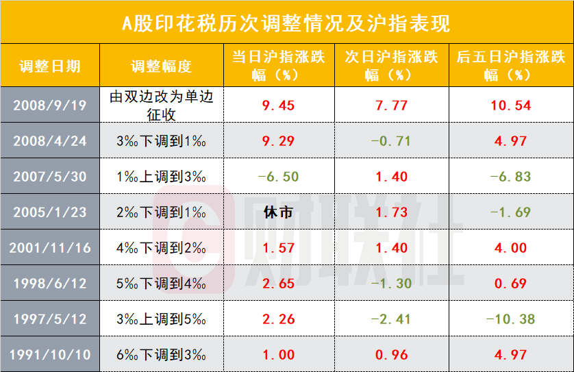

# 历年A股印花税调整后，市场如何反应？上次调整A股全部涨停

财联社8月15日讯，在政治局会议提出活跃资本市场后，通过降低或者取消印花税激活市场的呼声渐高，8月初，证券时报、经济日报、央广网等三大官媒共同发声，为活跃资本市场、提振投资者信心，呼吁降低印花税。昨日晚间，北京商报发表评论文章称A股也可以考虑取消印花税引发较高关注。

1990年印花税在深圳开征，当时征收标准是由卖出股票的交易者缴纳成交金额的6‰；同年的11月，深圳市场对买家也开征了6‰的印花税。

财联社整理了A股历史上调整印花税后上证指数的表现：

**A股印花税历次调整及影响：**

1）1991年10月10日，印花税由6‰下调到3‰，这是我国证券市场史上第一次调整印花税。调整后大牛市行情启动，半年后，上证指数从180点飙升到1429点，涨幅接近7倍。

2）1997年5月12日，印花税由3‰上调到5‰。当天形成大牛市顶峰，此后沪指下跌500点。

3）1998年6月12日，印花税由5‰下调到4‰，调整后首个交易日，沪指收盘小幅上涨2.65%。

4）2001年11月16日，印花税由4‰下调到2‰，调整之后，沪指有过一段100多点的行情。

5）2005年1月23日，印花税再次下调，由2‰下调到1‰。调整后的1月24日，沪指收盘上涨1.73%。随后，A股引来波澜壮阔的一波三年的大牛市，上证指数在2007年10月达到历史高点6124点，至今仍未突破。

6）2007年5月30日，印花税由1‰上调到3‰，这是1997年以来10年间唯一的一次上调。值得注意的是，上调印花税的消息在5月29日深夜发布，这也造成5月30日当日大盘暴跌6.5%。可以说，当时的上证4334点实际上是政策顶，市场已经认为股市过热了！可是当时的市场非常疯狂，直到10月份中旬6124点才结束牛市。

7）2008年4月24日，印花税从3‰调整为1‰，调整后，沪指收盘大涨9.29%，大盘接近涨停。可以说，3000点是当时的第一次官方护盘，第一次政策底。

（财联社）

