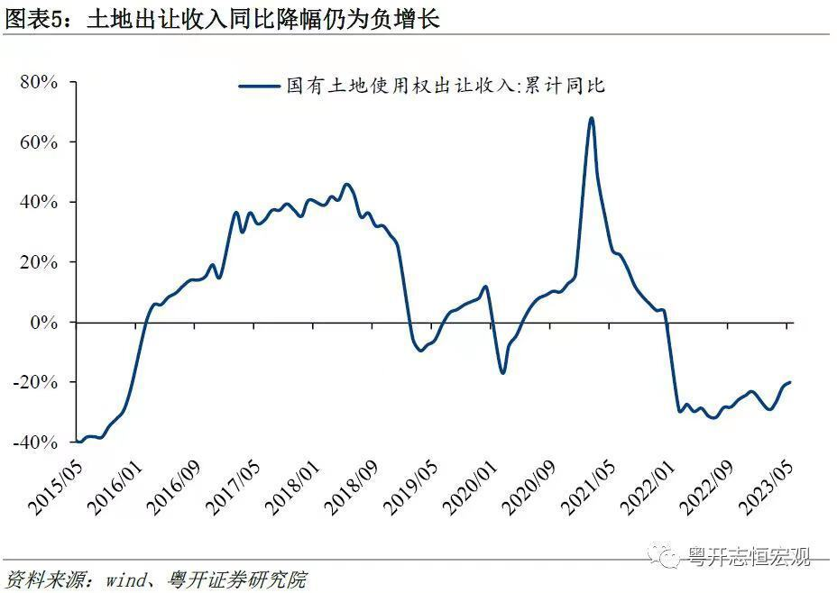

# 审计揭地方虚增财政收入老问题，土地交易成重灾区

地方虚增财政收入现象似乎有抬头迹象。

最近部分省份披露2022年度省级预算执行和其他财政收支的审计工作报告（下称“审计报告”）。其中，湖南审计报告对7个县财政决算情况专项审计发现，7个县通过土地“自卖自买”等方式，虚增财政收入；河北审计报告发现，个别市、县通过财政收支循环方式买卖非经营性国有资产虚增财政收入。

6月底审计署公开的《关于2022年度中央预算执行和其他财政收支的审计工作报告》显示，重点审计54个地区财政收支管理情况并就共性问题延伸了其他地区时，发现问题之一是，70个地区通过“自卖自买”国有资产、虚构土地交易等方式虚增财政收入861.3亿元，其中67.5%发生在县级。

多位财税专家告诉第一财经，虚增财政收入掩盖收入真实性，是违法违规行为，不仅影响地方实际可用财力，损害政府诚信，还会误导上级政府决策和宏观调控。一些地方虚增财政收入除了追求政绩营造区域经济虚假繁荣外，还跟近年地方财政困难收支难平衡情况下，借此来短期筹集财政资金缓解流动性危机。未来强化监管同时，也需要推动财税体制改革等，来解决这一问题。

**为何虚增财政收入**

地方虚增财政收入是个老问题。例如，2017年和2018年初，辽宁和内蒙古自曝大规模财政收入造假，两地当时挤掉财政收入“水分”，大幅调降收入，曾引起外界关注。近年来审计署及地方审计部门，也多次披露一些地方虚增财政收入情形。

从虚增财政收入手法来看，主要包括空转、虚构应税事项、先缴后返等。所谓空转，是指财政部门先将财政资金以支出形式拨付到缴款单位或财政收入征收单位，然后再将这些单位收到的财政拨款以税款、行政性收费等各种名义（无实际收入来源）再次征收入库，如此反复循环，形成财政收入虚增。

不过，从上述审计报告中不难发现，通过国企虚假土地交易形式来虚增财政收入情况比较常见。

中国政法大学教授施正文对第一财经分析，地方虚增财政收入手段多，但考虑到风险可控、快速便捷，多数会选择受政府控制的国企来操作，比如与一些政府融资平台公司虚构土地交易等虚增收入等。

近年来受房地产市场深度调整、房地产开发商资金紧张影响，不少地方十分依赖的土地出让收入出现大幅下滑，一些地方为了托底土地市场，就要求当地政府投融资平台公司（城投公司）去拍地，这直接导致去年城投拿地占比明显上升。

 _图表来自粤开证券研究院_

尽管城投拿地并不完全意味着都是虚增财政收入，但这一苗头引起财政部关注。

在去年10月财政财政部发布的《加强“三公”经费管理严控一般性支出的通知》中，一大要点就是要求地方防止虚增财政收入。不得通过国企购地等方式虚增土地出让收入，不得巧立名目虚增财政收入，弥补财政收入缺口。

一位地方财政人士告诉第一财经，地方虚增财政收入主要动机还是为了政绩，想让财政收入增长等指标好看。因为从最终来看，虚增财政收入并不能实际增加财力，对地方财政贡献不大。

辽宁大学地方财政研究院院长王振宇对第一财经表示，地方财政各种形式的“虚增”现象一直存在，但与十多年前部分省份因不合理政绩观的“虚增”有区别。近些年的地方财政“虚增”政绩观比重降低，更多是因为经济下行、减免税费、地方税萎缩、基层“三保”、地方政府债务还本付息、防疫等引致的地方财政流动性不足，预算难以有效平衡，不得不采取多种形式筹集财政资金。要理性看待当下特殊时期地方财政某些“非理性”行为。

近些年受疫情、大规模退税减税、楼市土地市场低迷等影响，不少地方财政收入出现下滑，收支矛盾加剧。

财政部数据显示，2022年全国地方一般公共预算本级收入约10.9万亿元，同比下降2.1%。2022年以卖地收入为主的全国地方政府性基金预算本级收入约7.4万亿元，同比下降21.6%。受去年低基数影响，今年上半年全国地方一般公共预算本级收入约6.5万亿元，同比增长13.5%。地方政府性基金预算本级收入约2.2万亿元，同比下降17.2%。

**如何整治**

虚增财政收入危害较大，近年来财政部三令五申地方不得虚增财政收入，提高财政收入质量。

施正文认为，虚增财政收入掩盖了真实财政收入状况，隐瞒了实际财政赤字，加剧了地方财政风险，也干扰了中央对地方真实财政状况判断，容易误导决策，影响宏观调控，并损害了政府公信力。

另外，上级政府对地方转移支付往往是以真实财力作为基础，而地方虚增财政收入，缩小了收支缺口，从而减少上级政府转移支付规模，反而降低了地方政府可用财力和民生保障能力。

如何防止虚增财政收入，仍需多措并举，标本兼治。

_图表来自粤开证券研究院_

当前经济形势错综复杂，专家认为，地方要端正政绩观，在确定收入目标应更加慎重，科学合理确定收入目标，并落实预算法等收入指标只是预期性指标，而非刚性完成任务指标，减少地方为了完成任务而虚增收入。

施正文表示，一些官员认为虚增财政收入并非贪污仅为己谋取私利，而且处罚多以警告、记过，因此观念上对虚增财政收入危害性认识不足。因此杜绝虚增财政收入，还需要官员加深认识。在当前财政困难下，还需要加强监管和问责，防止虚增财政收入趋势抬头。必要时相关部门可以开展专项检查，分析成因，采取针对性举措来解决。

当前财政收入质量已经成为财政部各地监管局监管的重点内容之一，以遏制地方财政收入造假行为抬头。

今年2月，中办、国办印发了《关于进一步加强财会监督工作的意见》，要求在加大重点领域财会监督中，就包括严肃查处财政收入不真实不合规等问题。为落实这一意见，财政部开展了对财会监督专项行动和预算执行监督专项行动。

王振宇表示，虚增财政收入在治标的同时侧重治本，科学合理构建地方财政事权与支出责任相适应的制度，纠正某些剩余支出责任“基层兜底”的做法。

去年，国务院办公厅发文进一步推进省以下财政体制改革工作，要求结合税源实际合理编制各级收入预算，依法依规征税收费，严格落实退税减税降费政策，严禁虚收空转、收“过头税费”、乱收费，不得违规对税费收入指标进行考核排名。省级可通过合理调整收入分享方式或分享比例等办法，抑制收入虚收空转行为等。

