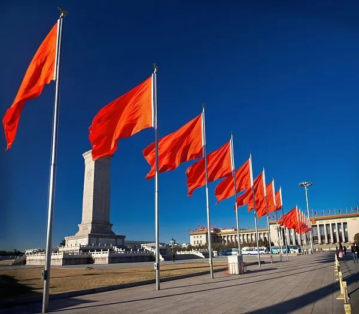

# 对日本，“警钟长鸣”并非杞人忧天

78年前的今天，日本天皇裕仁广播《停战诏书》，宣布无条件投降。中国人民抗日战争的伟大胜利，重新确立了中国在世界上的大国地位，中华民族一洗近代以来的民族耻辱，中国人民赢得了世界爱好和平的人民的尊敬。

回顾起那段沉甸甸的历史，很多人都会情不自禁地补一句：“警钟长鸣”。结合历史与现实，这绝非杞人忧天。

78年后的今天，日本似乎正在走上一条熟悉的老路。是什么推动着日本右倾化加剧？一个狂飙突进的日本，正在为世界带来什么？

（一）

从民族性格上看，日本既有“慕强”的特性，也有“凌弱”的偏好。

在1853年黑船事件后，日本见识了美国之强，逐渐“脱亚入欧”，积极向西方国家学习先进技术，实力得到快速提升。国力的此消彼长，让日本开始对周边国家肆意欺凌，逐渐走上了军国主义对外入侵的道路。

日本军国主义在亚太地区犯下的罪行罄竹难书。比如，在占领中国东北地区后，731部队进行了以活体人为对象的生物与化学实验；在侵占南京后，实行了惨绝人寰的南京大屠杀。

铁证如山，日本本应正视历史、反省罪责，但七十余年来，日本右翼势力始终没有建立起正确的历史认知，一直试图为军国主义侵略历史翻案。

特别是2012年以来，日本政治右倾化逐渐加剧，保守主义政治势力增强，新国家主义政治思潮日益增长。日本政府为摆脱战后体制的束缚，谋求成为“能战国家”，在错误的历史认知上渐行渐远——

在靖国神社问题上，首相在靖国神社春季祭典、秋季祭典以及终战纪念日时均会以首相身份或自民党总裁身份供奉祭礼。

在慰安妇问题上，妄图推翻承认慰安妇问题的“河野谈话”，在日韩慰安妇问题上坚称已在1965年日韩邦交正常化和2015年日韩慰安妇问题协定中解决。

在历史教科书问题上，不断淡化侵略历史、美化侵略战争，宣扬所谓的“爱国主义”与“国家主义”，强调所谓的日本传统文化认同与“爱国心”，坚持在教科书中坚称拥有对争议岛屿的主权。

在强征劳工问题上，坚持认为这一问题已经解决，强硬拒绝向强征劳工受害者提供任何赔偿，并综合利用经济、外交等手段迫使韩国让步。

在南京大屠杀问题上，极力淡化大屠杀事实，通过质疑30万被害者的具体人数，来否认实施暴行的整体事实。

……

日本在这些历史问题上的错误认知与行径，对战后国际秩序构成严重损害，激起日本国内与国际社会和平主义力量的强烈不满。

（二）

面对爱好和平的呼声，日本保守势力不仅不思悔改，反而对其曾经侵略的国家或地区始终存在着强烈的掌控欲，尤以对朝鲜半岛和中国台湾地区最为明显。

就拿台湾地区来说，近些年日本政客加强对台关注力度，对台政策出现新态势。

一方面，大肆炒作。一些日本保守政客渲染“中国威胁”，借俄乌冲突之机，炮制所谓“今日乌克兰，明日台湾”的话语叙事，甚至有政客扬言“台湾有事就是日本有事，就是日美联盟有事”，野心祸心昭然若揭。

另一方面，建立机制。日本自民党与台湾民进党建立了所谓的“执政党”“2+2”会谈机制。日本政府在双边/多边国际社会积极炒作台湾问题，试图将台湾问题国际化，意在谋求通过与其他国家合作联合介入台湾问题。

8月7日-9日，在《中日和平友好条约》签订45周年之际，日本前首相、长期担任自民党二号人物的副总裁麻生太郎还不顾日本国内和平主义势力与中国大陆的强烈反对，高调率团窜访中国台湾地区，不仅与台湾地区领导人蔡英文举行会谈、拜谒“台独”分子李登辉的陵墓，还主张加强日本与台湾的各领域合作，公然强调要“做好战争准备”，使其成为保卫台湾的“威慑力”。

**这番话用心险恶，不仅表明他仍然幻想着让中国大陆放弃“收台”，还明显在鼓励台湾“备战”，完全是在把台湾民众推向火坑。**

**台湾是中国领土不可分割的一部分，台湾问题纯属中国内政，不容外部势力干涉。麻生太郎窜访台湾及其言论是对中国内政的粗暴干涉，是对中日关系政治基础的巨大破坏，是日本保守主义政客错误历史观在台湾问题上的具体体现。**

**而今天的中国，早已不是1895年签订《马关条约》时的中国，日本个别政客没有资格和底气在台湾问题上信口雌黄！**

（三）

明知是冒天下之大不韪，日本为何一路狂飙？

**首先是对往昔历史的追忆以及对现实的不满。**

日本战后经济的迅速腾飞勾起日本国内各方对明治维新后国家快速发展、跻身世界强国之列的回忆，雄心勃勃地谋求改变“经济巨人，政治侏儒”的国家形象。然而，随着经济泡沫破灭，日本事事心有余而力不足，转而错误地认为和平主义是限制其成为政治大国的障碍。

**其次，和平主义政治势力显著衰退。**

近年来，日本和平主义势力分歧严重，左翼政党影响力下降，自民党“一家独大”的政党格局基本稳定，极右势力持续壮大，绑架着国家的前进方向。

**再次，美国的默许与纵容。**

随着中国国力的提升，中日地区结构性矛盾与中美结构性矛盾叠加。为维护其霸权地位，美国一直有意为日本松绑，以便利用其在亚太地区的特殊地缘政治地位牵制所谓“战略对手”。近些年，美国默许、纵容甚至鼓励日本保守主义势力提高防卫费用、增强安保能力、美化侵略战争等行为，进一步助长了保守主义的嚣张气焰。

此外，保守主义政治家的鼓噪、战后出生的政治家增多也是重要原因。战后出生的政治家对战争的残酷难有切身体会，更易形成错误的历史观。

（四）

历史问题是日本与周边国家稳定合作的重要障碍，日本的历史观不仅是日本的国内问题，也是关乎国际关系走向的国际问题，既是涉及国家间的经济问题、外交问题，也是关涉到受害国人民的人权问题、情感问题。

随着日本右倾化加剧，日本历史修正主义认知与行动均显著增强，对国家间关系、区域合作以及国际社会均带来严重危害。

一是阻碍日本与亚太各国或地区间的历史问题和解。日本错误的历史观与日本军国主义侵略受害国及其人民的正确历史观形成鲜明对比，历史和解困难直线上升。

二是影响亚太地区区域化经贸合作。经贸合作是亚太繁荣发展的基础，特别是中日韩经济的紧密度、依从度和关联度超过其他国家。但受历史问题和外部因素影响，APEC、RCEP、东盟“10+3”、中日韩合作等多边深化合作受到严峻挑战。如果经贸合作持续走低，那么各国的经济、企业以及民众的生活都会受到重创。

三是致使日本国内民众被迫接受错误的历史观，造成大多数日本民众思想混乱，特别是让年轻人对过去的教训一无所知。当不断长大的年轻一代，不去深入思考明天的日本该如何实现与邻国共生，无疑将加速日本国内的右倾化进程。

四是错误的历史观还将推动日本在增加防卫力量时减少和平主义势力的阻力。日本政府为增加防卫力量而增加税收，不仅增加东亚安全局势的不稳定因素，还将对日本民众生活产生诸多负面影响。

（五）

战后日本，常常为自己的“非正常国家”身份而尴尬，而某些政客的解决方式，反而令日本陷入更为尴尬甚至危险的境地。

历史是凝固的现实，现实是流动的历史。奉劝那些仍然沉迷于皇国史观的人不要再颠倒黑白，与所有爱好和平的人为敌了。

没有反省就没有未来，正确而健康的国家认同，维护和平的积极努力，都只能建立在正视历史的基础上。中国作为世界和平的建设者、国际秩序的维护者、全球发展的贡献者，始终与日本历史修正主义者进行着激烈斗争。

二战后持续了70多年的世界总体和平从来都不是抽象的，也不是偶然得来的。它需要公理正义的支撑，更需要靠实力去捍卫。

在这个特殊的节点，希望揭露日本战争罪责的努力更多一些，以唤起日本社会的良知和警醒。

