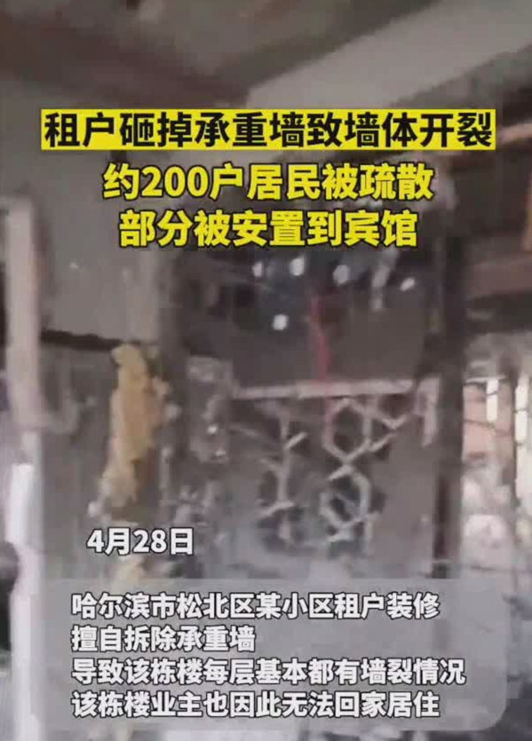

# 私拆承重墙可处五万以下罚款？全国人大：处罚较轻属放松管控

8月15日，中国人大网公布了一起备案审查工作案例，对地方物业管理条例中“私拆承重墙处罚标准”等多个问题进行审查，这也是全国人大常委会法工委建立备案审查案例指导制度以来发布的第2起案例。

南都记者关注到，今年以来，私拆承重墙引发的安全隐患事件频发，严重影响公共安全，“哈尔滨居民楼拆承重墙致200多户居民紧急疏散”等事件持续引发关注。

根据国务院《建设工程质量管理条例》的规定，房屋建筑使用者在装修过程中擅自变动房屋建筑结构和承重结构的，处五万元以上十万元以下的罚款。但有的省份在物业管理条例中规定损坏房屋承重结构的处罚为“可处一万元以上五万元以下罚款”。

全国人大常委会法工委对此审查认为，地方的处罚规定明显较轻，地方性法规应当严格执行上位法有关规定，不应放松管控，降低处罚幅度。

 _资料图。_

私拆承重墙，地方处罚标准过低

全国人大常委会法工委纠正

今年以来，装修中私拆承重墙事件频频进入公众视野。

4月底，“黑龙江哈尔滨一居民楼装修拆承重墙导致200多户居民紧急疏散事件”冲上热搜，后公安机关对4名相关责任人采取刑事强制措施。几乎同时段，“广州白云区岭南新世界一业主私拆承重墙事件”也引发广泛关注，有新世界业主称，同楼业主私自打拆承重墙，导致房屋出现墙体裂纹、地板下沉等问题。

装修私拆承重墙是严重危害公共安全的行为，如私自实施也会导致相应处罚。根据国务院《建设工程质量管理条例》的规定，房屋建筑使用者在装修过程中擅自变动房屋建筑结构和承重结构的，处五万元以上十万元以下的罚款。

而有的省份物业管理条例降低了私拆承重墙的罚款数额。全国人大常委会法工委审查发现，某省地方物业管理条例规定：“业主、物业使用人损坏房屋承重结构、主体结构的，由县级以上人民政府住房城乡建设行政主管部门责令立即改正，恢复原状，可以处一万元以上五万元以下罚款；情节严重的，处五万元以上十万元以下罚款”。

全国人大常委会法工委审查认为，地方省物业管理条例规定明显低于《建设工程质量管理条例》规定的罚款额度，属于放松管控，与上位法规定不一致。而且地方的规定是“可处”罚款，国务院的规定是“并处”，地方的处罚规定明显较轻。

“实践中因私拆承重墙而影响群众生命财产安全的案例时有发生，引起舆论关注。”全国人大常委会法工委表示，住房和城乡建设部专门下发通知要求坚决遏制私拆承重墙等违法违规行为。制定机关对此应当给予高度重视，房屋承重结构、主体结构涉及公共安全，地方性法规应当严格执行上位法有关规定，不应放松管控，降低处罚幅度。

小区供水供电设施所有权属供水供电企业？

全国人大法工委：违背民法典规定，属业主共有

除对地方物业管理条例中损坏房屋承重结构处罚幅度规定审查外，全国人大常委会法工委还对地方物业管理条例能否规定供水、供电等设备所有权移交给经营单位作出审查。

近年来，老旧小区供水、供电设备常常面临管网老化“超期服役”等问题，也极易引发来维修管理责任承担纠纷。

为促使供水、供电企业承担起设备养护的责任，某省甚至在地方性法规中明确，将设备所有权移交给供水供电企业。规定建设单位在竣工验收后，应当将变（配）电、二次供水、换热、燃气调压等设施设备及相关管线等专业经营设施设备的所有权移交给组织安装施工的专业经营单位；专业经营单位应当接收，并负责专业经营设施设备的管理、维修、养护和更新。

全国人大常委会法工委了解到这一情况，审查认为，民法典第二百七十一条规定，“业主对建筑物内的住宅、经营性住房等专有部分享有所有权，对专有部分以外的共有部分享有共有和共同管理的权利。”第二百七十四条中规定，“建筑区划内的其他公共场所、共用设施和物业服务用房，属于业主共有。”

这也意味着，根据民法典的规定，业主对建筑区划内的共有部分享有共有的权利，属于业主共有部分的变（配）电、二次供水、换热、燃气调压等设施设备及相关管线的所有权应当属于业主共有，建设单位不能将其所有权移交给相关专业经营单位。

此外，国务院《物业管理条例》第五十一条第一款规定，“供水、供电、供气、供热、通信、有线电视等单位，应当依法承担物业管理区域内相关管线和设施设备维修、养护的责任。”

因此，全国人大常委会法工委审查认为，供水、供电、供气、供热等共用设施设备的所有权属于业主共有，并不影响相关单位对专业经营设施设备的维修和养护责任。地方物业管理条例关于建设单位应当将专业经营设施设备的所有权移交专业经营单位的规定，涉及公民的基本财产权利，与民法典规定不一致，地方性法规无权作出上述规定。

地方立法称未实际入住应少交物业费

全国人大法工委：违背民法典，实践中业主可与物业协商

业主未实际入住的情况下，是否还需要缴纳物业费？

对此，某省地方物业管理条例规定，已竣工但尚未出售或者尚未交付物业买受人的物业，物业服务费用由建设单位承担。物业交付后，业主未实际入住使用的，应交纳物业服务费总额百分之七十的费用。

全国人大常委会法工委审查认为，民法典第九百四十四条规定，“业主应当按照约定向物业服务人支付物业费。物业服务人已经按照约定和有关规定提供服务的，业主不得以未接受或者无需接受相关物业服务为由拒绝支付物业费。”

根据民法典规定，业主应当按照物业服务合同的约定向物业服务企业支付物业费，不得以未接受或者无需接受相关物业服务为由拒绝向物业服务人支付物业费。实践中，未实际入住业主是否可以减免物业费，可以在物业服务合同中约定。未约定的，应当适用民法典的规定。

全国人大常委会法工委审查认为，地方物业管理条例规定业主未实际入住使用，一律交纳物业费总额百分之七十的费用，缺乏上位法依据，实践中也比较难操作，容易引发纠纷，地方性法规对此不宜直接作出规定，当予以纠正。

全国人大连发2例备案审查指导性案例

地方法规、司法解释存同类问题应及时修改废除

值得一提的是，备案审查案例指导制度是“推动解决地方立法共性问题，统一审查标准和尺度”的重要举措。

2022年，全国人大常委会法工委探索建立备案审查案例指导制度，选编有关事例实例作为备案审查工作案例印送地方人大参考，同时收集整理一些地方人大常委会审查纠正处理的典型事例139件，作为工作交流材料。

2023年1月13日，中国人大网首次公布了第一号备案审查指导性工作案例，对地方物业管理条例的相关规定提出了审查研究意见。

谈及备案审查案例指导制度发挥的作用，全国人大常委会法工委法规备案审查室主任严冬峰告诉南都记者，备案审查案例指导制度可以使备案审查工作进一步透明化，向社会公众公开。同时，通过公布案例也可以发挥其指导作用，其他法规、司法解释中的同类问题，制定机关应当对照指导案例修改废除，也可以对未来立法机关进行立法作出指导。此外，备案审查学术界也可以将指导案例作为研究和参考的素材。

北京大学法学院教授张翔认为，每年底全国人大常委会法工委会发布的备案审查工作报告中会公布一些案例，但相对缺乏及时性，而定期发布指导性案例的方式，可以将备案审查工作及时呈现，提高备案审查的透明度和公众知晓度。

张翔还提到，事实上，全国人大常委会法工委对备案审查意见的作出是非常慎重的，也做了很多讨论，但受限于备案审查工作报告篇幅，写入报告的案例往往比较简短，对案例的说理不够。通过发布指导案例的方式，可以使备案审查说理部分更充分呈现在公众面前，无论对于备案审查工作推进，还是对于学术研究都是非常有意义的。

在张翔看来，备案审查研究意见有普遍约束力，指导性案例公布后，可以促进其他地方性法规中的类似问题及时纠正。而有些案例虽然没有作为指导性案例发布，事实上也起到了纠正类似问题的作用。

他举例称，全国人大常委会曾在2020年备案审查工作报告中，对地方性法规规定的出租车司机本地户籍限制作出审查，备案审查报告公布后，一些城市修改了当地网约车管理办法，对司机户籍限制松绑，对于促进就业、营造公平就业的环境起到积极促进作用。

“随着第一号和第二号指导性案例的公布，备案审查案例指导制度也在逐步形成，希望以后指导性案例能更多一些。”张翔称。

在北京航空航天大学备案审查制度研究中心主任王锴看来，我国的立法体制是一元多层级的，相对应地，备案审查的主体也是多元的，但对同一法律问题的判断不能多元，因此需要通过“案例指导制度”来统一地方对法律问题的认识，进而统一审查结论，避免结论冲突。

此外，王锴还提到，案例指导制度还可以给地方人大常委会提供线索，地方人大常委会可以比照全国人大常委会发布的案例，对地方规范性文件进行梳理，审查是否存在类似的违法情形，也体现出备案审查的“上下联动”。

南都记者了解到，按照规划，全国人大常委会法工委将常态化发布指导案例，及时从备案审查纠正的问题法规中，甄选出有代表性意义的案例，对外公开发布。

采写：南都记者 刘嫚 发自北京

