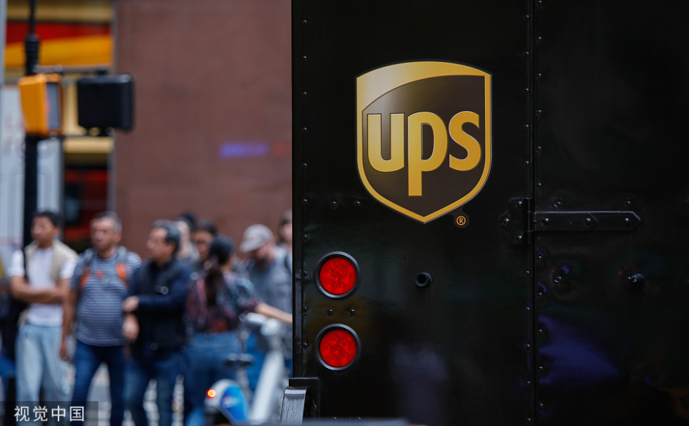
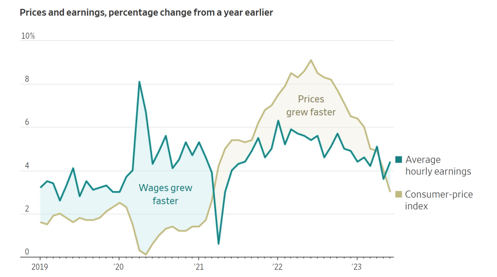

# 美国卡车司机年薪17万美元，让硅谷工程师羡慕嫉妒恨，美联储或最紧张

腾讯新闻《潜望》 作者 纪振宇 发自硅谷

全美数十万的UPS送货司机最近迎来了扬眉吐气的胜利时刻：代表他们利益的工会组织Teamster
Union与他们的雇主UPS达成了协议，将大幅提高他们的工资待遇。UPS首席执行官在最新一个季度财报发布后透露，UPS的送货司机未来的年薪酬待遇将达到17万美元。

一石激起千层浪，UPS司机待遇水平在全美范围瞬间跻身高收入阶层，甚至引来了身处收入金字塔顶端的硅谷工程师的“羡慕嫉妒恨”，无数的笑料梗图在社交网络上迅速传播，查找“ups”相关工作岗位的搜索量创下新高，一时间，UPS司机成了全美国都羡慕的工作岗位。

除了让人艳羡，在社交网络形成热烈讨论以外，UPS提高工人待遇更大的影响在于，这次事件很可能引起快递行业其他同行甚至其他更多行业的跟进，要求提高工资待遇的呼声四起，这对于目前仍处在对抗通胀阶段的美国经济来说，并不是一件好事。

美联储在这一轮对抗通胀的过程中，除了密切关注的通胀指标以外，最为警惕和惧怕的便是“工资价格螺旋”的产生，用美联储主席鲍威尔的原话说，“我们不能允许工资价格螺旋的发生，我们也不能允许通胀预期‘脱锚’”。

毫无疑问，UPS涨工资事件以及由此带来的潜在影响，将成为接下来美国经济以及美联储制定相应货币政策所需要考量的新的重要变量。

**17万美元年薪诱惑，意在重新赢回业务**

代表UPS 34万员工的工会组织Teamster
Union两周前与UPS达成了一桩提高UPS工人待遇的协议，两周后在UPS财报发布后的电话会上，UPS首席执行官Carol B.
Tomé亲自公布了这一协议更详细的内容。他表示，未来UPS的送货司机在5年合约满后，每年包括医疗保险、养老金等在内的薪酬总额平均将达到17万美元。在达成这一协议之前，美国UPS工人基本年工资平均为9.5万美元，外加5万美元的福利。

这则消息一出， UPS送货司机立刻成为了美国人羡慕的工作，与此同时，美国人在网上搜索“UPS司机职位”的搜索关键词较前一周增长了50%，“附近的UPS
司机工作”这样的关键词一度成为谷歌搜索的热词。

而对于UPS公司而言，人力成本的上升对于公司业绩来说自然不是什么好消息，在对下个季度业绩展望中，UPS将运营利润率从之前的12.8%至13.6%调低至11.8%，主要就是受到与工会达成提高司机工资待遇的影响。

实际上，这也是UPS在面临业绩压力和工会罢工威胁双重压力下的无奈之举。在第二季度中，UPS收入下滑11%至221亿美元，利润同比下滑24%至22亿美元，背后的原因主要是陷入与工会的谈判以及在线购物的减少。UPS
首席执行官表示，在第二季度中，公司业务流失至其他竞争对手的情况要比之前预想的更为严重，该季度平均每天流失100万份快递量，其中三分之一流向联邦快递，三分之一流向美国邮政，剩下三分之一被地区性的快速服务所瓜分。

提高工人待遇，让他们尽快回到岗位投入工作，是UPS希望抢回市场份额所采取的措施。“虽然业务回流需要时间，但我相信到今年年底，能够把业务重新赢回来。”
UPS首席执行官Carol B. Tomé表示。

在公布协议具体方案后，UPS股价当天便下跌超过3%。今年以来，在美股整体涨势明显的情况下，UPS的股价依然徘徊在年初的水平。

**硅谷工程师“羡慕嫉妒恨”**

对UPS送货司机待遇一下提高至17万美元的消息，最先坐不住的是硅谷的工程师们。过去几年中，硅谷工程师的工资待遇一直傲视全行业，连一直以来以高薪酬待遇著称的华尔街金融业都不禁侧目，许多过去涌向华尔街的毕业生，都开始转而涌向硅谷。

但一向被视为干着苦活累活，工资又不高的快递司机，工资待遇一下子开始逼近硅谷工程师，对许多人的心理冲击是巨大的。

一位工程师在科技圈职场社交网站Blind上评论称，“这太让人失望了，一个送货司机挣得要比普通研发工程师还要高，工程师要拿到17万基本工资要付出多少努力，这实在太烂了。”

也有硅谷工程师借机抱怨称，如果UPS送货司机都能拿到17万的话，再考虑到所生活地区的成本，那硅谷工程师现在的待遇太低了。

“在硅谷湾区30万的年收入相当于其他地区9万的年收入，所以UPS司机在低成本地区拿这样的工资实在太高了。”

但也有人表达了不同的意见。“别秀优越感了，”一位Blind用户说，“为何你会认为长时间疲劳驾驶和搬运重物的人，赚的要比工程师少？他们做的也是重要的工作，不管是你们经常光顾的超市还是在门口就能方便取到的快递，是谁给送的呢？他们很多人需要在恶劣的天气环境下长时间的从事重体力劳动。”也有用户指出，做一名快递司机意味着要强制在节假日工作，放弃像感恩节、圣诞节、新年等这样重要的与家人团聚的时光。

UPS工人工资待遇上涨让硅谷工程师“羡慕嫉妒恨”，某种程度上带来的些许讽刺意味在于，去年以来掀起的一轮AI热潮下，包括软件工程师、律师在内的许多待遇较高的工作岗位，被普遍认为将受到AI的冲击，未来可能很难再享受到目前的高工资待遇，反而是一些原先被看作是低端的蓝领工作，例如快递司机，至少目前看不到被AI取代的趋势。

**美联储需警惕“工资价格螺旋”的发生**

UPS送货司机薪酬待遇提高更广泛的影响在于，这是美国代表广大蓝领中产阶级阶层的工会的一次具有象征意义的胜利，也或许意味着未来在更多的蓝领行业，工会将掌握更多的积极主动权去争取更多的利益。

但对于目前的美国经济来说，全面的工资水平上涨，并不是一件好事。自去年以来，美国经济最大的挑战就是应对通胀，美联储以史上最快的加息速度和最大的加息幅度，将美国消费价格指数压低至目前4%的水平，但距离美联储2%的政策目标依然存在一定的差距。

美联储深知，现在如果掉以轻心，实际上是最危险的时刻，工资水平全面上涨，可能会带来需求端的增加，这将提高价格，价格的提高将会反过来让工人要求更高的工资，进一步推高成本，从而进一步施加物价上行压力，这就是最典型的经济学中的“工资价格螺旋”理论。

此前在美联储的历次发布会上，美联储主席鲍威尔每一次在被问到相关问题时，他的回答都是，目前还并没有观察到“工资螺旋”的情况出现，但表示美联储将持续关注。他也承认，一旦观察到“工资价格螺旋”发生，实际上就已经太晚了。他在2月份美联储货币政策会议后的记者发布会上的原话是：“我并没有看到任何工资价格螺旋的迹象，但一旦我们看到，一切都太晚了，我们不能让这样的情况发生。”（“I
DON'T SEE SIGNS OF A WAGE-PRICE SPIRAL, BUT ONCE YOU SEE IT, IT'S TOO LATE. WE
CANNOT ALLOW THAT TO HAPPEN.”）

UPS工人工资待遇上升的情况，值得美联储警惕。在上世纪60、70年代，美国面临的一轮超级通胀时期，工会联合工人进行罢工要求提高工资的情况就曾经发生，在当时确实对控制恶性通胀带来更大的压力。

在刚刚过去的7月份，美国平均小时工资增长两年来首次超过物价涨幅，在7月底美联储的货币政策会议后的新闻发布会上，鲍威尔表示，名义工资上涨幅度高于物价上涨幅度意味着实际工资的上涨，美联储是希望看到这种情况的发生，但希望工资上涨的幅度能与2%的通胀目标所一致。

“我们不认为工资水平在第一年中是导致通胀的主要因素，但工资水平可能是未来的重要因素，所以就业市场的状况是让通胀走低的重要因素，美联储希望就业市场情况进一步走弱。”鲍威尔说。

