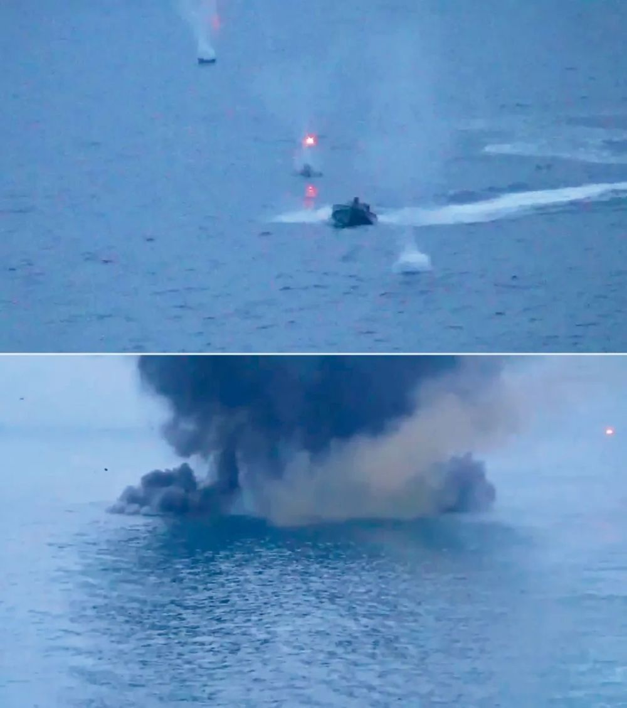
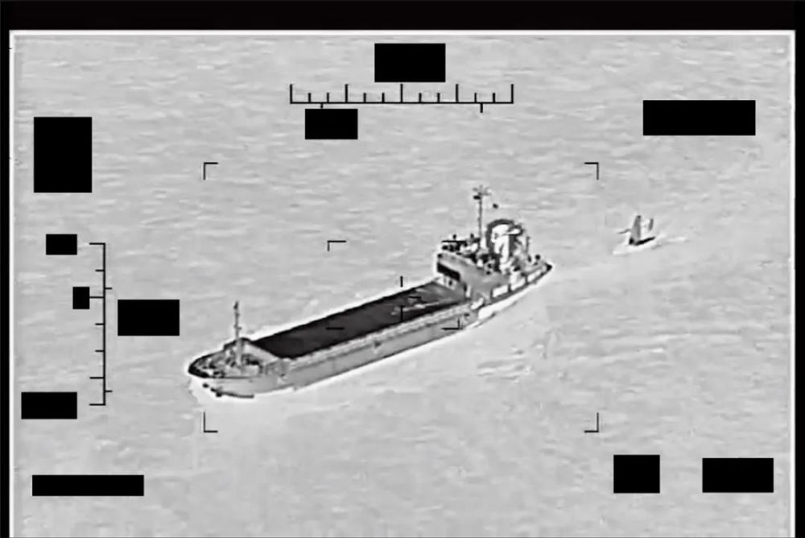

# “无人艇战争”开场？

近期，乌克兰方面多次出动无人艇，对克里米亚地区相关设施和黑海的俄方目标进行打击。最受关注的一次就是发生在7月17日凌晨的克里米亚大桥再度遇袭事件：在遭到两艘乌克兰无人艇袭击后，大桥四条公路车道中的两条严重受损。

此次俄乌冲突中，除了外界已经熟知的无人机攻防战外，无人艇作为新的反介入作战力量，也首次被大规模应用。不过，无人艇大规模应用于战争才刚刚开始，在技术、作战体系、道德伦理和风险管控等方面仍存在瓶颈，而俄乌在无人艇攻防战中表现出的能力不宜过度夸大。

**“菜鸡互啄”**

根据公开信息，俄乌之间的首次无人艇作战发生在2022年10月29日，乌克兰使用七艘无人艇和九架无人机突袭塞瓦斯托波尔港。伴随陆上反攻，乌方也在海上加大了针对俄罗斯的无人艇袭击。

今年以来，乌克兰发动无人艇袭击的次数明显增加，克里米亚地区以及黑海的俄方目标成为重点。5月24日，俄罗斯黑海舰队“伊万·胡尔斯”号侦察舰遭乌军三艘无人艇攻击。6月11日，黑海舰队“亚速海沿岸”号侦察舰遭乌军六艘无人艇偷袭。8月5日凌晨，
俄罗斯“白鲑鱼”号油轮又在刻赤海峡附近海域遭到乌军无人艇袭击。

 _2023年5月24日，俄罗斯黑海舰队军舰摧毁了乌克兰的水面无人艇。图/视觉中国_

俄军也曾使用无人艇对乌方目标发起攻击。2023年2月10日，俄使用满载炸药的无人艇攻击了敖德萨的扎多卡铁路桥。在无人艇攻防战中，俄乌双方虽然互有攻守，但总的来看，乌方占据明显优势，不仅攻击次数多，相关战果也遥遥领先俄军。这似乎不太符合俄乌两军两国的实力对比。

因为海军力量处于绝对劣势，乌军更为重视无人艇的作用。作为“光脚的一方”，乌克兰在发动无人艇袭击方面没有太多顾忌。开战没几天，乌克兰海军主战舰艇基本就清零了，俄军即便想大规模进行无人艇攻击，也没有太多的目标。相反，乌方别无选择，只能使用无人艇袭击这种非对称作战方式。尽管每次袭击都不能从根本上改变黑海的制海权，却能不断削弱俄海军的力量和克里米亚半岛的基础设施。

另一方面，虽然乌方整体实力弱于俄方，无人艇技术也未必强于俄方，但乌军在美国和北约提供的帮助下，却能在海域态势感知能力上傲视俄军。换言之，乌军无人艇所能仰仗的军事侦察、监视和情报体系要远强于俄军。

想要在大海上准确追踪俄军舰艇和油轮的行踪，对于缺乏侦察手段的乌军来说是“不可能完成的任务”。考虑到无人艇出发基地距离目标动辄几百公里的实际情况，跟踪起来就更是难上加难。显然，目标信息以及导航跟踪这些任务都是由美军和北约完成的。自开战以来，美国和北约通过空基、天基和无线电侦察侦测手段，密切监视黑海舰队和俄方其他兵力部署及调动情况。找到相关目标并持续跟踪监视对于他们而言，则非难事。

尽管热闹非凡，但俄乌冲突中无人艇攻防战的技术水平并不高，属于“菜鸡互啄”。双方使用的都是小型无人艇，有成本低、体积小、速度快、雷达反射面小等优势，但技术含量和智能化程度并不高，主要用于自杀式袭击。

**“执牛耳者”**

无人艇是一种可自动航行于水面或进行水下航行的船艇，按照任务需求搭载各种不同的功能模块，自主或者半自主完成一系列任务。它可以分为无人水面艇（USV）和无人水下艇/潜航器（UUV）。无人驾驶船最早见于
20世纪五六十年代出现的靶艇或扫雷艇，但仅限于在有人平台的遥控范围内进行水上或水下作业。随着卫星定位与通讯技术、自主导航技术以及智能规划和控制技术的进步，无人艇在军事上的价值日益凸显，目前主要集中在海洋测绘、监视侦察和反水雷战等领域。未来，随着装备智能化程度的提升，无人艇将逐步具备独立或协同遂行反潜、反舰等作战任务的能力，可直接代替有人平台或配合有人平台作战。

无人艇的门槛虽然不高，但世界上仅有少数国家如中美英法和以色列等，可以制造执行高端任务的中大型无人艇，能将无人艇与现有的海上力量有机整合到一起。其中，美军是这方面的先驱和执牛耳者。从20世纪90年代开始，美军系统性探索无人艇的应用，并根据形势和技术的发展，不断更新发展路线图，同时对概念艇进行验证。目前，美国海军已经研制并装备了全谱系全尺寸的各个类型的无人水面艇和无人潜航器，并在技术研发、预算采购和战斗力生成等方面都有着清晰的发展路线。

根据美国海军的标准，大型无人艇主要有以下三类：长45~150英尺、满载排水量约500吨的为中型无人艇（MUSV），主要搭载各种ISR传感器，用于海上巡逻、侦察和电子战；长200~300英尺、满载排水量1000吨~2000吨的为大型无人艇（LUSV），主要用于反舰和对陆打击，它们甚至拥有16~32管的导弹垂发装置；超大型无人水下航行器（XLUUV）则有地铁车厢大小，主要用于在深海部署水雷。

这些无人艇与普通的舰船相似，都可以直接从港口出发去执行任务，而不需要搭载其他平台进行部署。而且，上述大型无人艇已经被明确列入到了海军的《30年造舰计划》。和普通舰船一样，它们也代表着美军海军的兵力规模，是美军“分布式”作战概念的重要体现。据美国海军2024财年的预算计划，每年仅这些项目的技术研发费用就高达6亿美元左右。而据2022年国防预算，美国海军已获得50亿美元用于采购超大型无人水下航行器。

此外，美军还创建了无人艇作战单元，加快进行战斗力生成方面的探索。2017年，美国海军成立水下无人艇中队（UUVRON-1）。2019年5月，美国海军成立了一个水面战研发中队（SURFDEVRON）。该中队最初由一艘朱姆沃尔特（DDG1000）级驱逐舰和一艘海上猎人原型艇组成，后续会有更多的LUSV和MUSV加入。

除了上述大型无人艇，美国还装备或研发了名目繁多的小型无人艇，如“斯巴达”号巡逻侦察艇、港口级无人作战艇、梭鱼（Barracda）无人潜航器和刀鱼（Knifefish）水下无人潜航器等。与大型无人艇力量尚处于探索阶段不同，小型无人艇已经广泛装备美军各军兵种，无论是技术路线还是应用场景都非常成熟。美军主要是根据任务进行采购，其研发的主力是军工企业，走的是军民融合发展路线。

**“戴着镣铐跳舞”**

在此次俄乌冲突中，无人艇在海上反介入作战中的作用毋庸置疑，今后广大中小国家也将会群起效仿。这些小型无人艇的技术门槛较低，通常基于军民两用通用平台。因此，它们比战术或巡航导弹更容易获得，也更容易在世界扩散。

不过，相比于无人机，无人艇活动最大的困难在于海域态势感知。由于地球曲率和复杂海况的影响，依靠自身的感知能力，无人水面艇将只能掌握周边几十海里甚至几海里的情况，更缺乏对于水面或低空小目标的探索和预警能力。因此，如果不能融入到强大的作战体系，这些无人艇对于远距离的目标将无能为力。而世界大多数沿海国都没有广域海上态势感知能力，其无人艇的活动和作战范围将大大受限于无人艇的感知能力。水下的情况更为复杂，感知更加困难，目前技术上基本无法做到全时导航，无人潜航器多数时候要依赖惯性导航，这更增加了使用的不确定性。

这次俄乌冲突，乌克兰方面固然在无人艇使用方面进行很多创新，但如果离开了美国和北约的体系加持，也难堪大任。因此，中小国家在使用无人艇方面仍存在技术和体系障碍，而对无人机的使用则要简单得多。

对于大国竞争或大国冲突而言，无人艇的使用则面临更多的挑战。海洋大国和海洋强国的感知能力强大，反制手段多，像乌克兰这种仅依靠无人艇屡次突破对方防御体系的情况应该不会多见。考虑到大国对抗时的海情极度复杂，无人艇在承担高端任务时的不确定性更是大增，更多还是承担比较托底的任务，如侦察、扫雷和配合有人平台行动。

_2022年8月30日，伊朗军舰（左）在波斯湾控制并拖走一艘美国海军的无人艇。图/视觉中国_

当然，各大国都在积极探索有关无人艇的颠覆性技术，如水下通信等，但迄今为止，尚未有重大突破。当前，进步最快的是人工智能的相关应用，基本平台之外，比拼的是算法，如各种大模型。随着大数据、存储技术和计算能力的大幅提升，以人工智能为基础的无人平台和自主系统正在拓展人类活动的深度与广度，并在海上战略和战术竞争中发挥着越来越重要的作用。

无人平台和自主系统的发展，将极大拓展人类对海洋的认知、开发和利用能力。就军事领域而言，水下竞争和对抗将呈现全新的态势。深海空间由于通透性差、压力变化大、水文特性复杂等特点使其难以被感知，易实现军事行动的隐蔽性和攻击的突然性，其军事价值正在被各海洋强国挖掘。与以往主要依赖潜艇实施“点打击”或非对称制衡不同，现今水下军事竞争网络化和体系化特征愈发突出。

技术之外，将无人艇使用融入到现有的作战概念和作战体系中，理念和操作方面都需要时间进行验证或转换。历史经验表明，一种新型武器或平台出现后，不会自动形成战斗力，只有将其与现有作战体系有机结合起来后才能产生新的战斗力，谁的融入速度快、质量高，谁就有可能在竞争中获胜。但军事体系通常相对保守封闭，一种革命性技术或平台的融入，特别涉及到指挥链变化的，往往旷日持久，且有战争驱动。在没有战争作为催化剂的情况下，这种融合可能需要十年甚至数十年的时间。而无人平台作为自主武器，涉及到大量人机交互，其成军形成战斗力的进程必然更加复杂多变。由于海上战场环境要远比空中战场环境复杂，无人艇形成战斗力的进程要比无人机缓慢。

此外，各大国的国防战略对自主系统还存在伦理、风险管控等方面的顾虑。未来，无人平台和自主系统能解决高中低端不同层面的海上军事需求，而且正在改变竞争的形态和对抗的速度。尽管AI的算法越来越优、运算速度也越来越快，但AI理解不了复杂的战场环境，更没有人类复杂的情感，无人艇等无人自主平台不能代替人决策，特别是在缺乏真实战争模型和数据的情况下，它们的智能化有很大的不确定性。

美军在反恐战争中频频使用无人机定点清除恐怖分子，已经带来了一系列的道德伦理问题。无人平台和自主系统的广泛应用将大幅提高战场速度，必将加大冲突升级的风险、降低冲突的门槛和模糊冲突的边界。迫于大国竞争的压力，美国等各大国的军队已经不可避免地走向智能化。但越智能化，竞争失控的风险也越高。

在这种情况下，各国军队不得不“戴着镣铐跳舞”。一方面，希望借助无人平台和智能化赢得竞争，AI军备竞赛已经开启；另一方面，也担心智能化会加大与他国冲突的风险，必须对智能化的发展进行一定的自我限制。

作者：胡波

