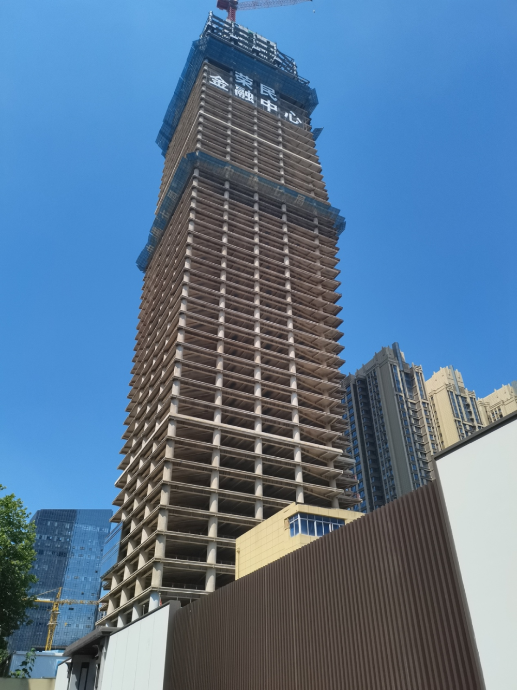

# “西安城北第一高”荣民金融中心陷停工风波

_荣民金融中心。石青玲/摄_

哪个项目没有拖欠工程款的事情，目前双方已经达成和解，正准备复工的事情。

**石青玲/发自西安**

围绕“西安城北第一高”荣民金融中心是否停工的纷扰不断。

8月9日，荣民金融中心出现了一张告示牌，内容为“本工地因荣民集团拖欠巨额工程款，已被迫停工。禁止一切与本工地无关人员入内，否则后果自负”。落款为中国建筑第七工程局有限公司。

针对上述内容，8月11日，荣民地产对外发布了《关于荣民金融中心项目建设情况不实信息的严正声明》，称目前公司与中建七局沟通顺畅，合作正常，项目在双方的努力下正在积极有序推进中，全力保障项目早日建成并顺利交付。

上述截然不同的声明令外界迷惑不解。

对于荣民金融中心停工一事拨打了荣民控股官网电话及联系到了荣民控股相关人士，不过截至发稿对方并未回复。一位接近中建七局四公司的人士表示，“哪个项目没有拖欠工程款的，目前双方已经达成和解，正准备复工的事情。”

“西安城北第一高”荣民金融中心“停工乌龙”再次将拥有庞大商业体系的荣民控股集团及它的掌舵人史贵禄推向台前。

**“停工乌龙”**

荣民国际金融中心位于未央路与凤城南路交会处，总高270米，被称为“西安城北第一高”。

项目由由荣民集团投资，世界顶级建筑设计事务所Gensler担纲设计，总投资高达20亿元，2017年5月开工奠基，计划2023年交付。

这个被寄予厚望的“西安城北第一高”项目开发进展迅速。根据公开资料显示，2018年底完成了主楼筏板混凝土浇筑，2019年5月1日冲出正负零，2020年10月核心筒突破了180米，2022年底核心筒封顶。到了2023年2月份，承建方中建七局四公司称，项目主体结构已经封顶。

一切都在进展之际，投资方与承建方之间却因工程款支付问题出现纠葛。8月14日，中房君在荣民金融中心看到，工地几乎处于停滞状态，鲜有施工迹象，上述公告已经被撕掉。附近一位商店老板表示，“该工地近两天都没有施工。”

“过完年有一段时间工地有很多人在干活，再后来就不怎么动了。”负责清洁凤城南路的环卫工人李阿姨也表示。

不过，一位接近中建七局四公司的人士表示，“目前双方已经达成和解，正准备复工的事情。”

值得一提的是，这已不是荣民金融中心第一次被曝出资金问题。2022年，有网友向西安人社局反馈，西安荣民金融中心项目钢结构安装拖欠农民工工资26人50万元，此工程在2021年5~7月份未支付劳务公司一分钱。此外，荣民捌号也曾被曝出拖欠工人工资事件。

天眼查资料显示，荣民控股旗下公司荣民地产亦深陷41宗法律诉讼，申请人既有个人购房者，也有类似于无锡江南电缆有限公司、豪尔赛科技集团股份有限公司、陕西九州行房地产营销策划有限公司等供应商，其中有两则司法协助信息引入关注，2023年4月，西安市中级人民法院冻结了荣民地产10000万元的股权及其他投资收益，股权被执行的企业为西安崇江企业管理咨询合伙企业（有限合伙），荣民地产持有该公司16.64%的股权；2023年5月，西安市中级人民法院冻结了荣民地产5000万元的股权及其他收益，股权被执行的企业为西安荣民科创房地产开发有限公司，荣民地产持有其10%的股权。

在股权出质上，从2022年1月至今，荣民地产共计出质8920万元股权。2019年7月，荣民地产还向光大兴陇信托有限责任公司出质了延安荣民地产1000万元股权。

多种迹象显示，这家由史贵禄创立的本土民企正处于困局中。

**跨界转型的发展**

1999年，在五金行业收获第一桶金的史贵禄筹资1000万元，成立了榆林市荣民房地产开发有限公司；2003年，在榆林煤炭发展的黄金时期，史贵禄选择带领荣民地产进驻西安。来到西安后，荣民地产并没有将目光瞄准住宅地产，而是首先开发了位于钟楼商圈“西安荣民国际饭店”“唐宁国际”项目。

通过这两个项目，荣民地产打开了市场知名度，并获取了当时西安最大的城改项目——龙首棚改。根据报道，在这个横跨莲湖、新城、未央3区，占地3.7平方公里，总规划面积500万平方米，连贯3个地铁站的荣民·龙首棚改项目中，史贵禄投资了200亿元，相继开发了公园壹号、宫园学府、宫园美岸、宫园中央等项目，荣民地产也因此收获了“一个荣民，半个龙首”的美誉。

龙首棚改彻底改变了西安道北地区脏乱差局面，改善了当地居民的生活环境，也带来了客观的税收收入。然而，这样的高光时刻并没有保持太久，2015年，随着万科、融创、碧桂园等外来房企进入，本土房企发展受到了冲击，荣民地产选择多元化扩张抵御，并正式成立控股集团。

地产业务上，荣民地产走起了“住宅+”路子，并向三四线城市下沉。2019年进入延安，在打造地标性建筑延安会议中心的同时，配建五星级酒店、30万平方米的住宅项目，如延安国宾府。在西安，荣民地产的项目多为“写字楼+商办大平层+商业街区”组合。

在非地产领域，荣民控股联合几家民营企业共同成立了西安天众新材料控股有限公司（下简称“西安天众”），主要研究航空航天新材料研发生产，位于铜川的大唐养生小镇项目就是天众新材料产业园的产业勾地项目。

截至目前，荣民控股已由单一的房地产业发展到了覆盖现代服务业、冷链物流、融资租赁、国际贸易、金融控股、航空航天新材料、文化投资、现代农业等多个领域的集团化企业。

对于荣民的转型，易居研究院研究总监严跃进分析认为，“投资多元化可以分散经营风险，内部产业可以有比较好的勾兑，促进企业稳健发展，但还是需要核心产业稳健发展，否则就会增加企业的经营成本与经营风险。就城市布局来看，因为西安对周边城市虹吸效应比较明显，所以如果下沉到三四线城市可能吸引力不是很强。”

除此之外，史贵禄掌控下的荣民控股与中民投关系匪浅。资料显示，史贵禄仍是中民投董事，持股比例未公开，不过中民投曾发布的一份短期融资券募集说明书显示，截至2018年10月10日，陕西荣民文化产业发展有限公司持有中民投2%股份。

与此同时，史贵禄还担任中民投国际物流融资租赁的董事长兼总经理，其旗下的陕西荣民投资实业持股比例为35.67%。此外，西安中民物流发展有限公司也由陕西荣民轻型材料科技有限公司100%持股，后者由荣民持股100%持股，这家公司曾经由中民投物流租赁全资控股。

在最新的胡润富豪榜上，曾登顶陕西首富的史贵禄（榆林籍）家族以200亿元财富排在全球富豪榜第1100位，商业版图庞大。

**值班编委：李红梅**

**责任编辑：马琳 刘亚**

**审读：戴士潮**

**中国房地产报版权所有**

**未经授权不得转载以及任何形式使用**

