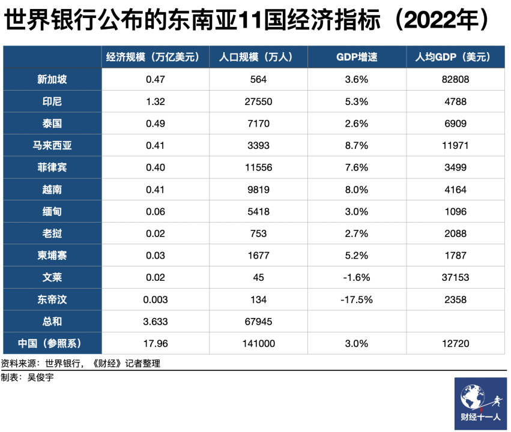
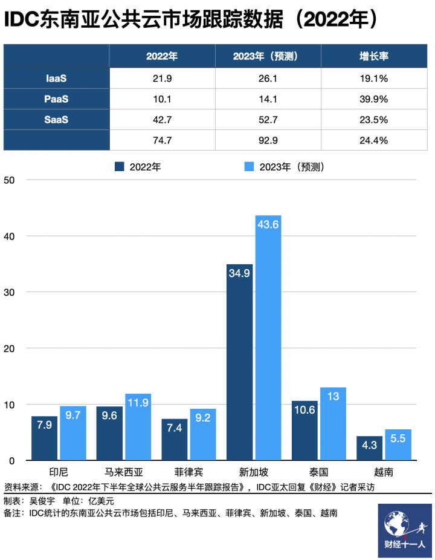
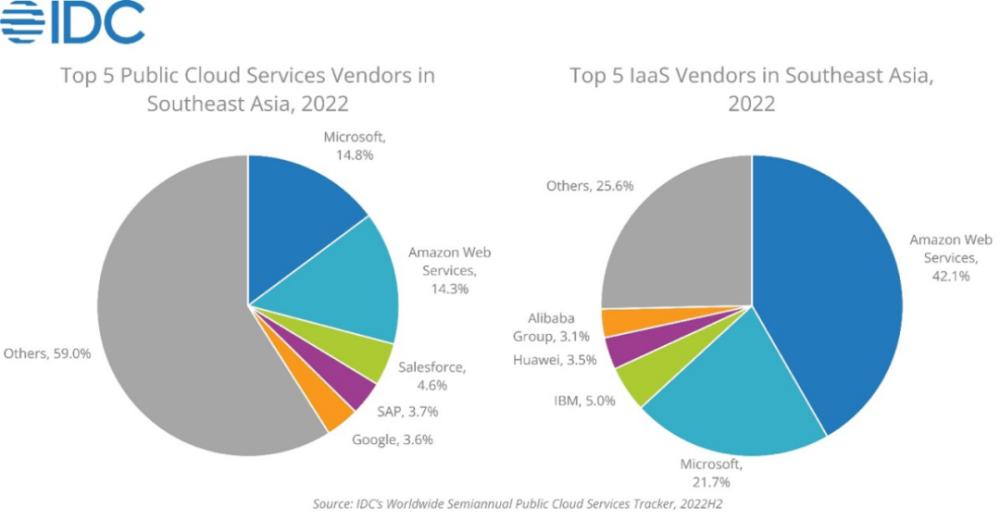
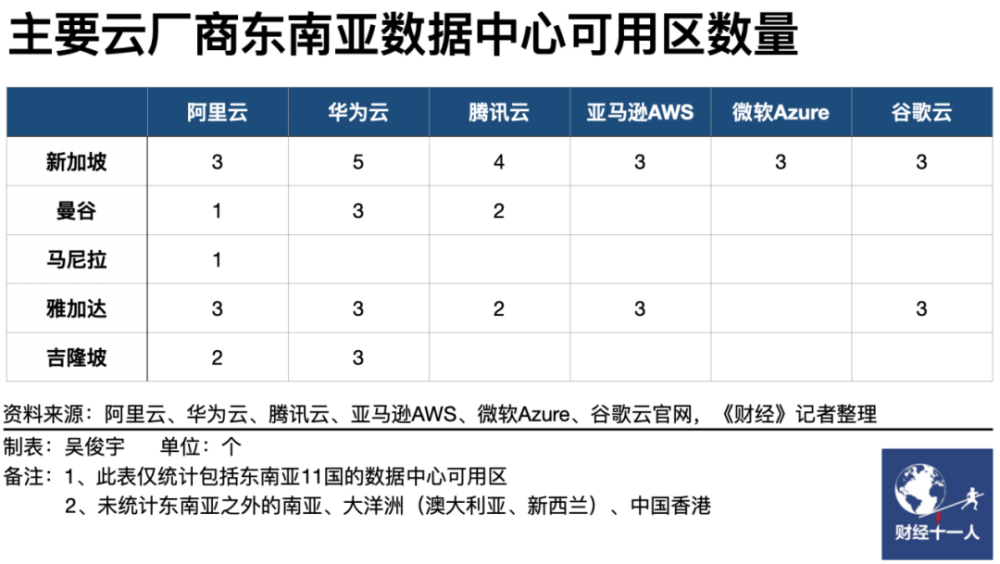
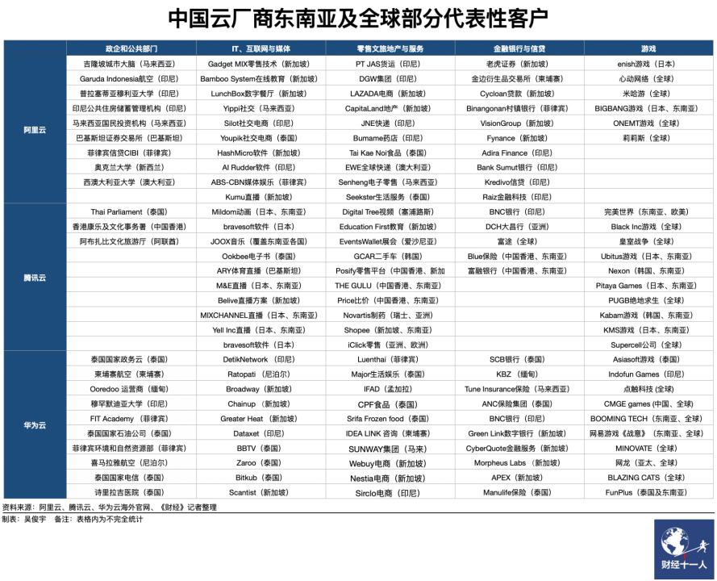
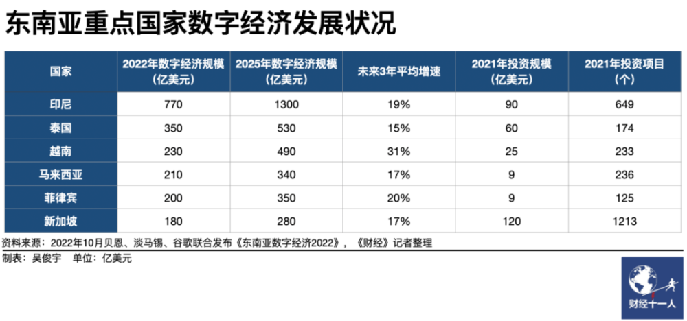
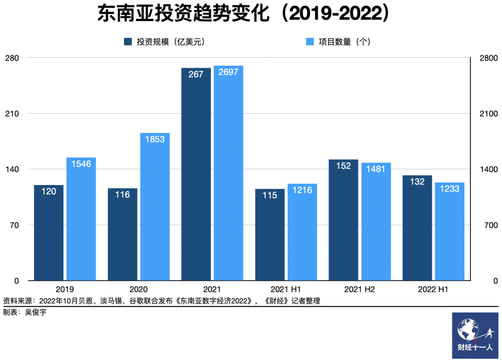

# 中国云厂，东南亚江湖

东南亚市场目前看起来肥沃且有潜力，但这里目前不是中国云厂商的主场。它们在东南亚11国，第一考虑合规稳定，第二考虑市场增速，第三才考虑业务逻辑。

 _印尼街头穿拖鞋的Grab摩托车骑手，摄影：吴俊宇_

**文 | 吴俊宇**

**编辑 | 谢丽容**

印尼首都雅加达街头穿梭着一辆辆身穿Grab夹克的摩托骑手。印尼人打车常见画面是，手机下单，骑手递过安全帽，乘客跨坐在摩托后座。Grab是东南亚版“滴滴+美团”，它可以打摩托、汽车，还能点外卖。

Grab在印尼颇有争议。当地人说，男骑手经常会飙快车，甚至骚扰女乘客。为了解决这个问题，Grab优先为女乘客配女骑手。Grab总部位于新加坡，为东南亚8个国家的350多座城市的1.87亿多用户提供服务，它的成长和壮大，只是东南亚互联网野蛮生长的缩影。

**东南亚11国互联网人口约4亿，超过总人口的70%。** 印尼在东南亚人口规模、经济规模最大，过去9年维持了年5%左右的经济高速增长。
**印尼在东南亚的特殊之处在于，它是不少科技公司的东南亚最大市场，但这些科技公司的总部通常又会设在新加坡。**
新加坡亚逸拉惹高速公路两岸如同北京的西二旗，聚集了打车平台Grab、电商平台Shopee、全球最大数据中心服务商Equinix、谷歌以及一批科技初创企业。

**东南亚被认为是全球经济的下个火车头。**
世界银行2022年数据显示，东南亚11国GDP总量3.6万亿美元，是中国的20%；人口5.8亿，是中国的48%。印尼、泰国、越南等国家人均GDP与2010年的中国（4500美元）相当。2022年，11国中只有新加坡人均GDP（8.28万美元）高于中国（1.27万美元）。

**2016年前后，中国科技企业出海东南亚成为趋势，到现在，中资企业在电商、直播领域是主导力量。**
阿里收购的电商Lazada、腾讯投资的电商Shopee、字节跳动的TikTok、欢聚时代旗下直播平台BIGO等在东南亚都是超过1亿月活跃用户的明星企业。

**东南亚互联网产业崛起带来了用云需求。目前，国际云厂商（亚马逊AWS、微软Azure、谷歌云等）在东南亚市场份额超过70%。中国云厂商如阿里云、华为云、腾讯云等还在快速扩展阶段，目前这些公司在部分区域、行业形成了壁垒，还取得了高于国内市场的收入增速。**

《财经》多方了解的不完全数据显示，阿里云2021年东南亚市场营收增速超60%，第三方市场调研机构Gartner
2022年数据显示，阿里云在印尼、马来西亚市场份额超过20%。

华为公有云服务过去4年在东南亚增长了20倍，是区域内增速最快的主流云厂商之一。第三方数据分析机构Gartner数据显示，华为云在泰国IaaS市场份额为29.4%。

腾讯云在东南亚游戏、直播、音视频市场占据优势，2023年上半年在东南亚等国际市场保持两位数增长，合作伙伴驱动收入同比增长66%。

**中国云厂商在东南亚的市场拓展大致可以分成两个阶段。第一阶段是出海，第二阶段是本地化。**

云这个市场有一定的特殊性，云厂商出海的第一步，通常是服务的客户有拓展海外市场的需求了，云厂一起出海。2016年前后，中国云厂商伴随中资企业出海，当时，东南亚只能算是中国市场的补充。

2021年和2022年间，中国云市场迎来了大发展，同时也伴随着竞争加剧。加上疫情后各国国门逐渐开放，中国云厂商深耕东南亚的意愿变强、速度变快。
**“Local to Local”（在本地为本地）已是阿里云、腾讯云、华为云经营东南亚的共识。**

东南亚开始被中国云厂越发重视的另一个重要原因是，东南亚云市场投入产出比、利润空间高于国内市场。 **合规基础上的本地化被公认为是在东南亚经营的根基。**

增长快利润高的市场

**如果只看大盘，东南亚公有云市场约为中国的五分之一，该市场目前被国际企业主导。**

国际市场调研机构IDC亚太向《财经》提供了一组数据，2022年东南亚公有云（IaaS、PaaS、SaaS）市场总和为74.7亿美元。其中，新加坡市场最大，为34.9亿美元，泰国为第二大市场（10.6亿美元）、接下来的是分别是马来西亚9.6亿美元、印尼7.9亿美元、菲律宾7.4亿美元、越南4.3亿美元。

IDC中国报告显示，2022年中国公有云市场总和为354.2亿美元。 **从数据来看，东南亚云市场理论规模大约是中国的五分之一。**

IDC亚太区分析师向《财经》介绍，东南亚40.6%的软件部署在公有云（SaaS、PaaS）上，59.4%的软件部署在本地（传统IT、私有云、混合云）。新加坡云成熟度超过中国，但东南亚其他国家则处于起步期。

IDC亚太区分析师向《财经》提供的数据还显示，东南亚公有云（IaaS、Paas、SaaS）市场，前五强是微软（14.8%）、亚马逊（14.3%）、Salesforce（4.6%）、SAP（3.7%）、谷歌（3.6%）。东南亚公有云IaaS市场，前五强是亚马逊（41.7%）、微软（21.5%）、IBM（5.0%）、华为（3.5%）、阿里（3.1%）。

不过，新加坡市场调研机构Twimbit
2021年10月数据，东南亚公有云IaaS市场，亚马逊AWS占比44%、微软Azure占比22%、谷歌云占比22%、阿里云占比7%。

**不同市场机构研究方法、统计口径存在差异。但相同结论是，中国云厂商在东南亚目前的市场份额不占优势。**

看起来需要虎口夺食，但中国云厂投入意愿却并不低。中国云厂商在东南亚11国数据中心可用区数量甚至比国际企业更多——阿里10个、华为14个、腾讯8个、亚马逊6个、微软3个、谷歌6个。

上述IDC亚太分析师对《财经》记者表示，阿里云在五个国家设立了本地数据中心，是所有云厂商中覆盖最广的。华为云是第一家在泰国设立云服务的国外云厂商。凭借本地数据中心，华为在泰国的政府、银行、医疗等受监管行业赢得了大量份额。

**相较欧美市场，东南亚地缘接近、文化相似，政治阻力最小，华人在商界影响力大，是中国云厂国际化规划中，当下的现实选择。**

**中国云厂商在东南亚市场的营收增速超过国内市场。**
IDC亚太预测，2023年东南亚公有云市场规模增速将达到22.4%。《财经》记者了解到，目前中国云厂商东南亚市场营收增速普遍超过60%。

**东南亚云市场利润空间也大，甚至高于国内。**
中国云服务东南亚市场定价通常比国内高30%以上，定制、服务成本也更低。阿里云官网显示，一款入门级x86通用计算实例，新加坡、马尼拉、曼谷、雅加达节点月费比北京高48%-64%。在腾讯云官网，同配置的redis云数据库新加坡、曼谷、雅加达月费比广州高30%-63%。

**在这个市场上先行一步的国际企业制定了东南亚市场的游戏规则。在这种游戏规则中，中国企业反而可以拥有更高的市场定价、更低的服务成本。**

销售易东南亚总经理Wee kai Teck是马来西亚华人，加入销售易之前的25年，他曾供职于亚马逊AWS、日立、EMC、Oracle等知名To
B企业。他对《财经》表示，云、软件公司定价受竞争对手影响。欧美企业定价更高，中国企业定价也变高了。

腾讯云总裁邱跃鹏解释，东南亚市场长期受国际企业教育，通常更看重产品、技术，价格战行不通。客户习惯标准化产品，偏好接口、文档自助服务。这跟国内保姆式贴身服务不同，服务成本也更低。

**收入、利润之外的另一个重要因素是“在国际市场寻找自己的坐标”。**
多位中国云厂商高管曾对《财经》记者直言，一家严肃的云厂商必须搭建起面向全球的技术架构。耕耘东南亚不只是为了收入，也是为了参与国际竞争，理解云计算的产品、技术趋势，进而反哺中国市场。

**2020年之后，中国云厂商与上下游企业抱团出海趋势明显。一批国内IT服务公司、软件公司、数据中心服务商也在走向东南亚。**
其中包括东软集团、中软国际、销售易、万国数据等。这些企业在出海过程中发现了增长空间，或是更合理的定价，逐渐决心认真经营东南亚。

IT服务商东软集团2021年在马来西亚开设了子公司，并在印尼设置交付中心。数据中心服务商万国数据2020年进入东南亚并在新加坡设立海外总部，万国数据正围绕新加坡、马来西亚柔佛州、印尼巴淡岛建设海外数据中心。主要配合阿里云等中国企业的东南亚扩张。

CRM（客户关系管理）软件供应商销售易2021年决心在东南亚本地化运营。销售易国际化战略市场负责人郭婧琪介绍，销售易早年服务了大量中资出海企业，公司逐渐发现国际市场的增长潜力。销售易管理层早年熟识的Wee
kai Teck因此入职，支持本地化运营。

**一位软件服务商东南亚战略规划人士对《财经》表示，中国IT服务商越来越青睐东南亚。因为东南亚客户服务付费意识更强，项目定价更合理。国内免费的隐性投入在东南亚（如咨询规划、方案设计和文档撰写等）都要付费。**
客户需求更规范，不像国内需求经常变动、蔓延。服务合同一般周期长达5年-10年。各种因素叠加的作用之下，让项目利润率比国内更高。

国内IT服务商营业利润率通常约为5%。业务覆盖东南亚的印度IT服务商塔塔咨询服务、印孚瑟斯营业利润率超过20%。越南软件外包商FPT集团营业利润率高达19%。

华为云亚太地区部总裁曾兴云认为，东南亚市场对软件、服务的价值认可度较高，市场发展潜力较大。但世界上没有一种方案和商业模式可以通关，归根究底还是要优先满足客户需求。华为每做一项业务，天然会着眼全球市场，并对不同市场的客户需求进行本地化适配。

虎口夺食

在东南亚，中国云厂商的竞争对手是亚马逊AWS、微软Azure、谷歌云，以及IBM、SAP、Oracle、Salesforce等老牌软件企业。与之相比，中国企业的短板是：品牌知名度更低，合作伙伴不够多。

**中国企业如何虎口夺食？差异化产品、更低的价格、高效的服务、长期经营都是突破口。**

**“不能硬碰硬，要找到比较优势，找到中国云服务商擅长的场景”，** 在 **腾讯云总裁邱跃鹏**
看来，中国市场竞争激烈，活下来就不容易，这其实是很好的实战训练。国际市场上，中国云厂商总体来看产品并不弱，价格有优势，服务还更好。这些综合因素造就了中国云厂商在东南亚的竞争力。产品力、销售覆盖提升，慢慢就会拿到市场份额。

**长期经营、积累信任也被认为是积累品牌的关键。** 华为云亚太地区部总裁曾兴云对《财经》记者表示，品牌是打出来的。To
B业务没有捷径，要靠一次次成功交付对客户的承诺来沉淀客户信任、市场品牌。华为坚持“以客户为中心”，持续提升产品解决方案、交付与服务、本地化云基础设施、产业生态等核心竞争力，赢得客户和伙伴信任。

**中国云厂有一些传统强势领域。比如，阿里云擅长电商、零售、物流、金融；腾讯云擅长直播、音视频、游戏；华为云的政务、大型政企以及混合云有优势。**

东南亚互联网产业和中国相比，发展滞后3年左右。当地互联网出现了“Copy From
China”现象。零售电商、直播带货、社交娱乐、枪战Moba游戏出现时，中国云厂商能够提供相应解决方案。

中国的数字经济发展模式也受到各国政府的关注。阿里云智能国际事业部副总裁宋瑛桥表示，东南亚对中国的数字政府感兴趣，阿里云因此在马来西亚落地。

**很多需求对于中国云厂来说司空见惯，欧美厂商却暂时难以提供。**
新加坡直播SaaS公司Belive为新加坡政府、Grab等客户提供直播技术。Belive使用了亚马逊AWS的IaaS和腾讯云的音视频PaaS。Belive
CEO Kenneth
Tan是新加坡人。他提到，Belive音视频平台2020年迁移到了腾讯云。直接原因是，腾讯云支持在八个平台同时直播，但国际厂商做不到。

**价格是另一个关键因素。中国云厂商不愿在东南亚重复国内价格战。即便如此，中国的云、软件产品比国际企业通常便宜30%-50%。**

KUPU是印尼本地互联网招聘平台。KUPU同时采用了三家中国公司的云服务——IaaS层资源是阿里云、PaaS层音视频平台是腾讯云，SaaS层的CRM是纷享销客。

聊到为什么要做这样的决策时，KUPU公司CEO周海波解释，阿里云IaaS资源比亚马逊AWS便宜。腾讯云音视频PaaS能力最出众。周海波对比销售易、纷享销客、Salesforce三款CRM，发现两家中国软件价格只有Salesforce的50%-60%，但产品功能并不弱。

不过，促使KUPU使用全套中国云产品的直接原因是，他们需要更快更周到的服务，而国际企业服务速度太慢。

**中国云厂商的服务长期被诟病人力成本太重，这在国际市场却成了重要竞争力。**
东南亚企业面对中国云厂商可以享受更好、更快的服务。面对国际企业只能按流程办事，只有少数大客户才能享受特殊服务。

面对中国企业，客户通常可以通过微信、WhatsAPP直接提需求，响应时间以小时为单位，解决问题以天为单位。面对国际厂商，一般通过邮件、工单提需求，响应时间通常以天为单位，解决问题通常在数周后。

周海波是中国互联网第一代产品经理。他长期从事互联网招聘，曾是大街网总裁、脉脉联合创始人。他直言，
**中国云厂商只是缺少被使用的契机，体验过中国式服务后，就无法再忍受国际企业的缓慢。**

这一说法得到了多家东南亚本地企业负责人的认同。中国服务、中国速度是他们提到最多的词。Belive CEO Kenneth Tan
2020年开始与腾讯云接触。他对《财经》说，“中国企业非常快，什么都要快快快，服务也很贴心，我很喜欢。”腾讯云会针对Belive产品需求迅速开发新功能，甚至会为Belive带来客户资源。国际企业不会如此重视Belive，因为不是大客户。

**“服务贴心”背后的逻辑是，中国云厂商希望弥补品牌影响力的短板。**
更倾向于按照行业、场景，而非消费规模发展客户关系。在销售易国际化战略市场负责人郭婧琪看来，中国企业在东南亚处于发展早期，格外珍视海外客户口碑，希望打造标杆案例。针对客户部分定制需求，公司产研团队会直接介入。

不过，曾有亚马逊AWS人士对《财经》表示，中国云厂商在东南亚展现了锋芒，但还无法撼动国际企业的主导地位。国际企业也不会为了东南亚随意打破全球的价格、服务体系。

**不过，即便如此，长期经营让中国云厂商在部分领域已经积累了影响力。**

阿里云2014年开启了东南亚业务。起步早、耕耘久，在印尼、马来西亚市场份额超过20%。2021年东京奥运会让阿里云品牌影响力增强，这带来了一批东南亚大型零售、物流、金融、政府客户。

腾讯云2016年进入国际市场。目前在游戏、直播、音视频市场占据较大优势。标杆客户包括韩国最大游戏公司Nexon、全球知名游戏公司Supercell、皇室战争、绝地求生，以及一批直播、音视频企业。这些优势辐射到了东南亚市场。

华为在东南亚市场布局20多年，面向政企和运营商市场构建了大规模本地化团队。华为云与老客户做新业务，一方面打开了政企、运营商市场，另一方面还在抓住互联网云原生市场的机会。华为云在泰国市场份额约为30%，获得了泰国国家政务云项目。客户还包括泰国第二大商业银行SCB银行、泰国最大公立医院诗里拉吉医院、泰国主流流媒体平台MONOMAX等。

尝试融入当地市场

**东南亚11国不能简单视为一个整体。各国经济发展阶段不同，语言、法律、文化、习俗也不同。**

新加坡政治稳定、法制健全，企业所得税仅17%税率且免税优惠政策多。很多公司注册地在新加坡，他国业务被计入统计数字。这里看似市场规模大，实则人口少、纵深有限，更适合作为信息、资本中心。

印尼人口多、规模大、增速快，是最大市场。但营商环境复杂，有数十个政党，每五年的大选会左右或者改变国家整体发展路线。相对复杂的宗教信仰、盘根错节的家族集团也被认为会影响企业经营。

马来西亚、泰国政局稳定，人均GDP仅次新加坡，互联网发展迅猛，但成长潜力被认为不如印尼。越南侧重制造业，互联网基础相对薄弱，但软件外包行业发达。菲律宾、缅甸人均GDP偏低。老挝、柬埔寨、文莱、东帝汶经济体量最小。

**中国云厂商的共识是，要对每个国家采取“Local to Local”（在本地为本地）的经营策略。“Local to
Local”的经营策略，包括产品本地化、团队本地化、合作伙伴本地化。**

**不同的国家审美、习惯、风俗会带来不同产品需求。**
比如，日韩UP主喜欢用二次元形象直播，但东南亚UP主个性开朗，更偏好秀场直播、K歌功能。东南亚英文口音重。腾讯云音视频PaaS产品、国际业务产品技术负责人李郁韬甚至遇到，客户要求要支持当地不同口音英语的AI互译。

针对东南亚用户习惯，中国企业做了大量产品本地化改造。销售易东南亚总经理Wee kai
Teck提到，中文名通常10个字符足够。印尼，穆斯林名字通常包含祖父、父亲、族名，字符长度高达50，产品页面需要留足空间。东南亚隐私保护观念重，员工不喜欢强势管理，CRM软件不能像中国每15分钟检查员工定位。

**本地化生态合作伙伴决定了扎根深度，销售、渠道、软件、服务、托管类伙伴要针对各国重新建立。**

东南亚本地伙伴以外包、销售、服务、托管类为主。东南亚软件服务业是个大熔炉，聚集了印度、新加坡、越南、日本的外包企业，覆盖智慧城市、政府、金融、电信、零售等领域。每个领域都能找到专业公司。

华为云亚太地区部总裁曾兴云介绍，华为云东南亚生态伙伴分成三类，分别来自全球、东南亚本地和中国。华为坚持以客户为中心，从客户需求出发推动生态与伙伴发展，并制定了清晰的合作与利益分享机制。

各国电信运营商也是云厂商重要的伙伴。它们能提供带宽资源、数据中心、销售渠道、软件服务等支持。为此，阿里云与泰国两大电信运营商泰国国家电信、True实现了战略合作。2022年7月，阿里还曾宣布向印尼金光集团控股的电信运营商Smartfren投资1亿美元，预计持股约6%。

**建立本地化团队，要以当地雇员为主，还要给予决策权。**

一些东南亚当地公司负责人发现，中资企业喜欢大量用中国雇员。这种方式可以减少磨合，短期内固然高效，但对企业长期发展不利。KUPU
CEO周海波解释，中国雇员很勤奋，做事方式灵活，但中国员工过多，工作方式的差异容易演变成文化冲突，甚至上升到更严重的情况。

本地化团队对本地、语言、文化理解也更深。英语在印尼无法通用，印尼语被公认学习门槛高。销售易在印尼客户包括当地保险公司PFI Mega
Life。销售易东南亚总经理Wee kai Teck介绍，这家保险公司决策人的第一个问题就是，是否有本地团队。Wee kai
Teck恰好又懂印尼语。这两个因素起到了重要作用。

《财经》从华为云、阿里云了解到，两家公司东南亚各国本地员工比重通常在70%左右，部分地区甚至超过80%。阿里云智能国际事业部副总裁宋瑛桥的经验是，要多依赖当地员工，这可以更好服务本地客户，而且他们会主动提建议和意见，帮阿里云规避风险。比如，当地员工会提醒避开一些颜色、文字，这可能和特定政党、宗教相关，容易引发争议。

**本地政商关系也是无法回避的话题。多位东南亚本地企业负责人建议，中国企业要与当地政府部门、投资机构、协会商会、家族企业保持适当合作。**

印尼、泰国、马来西亚等国家族集团掌握着各国的通信、能源、地产、食品、金融等核心产业。典型案例包括印尼金光集团、马来西亚杨忠礼集团、泰国正大集团。中国企业不可避免会与之交往。Belive
CEO Kenneth Tan建议中国企业，与新加坡政府或主权基金建立良好合作，通过官方渠道与家族集团打交道。

万国数据在新加坡、马来西亚、印尼市场开拓顺利被认为与其政商关系良好密不可分。新加坡寸土寸金，电力紧张，为科学规划数据中心，2022年暂停了所有项目审批。新建数据中心要经新加坡经济发展局(EDB)、信息通信媒体发展局(IMDA)批准。2023年7月14日，新加坡在20多个申请中仅通过了4个80兆瓦数据中心项目。其中包括字节跳动、微软、Equinix（美国数据中心服务商）和万国数据。

《财经》了解到，万国数据前两大股东分别是新加坡主权基金淡马锡旗下新科电信媒体国际数据中心（STT
GDC）和新加坡政府投资公司（GIC）。万国数据在马来西亚与杨忠礼电力集团也合作紧密。

合规、稳定，生死线

不仅是云厂，东南亚正在吸引越来越多中国人。“都觉得这里的生意看起来好做。”一位印尼当地中国创业者说，他最近遇到一个做炸鸡连锁店的老板，今年内想在印尼开1000家分店。

**东南亚被视为现阶段的投资沃土。近年来，流进东南亚的外部投资连年不减。**
贝恩、淡马锡、谷歌2022年10月联合发布的《东南亚数字经济2022》显示，2019年-2021年，东南亚投资规模分别120亿美元、116亿美元、267亿美元，项目数量分别为1546个、1853个、2697个。

很多中国人看到东南亚投资很热，就蒙头冲了进去，忽略了合规问题。一位中国云厂商高管总结，市场重要，但不是第一位的。“要先看合规稳定，再看市场增速，最后才考虑业务逻辑。”

**合规包含两个层面的议题，一是遵从本地法律法规，二是为当地社会做贡献。**

**遵守当地法律、从业规范是业务前提。**
腾讯云在各国都有专职法务、合规团队，每两年会审核数据中心牌照。云业务还要取得各地认证，目前阿里云在全球各国取得了130多项安全合规认证。

**为本地做贡献，也是合规的一部分。**
华为在全球设立了4个区域服务中心，170多个本地服务中心，中方员工与本地员工会提供7*24小时服务，确保无时差及时响应。

曾兴云介绍，华为对合规的要求是遵从、遵从、再遵从，一直把合规和本地遵从置于公司商业利益之上。“在亚太、为亚太”，华为希望成为亚太数字经济主要贡献者。为培养本地数字人才、数字生态，华为2022年通过东盟学院、ICT学院等人才培育项目为亚太培养了超7万名数字化人才。在新加坡、泰国、印尼等地通过初创企业扶持项目，帮助了约120家初创公司。

**“Local to Local”不只是经营策略，更是展现长期经营的决心。**
在阿里云智能国际事业部副总裁宋瑛桥看来，在任何一个区域，政府类客户或伙伴都是重要背书。在东南亚投资数据中心，参与数字政府项目，推动数字基建进程，这是获得当地政府信任的重要方式。《财经》了解到，阿里云是首个在印尼当地运营的国际公共云服务商，2021年还在菲律宾设立了第一个本地数据中心。

**上述IDC亚太分析师对《财经》表示，**
过去新加坡是国际云厂商在东南亚设立数据中心的唯一地点。中国云厂商进入后，泰国、马来西亚、印尼等其他国家也成了选项。中国云厂商的积极投资，带动了亚马逊AWS、微软Azure、谷歌云在新加坡之外开设数据中心。

**中国企业还需要学会自我保护，要密切关注汇率变动、地缘风险、自然灾害，谨慎投资固定资产。**

汇率半年就能影响超过10%的营收数字，对利润影响更无法估量。中国云厂商目前的习惯是，在东南亚尽量以美元结算，部分信用好的政企客户可以用当地货币结算。

数据中心作为不动产，自建投资高达数十亿元，地缘风险会导致损失无法挽回。一个最近的教训是，中国云厂商曾把印度作为南亚、东南亚最大数据中心节点。但随着小米、OPPO、vivo印度业务收缩，当地云业务也受到影响。

要不要在东南亚自建数据中心？中国云厂商态度总体谨慎。腾讯云总裁邱跃鹏提到，腾讯云会综合考虑网络质量、地质结构、建设成本、地缘风险、人才供给等综合因素。新加坡配套完善、法制健全，是数据中心最稳定的选项，但土地、电力成本很高。印尼、泰国等国家则具备成本优势。

《财经》了解到，目前国内云厂商在东南亚的数据中心全是托管租赁模式。好处是，灵活高效，风险更低。租赁对象通常是本地电信运营商、中国电信运营商以及第三方数据中心服务商。比如，腾讯云新加坡二区，就租赁了中国移动国际的数据中心。

**对东南亚市场过分乐观，进而激进扩张也是常见心态。一些中国软件厂商甚至开始在东南亚打价格战。**

面对外界的乐观和期待时，“耐心”是腾讯云总裁邱跃鹏提到最频繁的词。他说，进入国际市场不能喊口号，腾讯云对东南亚等国际市场没有爆发式的要求，更希望用稳健的方式慢慢滚雪球。

华为云亚太地区部总裁曾兴云说，面向东南亚云市场，华为云会坚持以客户为中心，持续提升核心竞争力，持续为客户创造价值。“在本地，为本地”，努力成为跑得最快、最远的长跑选手。

和大公司、老玩家不同，新入场的中国创业者面对东南亚这片蓬勃的市场时，容易变得自信。因为很多业务模式在中国验证过了，在东南亚重做就像降维打击。KUPU公司CEO周海波形容，这种心态类似于“我高考都经过了，难道不会中考？”他见很多出海创业者制定了激进的战略决策。

他提醒，“环境不一样，答案不能照抄，还得从头写”。

