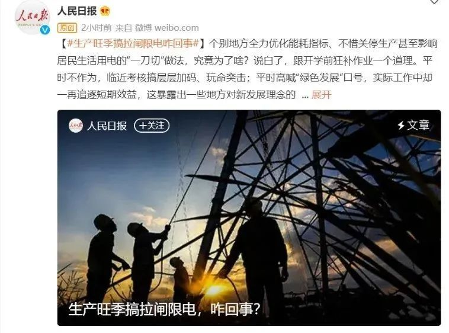

# 北方不让烧散煤，南方设置禁养区，基层折腾式治理何时休？

**核心要点：**

  * _1_ 基层正在经历一个堪称“折腾式”治理的过程。其主要内涵是，对治理者和治理对象而言，治理过程并未产生正面效果，反而在制造负面效果，且消耗相互之间的信任。
  * _2_ 折腾式治理除了证明某种理念和政策的“无比正确”之外，并不能够给基层干部和群众带来获得感。
  * _3_ 地方政府的理性，其实是“两害相权取其轻”。简单说来，与折腾老百姓付出的代价相比，不折腾所受到的问责惩罚更大。
  * _4_ 和20年前的“三农”危机相比，今天的基层问题，实在是没理由的。未曾料到，农民不苦了、农村不穷了、农业也不算危险了，竟然问题更多了！群众不满意，干部也有怨气，真是奇怪。

（原文收录于东方出版社2021版《基层中国——国家治理的基石》）

这几年，为了环保，北方各省市都在大力推广煤改气、煤改电工程，再不济也要推广清洁煤。也因此，每年都会出现因环保治理而导致的各种社会问题。比如，学校因为没供暖，小学生只能晒太阳取暖；老百姓因为烧散煤，还被拘留了；因为使用清洁煤不当，多人煤气中毒。

凡此种种，其实都和封灶式环保一个逻辑：地方政府为了实现环保目标，采用极端手段深度干预群众的生产生活方式，由此制造了大量社会问题。

概言之，基层正在经历一个堪称“折腾式”治理的过程。其主要内涵是，对治理者和治理对象而言，治理过程并未产生正面效果，反而在制造负面效果，且消耗相互之间的信任。

首先，地方政府其实是没什么好处的。

客观上，各种以环保、生态为目标的治理，对很多地方政府而言，其实是弊大于利的。不仅会影响经济发展，还会为此付出治理成本。

举例而言，煤改气和煤改电是一个需要耗费巨大财政的工程，北京或许可以做到，但周边的河北、山西或许就有极大压力。

其次，某种意义上农民也是利益受损的。本质上，“环保”是一个现代概念，和传统的生产生活方式有极大差别。

因此，过去农民的生产生活方式，很可能都“不环保”。养殖会污染水，烧火做饭会污染大气……简单说来，折腾式治理除了证明某种理念和政策的“无比正确”之外，并不能够给基层干部和群众带来获得感。

这些年来，基层社会和广大群众可谓是被各种不接地气的政策折腾得鸡飞狗跳。而其中最为典型的，便是和环保有关的政策。

北方如此，南方亦然。

我刚刚在一个南方山区县调研，该县为了治理大气污染，竟然也严禁出现野外用火，出现一个火点也一样要受到严厉处罚——真没想到，过去一些年北方平原地区秸秆禁烧的故事在南方山区也在上演了。

幸亏，南方的大气污染治理毕竟还不是重点，地方政府所受压力不算那么显性。

但是，环保督查的威力实在是大，大气污染还好，水、土壤等污染治理却马虎不得。为了“永绝后患”，北方在“封灶”，南方又何尝不是在拆这拆那？北方农村有禁煤区、限煤区，南方则到处有禁养区、限养区。从政策执行的角度看，地方政府的行为是再理性不过，与其花大力气治理养殖污染，还不如直接把养殖业连根拔除算了，从此一劳永逸。

非常有意思的是，调研发现，关于生猪养殖的问题，农业部门和环保部门的政策其实是在打架的：一方要恢复生猪产能，另一方则需要治理养殖污染。问题的关键是，我国现有的生猪生产主要是靠规模化的小农生产进行的，这一生产方式几乎就不可能满足环保要求。

一旦环保督查，农民生计必定受到影响。

看来，基层的折腾，地方政府的理性行为难辞其咎，它首先是政策执行的结果。然而，几乎每一次问题的出现，地方政府都要承受巨大压力。平心而论，地方政府真要为这些社会问题埋单吗？

根据调研，地方政府怕是有点冤枉，很多地方领导和基层干部都甚感委屈。我这些年算是做了不少基层调研，对基层干部的所思所想也算是比较了解。今日的基层干部，其政策水平并不低，理解上级政策内涵是没任何问题的。并且，基层干部因做一线工作，也了解基层实际，很清楚政策落地会产生什么后果。

故而，地方政府的理性，其实是“两害相权取其轻”。

简单说来，与折腾老百姓付出的代价相比，不折腾所受到的问责惩罚更大。在北方农村，谁都知道多年来形成的烧柴火做饭、烧炕取暖是最经济实惠也是最有效的生活方式。并且，这种取暖方式还和北方的房屋设计、建筑建构、家庭空间等密切相关，已经深深嵌入到了家庭生计和生活方式之中。因此，煤改电、煤改气等看似只是改变了人们的热量获取方式，其实是在撬动社会的根本。

如此巨大的变革，哪能是一项简单的环保政策可以承受得起的？哪怕是财政补贴足额，对群众的影响也是巨大的。

问题的吊诡之处恰恰在于，政策越是简单，越是粗暴，其短期的威力往往越大。地方上为了完成环保大业、免于遭受问责，会选择牺牲点经济发展，牺牲点老百姓的福祉。

更深层次的问题是，与折腾式治理相关的是，当前的基层治理正在经历一个堪称治理迭代的过程。治理的理念、方式和方法也在发生巨大转变。

治理迭代的典型表现是，基层治理活动从生产治理转换到了生活治理。过去，基层治理主要是谋求发展。地方政府的大量工作花在发展经济，进行基础设施建设上。

可以这么认为，这些治理任务有极大的合法性，老百姓哪怕不情愿，大概率也是不可能有怨气的。并且，谋发展的工作并不会深度介入群众的日常生活，对私人生活的干预是比较浅层的。这就意味着，基层治理其实是很难和群众发生全面冲突的。

而今，基层治理主要是服务和安置群众生活，无论是环保、乡风文明建设，都意味着要深度嵌入到群众的生产生活方式之中。

这就意味着，在生产治理时代习以为常的政策工具，很可能不起作用。简言之，对农民的“安置”，如果不仔细做思想工作，不采用引导、说服、教育的办法，而是简单粗暴地采用行政手段，效果很可能适得其反。

以精准扶贫为例，这本来是一个利国利民的大事，然而，扶贫扶出仇恨来的情况实在普遍。调研的某地，连土葬改火葬和拆空心房这样的工作也闹出了几条人命。很显然，老百姓之所以反应强烈，并不在于简单的火葬或美丽乡村建设的政策问题，而是这些政策触及了人们的基本生活方式，乃至于灵魂安顿。

非常可惜的是，近年来的基层治理，时间紧、任务重，越来越多的问题都成了政治任务，都辅以检查、考核、督查等手段，基层不敢怠慢也不能怠慢。导致的结果是，基层干部疲于奔命，一个工作没干完，另一个工作又来了，根本就没有时间和空间来理顺治理体系，以有效应对治理迭代带来的风险。

**这些年基层治理有一个明显趋势，就是越来越多的业务工作成了政治任务，导致基层治理压力陡增**
。扶贫、环保、党建、维稳、招商引资、扫黑除恶等都成了重点工作。那些本来是在实际承担行政任务的业务部门，转而成了督查检查部门，具体任务几乎都下沉到了乡村两级。“攻坚”成了当前基层治理的重要特征。

**基层治理不再依靠常规的力量来推动，而主要依赖于政治和行政力量，通过责任层层下压来推动。**

这种工作方法，虽然可以在短时间内聚集力量，有利于“攻坚”，却极大压缩和限制了基层的工作空间。基层党委、政府和干部在重压之下，只能“对标”上级考核体系，尽力完成任务，并没有时间和精力去考虑这些任务该用什么方式来完成。并且，由于各项工作都有较大的时间压力，时间紧、任务重，根本就不可能顾及基层实际。

**总之，基层普遍弥漫一个氛围，希望各项攻坚任务赶快结束，早点回归到常规为好。**

作为一个农村研究者，我觉得，和20年前的“三农”危机相比，今天的基层问题，实在是没理由的。未曾料到，农民不苦了、农村不穷了、农业也不算危险了，竟然问题更多了！群众不满意，干部也有怨气，真是奇怪。

大时代的基层治理，是到了反思的时候了。也许，治理迭代是一个漫长过程，等不及它来解决现实问题；但我们至少可以减缓一下激进政策，让基层治理有更多的调整空间。

