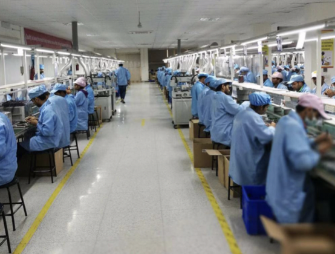
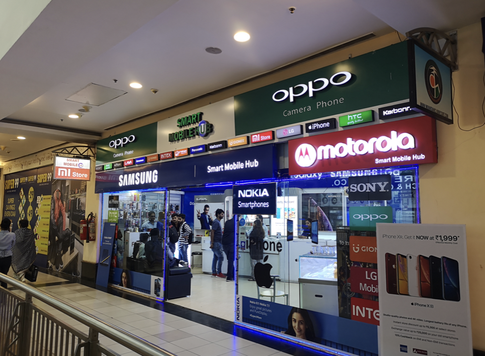

# 印度不再从中国进口手机：每年1.8亿支的订单没了

一部iPhone手机的诞生过去往往经历着这样的一个过程：在苹果美国总部设计，采用美国芯片厂商提供的手机主芯片以及日本、韩国提供的包括显示屏在内的关键器件，再由中国厂商供应剩余零部件，最后在河南郑州的富士康工厂里组装，空运至全球各地。

作为苹果全球最大的生产基地，中国组装生产了全球九成以上的iPhone产品。根据Counterpoint向第一财经提供的数据，2022年，苹果手机的生产组装中，中国市场的份额为96%，印度紧随其后，约占4%左右。但从去年9月开始，越来越多的消费者发现，他们买到的iPhone
14 系列包装盒上印着“Assembled in
India”的字样。这意味着，最新款的苹果手机正在由印度生产制造。苹果公司计划到2025年将25%的生产转移到印度。

中国的手机制造商小米、OPPO和vivo都已经实现了在印度的生产制造。同时，三星目前能在印度制造所有的旗舰手机，而在两年前并不是这样。“苹果和三星在过去两年里实现了显著增长。”Counterpoint高级分析师Shilpi
Jain对第一财经记者表示，印度政府正在推动智能手机制造商增加本地价值，包括制造本地化。

这种趋势在过去十年间令中国和印度的手机贸易格局发生颠覆。2014年的时候，中国每年向印度出口的手机数量可达到1.8亿支。但近年来，随着印度在手机制造的产业生态日渐完备，它已经几乎不再需要从中国进口手机整机。

**“印度制造”起步**

过百亿的资金正在涌入印度的制造业，大量的印度年轻人聚集在印度诺伊达、哈里亚纳邦等地的工业园区，开始为来自全球主流智能手机品牌的雇主打工。在完成组装环节后，这些手机就会被运往包括美国、英国等多个国家直接进行销售。

据印度商业和工业部数据，今年4月至6月期间，印度电子产品出口增长超过56%，达到5722.024亿卢比，而去年同期为3653.318亿卢比。电子产品成为前五类出口中产品唯一增长的行业。

在最新公布的官方数据中，电子产品已经成为印度第二季度第四大出口产品，该类别在前三十名出口产品中增长最快。

印度电子和信息技术国务部长拉吉夫·钱德拉塞卡(Rajeev
Chandrasekhar)今年3月对外表示，印度总理莫迪已提出明确愿景，即印度将在全球电子供应链中发挥重要作用，并制定到2026年制造3000亿美元电子产品的目标。

钱德拉塞卡预计，从明年起，手机将成为印度出口的十大类别之一。

近年来，在莫迪政府的推动下，消费电子产业在印度制造业中的占比呈现出上升态势。莫迪政府以印度广阔的消费市场为吸引点，出台扶持方案同时提高整机进口关税，力图打造消费电子制造上下游产业，培育本土完整产业链。

根据印度蜂窝通信协会公布的数据显示，在2014年，印度制造的手机仅占全球的3%，但在莫迪力推“印度制造”的第二年，也就是2015年，印度制造的手机在全球占到的比例已经达到11%，并且超过了越南，成为仅次于中国的第二大手机制造国。2020年5月，印度推出支持电子制造业发展的生产相关激励计划（下称“PLI计划”）以刺激经济、基建、市场需求、电子制造业的发展。

Shilpi
Jain对记者表示，《印度制造》政策，如PLI计划等，使苹果、三星等厂商受益匪浅。但从政府的角度，这项计划也提高了印度高层管理人员的就业机会，吸纳本地股权合作伙伴进一步增强这些公司对印度市场的承诺。

Counterpoint
Research向记者提供的一份数据显示，在2020年，印度产iPhone仅占其全球产量的1.3%，到2021年上升到3.1%。2022年，苹果的iPhone、AirPods、Mac以及iPad在中国的产量占比分别为96%、95%、98%以及98%，印度的这一数据为4%、0%、1%和0%，但在今年，该机构预计印度制造在上述苹果产品中的份额则变更为7%、2%、3%以及3%。

从增长趋势来看，今年“印度制造”中来自于苹果的订单甚至将高于分析师年初的预期。

在印度蜂窝通信协会公布的数据中，受益于PLI计划，印度智能手机出口量在2023财年的前两个月增长了一倍多（4月以及5月），而智能手机出口额达2000亿印度卢比，远高于去年同期的906.6亿印度卢比。其中，5
月份智能手机出口订单额达到1200 亿卢比，50%由苹果贡献。

相较于两年前印度还只能生产“过代”的iPhone，如今最新款的iPhone14系列手机已经开始从印度输送至全球市场。在印度官方公布的一组智能手机主要出口国中，主要为美国、阿联酋、荷兰、英国和意大利，这些国家的份额占印度手机出口的七成以上。

据美国商务部统计，2022年美国自中国进口手机同比下降2.2%至1.51亿部，占其进口来源的79.9%，虽然较疫情前2019年的71.2%有所提升，但较2014年顶峰84.9%已下降5%。2022年美国自越南和印度的进口量占比分别有15.3%和2.2%，该比重较2014年扩大超10倍。

Counterpoint Research高级分析师Ivan
Lam对记者表示，2022年，苹果手机主要在中国和印度组装，中国市场的份额在96%，印度在4%左右。到了2023年，这一数字将会变为93%和7%。

“出口的增长取决于产业链的本土供应，还有本地生产爬坡的可控率。”Ivan Lam对记者说。

**中国供应链身影**

虽然印度对于本土制造有着强烈的野心，但目前其生产基本上集中在散件组装环节。从整体供应链的发展成熟度来看，印度本土还没有元器件、模具等生产配套能力。

富士康曾计划用五到十年的时间将30%的产能转移到印度。然而一个现实是，苹果手机90%的组件仍来自中国，包括手机支架、工业胶水、螺丝、网眼、压敏粘合剂和金属零件等物品都需要按照苹果的要求从中国发货。

据中印越电子协会CMA统计，到2020年底，投资印度的中资手机供应链工厂整体数量达200家，贸易公司（即在印度注册有公司没工厂企业）达500
家，往来支持中资手机工厂发展的中国人数达万人。每年往来印度的中资手机企业人数达 10 万人次。

王刚是常年往返于中印手机供应链中的一员。

从香港国际机场出发，飞行六个小时之后，王刚落地印度的德里机场，短暂休息后，驱车向东1小时，20公里的路程，就能到达印度的新奥克拉工业开发区诺伊达。从2016年开始，像这样横跨在中印两国之间的出差对于王刚这样的“手机人”来说，已经成了家常便饭。

《中资企业在印度发展报告》显示，印度中资电子（手机）企业投资印度主要分三个阶段。

第一个阶段是2015-2016
年，中国的手机品牌小米、OPPO、vivo、传音四大品牌先后进入印度，并在印度获得三分之一的市场占有额。同时，MCM、海派、与德等手机组装工厂投资印度。第二阶段是
2017-2018 年，主要是中国手机供应链及配件配套服务商投资印度，电池、充电器、数据线等厂家如欣旺达、APSC、小林电子、裕同等企业。第三阶段是
2018-2019年，手机供应链中的中小企业进驻印度，如模组、模切、包材、辅料等企业，代表性企业如联创、同兴达、六甲包材等。

这些来自于中国的供应链厂商主要分布在诺伊达、古尔岗以及印度南部的钦奈周围，而除了手机供产业链投资印度外，还有近500家贸易公司服务于手机企业，如设备商、材料商、弱电强电安装公司、净化工程公司、酒店餐饮服务商、人力公司、物流公司、税务注册服务公司、法律咨询服务公司等。

印度中资手机企业协会秘书长杨述成曾在接受第一财经记者采访时表示，印度的诺伊达目前拥有的手机产业链厂商最多，过去小米、传音的OEM代工厂以及围绕这些手机大厂的上游供应链都在印度设厂，其中不乏A股上市公司。

印度的手机市场空间是吸引中国手机及其供应链企业投资印度的核心原因。

相比全球其他地区，印度是唯一一个呈现换新手机频率加快趋势的国家，和2G转3G时代的中国市场颇有几分相似的地方，而14亿的人口红利在任何一家品牌手机厂商看来，更是割舍不下的“肥肉”。除了市场原因外，印度市场对中国手机厂商的关税调整也是倒逼厂商建厂的关键因素。

2016年开始，莫迪推出了“分阶段制造计划”，希望利用印度巨大的智能手机市场推动本土生产。该计划不仅包括对手机征收关税，还包括对手机充电器、电池、耳机和已经预装印刷电路板的零部件征收关税。

据业内人士透露，从2017年12月开始，印度政府将智能手机的基本关税从10%提升到了15%，2018年2月又上升至20%，4月份又对包括电路板、摄像头模块在内的电子元件征收了10%的关税。这样的政策，促使手机上游电子元件和整机在本地的生产。至2020
年，印度品牌平均关税为 28%， 其它零配件平均关税为 15%。

换言之，以散件零部件的形式进入印度市场可以获得更低的关税，从而获得更低的综合成本。Counterpoint
的一组数据显示，2018年，印度手机市场中有一半是以SKD（半散件组装）形式进口，CKD（全散件组装）则为34％，但到了2019年，CKD已经占到了三分之二以上的比例。

“中国手机产业链铺设速度令人吃惊。”长期跟踪国产手机的一位分析师对记者表示，中国品牌仅耗时一年多就从SKD快速转变为CKD完成本地化，并且在印度手机销售榜上拿下了近七成五以上的市场份额。

**1.8亿支出口订单没了**

根据经济智库全球贸易研究倡议(GTRI)
的一份报告，印度从中国进口的笔记本电脑、个人电脑、集成电路和太阳能电池等电子产品在2022到2023年期间有所下降。

目前，我国出口印度货品主要以电子元件、电池、初级化学品颗粒、塑料、塑胶等生产原料为主。据中国海关统计，今年1到6月，我国对印度进出口总值
660.27亿美元，同比下降 0.8 %。其中，出口565.31 亿美元，下降0.9 %；进口 94.96亿美元，下降0.6 %。

在所有类别中，手机元件设备依旧排第一，出口额达17.4 亿美元，而智能手机整体出口为3.06亿美元。但从金额来看，前者同比下降52%，而后者同比下降24%。

这不是近期才出现的趋势。据印度海关统计，印度手机进口量已经从2014年的2亿部降至2022年的377万部，萎缩了超98%，自中国的进口量更是从1.79亿部降至219万部。

这些证据显示，至少在手机整机制造环节，印度消费者所需手机已经基本实现了自给自足。

手机制造环节向印度转移的趋势没有停止。

苹果CEO库克在财报中曾多次强调对印度市场的重视，并将其视为下一个促进苹果增长的主要市场，甚至是最重要的市场之一。今年，苹果计划在印度首发iPhone
15系列，并加大对当地的投资和布局。

而在今年三月，一张富士康董事长刘扬伟与印度总理莫迪握手的照片在海外社交媒体上传播，刘扬伟在印度的行程则被外界解读为富士康增加印度投资的信号，包括扩建制造工厂以及建设碳化硅加工厂和芯片封装设施。

虽然富士康随后否认了具体的投资动作，但有消息称，富士康将于2024年4月开始在印度南部的卡纳塔克邦生产最新款iPhone。印度南部卡纳塔克邦政府表示，该项目价值1300亿卢比（15.9亿美元），预计将创造约5万个就业岗位。

彭博智库预计，新的生产基地和扩产计划将使印度在iPhone组装方面的市场份额从目前的不到5%提高到10%至15%。

除了苹果外，包括小米、OPPO以及vivo在内的头部手机厂商均在印度实现了本土制造。

Shilpi
Jain对记者表示，小米最近还与Dixon合作，扩大智能手机在印度的制造能力，vivo则计划在2023年年底之前在印度扩大生产能力。但手机厂商官方并未对上述扩产消息予以进一步确认。

研究机构Omdia
Display分析师郭子骄认为，全球供应链的配置，最终还是由成本和市场来决定的。成本最重要的优势来自于规模，其次由投资额以及材料成本决定，还取决于管理。“零部件作为资本和技术密集型的产业，目前中国占苹果零部件的生产比重仍然相当大，全球还没有地方可以在短期内承接大规模的转移。”

短期来看，印度想复制中国制造的成功不是易事。

“刚开始投产的时候，印度工厂的生产效率只有中国的60%。”一位曾经为小米做海外代工的企业负责人曾对记者表示，技术工作仍需要靠中国工人手把手教会印度本地工人，而且不太愿意加班，周日需要休息，这一点和中国的工厂不太一样。

此外，上游供应链也有待完善。除了供应链生态外，完善的配套设施，包括公路、铁路、电、水等需要巨额投资。上述《报告》认为，未来10 年里，印度基建缺口大概会有
1 万亿美元，这些钱需要从海外市场吸纳。

“总不能缺个什么零配件还要等上一个月才组装，完全实现印度的本地化制造仍需要时间。”上述人士称。

不过，随着印度成为苹果的第五大市场，当地手机产业链迎来机遇期。TechInsights表示，苹果 iPhone 该季度出货量在印度同比增长超过
50%，印度已经成为苹果在销售和制造方面重要的战略市场。

（第一财经实习生汪倚妃 记者王珍对此文亦有贡献）

