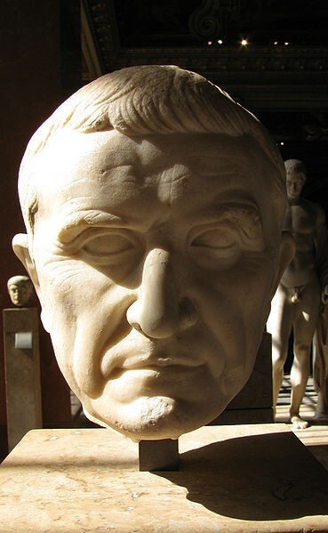
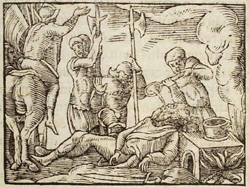
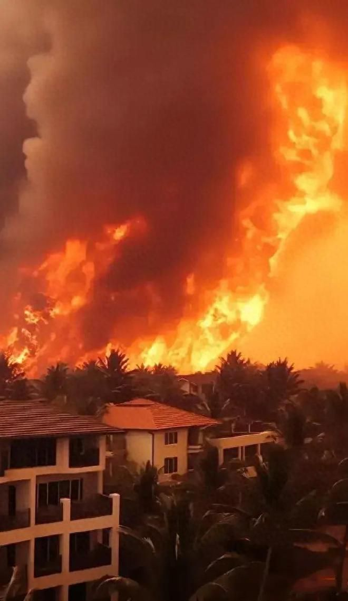

# 夏威夷大火是富人为掠夺穷人土地而放的？解读谣言背后的源头与真相

正是在西方的传统和传说的影响下，才会有“火灾换土地”的说法。

最近，美国民众也在反思山火的源头，一种广泛传播的谣言是，“火是富人放的”，目的是低价买走当地的土地。另一个让人误解的迷思是，“富人的房子不容易过火”，为什么大火会“躲着豪宅走”？我一听就知道这一说法的文化源头，这里我来解释一下谣言是如何产生的。

“放火为地价”的说法，来自罗马的第一支私人消防队伍的实践。马库斯·李锡尼·克拉苏（约前115年-前53年），是罗马执政官老克拉苏三个儿子当中的老二，罗马将军，政治家，在罗马由共和国转变为帝国的过程之中，扮演了重要角色。克拉苏出身在富有的上流阶级，克拉苏是在内战时期，以担任卢基乌斯·科尔内利乌斯·苏拉手下一名将领，开始政治生涯的。克拉苏自己的政治地位，是通过镇压斯巴达克斯领导的奴隶叛乱而崛起（美国电影《斯巴达克斯》中的反面主人公），与对手格奈乌斯·庞培一起担任执政官。

克拉苏也是一位成功的黑心奴隶商人，不择手段的敛财。所以他在一生中聚敛了巨大的财富，所以后人认为他是罗马历史中最富裕的人，按今天的价值估算，大约是84亿美元，因此也算是古往今来世界历史中最富有的人之一。那么，他是如何致富的呢？罗马历史学家普鲁塔赫认为，他是通过“火灾和抢劫，利用公共灾难致富”。也就是说，他从那些着火或倒塌建筑中进行投机地产投机。

_西方消防之父，第一个试图从消防中谋利的先驱者，克拉苏（雕塑原件保存于卢浮宫）_

在当时的罗马共和国，没有人可以处理在罗马的火灾保险，克拉苏以一个相当特殊的方式组织他的奴隶消防队伍。起初，他征集500名奴隶，大多从事建筑师和工匠的工作。在收到火警之后，在克拉苏的带领下他的人会冲出来，但在到达受火灾影响的房子时会停下来，拒绝工作。然后克拉苏与业主讨论房子的价值，并会做出低价赎买。正因为房主很难拒绝，恳求这些人将大火扑灭。如果拒绝报价，这些队伍就站在马路的一边袖手旁观，而克拉苏则试图购买受影响物业的两侧房屋。现在火灾已经稳定燃烧，克拉苏将靠近失火房主给出更低的报价，如果这件事情拒绝，他和他的手下会让大火更燃烧多一点，直到最后的交易完成。一旦价格商定，这些人会很快进入着火的建筑，扑灭火头。当时消防队伍主要靠水桶和提水到现场的足够人手，如果火势太大，他们也会束手无策。熄火以后，让人修好房屋，把房子投放到公开市场上出售了。通过平整地产，重建物业，相机售出，累积财富，克拉苏累积了第一桶金（估计他年轻时才会如此赤膊上阵，所以应当发生在公元前81年前后）。

后来克拉苏跟在苏拉后面当打手，就不会如此出头露面了。他最喜欢从那些被放逐的公民留下的不动产中不劳而获。为了这个目的，他在上级（苏拉）的默许下大肆迫害政敌，没收对方的财产。最著名的办法是当他看见那些需要放逐的政敌名单之时，往往添加几位当时最富有的人，因为他觊觎他们的财产，这样当有钱人被放逐之后，他来坐享其成。也有一些财产是使用传统方式取得，比如奴隶交易、银矿开采、不动产投机生意等，甚至包括娶有钱的寡妇。用种种不名誉的办法，他在短时间内积累了庞大的产业，使自己成为古往今来的十大富豪之首，同时也给自己带来臭名昭著的名声。英语里一个单词叫作Crass，意思是厚颜无耻。

人的欲望是没有止境的，在第二个执政官任期完结之后，克拉苏获任命为叙利亚行省总督，继续到东方开疆拓土、收集财富。为了获取声名和财富，他以叙利亚为基地，向罗马的长久敌人安息帝国发起了进攻。公元前53年，在卡莱战役中，克拉苏遭到了彻底的失败，他本人被俘。传说中，因为他太贪婪，所以被灌以熔融的金属杀死，于是有下面的插图产生。

_克拉苏之死，Pierre Cousteau（1555年绘制）_

也就是说，正是在西方的传统和传说的影响下，才会有“火灾换土地”的说法。不过，从西方的观点来说，克拉苏是一个高超的企业家和创业者，能够通过白手起家获得超级富豪的地位，成为消防领域当之无愧的先行者和创业者，给人类社会的消防事业进行了勇敢的“探雷”工作。正是他的努力，让人类社会认识到，消防工作的公益特征决定了，一旦私有化就会发生“见火不救”的伦理学困境。

“放火拿地说”的另一个源头是公元64年的尼禄大火。古罗马史家塔西佗认为是尼禄放火焚烧罗马城的，他写道：“因为火是从埃米里乌斯区提盖里努斯的房屋那里开始的，这种种迹象都表明尼禄是在想取得建立一座以他的名字命名的新首都的荣誉。”他还描写道：“当大火吞噬城市时，没有人敢去救火，因为许多不许人们去救火的人不断发出威胁，还有一些人竟公然到处投火把。他们喊着说，他们是奉命这样做的。”古史家苏埃托尼乌斯的说法则更详尽：“他以不喜欢难看的旧建筑和曲折狭窄的旧街道为借口，竟然如此公开地点着了这座城市，以致几位前任的执政官在他们自己的庄园上发现尼禄的侍从拿着麻屑和火把时，竟然不敢拿捕他们。而在他特别想占用的黄金房屋附近的一些谷仓，是先用作战器摧毁后才付之一炬的，因为它们的墙壁是石头的。”不过现代人对此城市规划说不太认可，尼禄只要征地就可以了，根本不需要靠纵火来达到这一目的。事实上，尼禄主要和元老院的贵族成员不对付，却作为凯撒的直系子孙一直受到民众的欢迎，因此大可不必通过这种损害老百姓利益的方法进行拿地，此说不成立。但是，在塔西佗的说法下，“放火拿地说”持久不衰，构成了今天夏威夷灾后谣言的群众基础和文化源头。

_尼禄曾经迫害基督徒，所以一直被基督徒历史学家抹黑。不过，在消防领域，却被誉为西方第一位消防工程师_

为什么中国人很难相信“纵火拿地说”？因为西方有“arson for
profit”的传统，而中国没有。在中国如果有纵火，往往是想不开的妇女（如杭州萧山纵火案）或不懂事的儿童（如云南留守儿童纵火案），却几乎没有纵火牟利的说法，因为我们历史上没有真正的保险公司，放火得不到好处，自然很少有人放火。此外，中国历史上对放火的惩罚又是极其残忍的，“弃灰于道断其手”，所以历史上几乎没有“放火谋利”的成功案例，自然也就不会有“纵火拿地说”的土壤。在中国历史上，土地是国家的，人是地主或领主的，你没有啥私有财产，自然不会产生保护私有财产的说法。唯一的例外是宋代，宋代的种种重视人权的现代文明观念，被某些爱国主义者贬低得一文不值。武力可以解决一切，其实就是一种野蛮。

_豪宅避火说的背后，是空间换安全，防火靠隔离的基本规律。老子云“无用之用”说的是防火隔离带。_

另外，关于“大火避开豪宅”的说法，人们总是举例加州的自卫措施。在此前的美国加州山火中，也有不少名流的豪宅面临火灾的威胁，但他们选择雇佣了收费高昂的私人消防公司，这些公司很快为他们的豪宅清理出了防火带，安装了各式救火设备，并在外圈设置了防火布。当时有不少民众还注意到，这些私人消防公司只对雇主负责，换言之，他们只需要把大火隔绝在雇主的财产外即可，而不对外面的火情采取任何行动。另外，这些在当地购置豪宅的名流大多并不涉及房地产业务，即使想扩建豪宅，也大概会从专门的房产公司购买房屋，而不是像网民猜的那样“放火收地”。

这些都是外行的说法。更合理的说法是，富人豪宅投入大，占地多，有足够的空间进行防火隔离，所以防火的难度要远远低于群居的贫民住宅区。你可以把空地改造成防火带，却不能改造邻居的私有财产。古代的城市火灾很少发生在富人区，防火隔离是关键。今天的建筑规划，需要考虑防火隔离带（植被隔离区），其目的就是为了提高重大火灾蔓延的难度，达到少量投入即可减轻火灾的目的。中国古代的防火墙，就是为了解决防火间距不足的困境，因此徽州防火墙诞生在气候变暖的时段，这也是我作为一个消防工程师研究气候变化的原因。重大火灾都是气候变化的结果，这是我多年来持续不断的研究方向和成果。

_安全是什么？安全就是隔离危险（对火灾来说是热能）。_

那么，夏威夷山火的失控原因究竟是什么？严格说来，任何重大火灾都是中国古代“天地人三才理论”的综合应用。

第一，
今年是厄尔尼诺暖流高发年，气候变暖意味着蒸发旺盛，容易产生大气层失稳现象，也就是容易产生大规模推动火灾蔓延的大风，而大风推动火灾的蔓延，是超出救灾能力的。这种风助蔓延模式，决定了伤亡率高和不可扑灭的特征，只有等燃料烧光，或者气象模式改变，才有可能灭火；

第二，毛伊岛位于赤道附近，环境湿度大，本身不是一个容易着火的地方。但是，由于外来物种的引进，造成了外来燃料的积累效应，厚积薄发，终于酿成大灾，有一定的时间性和累积性。

第三，美国办消防好的地方，首先是纽约和德州，因其工业基础好，有足够的盈余办职业化消防；其次是商业和保险业发达的新英格兰地区，有大量的燃料需要保护。而毛伊岛在工业（供应）和商业（需求）上都啥也不是，因此不可能有足够的财力办好消防。火灾具有高度的突发性特征，一旦火灾超出当地的救援能力，外部的救援也解决不了，这是火灾发展的非线性特征决定的。所以，消防具有本地化特征，依靠外部的救援，往往容易失控。

所以，夏威夷山火的后果是环境决定论的结果，其中最大的不可控变量是气候变暖（或厄尔尼诺现象）。当我们认识了这一点，就会“不畏浮云遮望眼”，相信“防火防灾靠理论”。毕竟，我们现在消防工作的所有作法，都可以找到西方的源头，却不一定是符合中国特色的作法。至于宋代的消防经验，那些爱国主义者是完全不在乎的，没有西方经验的参照和对比，古代的作法都是非常可笑的，这就是我们今天产生难以“制度自信，文化自信”的源头。你连自己的生存问题是什么，文化的传统是什么，制度的源头是什么都不知道，爱国主义不过是愚昧无知的遮羞布而已。

