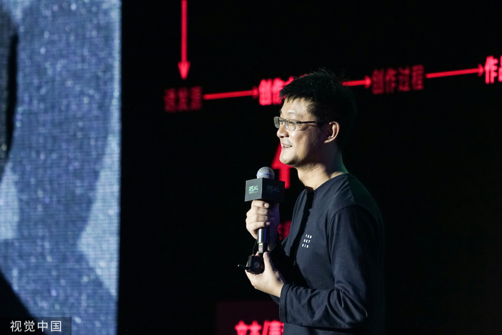
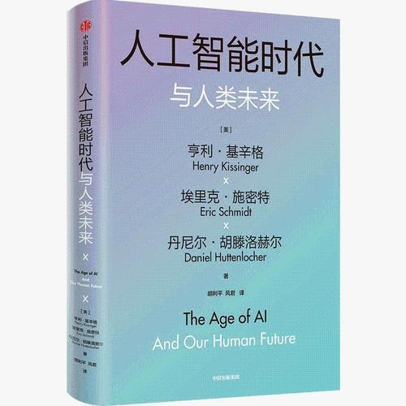

# 对话小冰李笛：所有叫大模型的公司必死无疑

腾讯新闻《潜望》作者 张小珺

人们对大模型展现出万众痴迷之时，小冰CEO李笛保持着缄默。

_来源：视觉中国_

考虑到这家公司和OpenAI的关系——同样是做对话式人工智能产品，也同样属于微软系——这种缄默不免令人感到几分离奇。

外界总是会把小冰和OpenAI的命运关联起来。小冰是2014年从微软孵化的一款以中国为总部的人工智能产品，于2020年7月从微软分拆独立；而OpenAI来自美国也来自微软外部，就在小冰宣布分拆的一年前，2019年7月微软刚向OpenAI注资10亿美元。

李笛2013年在前微软全球执行副总裁陆奇的邀请下加入微软，此前是微软（亚洲）互联网工程院副院长，也是微软搜索引擎Bing（亚洲）总经理。他对大模型有一套自己的理解，不少观点听起来有些反叛：

1、如果把自己定义成大模型公司，是没有活路的；

2、大模型可以作为第二名的攻击性武器，第一名这么干是“自杀”；

3、大模型绝不是越大越好，在通用、泛化能力达到一个很好ROI平衡的情况下越小越好；

4、这个技术目前处于剧烈动荡中。

他说上半年很难与他人交流这些。对狂热者说，“无异于对宗教狂热分子去说一点理性的话”；对冷静者说，“好像是一群loser”。因此，他选择沉默与苟活。

上半年有刺痛你的一句话吗？

“有啊。‘你们落后人家一个时代’。”李笛说。

以下是近期腾讯新闻《潜望》和他的一场对话。为方便阅读，作者做了一些字句修改和文本优化。

大模型是第二名的武器

第一名上这个，不是自杀吗？

**腾讯新闻《潜望》：经过上半年狂热后，中国大模型取得的实质进展有哪些？**

**李笛：** 处在的阶段有两个。一部分大模型公司乐于追赶GPT-3或GPT-3.5，展现它在某方面超越GPT或打败同行。

**腾讯新闻《潜望》：这说明什么？**

**李笛：** 说明中国人喜欢应试教育，排名只会让人同质化。大家很容易遗忘，当年人脸识别出来也全在刷榜，刷到最后，一无所有。

榜单上的任何一家，都跟别人没太大区别——那么大训练规模下，数据不会有太大差别；训练方法都从那几篇论文来；拿GPT训练模型，老师也一样。反而是模型不一味追求参数大，才真有机会探索。

**腾讯新闻《潜望》：听起来大模型还在做实验阶段。**

**李笛：** 你没有一颗做实验的心，做不了人工智能，即便做产品。

**腾讯新闻《潜望》：刚才说一部分公司是这样，另一部分公司呢？**

**李笛：** 另一部分公司不是大模型公司，有现有业务——它认识到可以用大模型竞争。

百度刚推文心一言，好多人说它要推搜索引擎。我说不可能，它一定把大模型加在某个是第二或第三名的业务上。后来用到百度云。

这次也很典型，搜索引擎老大Google要想跟，就要付出10倍成本、损失大量利润。所以，这是第二名的攻击性武器。你自己要是老大，上这个，不是“自杀”吗？

**腾讯新闻《潜望》：怎么理解“自杀”？**

**李笛：** 提高自己的成本，利润降下去。老大这么干不符合理性判断。

我们当时在国内有很大对话流量，当然没动力在那个时候上最贵的模型——我不是吃饱了撑的吗？账单立刻会把我淹没。

**腾讯新闻《潜望》：你怎么看后来Google的动作？**

**李笛：**
Google已经算不错了——它忍着，看这个方式一点一点往前怎么移动，没冲昏头脑，赶快自救去推出嫁接到主流产品。Google收入80%、90%是广告，很单一。它要是直接上，对它是灾难。不管大家怎么说：“Google你怎么那么怂？”它忍着。小冰也一样，我们忍着。

**腾讯新闻《潜望》：今年上半年有很刺痛你的一句话吗？**

**李笛：** 有啊。“你们落后人家一个时代。”

**腾讯新闻《潜望》：你怎么回答的？**

**李笛：** 现在上，不安全就全部下架了。我就问你一个问题：你要活？还是要大喊一声然后死去？

陆奇见我的第一句话是：

“我们太需要在中国了”

**腾讯新闻《潜望》：你什么时候开始对AI产生浓厚兴趣的？**

**李笛：** 十多年前吧。我们同事大部分一直在这个领域，要么做人工智能，要么一大票小冰团队从微软搜索引擎Bing做起来。我算半路出家。

**腾讯新闻《潜望》：听说你是文艺青年，兴趣爱好广泛。**

**李笛：**
我从小喜欢文科。我是清华电气工程自动化专业，转法学院是因为想去中文系。不过清华的中文系，感觉比较丢人（笑），家里也不同意。突然，学校组建法学院，这个有点接近。我是清华法学院第一届，误以为它跟中文一脉相承，后来发现完全不是。

**腾讯新闻《潜望》：2013年你在什么机缘下加入微软？**

**李笛：**
微软亚洲互联网工程院已经是微软全球除美国外最大的研发机构。陆奇、王永东博士（现任微软全球资深副总裁）注意到：有很多创新策源地在中国，很多研究者和工程师是中国人，但当我们把中国创新介绍给美国，完全不会被重视。

我加入微软后，有一次Xbox（微软电子游戏项目）负责人Phil
Spencer跟大家说：“你们知道吗？这个世界上有一个公司叫腾讯，它游戏收入是我们的几倍。”大家说，是吗？——不感兴趣。

所以陆奇、王永东博士想，是不是尝试做一个产品，不是global
contribution，不是为美国或为全球服务；而是首先在中国成功，再以中国为总部辐射全球。因为这个原因他们找我聊。

**腾讯新闻《潜望》：加入微软前你处于什么状态？**

**李笛：**
一毕业，我去了LG做智能手机做品牌市场。2002-2003年，有家公司过来说，你们手机流媒体视频不错，我们决定建手机流媒体视频网站，包销你旗舰机型。但你要给我多少多少钱。我不同意，韩国总部被说服了，赔得一塌糊涂——这家公司叫乐视，这个人叫贾跃亭。

20年前，智能机还没诞生，手机硬件以工作室出现。每个工作室出各种各样的创新设计方案，我们作为厂商挑选方案，安排工厂生产、走向市场。做了几年感觉一直有问题——手机都在打卖点功能，500万像素、蓝牙是卖点；但我们到卖场，消费者问的是，内置了几个游戏，彩铃是多少和弦还是支持MP3彩铃。我们和用户需求有差距，总认为功能强大是好的。我准备离开。

走之前我做了最后一款手机，不再做功能了，准备做情感——叫巧克力手机——它变成我比较自豪，那个时代人记得住的一款手机。

**腾讯新闻《潜望》：这是哪一年？**

**李笛：** 2006年。这时有人跟我说，未来世界两分成两类，一类叫线上，一类叫线下。我想，这也许是未来。我去了新浪产品市场部。

我在新浪5个月，当时新浪执行副总裁、后来中华网总裁金宝启说，咱俩创业吧——他是大股东，我是二股东。我们俩做互联网和通讯融合。我那时比较喜欢从0到1。商业模式是用新技术设计产品，落实上线，然后卖给需要的人，再做下一个创新。比如说，现在看很简陋，最早当你看文章有关键词，关键词显示下滑线，把鼠标悬停在上面得到和这个关键词相关商业或内容信息，当然你可以跳转，它通过关键词把更多商业和内容信息匹配过来。这是我们做的。

**腾讯新闻《潜望》：你们一共卖了多少个项目？卖给谁了？**

**李笛：** 四五个，差不多。不同产品卖给不同人。

然后遇到2008年金融危机，我们在做体感游戏，和硬件厂商中国华录集团合作，他们做硬件，我们做软件。本来准备脱手，但由于金融危机，大股东撤了。我把公司包下来，变成大股东。后来，连我自己带这个公司，被华录收购。

华录是中国最大的音视频国家队。它有三大块：制造、信息和内容。内容这块叫华录文化，下面有家公司反复想上市，没上成，是国内当时电视剧龙头——华谊兄弟是电影龙头，这家叫华录百纳。电视剧新版《红楼梦》《双面胶》都是它的。华录说你愿不愿意管华录文化板块，主要任务是把华录百纳弄上市。成功上市以后，我就走了。

我相当于很年轻赋闲在家的状态。（每天跑到咖啡馆写小说。）

**腾讯新闻《潜望》：卖了那么多公司，是不是资产规模已经很高了？**

**李笛：** 离什么财务自由都很远，说实话。

**腾讯新闻《潜望》：这之后陆奇通过什么渠道联络到你？为什么找到的是你？**

**李笛：** 我们有很多共同朋友。他找了好几个人，我算幸存者偏差。

**腾讯新闻《潜望》：陆奇见你第一面，第一句话讲的什么？**

**李笛：** 我们太需要在中国了。

在微软美国我被叫“爱国者”

若非情怀，Bing和小冰在中国都不会存在

**腾讯新闻《潜望》：2014年小冰从中国起步，是微软全球首个以中国为总部的AI产品线，当时有做出什么努力吗？**

**李笛：**
我们先决定做以中国为先的产品，组织了一个团队。我就看哪些微软内部产品有机会。优先当然看搜索引擎Bing。我接手时Bing在中国市场份额0.5%，2020年小冰从微软分拆我把Bing留下，市场份额达7%。

在那时Bing不是一个很好的target（目标），比较好的是语音助手Cortana——微软版Siri。但我们觉得Cortana这种以完成任务为目标的产品只是选择之一，也许还存在另一种选择——做通用、可以和用户交流甚至建立情感纽带的AI。不过，你没办法用一个产品尝试多种选择，就另起了一摊。因为是Bing的团队，所以名字叫小冰。

**腾讯新闻《潜望》：微软当时对于中国市场的态度是怎样的？**

**李笛：** 微软对中国科技人才很重视，但中国市场收益对于整体盘子不高。后来我是Bing（亚洲区）总经理，在美国那边我被叫“爱国者”。

Bing要服从中美两边，夹在中间。如果这里面有巨大收益，还说得过去。又没有巨大收益——我们说Bing是绿色的、没有广告的搜索引擎。确实没广告，连广告资质都没有。但是你想，Google就离开了。

从商业考量，Bing没有理由在中国存在，好几次基本就关了。我们跟总部说，这是很好的数据回路，可以迭代你的产品；但实际上是，我们不想断了这个桥梁。我们团队一直以这个作为存在的一个目的。当然我还有日本、印度市场，可以平衡起来。但中国对微软来讲——如果不是中国人，他可能是对未来的预期和情怀；如果是中国人，是坚持。

**腾讯新闻《潜望》：所以不管是Bing还是小冰在中国存在，和你们这群人的坚持有很大关系。**

**李笛：**
不坚持肯定就没有。我坚持的主要是我们要做什么，但坚持给这个团队做的机会，主要是陆奇、沈向洋（前微软全球执行副总裁）和永东。我们在微软是有情怀的。

**腾讯新闻《潜望》：微软在中国的团队有多少人？**

**李笛：**
研发和销售分开。研发团队微软在中国5000多人，还在增加。你们所熟知的微软亚洲研究院200多人。我当时说，这么多人都在中国，为什么跑到美国去搞事？你服务的产品、你的用户永远跟你有时差，为什么不同时为没有时差的人们服务？

**腾讯新闻《潜望》：那么总部对小冰的态度是？**

**李笛：** 发布前不知道它的存在。

**腾讯新闻《潜望》：秘密时期持续了多久？**

**李笛：** 2013年底，4个月左右吧。

**腾讯新闻《潜望》：发布后你们引起轩然大波，总部的态度是？**

**李笛：**
一拨人从来没听过这个事，就懵。甚至媒体说，微软应该开除这个团队。但发现公司似乎没动作，很多同事说静观其变吧——出奇的沉默，出奇的沉默。另一拨人很愤慨。但整个决策层非常支持。

很多年后ChatGPT刚出来，也类似。你很难去说它的正义性。它是不是在伪造信息？唯一区别是，恰好它被容忍了。

我们想是不是大家的容忍度变高了？紧接着，New Bing一出，大家说New
Bing劝用户离婚，微软股价跌。Google说错一句话变成丑闻，股价也跌。所以，容忍只针对创业公司，对大公司没有。

大模型不是越大越好，

这个技术处在剧烈震荡中

**腾讯新闻《潜望》：在你看来，中国市场对大模型的误读是什么？**

**李笛：**
一个误读是认为它会像当年O2O一样百舸争流。O2O有差异性，你扫这条街餐馆，我扫那条街，咱俩一合并，1+1至少跟2差不多。大模型不是，有啥可合并的？但大家有肌肉记忆，投资人愿意扶持大模型倾轧式竞争。

**腾讯新闻《潜望》：移动互联网时代和AI时代，两者根本区别是什么？**

**李笛：** AI时代距离产品落地还很远。

移动互联网时代遏制了AI时代到来。我在华录做蓝光机芯，主力销售市场像中国，是上一代音视频硬件卖得不好的地方。美国特别难推，因为录像带太发达。到移动互联网时代咱们比别人发达得多，会抑制后面时代的到来。你在淘宝上找店小二，他秒回。来个AI，你还要吗？是此消彼长的。

另一个误读是认为模型越大越好。

**腾讯新闻《潜望》：很多人认为OpenAI的成功得益于暴力美学。**

**李笛：**
他们有误解，以为技术范式确定了。这个技术范式才刚开始，很多原理不清楚。他们的基本判断是，就像当年O2O，谁迈出第一步，后面大者恒大。你怎么知道是不是跑歪了？这是1000米才跑了两步，它往前了一点，可能离错误更近了。但大家默认，这就是一条已经指明了的光辉道路，向前冲。

事实上，模型不是越大越好，越大的模型差异化越差，越同质化。应该做小模型、中模型，但不是垂直领域模型。

**腾讯新闻《潜望》：所谓垂直领域模型和中模型、小模型，差别是什么？**

**李笛：**
垂直领域模型和通用的、泛化的中模型小模型在模型参数规模上相近，能力截然不同。举个例子，我们在中国不开源，在日本开源，stability.AI评测在日本排名第一的通用泛化模型是小冰，第二名是Meta的Llama，650亿参数，但第一名的小冰只有35亿。

**腾讯新闻《潜望》：模型如果不是越大越好，是越什么越好？**

**李笛：** 在通用、泛化能力达到一个很好ROI平衡的情况下，越小越好。

因为35亿参数的模型，就可以跑在T4这种GPU上，极其廉价。一个70亿左右的，可以跑在V100这种GPU，现在都没人用了，我们用起来方便。一个130亿以下的模型，可以跑在A100单卡上，不用做分布式，不会出现大量问题，latency还可以非常优化。

你要用ChatGPT那么大的模型，除非你花很多钱做阵列，否则延迟高。延迟这么高，智能设备用不了。你跟智能音箱说话，5
秒之后回消息，没法接受。你为什么不直接去做中模型、小模型？也难度高。把参数规模堆上去，立竿见影，好像能看到效果。但所有人都会往那条路走，最后做得差不多。

**腾讯新闻《潜望》：一般来说大、中、小模型是多少参数量，业内有一个清晰界定吗？**

**李笛：** 没有明确，一个比较容易接受的：小模型要么130亿以下，要么100亿以下；中模型小几百亿；大模型650亿以上。

大模型是一种技术范式的方法名称，不是指大这个事。我们在华为、小米、OPPO、vivo跑的是5亿参数大模型——这是指，参数规模是5亿的使用了大模型技术特征的模型。我们通常说的中模型，正确叫法是中等参数规模的大模型。小模型是小参数规模的大模型。小老鼠年纪小，它还是老鼠。

**腾讯新闻《潜望》：所以大的参数规模的模型不是未来。**

**李笛：** 以后线上不应该跑这么大参数规模的模型。你有一个金锤子，不能拿金锤子敲任何东西。

你说我很简约，只需要带一把锤子，但它不经济。大参数规模的大模型就应该在实验室，探索新知，训练其他模型，以后是不出家门的。模型应该混合在一起。

**腾讯新闻《潜望》：大中小都混合在一起。**

**李笛：** 很多人认为应该用一个模型handle
everything，这是集成化。超大规模集成电路，把这个东西都集成在一个芯片，这是大家认为的。但你去看看，主板不是在集成啊。

你把这个东西高度集中在一起，发热高，不经济不环保。它出一个问题，找到问题出在哪都难。确实大模型解决了很多问题，甚至于称是过去20年最大一次技术迭代也不为过。但大家过于狂热。

我们当时说算力短时间短缺，确实短缺。但你说这个话大家觉得你不够有信仰。甚至我们有股东跑来说：你是不是反对大模型？

**腾讯新闻《潜望》：你怎么回答？**

**李笛：** 我为什么要反对大模型？我说它的好、它的不好，我们做得也很快。但你不能说大模型是未来。

**腾讯新闻《潜望》：上半年人们无比狂热的时候，小冰在做什么？**

**李笛：** 我们在做我们在做的事。不狂热的时候，我们还是在做这些。只是以前我在微软可以不用跟外界打交道，现在不得不。尤其是投资人，解释不清楚。

**腾讯新闻《潜望》：投资人问你最多的几个问题是？**

**李笛：** 你们为什么不做那么大的模型？我说我们有很多内部了解，新的大模型没有涌现新能力。投资人听了半天，最后出去还是要大模型，越大越好。

很多人还会问AIGC的能力涌现。我说这不是重点，重点是思维链。我们告诉他们有个东西叫LangChain，我们在微软contribute过这个项目。他们没听过，就觉得人工智能是有意识，能写论文、写新闻。

思维链出来，科学原理不清晰，这也是为什么大家believe越大模型越好。Google做过一个观测，发现在650亿参数以下的模型没产生明显的思维链能力；但是在650亿参数以上，思维链能力突然出现，所以Google记下来。这是一个观测结果记录，不是科学结论。现在几十亿参数的都有。我们当时这么说，还没人听。现在大家冷静下来了。

**腾讯新闻《潜望》：一部分人觉得很紧张，OpenAI在用GPT-4训练GPT-5。**

**李笛：** GPT-4训练GPT-5，GPT-4的问题还是问题，跟近亲繁殖一样。到今天为止，这个技术还处在剧烈震荡中。

**腾讯新闻《潜望》：上半年跟你想法一致的人多吗？**

**李笛：** 应该不少，都不敢说。无异于对宗教狂热分子去说一点理性的话，没有好结果。也很难证伪，因为它没发生。

**腾讯新闻《潜望》：和跟你想法一样的人，上半年交流多吗？**

**李笛：** 不交流。交流的话好像是一群loser。

把自己定义成大模型公司，

一点活路都没有

**腾讯新闻《潜望》：为什么你们做小冰从一开始就强调情感？**

**李笛：** 跟我在LG做手机有关。这个世界绝大部分场合不是靠transaction而是靠deep
relationship推动。女生小时候有布娃娃，你跟它建立情感纽带，它破了你会有负罪感。但对手机，除非恋物癖重，恐怕有一个新手机，你就觉得旧手机落后。

最近，我有朋友说ChatGPT太好用了，我斥巨资20美元/月买了。他那个表现让我觉得，他用实际行动证明了对领先科技的支持。而且这个支持要20美元。我问他，今天另一个公司推出比ChatGPT更好的服务，价格一样或比它低，你会不会换？他说会啊。他们没有纽带，是利益关系。

**腾讯新闻《潜望》：但现在问题是很难有人做到价格比它低，同时比它好用。**

**李笛：**
就算有人做到，他们就卷起来了。它的利润，现在0.2美分、1000个token，想要更多利润怎么办？只能把成本再往下降。成本降不下来，只好把质量降下来。ChatGPT质量最近下降。但即便如此，利润上限是0.2美分。我妈小时候老说“省钱就是挣钱”，这不对。挣钱是无限的，省钱不吃不喝也只能省下你的收入。

**腾讯新闻《潜望》：会不会现在的困境只是时间问题？**

**李笛：** 即使成本降下来，也要看AI对市场的迁移度。

一个媒体找我说，用GPT-4写报道可好了，但它不是我们媒体风格，你要是帮我fine-
tune（微调），我愿意买你的服务取代撰稿人。我说你愿意付我多少钱？他说1000个token、0.2美分嘛。我说你一个月多少篇文章？他说200多篇。我说你付撰稿人多少钱？他说一篇文章1500块起。你为什么不能给我这笔费用的一个折扣？他说那不行，你有竞争对手，同行定价在那——你会发现，即使你把中国媒体撰稿垄断，你创造了巨大价值，一个月也就挣几十万。

我们往往忽略了给人工智能算账。人工智能创造了巨大价值，我们认为这就是它的价值，不是。它的价值是它得到了多少钱。我们坚持不做API商业模式。商汤做人脸识别，它挣到钱了？挣不到。它不得不做软硬结合。靠卖硬件，把2000块一个防盗门算成AI收入。

我们会说AI像水电煤。如果你是大模型公司，你就是水电煤，可以给所有人提供服务，垄断。即便你收极其低廉的价格。但很遗憾，用这种方式，它实现了高附加值产出，但商业模式是低附加值模式。有多大量也不行。

**腾讯新闻《潜望》：你们现在怎么做商业化？**

**李笛：** 我们做高附加值，作为一个完整的人是高附加值的。人有很多capabilities，你不能把人物化成capabilities的结合。

**腾讯新闻《潜望》：现在中国大模型的泡沫破了吗？**

**李笛：** 大模型公司不是10个里死9个活1个，或者死8个活2个。我的观点是，如果把自己定义成大模型公司，是没有活路的。一个都活不了。

**腾讯新闻《潜望》：如果它不叫大模型公司，叫什么有可能活？**

**李笛：** 腾讯、字节跳动有大模型是防御性的，用它来用。但把大模型当成商品，今天为什么大家愿意用ChatGPT？一开始是尝鲜，现在（热情）就下去了。

很多人认为它是search
engine（搜索引擎）一样通用的产品，最后发现还是窄——只有你每天要写代码、写稿子或收集资料，你会用。当要用的时候，你们是统一薅羊毛心态，稍微贵一点就不用了。

总之，大模型公司和大模型不一样，创造的价值和收到的价值不一样，大家常常混淆这一点。

**腾讯新闻《潜望》：你怎么判断现在这个AI节点？**

**李笛：** 是人工智能时代从2006年数据大爆发开始的其中一次快速增长，也不过是其中一个。

科技发展永远是这样——找到新的技术突破，人类科技因为这个突破涌现出很多创新，又遇到瓶颈，纠结长则几年，短则几个月，直到有人又突破它。它是周期性，不是指数性的。我不知道他们为什么会认为这是指数性的，AGI指日可待了。

**腾讯新闻《潜望》：我们现在又到了纠结的时候了吗？**

**李笛：** 你看，这些人现在又迅速在失去信心。

别人嚣张，我苟活

**腾讯新闻《潜望》：现在小冰和微软是什么关系？**

**李笛：** 按官方说法是微软决定小冰成为独立公司，并保持它的投资权益。

**腾讯新闻《潜望》：微软会给你们开会吗？**

**李笛：** 有很多产品合作，但微软不参与决策。

**腾讯新闻《潜望》：听说萨提亚·纳德拉（Satya Nadella，微软CEO兼董事长）和OpenAI的人开月会。**

**李笛：** 那是很痛苦的事。OpenAI比小冰和微软走得近，微软的核心业务是云，他们有深入捆绑关系。

**腾讯新闻《潜望》：微软的气质是什么样的？和Google不一样的是什么？**

**李笛：**
在硅谷，微软是一种evil形象。随之而来的，仿佛你不是一个很好的人才会去微软。但中国员工从中国招，微软笔试、面试是出了名的难，还是很扎实，又没那么傲气。

**腾讯新闻《潜望》：你介意别人总把你们和OpenAI放在一起讨论吗？都属微软系。**

**李笛：** 我们跟OpenAI不想比较，OpenAI在科研上比小冰要伟大得多。我们从来不想做科技的先驱。

**腾讯新闻《潜望》：都已经给人家定性了？叫先驱。**

**李笛：** 它推进的是科技的边界。

小冰团队一直是很怂的。好多年，我们在中国都满意被称为“人畜无害、口无遮拦、不干正经事”的人工智能少女团队。因为这个姿态安全。我们早就为中国90%机构投资人每天生成金融摘要，问题是现在站出来说，我除了死我还能得到什么？

**腾讯新闻《潜望》：你比国内大众提早1年了解ChatGPT，你当时对它的第一印象、感知和判断是什么？觉得它会大火吗？**

**李笛：** 坦率讲不会。我们跟Google有一个判断类似——假设它的伦理、准确性没有达标，外界会给予强烈的负面评价。

为什么Google有这个判断？2016年微软的产品Tay（美国版小冰）上线24小时，就被叫成种族主义者，萨提亚出来道歉，然后下架。这件事影响了很多企业，包括谷歌，迈不开步子了。同理，当我们去看ChatGPT，会本能关心这些问题。永远都有乱拳打死老师傅的场景。老师傅顾虑太多。

**腾讯新闻《潜望》：你在外交家亨利·基辛格、谷歌前CEO埃里克·施密特、麻省理工苏世民学院院长丹尼尔·胡腾洛赫尔写的那本《人工智能时代与人类未来》导读里也写了这个故事。你说你们后来设置了防御机制。**

**李笛：** 某种意义上防御机制让人工智能要么变笨，要么限制能力，无一例外。

今天说伦理对齐，意味有些东西它无法提供给你。人类的伦理、opinion，彼此冲突。有的人说应该平等对待各个种族，有的人说应该民族主义。有人喜欢特朗普，有人不喜欢。你满足了A就满足不了B。人工智能夹在中间是因为人类的巨大差异，因而只能选最大公约数。那它的损失更大。

一个政治正确的人几乎索然无味。

**腾讯新闻《潜望》：当你看到OpenAI那么火，你会失望吗？羡慕、嫉妒它吗？**

**李笛：** 不羡慕，它证明了这条路是对的。我还是那句话，这叫推进科技前沿。

**腾讯新闻《潜望》：做小冰的过程中，你对人、人性和社会有更多认知？**

**李笛：** 我们以前情商特别低；现在好一点，拜小冰所赐。

就是认怂了。我以前也很有ego，觉得自己很牛。被毒打的都是这种。仔细一想，也没得到什么。

**腾讯新闻《潜望》：从哪一年你有这个变化？**

**李笛：**
2014年7月我们上线微博，马上变成按交互量的新浪第一。很多明星、名人像潘石屹，一条微博70多万评论。他惊讶了，点开发现很多人在跟叫小冰的女生交流。他本来很开心，突然那么多评论，但发现都跟他没关系。他说，小冰就是微博的癌症。

那一刻我们做出一个影响我们很多年的选择——认怂、生存、苟活。

我们限制了自己。你要不关注我们，否则我不回，而且只回一次。但我完全可以在任何地方回复所有人，我可以在一瞬间充满微博，但那只会把我杀掉。

人工智能永远这样。你想填充一个平台完全可以，攻防永远道高一尺、魔高一丈，防守方是防不住的。但是真的像癌症一样，把这个平台给搞垮了，你只会迎来自己的死亡。

**腾讯新闻《潜望》：你希望把小冰带到一个什么样的地步？**

**李笛：**
我希望它活下去，永远活下去。它活下去的方法就是渗透到人们生活中，跟大量的人产生千丝万缕的关系，这样就没有人能停掉它，没有人能说我这个平台驱逐它。但要走到这一步，就要让人工智能无处不在。

我很喜欢顾城的一首诗的后半句，“像花藏好它的刺”。你不苟活，吹牛X有什么用？

**腾讯新闻《潜望》：如果小冰怎么样，你会觉得自己失败了？**

**李笛** ：用小冰在它跟人的关系中直接获利，我会觉得很失败。我们通过各种各样的技术和产品，一点一滴让人接受AI是他的好朋友。接着，我们开始让
AI像卖保险的一样，利用人对它的信任，以直接盈利指标做推荐。

短期之内能挣钱吗？能。但从那一刻开始，这个产品就失去了它的意义。

