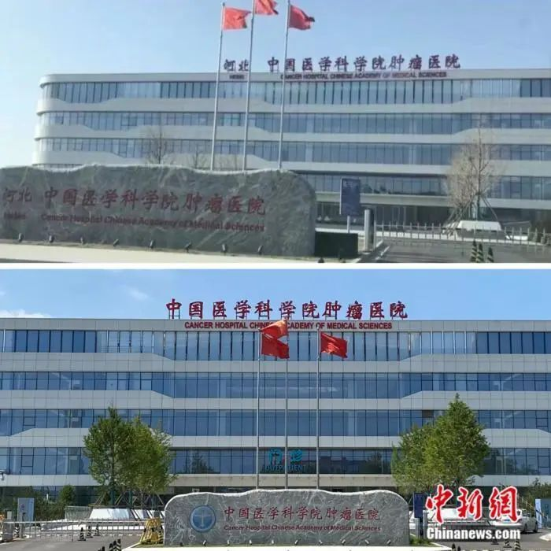
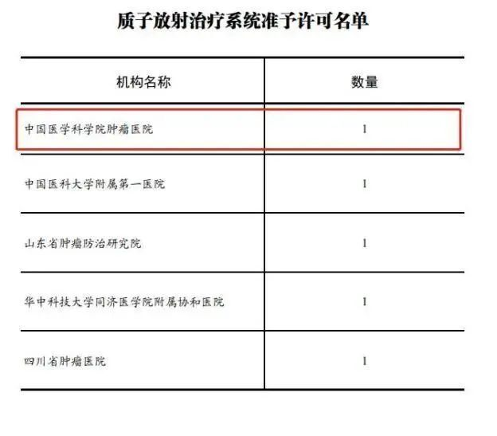
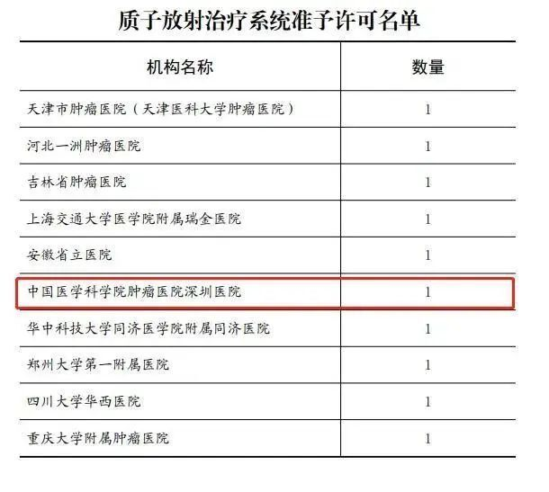
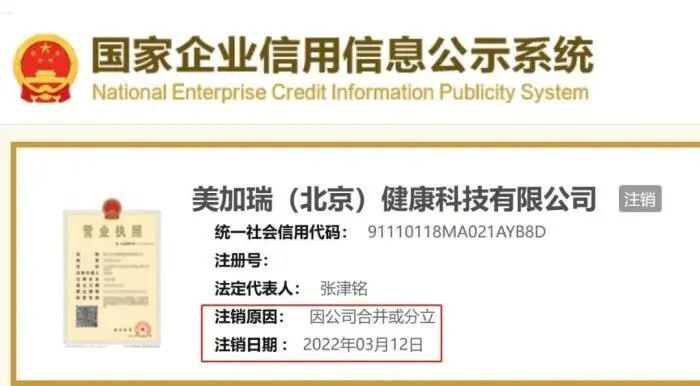
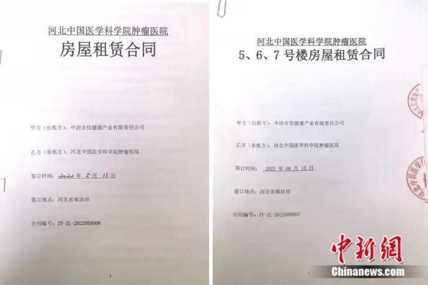

# 总投资超90亿元肿瘤医院突然申请注销，院名中“河北”二字已不见踪影

近日，地处廊坊的“河北中国医学科学院肿瘤医院”(简称“河北医院”)因突然申请注销，站上舆论的风口浪尖。

8月15日，中国新闻网记者实地探访河北医院发现，院名中“河北”二字已不见踪影，只留下“中国医学科学院肿瘤医院”。

记者在现场了解到，“河北”二字是在前几天被撤下的。现场一位不愿透露姓名的工作人员告诉记者，目前医院主要楼宇已经封顶，不少医疗设备也已进场，里面还有工作人员。

_8月15日，记者现场走访河北中国医学科学院肿瘤医院，发现“河北”二字已消失。(上为此前照片，下为15日照片)_

8月11日，中国新闻网率先报道，河北医院9日在当地媒体发布公告：拟向组织登记管理机关申请注销登记。这一天距离其注册登记不足两年。

虽然已经申请注销，但围绕河北医院的质疑声音却越来越多。比如，为何突然申请注销？注销后资产如何处置？国资购买、价值数亿元的质子放射治疗系统为何要配置到民办医院？河北医院为何要将超5亿元的采购大单给到一家成立仅2个月、不到一年又仓促注销的新公司？

网上舆论不断发酵，但相关方迄今为止均未发声。一系列疑问待解。

**突然申请注销有何隐情，后续资产如何处置？**

乍一看，很多人会认为这是一家公立医院。中国新闻网记者在河北医院探访时，多位当地居民也都以为“这是公家的医院，毕竟名字里有‘中国’两个字”。

此前，中国医学科学院肿瘤医院深圳医院、中国医学科学院肿瘤医院山西医院，均为公立医院。

但这家河北中国医学科学院肿瘤医院却是民办医院。

2020年11月24日，河北省卫健委批复同意设置中国医学科学院肿瘤医院河北医院，其共同举办方为中国医学科学院肿瘤医院、中冶吉信健康产业有限责任公司(简称“中冶吉信”)。全国社会组织信用信息公示平台显示，河北医院为民办非企业单位。

_登记证书_

一家是国家卫健委所属三级甲等肿瘤专科医院；另一家从工商信息看，实际控制人为吉林省财政厅，应为国企。两家国有单位共同举办的医院，为何成了民办医院？

“如果全部出资来源于国有资产，依法是不能成立‘民办’机构的。”大成律师事务所律师、高级合伙人瞿霞向中国新闻网记者表示，根据《民办非企业单位登记管理暂行条例》，民办非企业单位是指企业事业单位、社会团体和其他社会力量以及公民个人利用非国有资产举办的，从事非营利性社会服务活动的社会组织。那就意味着，自称民办机构的河北医院应由非国有资产出资，而上述两个出资方一家为国家事业单位，另一家为“国有企业”，哪来的非国有资产？

北京市在线律师事务所高级合伙人朱业清表示，上述两个举办方一家为国家事业单位，另一家为“国有企业”，该医院的建设资金高达数十亿元，如果医院由上述两家单位出资建设，却登记为民办非企业单位，显然违反了法律规定。如果并非由上述两家单位出资建设，那么如此巨额的建设资金来源于哪里？出资人是谁，又为何没有作为举办人的身份出现？

2023年7月，中国新闻网接到举报称，河北医院的举办方之一中冶吉信是“假国企”。记者调查发现：中冶吉信的大股东康和信(大连市)健康医疗管理有限责任公司(简称“康和信”)注册资金来源不明，社保参保人数为0，股权变更亦存在疑点，工商登记信息中的控股股东为吉林省信托有限责任公司(简称“吉林信托”)，但在吉林信托的资料中查不到康和信的身影。吉林信托工作人员接受中新财经记者采访时表示，“没听说过”这一子公司。法律专家表示，从现有信息看，康和信和其持股99.58%的中冶吉信的国企身份确实存在很大疑问。【中国新闻网此前报道>>>中冶吉信“国企”身份存疑】

更耐人寻味的是，2020年11月16日，康和信全资收购了一家自然人独资公司北京康养建筑设计咨询有限公司(简称“北京康养”)。随后，11月24日河北省卫健委批复设置河北医院当天，中冶吉信发生了两次绝对控股股东变更。北京康养出资2.98亿元收购吉林信托持有的中冶吉信的全部股份，随后康和信又出资2.98亿元收购了北京康养持有的中冶吉信的全部股份。“国有企业”股权竟然可以在一天内轻易发生两次变更，也加剧了各界对假国企的质疑。【中国新闻网此前报道>>>2.98亿股权一天内两次换手，这家“国企”的操作让人看不懂】

8月3日，上述“假国企”系列报道发布不到两周时间，国家企业信用信息公示系统显示，中冶吉信法定代表人已从付列武变更为孙修善。8月9日，河北医院突然申请注销。【中国新闻网此前报道>>>美甲店老板，竟2个月内当上
“国企老总”】

中国新闻网记者期间多次致电或致函中国医学科学院肿瘤医院、中冶吉信、河北医院、吉林财政厅、吉林信托等相关方，但截至发稿时，各方均未就相关问题作出回应。

注销之后，这家注册资本200万、声称投资超90亿元的医院何去何从？最新公开消息显示，中国医学科学院肿瘤医院准备“资产并购”。

中国医学科学院肿瘤医院公众号发布的文章显示，7月27日，国家癌症中心中国医学科学院肿瘤医院第一届职代会一届二次工代会召开，会上医院廊坊院区资产并购等事项获表决通过。

上述“廊坊院区”即“河北中国医学科学院肿瘤医院”。

北京市高默克律师事务所资深律师宗海潮对中国新闻网记者表示，法律上，申请注销登记意味着原开办单位(股东)想要终止该民办非企业单位的法律主体资格，有可能是注销不开了，也可能是换一种开法，具体要看投资人和政府主管部门的决策。这也间接证明了该项目设立、审批、投资、操作过程中可能会存在一些问题，无法简单调整完善，只能采取注销模式。

有法律人士发问：民办的河北医院申请注销后，目前已投入的几十亿元资产将如何处置？该资产的所有权人到底是谁？如何厘清举办人和投资人之间对该资产的权益？是否会涉及国有资产流失？这一系列与注销相关的疑问，有待解答。

**巨额国资购买的质子放疗系统放到民办医院是否合规？**

诸多介绍“河北医院”的报道都会提到该项目建设的一大“亮点”是配置了质子放疗系统。中国医学科学院肿瘤医院网站的文章也指出，河北医院“将配置世界上最先进的质子治疗系统”。

据了解，该设备属于甲类全国规划配置大型医用设备，由国家卫健委负责配置管理。中国新闻网获得的一份名为《肿瘤医院提供给河北医院使用的设备清单》的材料显示，仅该批次设备，总价就超过11.4亿元，其中“质子放射治疗系统及配套设备”价值超7.7亿元。

记者查询发现，国家卫健委网站公布的质子放射治疗系统准予许可名单中，涉及中国医学科学院肿瘤医院共2台。其中，中国医学科学院肿瘤医院深圳医院1台，中国医学科学院肿瘤医院1台。后者是唯一一家被准予配置质子放疗系统且地处北京的医院。

_国家卫健委网站截图_

中国医学科学院肿瘤医院内部刊物明确提及，“中国医学科学院肿瘤医院廊坊院区和中国医学科学院肿瘤医院深圳医院配置的是IBA的大型多仓室质子放疗系统。项目建成后，中国医学科学院肿瘤医院将成为国际上唯一同时配置两套大型质子放疗系统的医疗机构。”

由此判断，中国医学科学院肿瘤医院并未将质子放疗设备配置到北京的公立医院，却放到未出现在通告中的河北医院，而这家医院的性质为民办。巨额国资购买的质子放疗系统放到民办医院，是否合规？

财政部相关司局人士向中国新闻网记者透露，当时批准该质子放疗系统的配置主体是中国医学科学院肿瘤医院。“他们所有报的材料里面没有体现安排在哪里”，如果确实配置到民办的河北中国医学科学院肿瘤医院“肯定不合理”。

根据举办方向河北申请设置医疗机构时提供的可研报告，质子项目每年可为河北医院带来4000万收入。

**成立俩月的公司拿下5亿大单，不满一年就注销？**

知情人士提供给中新财经的一份项目合同显示，参与共同举办河北医院的中冶吉信于2021年5月与成立仅两个月的美加瑞(北京)健康科技有限公司(简称“美加瑞”)签署河北医院信息化建设采购合同，购买软件及相关技术服务。

该合同总价5.1957亿元，项目总工期34个月。合同验收标准要求，美加瑞提供的质量保证期不得少于12个月。但2022年3月12日这家公司就注销了，存续时间甚至未达到合同要求的质保期。

相关知情人告诉中国新闻网记者，美加瑞在注销之前，至少收取了9000余万元合同款。

 _国家企业信用信息公示系统截图_

美加瑞到底什么来头？为何成立仅两个月就能接到5亿元大单？又为何成立不到一年就注销？这份合同履行到何种程度？作为“国企”的中冶吉信是否就项目进行了招标？

截至记者发稿时，中冶吉信尚未就相关问题进行回复。

**到底是谁的“河北中国医学科学院肿瘤医院”？**

扑朔迷离的举办过程、眼花缭乱的名称变换、错综复杂的股权交易……这家拟注销的河北医院的一系列超常规操作手法，引发不少质疑。

从举办过程看，合作方从最初的三方变两方，廊坊经济技术开发区管委会退出，中国冶金科工股份有限公司变为疑似假国企的中冶吉信。

从医院名称看，在相关政府网站或媒体公开报道中，一开始叫“中国医学科学院肿瘤医院分院”“中国医学科学院肿瘤医院廊坊院区”，河北省卫健委批复的名字为“中国医学科学院肿瘤医院河北医院”，在民政系统登记的名字为“河北中国医学科学院肿瘤医院”。8月15日，中国新闻网记者实地探访中发现，医院大楼上的院名中“河北”二字已消失。

从股权变更看，河北医院的举办方之一中冶吉信的股权在短时间内发生数次变更。2020年11月24日，河北省卫健委批复设置河北医院当天，还发生了2次绝对控股股东的变更。这样的操作，让很多网友直呼“看不懂”。经过一系列眼花缭乱的操作，辗转腾挪之间，一家由公立医院和“国企”联合开办的医院，性质已变为民办。

从医院房屋产权看，中国新闻网记者获得的《中国医学科学院肿瘤医院和中冶吉信合作设置河北中国医学科学院肿瘤医院协议书》显示，双方约定，河北医院租赁使用中冶吉信土地、房屋和设施并支付相关费用。

另有材料显示，河北医院与中冶吉信在2022年5月和8月分别签订了两份房屋租赁合同。中冶吉信将院区的1号至7号楼租赁给河北医院使用。

随后，中冶吉信将5月份签订的房屋租赁合同作为产生应收账款基础合同，河北医院作为应收账款债务人，与廊坊银行签订应收账款最高额质押合同，取得最高债权额达22.95亿元。用类似操作，中冶吉信或还从龙江银行取得高达十余亿的最高债权额。

_房屋租赁合同_

上海兰迪律师事务所高级合伙人孙芸律师认为，租赁合同的相关条款明确表述，由中国医学科学院肿瘤医院与中冶吉信合作设立的河北医院，相关房屋所有权和土地使用权均在中冶吉信名下。

据此，有法律人士提出质疑：“河北中国医学科学院肿瘤医院”到底是谁的？

公众期待相关方尽快回应。中国新闻网记者近期就舆论的核心关切，多次联系了中国医学科学院肿瘤医院多位相关负责人，但对方均拒绝接受采访或表示不清楚。有中国医学科学院肿瘤医院员工表示，“医院有明确规定，没有院长同意谁也不允许接受采访。”

