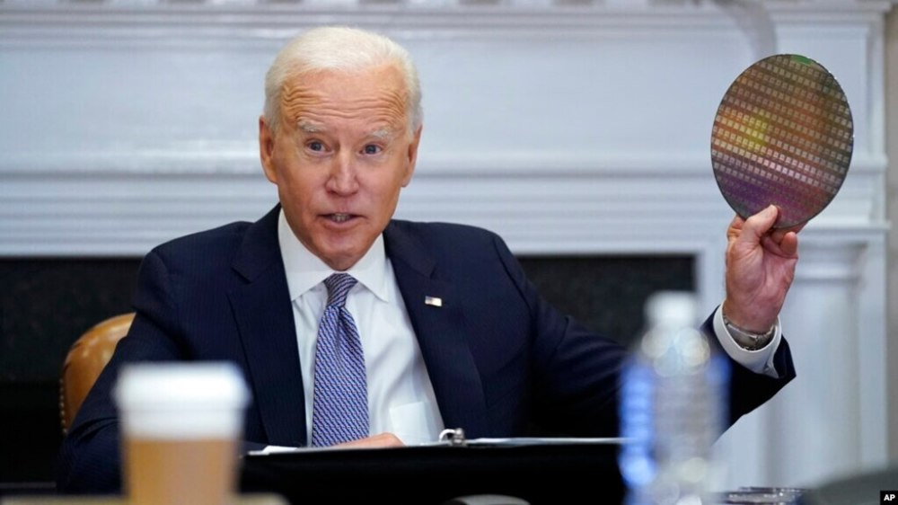

# 美国发动“芯片战争”的两手准备：一边卡中国脖子，一边搞尖端制造

_“芯事重重”半导体产业研究策划，本期聚焦美国芯片制造的挑战、芯片战争攻防博弈及背后的根本原因分析。_

**划重点**

  * _1_ 美国的策略一部分是重建美国在全球芯片制造业务中的份额，另一部分是阻止中国进入芯片技术的未来。
  * _2_ 国防应用可能是台积电决定投资400亿美元在美国生产3nm和2nm芯片（目前最先进的两代芯片）的主要原因之一。
  * _3_ 如果芯片公司不能想办法支付美国较高的劳动力成本，或继续从政府那里获得补贴，就不会有长期投资美国生产的动力。
  * _4_ 利用举国体制可能会让中国在与国际技术隔绝时免于完全丧失能力，但对于为最终消费产品制造先进芯片却没有太大帮助，因为成本竞争力和产量至关重要。
  * _5_ 去全球化、退缩到国家利益和自给自足则可能会导致世界经济增长放缓，甚至更糟。即使最终结果不是真正的全球战争，在芯片战争中也不会有赢家。

**文 / 胡泳 北京大学新闻与传播学院教授**

唐纳德·特朗普喜欢的贸易争端有一种老式的感觉。关税是主要武器；从汽车到钢铁等旧经济市场是主战场；农民和工厂是他最关心的问题。

乔·拜登不一样。他看到中美之间最重要的贸易冲突是21世纪的技术之争。它涵盖了从人工智能到网络设备的一切。基本战场是半导体。

半导体为人所知的称谓是“芯片”，它是经济增长的核心，也是技术创新的重要组成部分。这些集成电路 (IC)
极其复杂且资本密集，为从计算机、智能手机、汽车、数据中心服务器到游戏机的一切设备提供动力。在许多方面，我们的世界就是“建立”在半导体之上的：
**汽车已成为带轮子的计算机；银行是转移资金的计算机；军队用硅和钢作战。芯片不仅是数字经济的基础，也是国家安全之所系。**

_台积电亚利桑那工厂移机典礼，库克、黄仁勋、苏姿丰等美国科技巨头高层出席， 来源：AP_

所以，芯片行业是美国的工业领导地位和中国的新兴大国目标最直接冲突的领域。 随着两国政府竞相确保半导体的不间断供应，我们看到芯片行业被拖入新技术冷战。

2022年10月，拜登政府以戏剧性的方式加剧了这场竞争，宣布了一系列非同寻常的措施，其目的明确无误：
**通过切断中国获得先进半导体的渠道来遏制中国在人工智能和量子计算等领域的进步。**

咨询公司奥布莱特·斯通布里奇（Albright Stonebridge）的中国和技术专家保罗·特里奥罗（Paul
Triolo）对英国《金融时报》表示，“美国实际上已经向中国推动本国利用高性能计算实现经济和安全收益的能力宣战”。

01 芯片业将面对什么

对于半导体企业来说，2023年是艰难的一年。

代表美国半导体行业的半导体行业协会 (SIA，Semiconductor Industry Association)
8月宣布，2023年第二季度全球半导体销售额总计1,245亿美元，比2023年第一季度增长4.7%，但比2022 年第二季度下降17.3%。

众所周知，芯片行业的周期性特征是需求的飙升和萎缩，随着消费电子产品的需求趋于平缓，预计半导体行业的增长速度将有所下降。利率上升、通胀高企、消费者信心下降以及科技股主导的股市回落导致市值大幅缩水：
**全球十大芯片公司的总市值较2021年11月的2.9万亿美元下滑34%，至2022年11月为1.9万亿美元。**

然而，对经济周期的担忧，对资本成本上升、客户和供应链库存减少以及收益下降的应对，以及与制造更先进芯片相关的挑战，很容易被地缘政治所掩盖。
**进入2023年，除了全球宏观经济因素，地缘政治正在成为塑造半导体行业的主导力量。**

最近几个月，美国对哪些芯片可以销往中国以及哪些人可以为中国公司工作实施了有史以来最广泛的限制。8月11日，北京日报报道称，美国总统拜登签署行政令，设立对外投资审查机制，限制美国主体投资中国半导体和微电子、量子信息技术和人工智能领域。

与此同时，美国还针对芯片产业的供应方，推出了慷慨的联邦补贴，以吸引制造业回流美国。欧洲和亚洲其他拥有大型芯片公司的国家和地区政府也出台了类似政策，以维持自己在该行业的地位。

随着这些变化在2023年继续生效，它们将给这个长期以来依赖全球分布式供应链和在决定与谁做生意方面拥有相当大自由度的行业，带来新的不确定性因素。
**美国激进的新政策将在可预期的未来接受考验，它们最终可能会导致全球半导体行业的分裂。**

价值超过5000亿美元的半导体行业究竟会何去何从？

02 美国：一手打压中国，一手推动本土化

美国的策略是双重的。 **策略的第一部分是重建美国在全球芯片制造业务中的份额**
，该份额已从1990年37%的峰值下降至目前的12%。拜登强调，必须减少美国对东亚地区先进芯片的依赖，采取措施促进国内的高科技制造业。

根据2022年《芯片与科学法案》，美国承诺在为半导体制造和研究投入520亿美元。其中，390亿美元将用于补贴在国内建厂。芯片制造商已经宣布了在美国各地进行新投资的数十亿美元计划。尖端芯片世界产量第一的台积电一直忙于在亚利桑那州扩张，排名第二的三星则在得克萨斯州发展。制造先进存储芯片的美光公司已宣布了在纽约州的大规模扩张计划。美国科技巨头英特尔正在俄亥俄州破土动工建造“巨型工厂”。

其中部分补贴可用于帮助在美国建厂的公司生产军用芯片，
**国防应用可能是台积电决定投资400亿美元在美国生产3nm和2nm芯片（目前最先进的两代芯片）的主要原因之一**
。但商业芯片生产的本土化则完全是另一回事。消费产品和数据中心使用的大部分芯片都在亚洲生产。即便有政府补贴，将生产转移到美国也可能会推高成本，降低芯片的商业竞争力。台积电创始人张忠谋表示，美国的芯片制造成本比中国台湾高50%。

对于希望将半导体供应链转移到美国的白宫保护主义者，只能祝他们好运，因为半导体行业生来就是全球化的。
**如果芯片公司不能想办法支付美国较高的劳动力成本，或继续从政府那里获得补贴——现在的钱很容易花完，而后续的钱又很难保证——它们就不会有长期投资美国生产的动力。**

_芯片与科学法案签署的前一年，美国总统拜登召集科技公司高管进行视频会议，现场举起一块晶圆，来源：AP_

《芯片与科学法案》包含所谓的“防护栏”，这意味着如果公司获得美国补贴，它们就不能在中国大陆投资某些类型的项目。总体目标是为了确保半导体行业的投资是在美国及其盟友境内进行。

美国并不是唯一希望吸引更多芯片工厂的地方。中国台湾在2022年11月通过了一项补贴法案，给予芯片公司大量税收减免。日本和韩国也在这样做。例如，韩国总统尹锡悦2023年1月宣布，政府将把对包括半导体在内的先进技术投资的税收抵免从8%提高至15%。预计欧盟的补贴政策也将在2023年出台，但鉴于欧盟达成交易的复杂性，这些补贴很可能要到下一年才能最终确定。2023年7月11日，欧洲议会通过了《芯片法案》，要求到2030年欧盟芯片产量占全球的份额应从目前的10%提高至20%，以满足自身和世界市场需求。

**美国策略的第二部分是通过挤压半导体行业的天然瓶颈，阻止中国进入芯片技术的未来。**
其影响将远远超出削弱中国的军事进步，还将威胁到中国的经济增长和科学领导地位。

美国对中国技术流动实施了冷战以来最全面的限制。新的出口管制旨在阻止美国和外国公司向中国实体提供高端芯片以及设计和生产这些芯片的工具、技术和软件。这些措施针对的是图形处理单元（GPU）和其他用于超级计算和人工智能的芯片。它们的目的不仅是削弱中国获得先进半导体的能力，还削弱中国制造自己的机器和形成自己的人才的能力。正如美国国家安全顾问杰克·沙利文（Jake
Sullivan）所说，华盛顿现在的目标是在人工智能等基础技术方面“尽可能保持领先地位”。

**编注：2022年10月7日，美国商务部发布半导体新规，新增出口管制分类编码ECCN
3A090、4A090、3A090、3B090、4D090，涉及先进集成电路及其产品，制造设备以及开发软件。**

_来源：金杜律师事务所 @Lou Xianying_

03 中国的回应：贸易限制、举国体制与弯道超车

美国两党对华鹰派人士将美国在半导体行业的主导地位视为一种战略政策杠杆，利用这一杠杆来打击中国。

一个原因是美国的杠杆的确强大。三家位于美国的公司Cadence、Synopsys、Mentor主导着芯片设计软件市场，该软件用于为新芯片配置数十亿个晶体管。先进芯片制造工具的市场也同样集中，只有少数几家公司能够有效地垄断重要的机器或工艺，而这些公司几乎都是美国公司或依赖美国零部件的公司。

本来世界舞台上只有美国在阻止中国获得关键技术，毕竟，采用这种方式进行地缘政治竞争是一件很新颖的事情。
**鉴于现有的多边出口管制机制不再真正发挥作用，美国单方面出手，采取了一系列强硬措施。**

采取单方面行动的决定是一场外交赌博。

尽管美国掌控了半导体全球供应链上的诸多关键阻塞点，但其他国家和地区——特别是台湾、日本与荷兰——在制造过程中同样关键的部门也占据了主导地位。

如果它们和以前一样继续向中国出售产品，那2022年10月的管制措施基本等于形同虚设。但在2023年1月底，拜登政府与日本及荷兰达成协议，将对半导体或半导体制造设备实施类似的管控。而台湾地区在此前几个月管制措施刚宣布的时候就签署了协议。韩国则表示，在加入拟由美国、韩国、日本和中国台湾地区组成的“芯片四方联盟”之前，应该寻求中国大陆的“理解”，因为后者是韩国最大的贸易伙伴。

日本和荷兰的合作是美国的盟友对中国态度不断变化的例子，它们在将中国视为未来经济和安全挑战的根源方面与美国越来越一致。毕竟，地缘政治在中国大陆芯片产量落后于台湾地区、韩国和日本的原因中发挥了关键作用。作为冷战期间美国的盟友，这些经济体受益于美国的资本和技术转让。

然而，从长远来看，美国的技术封锁措施是否会弄巧成拙，促使中国大力投资以缩小差距？

早在特朗普登场之前，中国就明确表示要迎头赶上。大量资源已经流入前沿领域：2009年至2011年间，中国在量子计算方面的投资高达110亿美元。政府主导的半导体大基金已向该行业注入了近万亿人民币的私人和公共资金。甚至央行也为高科技企业提供了约2000亿元人民币的特殊低息贷款。数百个开展最先进研究的国家实验室正在建设中，以促进基础研究。半导体在2015年发布的国家发展规划“中国制造2025”中占有重要地位。

为了应对美国的“卡脖子”挑战，中国目前正在转向最强大的技术民族主义形式，即“举国体制”，调动所有国家资源来实现战略目标。中国政府主导的、对其工业化非常有效的方法是否对科技创新也同样有效？国家可以推出基础设施并协调供应链，但它能选出技术领域的赢家吗？

**到目前为止，国家主导的技术创新方法不无成功，但成本也非常高。**

中国现在在量子领域与美国并驾齐驱，并在某些领域处于领先地位。然而举国体制的问题也恰恰在于，只有当成本不成问题时，它才会更有效。利用举国体制可能会让中国在与国际技术隔绝时免于完全丧失能力，但对于为最终消费产品制造先进芯片却没有太大帮助，因为成本竞争力和产量至关重要。

中国人常挂在嘴边的“弯道超车”，也不是完全没有可能。 **比如押注于半导体的新方向。先进的封装技术使具有低端处理节点的芯片具有同高端芯片一样的性能。
硅等芯片材料可能会被替换为新一代材料。替代阿斯麦极紫外技术的候选技术包括使用X射线、电子束、离子束和纳米压印光刻。**
不过，技术民族主义不太可能通过快速行驶来缩短距离。核心技术的开发需要时间——多年积累的学习和知识。而人才和基础研究仍然是中国的短板。中国半导体行业协会预计，到2025年，行业专家缺口将达到30万人。同时，为尖端技术奠基的基础研究明显滞后。

面对美国一波又一波的攻势，中国今后可能会有更激烈的反应吗？大多数观察家认为不会，但中国确实控制着全球80%的稀土材料提炼能力，而稀土材料对于制造战斗机部件等军用产品以及电池和屏幕等日常消费设备部件都至关重要。限制出口可以为中国提供一些筹码。中国也可以选择制裁几家美国公司，无论它们是否从事芯片行业，以此来传递信息。

今年5月，中国禁止在“关键国家基础设施”中使用美国存储芯片制造商美光科技的产品。7月初，中国宣布8月1日起对镓、锗及其化合物实施出口管制。这些应对都可视为中国的反制手段，也即是芯片战争中的攻防。

芯片战争正在把中国的举国体制置于严峻考验之下。这不仅是一场技术霸主的竞赛，也是两种截然不同的体系之间的终极竞争。

04 半导体“小圈子”有可能进一步分裂全球供应链

半导体行业已成为一个高风险的地缘政治问题，对全球商业产生潜在影响。

芯片行业已经无法再像过去各国相互“开放”时那样开展业务。现在，芯片公司需要获得许可或政府批准才能采取任何措施。随着各国越来越无奈地将供应链转移到中国大陆境外，该行业被迫重新考虑其全球运营，从人才招聘到稀土金属矿。

《首尔经济日报》在一篇社论文章中指出，“如果政界人士的看法不发生改变，那么我们的公司将会发现，在全球半导体的这场战争中，不开火就将很难存活。”这反映了该国境内普遍存在的一种情绪，即半导体行业希望政府通过提供补贴和税收优惠，来帮助其与海外竞争对手之间的竞争。

这只是一个迹象而已：近几十年来，主要由市场驱动和自由放任鞭策的半导体行业已然瓦解。国与国之间的半导体竞争逐步演变为一种赤裸裸的对抗行为，对不公平竞争和真正的竞争不加区分。曾经一度，半导体价值链的复杂性和相互依赖性得益于有利的地缘政治环境，其特点是基于规则的国际机构、自由化的贸易政策和稳定的贸易伙伴关系。然而，随着地缘政治复杂化，最近的事态发展对全球半导体供应链的弹性提出了挑战。

**技术地缘政治不仅影响半导体行业，也出现了威胁到任何可能行业的迹象。**
在某些情况下，芯片竞争可能会迫使各国通过控制其他产品（例如电子产品或者药品）的出口来寻求施加影响力，从而会对全球贸易造成广泛的破坏，并造成消费品的短缺。难怪91岁的张忠谋感叹，全球化和自由贸易“几近死亡”，并且不太可能重来。

应该注意芯片战争和其他技术战争可能产生的意想不到的后果。如果全球化给世界带来了巨大的经济利益，那么
**去全球化、退缩到国家利益和自给自足则可能会导致世界经济增长放缓，甚至更糟。即使最终结果不是真正的全球战争，在芯片战争中也不会有赢家。**

**本文独家发布腾讯新闻，未经授权，请勿转载。**

