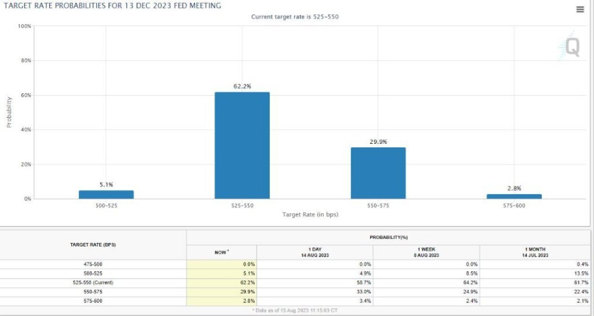
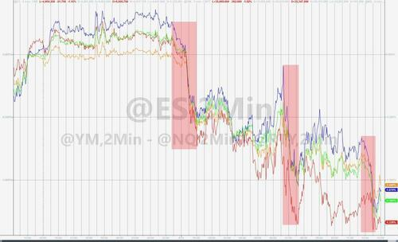
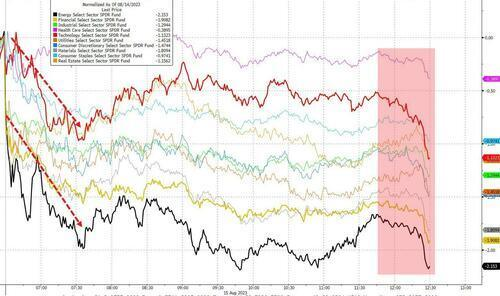
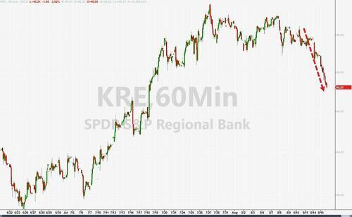
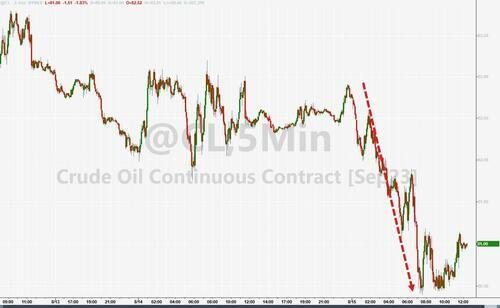
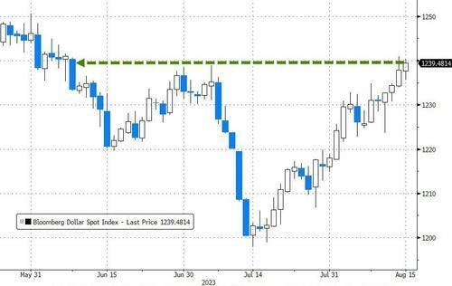
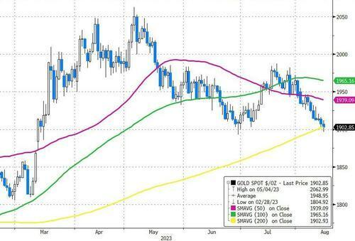

# 美股齐跌超1%，银行股指跌约3%，中概指数跌2%，美元美债收益率反弹

美国7月零售销售环比增长0.7%超预期，创今年1月份以来最大增幅，显示高利率环境尚未打消消费者需求的韧性，令美元指数和美债收益率短线拉升。

同时，美国7月进口价格环比增长0.4%，是预期增幅的两倍和今年以来第二个月增长，显示通胀压力犹存，有分析称，这结合零售销售将迫使美联储继续考虑进一步加息的前景。

市场等待周三公布的美联储7月FOMC会议纪要给出利率路径线索，今年票委、明尼阿波利斯联储主席卡什卡利称尚未准备好宣称加息进程已经完成，距离降息还很远，并提倡“大幅加强”银行业资本金监管，加深地区银行股的跌势。

期货交易员预计美联储今年维持利率不变的可能性为62%，即另有三分之一的可能性是年底前再度加息25个基点，但9月会议暂不加息的概率维持在89%的“板上钉钉”水平。

其他经济数据不佳。美国8月NAHB房产市场指数降至50荣枯线，显著低于预期和前值的56，表明在按揭贷款利率超过7%的当下，美国房屋建筑商信心出现年内首次下滑，至三个月新低。

美国8月纽约联储制造业指数暴跌至-19，显著低于预期的-1和前值1.1，新订单和出货量急剧下降，支付与接收价格等通胀指标反弹。但未来六个月的商业状况展望大幅升至19.9。

“欧洲火车头”德国8月ZEW经济景气指数意外反弹至-12.3，虽仍处于负值区间，但好于预期的-14.9和前值-14.7，欧元区8月ZEW经济景气指数也从-12.2反弹至-5.5。

**对欧美央行在更长时间内维持高利率的预期持续升温。**
市场认为欧洲央行年底达到3.95%的利率峰值，是7月中旬以来最高预期水平，并下调对明年欧央行降息幅度的押注。

截至6月的三个月内，英国不包括奖金的工资同比增长7.8%，创2001年有记录以来的史上最高年增长率，通胀担忧加剧令交易员将英国央行9月暴力加息50个基点的可能性上调至20%。

为遏制卢布贬值，俄罗斯央行暴力加息350个基点，俄罗斯政府讨论重启资本管控措施，卢布兑美元在周二美股盘中止跌转涨，昨日曾跌穿100关口至17个月最低。

惠誉评级的分析师暗示，不排除自6月份以来再度下调对美国银行业的评级，这将导致数十家美国银行的信用评级被迫重估，其中或包括摩根大通和美国银行等最大金融机构。

美股齐跌超1%，标普大盘跌穿50日均线至五周新低，银行股低迷，中概指数跌2%

8月15日周二，市场风险偏好低迷，美股集体低开并在开盘近一小时齐跌约1%。道指失守3.5万点整数位，成分股摩根大通和高盛，以及工业巨头陶氏化学、卡特彼勒和3M均跌超2%。罗素小盘股领跌主要股指并失守1900点关口。

**美股集体收于日低并跌超1%，**
道指止步三日连涨至四周新低，标普500指数和罗素小盘股均创7月10以来的五周低位，纳指创6月29日以来的近七周新低，小盘股8月份仅有两日上涨：

标普500指数跌穿50日均线，收跌51.86点，跌幅1.16%，报4437.86点。道指收跌361.24点，跌幅1.02%，报34946.39点。纳指收跌157.28点，跌幅1.14%，报13631.05点。纳指100跌1.1%，罗素2000指数跌1.3%，“恐慌指数”VIX收涨10.80%，报16.42。

 _美股尾盘跌幅扩大至齐跌超1%，标普、纳指和小盘股均跌穿50日均线_

_能源和金融板块领跌美股大盘，科技股跌近1%_

标普11个板块全军覆没，能源板块跌2.4%，金融跌1.8%，公用事业、原材料、可选消费、工业、房地产、日用消费品、电信至多跌1.7%，信息技术/科技跌0.9%，医疗保健跌0.4%跌幅最小。

美国银行对基金经理的最新全球调查显示，投资者对股市的悲观程度为去年2月以来最低，对通胀在一年内放缓的预期愈发增强，对经济衰退的担忧正在消退。但有分析指出，随着美债收益率在高位徘徊，美股将在短期内迎来盘整和回调。

**明星科技股齐跌。**
元宇宙Meta跌1.4%，奈飞跌近1%，均徘徊两周低位；亚马逊跌2%，谷歌A跌超1%；苹果跌超1%，微软跌0.7%，均接近两个半月最低；特斯拉跌近3%至两个多月最低。

**芯片股也普跌。**
费城半导体指数跌1.7%脱离一周高位。AMD跌0.6%重新下逼七周最低，英特尔跌2.6%，止步三日连涨脱离两周新高，但昨日涨7%的英伟达再涨0.4%至一周新高。

**AI概念股齐跌** 。C3.ai跌近5%至七周最低，Palantir
Technologies跌超2%徘徊一个月低位，BigBear.ai跌超8%，昨日涨近24%的SoundHound.ai跌超3%，均重新逼近五个月低位。

消息面上，特斯拉在美国升级价格战，推出各便宜1万美元的Model
S和X低配车型。瑞银、富国银行和Baird均上调8月23日盘后财报的英伟达目标价，瑞银预计还有超23%的涨幅空间。

**热门中概追跌美股大盘** 。ETF
KWEB和CQQQ跌2%，纳斯达克金龙中国指数（HXC）跌近2%，盘中一度接连跌穿7000和6900点两道整数位，刷新逾三周最低。

纳斯达克100成份股中，京东跌超2%，百度跌1.6%，拼多多跌超3%。其他个股中，阿里巴巴跌2%，腾讯ADR跌近1%，B站跌超4%。蔚来汽车跌超5%，小鹏汽车跌0.8%，理想汽车涨1.6%。

消息面上，理想汽车CEO李想称瓶颈零部件产能在10月份解决。蔚来硬件副总裁称，未来1-2年蔚来一些关键自研芯片会量产。腾讯音乐涨近7%后收涨0.7%，二季度净利润同比增近52%至13亿元。迅雷跌超7%，二季度总营收同比增长33%，毛利润增近36%，但净利润降14%。

**银行股跌约3%至四周新低，地区银行跌幅更大。**
行业基准费城证交所KBW银行指数（BKX）跌2.8%，5月4日曾创2020年10月以来最低。KBW纳斯达克地区银行指数（KRX）跌3.4%，5月11日创2020年11月来最低；SPDR标普地区银行ETF（KRE）5月4日创2020年10月来最低。

_银行股跌约3%至四周新低，地区银行跌幅更大_

“美国四大行”齐跌超2%，美国银行跌超3%最差。 **重点地区银行中，** 西太平洋合众银行（PacWest
Bancorp）和Keycorp跌超3%，阿莱恩斯西部银行（Western Alliance Bancorp）和Zions
Bancorporation跌超4%。

**其他变动较大的个股包括：**

开启最大型零售商财报季的美国家居装修龙头家得宝涨2.5%后收涨0.7%，二季度营收和盈利超预期，但重审上季度下调后的黯淡全年指引，警告消费者仍不愿意购买大件非必需品。

美股房屋建筑商上涨，二季度被伯克希尔增持7.26亿美元股份的美国三大房地产商之一D.R.
Horton涨近3%，被增持7000万美元的NVR涨0.6%，被增持1720万美元的Lennar涨近2%。

东南亚消费互联网龙头Sea跌超28%至九个月最低，也接近2020年3月以来低位，二季度营收不及预期，净利润同比实现扭亏为盈，但旗下电商业务Shopee收入创历史新低。

山火担忧放大，夏威夷电力公司再跌超31%至2009年以来的十四年最低，昨日盘中跌超42%创上市后最大跌幅且收跌近34%。标普将其评级下调至BB-的“垃圾级”，置于负面观察名单。

欧股集体跌约1%，英股跌1.6%领跌国家指数，意大利股市休市。泛欧Stoxx
600指数收跌0.93%至7月11日来最低，基础资源类股跌1.5%，银行与公用事业板块均跌1.2%，但零售股涨0.5%。俄罗斯股指在“紧急加息日”冲高回落。

两年期美债收益率止步四连涨，10年期基债收益率转涨后创近十个月最高

对货币政策更敏感的两年期美债收益率最深跌6个基点并下逼4.90%，美股盘中跌幅收窄至逾2个基点且交投4.94%，止步四日连涨，但离昨日所创的7月7日以来五周高位不远。

长债收益率在美股盘中止跌转涨。10年期基债收益率一度跌2个基点，转涨后日高至4.28%，创去年10月24日以来的近十个月最高。

衡量实际利率的美国30年期通胀保值国债TIPS收益率突破2%，为2011年以来最高，去年开启加息时曾低于零。10年期TIPS收益率持续逼近2009年8月以来顶部位。

 _10年期美债收益率转涨后创近十个月最高_

德债收益率尾盘普涨超3个基点，欧元区基准的10年期德债收益率一度升超9个基点至2.73%，创3月7日以来的五个月最高，并逼近十二年高位。10年期法债收益率也涨9个基点，至3.26%的2012年以来最高。负债较深外围国家基准的10年期意债收益率跃升13个基点至4.37%。

英债收益率尾盘冲高回落，投资者等待周三发布的英国通胀数据。此前，10年期英债收益率在美国零售销售发布后一度跳涨10个基点至一个月最高，两年期收益率一度跃升超13个基点。

有分析称，对利率将在更长时间内保持较高水平的预期，导致投资者抛售欧元区、英国和美国政府债务。推涨长债收益率的因素还包括：强于预期的美国经济数据、美国财政部加大售债力度、日本改变货币政策导向，推动长端日债收益率升至九年高位等。

油价收跌超1%逼近两周低点，盘中齐跌超2%，欧洲天然气盘中跃升15%接近两个月高位

需求前景不振，油价收盘逼近两周低点。WTI
9月原油期货收跌1.52美元，跌幅1.84%，报80.99美元/桶。布伦特10月期货收跌1.32美元，跌幅1.53%，报84.89美元/桶。

美油WTI最深跌超2美元或跌2.5%，失守81美元，布伦特最深跌1.90美元或跌2.2%，失守85美元，均连跌两日并创8月8日以来的盘中最低。

_油价收跌超1%逼近两周低点，盘中齐跌超2%_

消息面上，俄罗斯承诺9月减少石油出口30万桶/日，并将9月原油和燃料油的出口关税上调近27%至每吨21.4美元，创今年以来最高水平。

欧洲基准的TTF荷兰天然气期货尾盘涨超12%，美股盘前一度触及40欧元/兆瓦时整数位，ICE英国天然气涨超14%，美股盘前一度升破100便士/千卡，均接近6月中旬以来最高。澳大利亚LNG工厂与工会的谈判继续，上周三因担心澳洲LNG生产被罢工影响，天然气盘中曾跳涨超40%。

美元站稳103接近六周最高，离岸人民币一度跌520点跌穿7.33元，与日元齐创九个月新低

衡量兑六种主要货币的一篮子美元指数DXY一度跌0.4并失守103，美股盘中接近抹去全部跌幅并重回这一关口上方，接近昨日触及103.46所创的一个半月高位。

_美元站稳103接近六周最高_

欧元兑美元小幅上涨并站稳1.09上方，仍交投五周新低。英镑兑美元小幅上涨并重上1.27，脱离昨日盘中触及的6月30日来最低。

日元兑美元一度跌0.2%并持续不足145关口，刷新去年11月初以来的九个月最低。离岸人民币一度跌穿7.33元，较上日收盘最深跌超520点或跌0.7%，也创九个多月最低。

 _离岸人民币一度跌520点跌穿7.33元_

令人意外的总统大选初选过后，阿根廷比索兑美元在非官方汇率的平行市场下跌4.2%，连续两日刷新历史新低至715。俄罗斯卢布兑美元跌1.6%后小幅转涨，持续站稳100关口上方。

**主流加密货币普跌但跌幅不大。** 市值最大的龙头比特币跌近1%并失守2.93万美元，重返一周低位。第二大的以太坊跌0.5%并失守1840美元整数位。

现货黄金一度失守1900美元，与跌超1%的伦铜齐创近七周最低，伦镍跌至13个月最低

美元和美债收益率在美股盘中携手反弹压低贵金属价格。COMEX 10月黄金期货收跌0.45%，报1916.50美元/盎司。COMEX
10月白银期货收跌0.23%，报22.759美元/盎司。

现货黄金最深跌0.6%并一度失守1900美元整数位心理关口，连跌两日至6月29日以来的近七周新低，美国零售销售数据抬升人们对美联储在更长时间内维持较高利率的担忧。

_黄金10个交易日里下跌9天，下测200日均线_

**需求前景恶化和美元反弹，令伦敦工业基本金属再度普跌：**

经济风向标“铜博士”跌超90美元或跌1.1%，至8200美元创6月29日以来的近七周最低，且连跌四日。纽约铜价跌至6月1日以来的两个多月新低。

伦铝小幅收跌，盘中创7月7日以来的五周多新低，近月期货较三个月期铝的贴水攀升至2008年全球金融危机以来最高，表明需求疲软。

伦锌跌1.5%下逼2310美元，创6月6日以来的逾两个月最低。伦镍跌1.6%失守2万美元关口，至去年7月以来的13个月最低。昨日跌超1100美元或跌超4%的伦锡再跌0.5%，至近三个月最低，尽管全球第三大矿业国缅甸颁布了采矿禁令，锡仍面临大量库存和需求疲软的压力。

天气条件改善农作物生长条件，芝加哥玉米期货跌近3%至2020年以来新低，彭博谷物分类指数和大豆期货均跌超2%，CBOT小麦期货跌近3%，刷新至少逾两个月最低。

