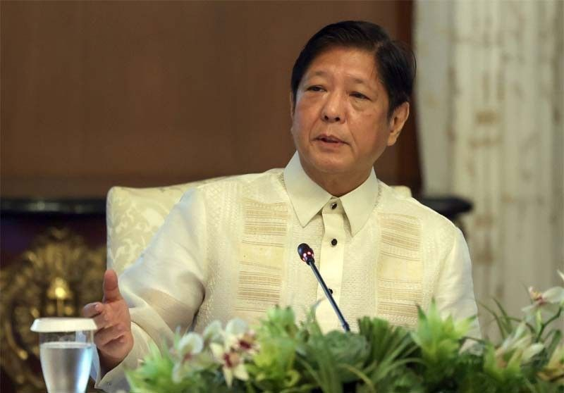

# 菲律宾发布国安政策文件，将台海冲突风险视为“主要关切”

（观察者网讯）据路透社和菲律宾官方通讯社报道，当地时间8月15日，菲律宾政府公布《2023至2028年国家安全政策》。在这份长达48页的文件中，菲律宾政府认为，中美间战略竞争加剧将导致地缘政治格局更加紧张，同时将台海冲突风险视作该国的主要安全担忧。

 _菲律宾总统马科斯，图自菲媒_

菲律宾总统马科斯于8月10日批准了这份国家安全政策文件，呼吁各级政府和政府各机构间加强协调，努力使菲律宾成为一个“自由、团结、安全、和平、坚韧和繁荣”的国家。

根据公布的政策文件，菲律宾在未来几年间寻求增强其应对威胁的能力，强调需加强与盟友的关系，同时奉行独立的外交政策。文件强调，“美国和中国之间的战略竞争加剧”和“大国之间的竞争加剧”是导致“地缘政治格局更加紧张”的原因。

菲律宾政府提到了台海问题，称“两岸关系存在重大担忧，有可能成为地区冲突爆发点（flashpoint)”。

“菲律宾担忧自身经济稳定、潜在难民涌入以及海外人口的福利。”菲政府在文件中称，台湾海峡的任何军事冲突“都将不可避免地影响菲律宾，因为台湾地区在地理上靠近菲律宾群岛，而且台湾岛上有超过15万菲律宾人”。

这份国家安全政策文件还涉及了南海问题，宣称南海“仍是国家的主要利益”。此外，菲政府表示，为实现能源安全，菲律宾将探索开发包括南海海域在内的海上储备，以帮助减少对进口的依赖。

_马科斯批准《2023至2028年国家安全政策》文件_

菲律宾政府并非首次表态称“正密切关注台海局势”。7月20日，菲律宾国防部长特奥多罗在记者会上炒作称，菲律宾政府正在密切关注台海地区局势，并且正在为可能发生的突发事件做准备。

不过，特奥多罗又于7月24日一口回绝台外事部门负责人吴钊燮称菲台应考虑安全合作的提议，直言双方合作“可能性为零”。在台湾问题上，菲律宾政府多次公开表态坚持一个中国原则。菲律宾总统马科斯今年4月曾表示，台湾问题是中国内政，菲方将一如既往恪守一个中国政策。

近一段时间，菲律宾国内外重提南海问题，炒作所谓“南海仲裁案”。路透社提到，与此同时，菲律宾正加强与美国的共同防御条约，并加大与北约国家之间的军事联系。

应菲律宾总统马科斯邀请，欧盟委员会主席冯德莱恩于7月31日至8月1日对菲律宾进行正式访问，成为双方建交近60年来首位到访该国的欧盟委员会主席。据日媒日前报道，日本同法国和菲律宾有可能签署“便于军队相互顺畅往来”的《互惠准入协定》，以“牵制加强海洋活动的中国”。

对于菲律宾近期重提南海问题，我驻菲律宾大使馆7月12日指出，中方在南海仲裁案问题上的立场是一贯的、明确的、坚定的。南海仲裁案所谓裁决严重违反包括《联合国海洋法公约》在内的国际法，是非法的、无效的。中方不接受、不承认该裁决，不接受任何基于该裁决的主张和行动。中国在南海的主权和权益是在长期的历史实践中形成的，具有充分的历史和法理依据，在任何情况下都不受非法仲裁裁决的影响。

美国作为南海仲裁案的始作俑者和幕后操手，每年在非法裁决出台周年之际，纠集部分域外国家大肆渲染炒作，企图以此向中方施压，逼迫中国接受非法裁决，中方对此坚决反对。中方敦促这些域外国家尊重中方在南海的领土主权和海洋权益，停止利用南海问题挑拨地区国家间关系，不要做南海和平稳定的麻烦制造者。

**本文系观察者网独家稿件，未经授权，不得转载。**

