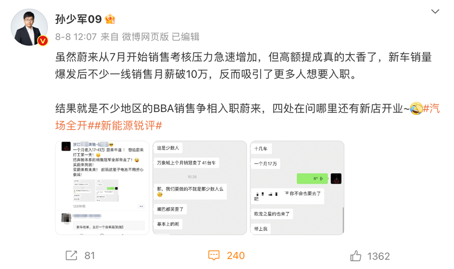

# 蔚来“被迫狼性”：提成涨250%，销售月入10万，宝马奔驰销冠争相入职

腾讯新闻《远光灯》特约作者 麦麦 作者 郭亦非

外有特斯拉接连降价紧逼，内有国产自主品牌围剿，生存压力下，李斌不得不开始改变蔚来的“佛系文化”。

8月8日，微博汽车博主@孙少军09爆料称，自7月起，蔚来销售考核压力急速增加，高额提成吸引之下，大量BBA销售争相入职蔚来，有不少一线蔚来销售月薪突破10万。

随后，多位上海区域门店销售员工向腾讯新闻《远光灯》证实，月薪10万的传言为真，“单月销售41台是6月份上海区域销冠创下的记录，7月份最多应该是卖了30多台”。

不过他们也都强调，月薪10万是极少数人才能达到的，堪称“人中龙凤”。

据腾讯新闻《远光灯》了解，蔚来销售月薪破10万背后，除了提成的大幅增加，还连带销售体系的调整。与此同时，蔚来开始大量招聘销售并设置对应的考核淘汰机制，带动员工快速流转，以佛系著称的蔚来开始转向“狼性”。

**单车提成从800拉到2000**

一般来说，宝马奔驰等传统豪华品牌销售人员的提成，与贷款、保险等多种因素挂钩，单车提车平均在1000元左右，但底薪较低，即便在一线城市通常也只有4000元左右。

与之相比，造车新势力品牌则倾向于“高底薪+严考核”的模式。公开招聘信息显示，在上海地区，蔚来销售的底薪收入为7000元，而理想则为8000元。这种模式意味着，公司将注重过程考核，到店体验、试驾感受等是影响销售收入的重要因素，有利于提高服务质量和用户体验。

此前有媒体报道称，理想销售员工每卖一辆车的平均提成在800-1000元左右，越好卖的车提成越低，蔚来单台车提成大约也在800元左右。腾讯新闻《远光灯》获悉，从7月开始，蔚来的提成已经提高到了2000元，而销售现车或展车更有超过4000元的高额提成，以此来激励销售主动消化库存车，放眼全行业，这样的高提成都极具吸引力。

这背后，是生存压力下，蔚来创始人李斌被迫对销售体系的大幅调整，甚至还打脸了“决不降价”的承诺。

蔚来官方数据统计称，2023年前三月，其尚能维持月均1万辆的交付量，分别为8506辆、12517辆、10378辆。

彼时，李斌曾自我调侃称，“如果蔚来还总是每月交付一万辆，那么我真的该找工作了。”为此，在2023年Q1财报电话会上，李斌信誓旦旦地表示，有信心在2023年下半年实现新车月均交付2万辆的销量目标。

但随着特斯拉引发的一系列品牌降价潮，蔚来销售形势更加急转直下，4月下滑至6658辆，5月仅有6155辆。

6月末，全新ES8交付开启。从产品侧来说，蔚来完成了主力车型的换代，同时，交付节奏大幅提速，不久前上市的ET5T车型甚至在同一天内实现了发布、上市和交付。

销售端的调整成了蔚来挽回销售颓势的最后一块拼图。

重压之下，蔚来变相降价，将终身免费换电、10年不限里程质保等剥离打包成3万元的权益包。如用户选择放弃购买权益包，则车价可立减3万元，大幅降低了价格门槛。此番调整后，蔚来体系中最便宜的ET5车型起售价来到29.8万元。

一位上海区域蔚来销售人员告诉作者，“车型换代以及价格调整后，车子确实比较好卖，单看上海的话，一线销售的平均薪资达到三四万元没有太大问题。”

**不达标就辞退，蔚来被迫“狼性”？**

腾讯新闻《远光灯》作者了解到，与其他新势力品牌的销售不同，蔚来门店内负责销售的员工被称为Fellow，他们不仅需要担负销售任务，同时还要负责用户的运营与维护。提车后车主出现任何问题，对应的Fellow都需要第一时间响应，同时也需要组织用户活动。最甚时，门店销售甚至不需要背负任何销售指标。

不过，这一切已经成为了过去式，蔚来直营门店架构也在此番调整中被迅速精简。除Fellow以外，此前蔚来门店里还存在一个岗位叫做NPE，专门负责用户试驾、门店员工培训等，但2023年1月份，NPE部门已被解散，员工要么选择转岗，要么领取补偿后离开，Fellow将独自负责客户从进店到下单的全流程跟进，独自对销售结果负责。

用户运营则交由去年全新成立的24k Fellow团队负责，24k Fellow不承担任何销售任务，但每个人要负责几百位车主，车主满意度是他们最大的考核指标。

作者了解到，这意味着，专注于销售的Fellow承担了更高的考核指标，门店会根据各人情况，制定不同的业绩要求。以上海区域为例，有的Fellow被要求单月卖出近30台车子，如果业绩不达标，第一个月将会被下达CIP（Continues
Improvement Process持续改进流程），需要提出改进方向并完成销售目标，如连续两个月未完成则会被辞退。

一位熟悉蔚来销售体系的员工告诉作者，“这一段时间确实有很多其他品牌的销售入职，一方面是各个品牌的销售互相跳槽本来就是常态，加上高额提成的吸引，另一方面是门店确实也开放了更多的hc(人员编制)。”

这种“狼性”与以往蔚来所展现出来的佛系气质格外不同。但是从销量来看，此番调整立竿见影。

6月份，蔚来汽车交付量达到10707台，7月则攀升至20462辆，创历史新高。蔚来也得以重新回到自主造车新势力前3名，但仍大幅落后于广汽埃安（45025辆）、理想汽车（34134辆）。

值得注意的是，高额提成+大幅扩招的销售模式或对本就严峻的毛利率状况产生进一步的影响。财报显示，蔚来2023年一季度净亏损达到了47.395亿元，同比增长165.9%，汽车销售毛利率进一步下滑至5.1%。

不过，李斌表示，三季度 NT2.0 全部车型完成交付后，毛利率预计会改善，有信心重返20%毛利率。显然，相较毛利率，眼下的蔚来更看重销量数字。

蔚来这家公司从诞生之初就有着极为庞大的业务构想，如今新能源市场已经进入淘汰赛，有圈内人士甚至戏称“中国汽车，卷在一起”。上半年蔚来销量跌入低谷，外界质疑的声音此起彼伏，残酷的竞争正迫使李斌不断反思和迭代，聚焦主营业务，降本增效，暂时放弃那些美好设想和宏大叙事。

除了对研发、营销、销售等多个团队调整外，李斌也暂缓了一些烧钱项目。此前有媒体报道，蔚来于近期推迟了自制电池的量产节点，放缓了电池工厂的部分设备采购，专注于换电站建设、销售提成等方面的投入。

