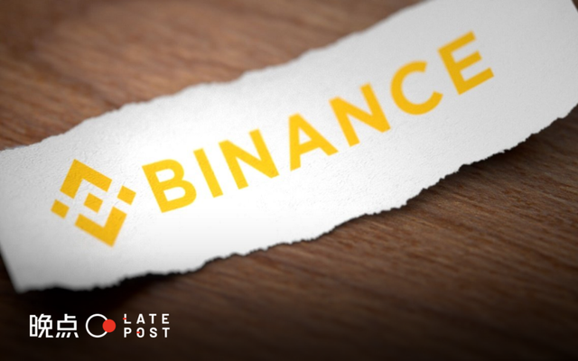
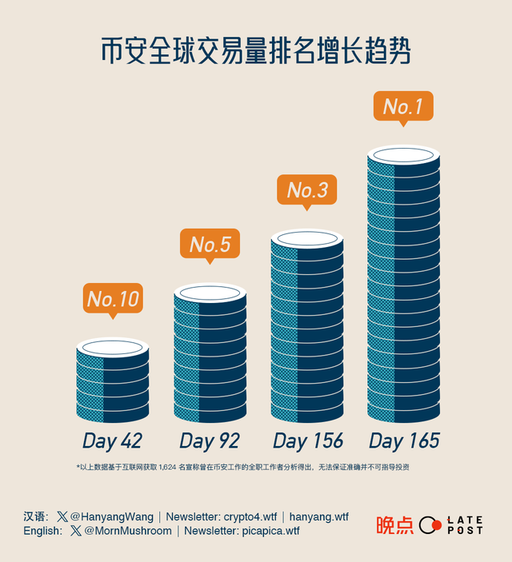
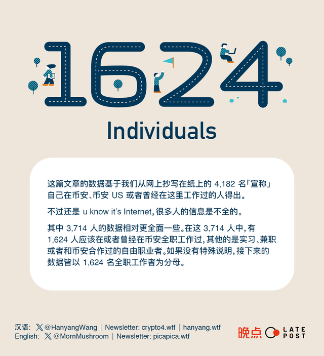
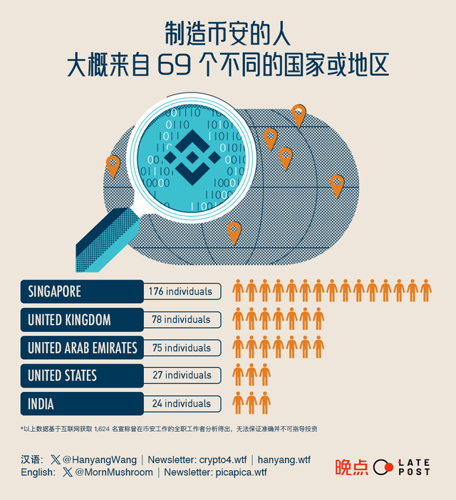
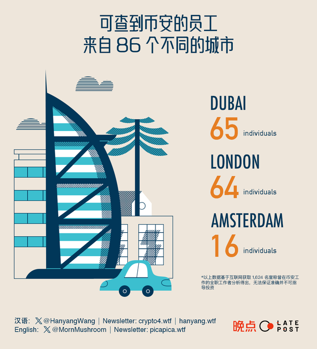
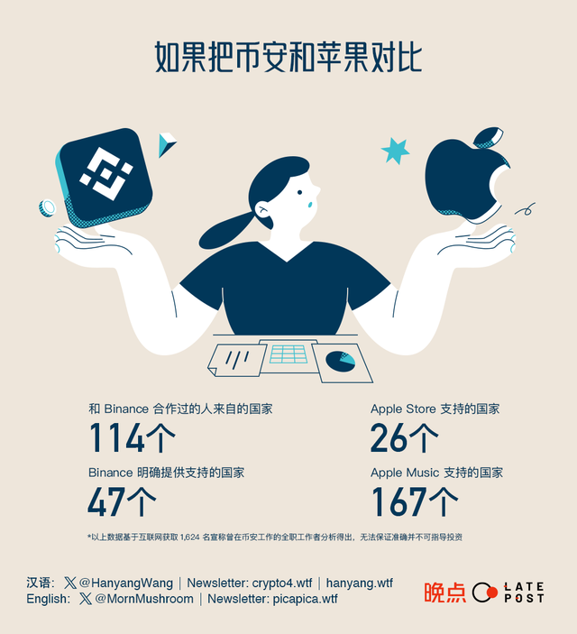
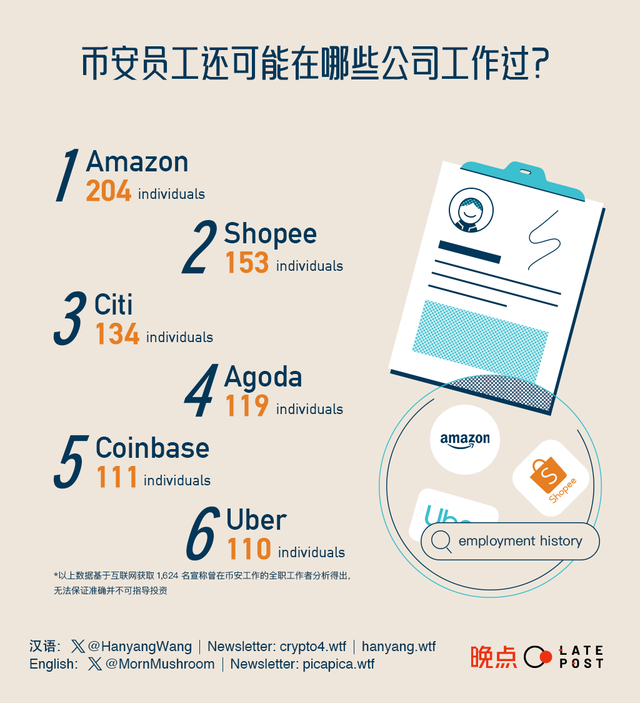
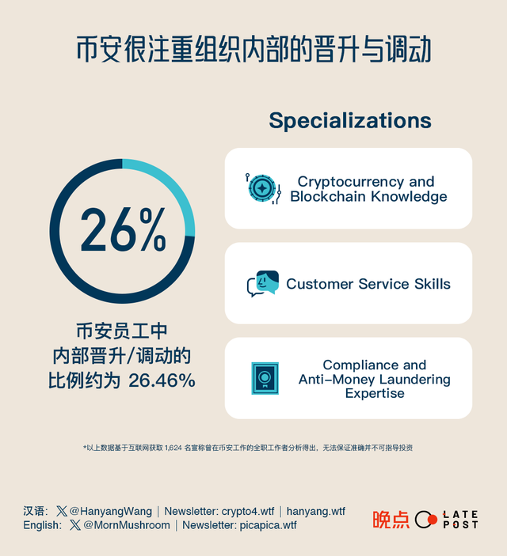

# 谁在制造币安：4000份履历里的无国界公司

成立165天即登顶全球第一的公司，它的员工是谁，来自哪儿？

**晚点特约作者丨王汉洋**

**编辑丨程曼祺**

两年前上一个加密货币牛市的尾声，《晚点 LatePost》曾对话全球最大加密货币交易所创始人赵长鹏。这是一个被由 0、1
组成的区块链密码迷雾笼罩的创始人和公司。它因巨量的财富效应、创始人漂泊不定的踪迹与分布全球各地的数千名员工的神秘感被关注、讨论，但从未被完整还原。

在已逐渐步入熊市的 2022 年，币安日均交易量也有 650 亿美元，是 A 股 2022 年日均交易量的约 1/2，港股的超 4 倍。据
CoinGecko 数据，去年 11 月的某一天，币安的日交易额达到 1367
亿美元。一位从业者称，即使在去年免去部分手续费后，币安的利润仍有交易额的约万分之四。也就是这 24 小时中，币安仅在交易业务上就赚取了超 5000
万美元的利润。“拥有一个全世界人都参与的 ‘赌场’ 是什么概念。”

仿佛印钞机般的赚钱能力，和加密货币世界游离于监管之外的特殊位置也把币安推到了漩涡之中。今年 6
月，美国证券交易委员会（SEC）正式起诉赵长鹏和他创立的币安，称币安涉嫌 “通过广泛的欺骗网络”
谋利，将投资者置于重大风险之中，还帮助美国客户逃避监管。长达 136 页的起诉文件上写下了 13 项指控。

SEC
对赵长鹏与币安的起诉仍在进行中。币安与赵长鹏的故事混杂着这个时代的新元素：前沿计算机科技、去中心化的组织变革；也掺杂着人性中长久涌动的对财富的渴望，对自由与规则之边界的迷思。仅从商业角度看，币安异乎寻常的崛起速度和新的组织方式，也使它成为当前最值得研究的公司之一。

还原这家公司故事和 “寻找赵长鹏” 都是一项浩大的工程，今天的这篇文章是一个小小的开端：它来自我们的特约作者王汉洋，他与朋友们一起梳理了能从互联网上找到的
4000 多份履历，这些人声称自己曾在币安全职工作或实习过。他们的背景和经历，拼凑出了这家神秘公司的冰山一角。

对大部分不关心区块链的人来说，币安可能仅仅是一个偶尔出现在科技新闻里的公司而已。但在今天，币安已经成为了金融和科技两个领域中最特殊、最重要的公司之一：根据报道，币安有八千名左右的员工（最近有消息称币安正在裁员），但这家公司却没有总部，员工远程分散在世界各地，可能很多人从入职到离职都没见过自己的几位同事。币安可能成为了有史以来最大的分布式公司。如果
30 年后（差不多是互联网诞生到今天的时间）的人研究互联网历史，币安的组织形态绝对是无法绕过的一章。

从业务影响力和盈利能力来看，币安也非常重要。可以和智能手机行业的领头羊苹果做一个对比：据 Tokeninsight 数据，2023 年 Q2
币安在加密货币交易所中的市场份额是 50.6%，而据 StrategyAnalytics 数据，苹果在 2022 年 Q4 的智能手机市场份额中的占比是
24%，这是全球之首，也是苹果有史以来最高的 Q4 市场份额——不过这个数字相比币安的占比，逊色了不少。即使在 2022 年这个加密货币的寒冬，据
CoinDesk 数据，币安的现货交易量还是达到了 5.29 万亿美元。2022 年苹果 App Store 的生态系统的营业与销售额是 1.1
万亿美元，其中超 90% 是零抽成的。而币安的交易在大部分时间里是有手续费的。所以如果苹果是智能手机的霸主，那么币安就是此刻加密货币市场中的绝对霸主。

整个行业的绝对霸主加上开创性的工作模式，让币安足够跻身我们这个时代最重要的公司之一。

可另一方面，币安又是一个谜。甚至币安是今天全球互联网上最大的一个谜：很少有一家公司对行业如此重要，但我们对它的了解又如此之少。

币安推出产品后的第 42 天，交易量排名全球第十；第 92 天，全球第五；第 156 天，全球第三；165
天时，成为全球第一——直到现在。它是如何做到这一切的？

我几乎读了中英文互联网上所有关于币安的文章，但依然无法解答我对币安的疑问，我甚至无法通过这些网上信息提出关键问题。所以我打算通过大量调查研究和采访，通过分析和整理来填补关于币安的空白。

对币安进行研究和访问并不容易。我希望利用一切可以利用的机会、一切可以获得的信息，从细微处着眼，展开这个项目。借助一系列文章，尽可能把币安的故事讲得足够有趣、全面，更重要的是，可以推动更多朋友一起，研究和分析币安这个在我们所处的时代无法回避的公司。

在第一篇文章里，让我们来谈谈到底是什么样的一群人制造了币安。感谢 @paincompiler
的帮助，他从网上收集了四千多名在币安工作或者曾经工作过的人的信息，并且用铅笔一条条抄在了纸上。

请注意：我们收集到的信息未必全部都是准确的，这些信息也无法覆盖币安的全部情况。

这篇文章的数据基于我们从网上抄写在纸上的 4182 名 “宣称” 自己在币安、币安 US 或者曾经在这里工作过的人。很多人的信息是不全的。其中 3714
人的数据相对更全面一些，在这 3714 人中，有 1624
人应该在或者曾经在币安全职工作过，其他的是实习、兼职或者和币安合作过的自由职业者。如果没有特殊说明，接下来的数据皆以 1624 名全职工作者为分母。

“无国界” 公司：新加坡与中东分布着最多员工

虽然区块链没有国界，但区块链公司是有国界的。不过币安似乎比其他任何一家公司都更接近 “无国界”：在我们的样本里，这些制造了币安的人来自 69
个不同的国家或地区。其中：

  * _1_ 新加坡: 176 人
  * _2_ 英国: 78 人
  * _3_ 阿联酋: 75 人
  * _4_ 美国: 27 人
  * _5_ 印度: 24 人

和大家的刻板印象差不多，币安有大量员工在新加坡。笔记本的资料显示还有一位员工在开曼群岛工作——我以为这个群岛仅仅是用来注册公司的。

你可能会问，那迪拜呢？毕竟创始人赵长鹏和何一都在迪拜——迪拜是阿联酋的经济中心，但它是一个城市，不是国家。如果我们根据城市来排名，迪拜将会排名第一。有 65
个人在迪拜，64 个人在伦敦，16 个人在阿姆斯特丹。这些员工一共分布在 86 个城市。

作为一家诞生在中国的公司，币安依然有人在这里工作——但我们收集到的数据只有一个人。不排除是在中国大陆工作的币安员工会刻意隐藏自己的公司。

在币安之前，著名的远程办公公司里，规模最大的应该是 GitLab。GitLab 是一家开源软件公司，他们宣称自己是全球最大的远程工作组织：2038
名全职员工和他们的 358 只宠物分布在 65 个不同的国家或地区。

如果我们能有更明确的资料，我相信这个 “全球最大远程工作组织” 的名头应该要转移给币安了。不过我不光是想对比体量，而是想通过对比 GitLab
证明币安的确是一家远程工作的公司。很多人不相信币安在远程工作，他们或多或少地认为币安只是怕监管所以说自己没有总部，都是远程。也有人认为，币安所谓的远程不过是跨国公司常见的状态——但事实大概率不是这样。币安和
GitLab 都应该被看作是这个星球上最大的远程组织。

如果目光不仅限于全职工作，那么我们笔记本上的 3714 位和币安有过合作关系的人一共来自 114 个国家。这可比 Apple Store
的范围广多了，全世界只有 26 个国家或地区有 Apple Store。不过全球有 167 个国家或地区可以用 Apple
Music，但在官网上币安明确提供支持的国家或地区只有 47 个。

虽然在地理上，币安员工的分布非常多样，不过从学校来看，币安员工就读的 Top 5 大学中有三所都位于新加坡，可见新加坡的确是加密世界的中心之一。

  * _1_ 新加坡国立大学：54 人
  * _2_ 南洋理工大学：47 人
  * _3_ 伦敦大学：25 人
  * _4_ 新加坡管理大学：24 人
  * _5_ 台湾大学：23 人

如果把条件放宽到全部和币安有过合作的 3714 人中，有英国学习经验的人则出现了不少：

  * _1_ 英国剑桥大学：219 人
  * _2_ 新加坡国立大学：179 人
  * _3_ 新加坡南洋理工大学：128 人
  * _4_ 新加坡管理大学：90 人
  * _5_ 英国伦敦大学：90 人

一个推测是：币安作为一家快速增长的公司，对实习生的需求应该不会小。而作为一家华人主导的公司，会说英文的华人是非常理想的招聘选择。但是在中国境内招聘不是太容易，那么在海外的中国留学生就很合适了。

英国有 17
万中国学生，是最大生源地。币安可以给这些学生合适的实习机会。根据我的观察，在英国的中国留学生在本地找实习和工作的难度要大于在北美的中国留学生，所以会有更多人涌入可以全球招聘的区块链公司。新加坡一共才只有
5 万名留学生，中国人占 1/3。所以实习生的数量必然不会特别多。

钟情 Uber 的赵长鹏，招了最多亚马逊前员工，像互联网 CEO 那样斟酌版面调整

有币安的离职高管告诉我，赵长鹏是一个很爱看书的人。早年间币安有一个 40
多人的核心管理层群，赵长鹏会经常把自己读过的书丢进去让大家一起同步思考，并且开玩笑地 “威胁”：不读就会被踢出去。

这些书大多是管理和公司传记。在众多公司中，赵长鹏很喜欢关于 Uber 和网飞的传记。尤其是 Uber，因为这家打车巨头早年面对的监管和币安的挑战很像。

赵长鹏不光读，也活学活用，后来也招聘了不少 Uber 的人。这在我们的全职人员样本中能得到佐证：有 110 人有过在 Uber
的工作经历，在我们的数据中排名第六。前五名分别是：

  * _1_ 亚马逊：204 人
  * _2_ Shopee：153 人
  * _3_ 花旗银行：134 人
  * _4_ Agoda：119 人 （一家在线酒店预定网站）
  * _5_ Coinbase：111 人 （一家美国加密货币交易所）

那么这些人在币安都在做什么工作呢？

  * _1_ 商业相关：761 人 （占总人数 46.86%）
  * _2_ 技术相关：329 人（占总人数 20.26%）
  * _3_ 运营相关：243 人（占总人数 14.96%）
  * _4_ 不确定：291 人 （占总人数 17.92%）

我们无法确定很多人的职位，因为这些被收集的资料不一定准确，且缺乏很多关键信息。在这个有限的数据集里，可以见到近一半职位与业务相关，这或许体现出币安对商业拓展、销售、市场营销和战略的重视——本质上是对增长和扩大市场份额的追求。

这让我联系到了一件某位受访者说的故事：这位受访者在币安收购加密货币价格跟踪网站和数据提供商 CMC（CoinMarketCap）之后参与了对 CMC
的改版工作。在商讨改版的会议上，赵长鹏一个一个地看不同位置是否合适放广告。最后赵长鹏要求把首页非常显眼位置的广告都撤下，只留一些小位置放广告，并建议团队在用户无感的位置增加广告，把用户的体验放在第一位。

撤下的广告占据了 CMC 收入的大头，可赵长鹏认为
“如果用户体验比竞品差，那最终用户只会流失，当下的收入再高也没有意义”。最后的效果是只保留小位置的广告以及在用户无感的位置插入一些很顺滑的广告。不过毕竟广告收入的大头没有了，赵长鹏也相应调整了员工们的
KPI。这位受访者评价赵长鹏：有大局观，抓重点。

超四分之一的样本在币安得到了晋升

我试图通过数据来判断币安倾向于从什么行业招聘人才，不出所料的是科技和金融行业。一个有趣的事情是：通过我们这个小样本数据，可以看出币安员工中内部晋升的比例约为
26.46%。这也许表明币安非常注重在组织内部进行晋升，或者在不同分支机构或子公司之间调动员工。

从这些员工对自己职位的描述看，币安对技能的要求主要集中在三个领域：加密货币和区块链知识、客户服务技能和合规与反洗钱专业知识——币安似乎很注重合规。

币安和合规是一个很有争议的话题，在绝大部分国家，币安是不合规的。尤其是币安与 SEC 之间的纷争。虽然币安已被 SEC
起诉，但大部分观察者们都认为这只是更激烈斗争的前奏，真正的大斗争应该还在后面。而且币安努力追求合规的过程基本上可以串起整个币安的公司历史，值得以后详述。

这篇文章只是对币安的一些基本分析，它留下的疑问远大于能得到的回答。

从有限的数据看，币安是一家分布在全球、增长极其快速的交易所。它的员工如何组织与合作？什么样的人、通过什么具体方法管理它？它如何面对日益严峻的挑战？它可能出现的问题在哪里？这些问题都有待进一步探究。

币安就像是一张充满战争迷雾的地图，希望通过努力我们可以逐渐探索出全貌。因为币安注定成为这个时代最重要的公司之一。

题图来自 steemit.com，由 belenguerra 拍摄。

