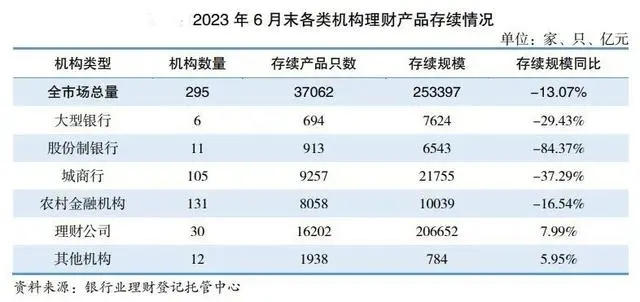

# 银行理财少了2万亿

历史首次！资管行业头把交椅易主。

数据显示，截至今年6月末，我国银行理财市场存续规模为25.34万亿元，而同期公募基金资产净值合计27.69万亿元。银行理财首度被公募基金反超。

回想10年前，公募基金规模只有3万亿，是银行理财三分之一。

在市场环境不稳的当下，保守投资是趋势，公募基金的稳健性往往不如银行理财，但为何银行理财的规模，反倒被公募基金超越了？

资管市场的历史性时刻

“终于要和银行理财说再见了！”

7月底的一天，上海的王先生经过了数日的犹豫之后，终于做出了这个决定。一年多前，他购买了某股份制银行的一款理财产品，10万元本金存了13个月，收益1958元，“跑不赢行情好时的余额宝。”

和王先生一样，北京的张女士也早已准备从马上到期的银行理财里逃离。她去年买了一笔银行理财，风险等级R2，买的时候显示预计年化利率超4%，现在一年过去了，实际年化收益率只有2.25%。

“理财经理劝我再等等，但我还是决定算了，担心会被套进去。在资产平均回报率漫漫下行的时期，理财收益率不亏已经不易。”张女士称。

她的一位朋友早在今年2月就开始行动，将尚在亏损阶段的银行理财产品忍痛赎回，换成了定期和大额存单，朋友称，“及时止损为妙。从此银行理财产品从我的生活中消失了。”

在理财市场无法达到预期收益的情况下，一些投资者正在告别银行理财。

一位股份行理财经理向「市界」抱怨称，“不少客户表示到期赎回后就不会再买了，而是打算转回定期存款，甚至是投向股市和基金。个别不自动赎回的产品，到期又续上了，客户还要抱怨说我没提醒他。”

一系列现象都在指向一个结果，银行理财从赚钱的“小甜甜”，变成了被嫌弃的“牛夫人”。

根据银行业理财登记托管中心发布的《中国银行业理财市场2023年上半年报告》披露，截至2023年6月末，银行理财市场存续规模25.34万亿元，较2022年同期下降了3.81万亿元，较2022年底下降了2.31万亿元。

值得关注的是，据中国证券投资基金业协会数据，截至6月末，我国公募基金资产净值合计27.69万亿元。这意味着，银行理财首次让出资管业“头号交椅”，一个历史性的时刻已经到来。

“银行理财确实不香了。”星图金融研究院副院长薛洪言向「市界」感慨。

据他观察，银行理财的规模高点出现在2017年之后，随着资管新规出台，银行理财打破刚兑，低风险高息产品成为历史，银行理财规模也开始缩水，至今仍未突破前期高点。相比之下，公募基金余额则逐年攀升，基金投资者超过7亿人，成为全民级理财新选择。

冰冻三尺非一日之寒。在薛洪言看来，过去十年，堪称公募基金的黄金发展期。

从数据上看，公募基金近些年与银行理财相比，形成了此消彼长的态势。

2013年，银行理财规模为10.21万亿，公募基金只有3万亿，相当于前者的三成。

2018年，银行理财规模增加近12万亿至22.04万亿，公募基金的新增规模也超10万亿，达到13.03万亿。

到2022年末，公募基金期末净值26.03万亿元，2012年以来的十年复合增速为24.69%，远超同期GDP增速。且距离27.65万亿元的银行理财仅一步之遥。

事实上，公募基金比银行理财出现的时间要更早，1998年，首批公募基金成立。2004年，光大银行发行了中国第一只面向个人客户的人民币理财产品，才标志着中国式理财呱呱坠地。

中关村物联网产业联盟副秘书长、专精特新企业高质量发展促进工程副主任袁帅表示，作为后来者的银行理财，不论是渠道优势和品牌影响力，都优于公募基金。

“它拥有广泛的客户资源和销售渠道，可以通过银行柜台、手机银行等方式将理财产品推广给广大客户群体；银行的品牌影响力也为理财产品的销售提供了有利条件，客户更容易信任银行推出的产品。”袁帅称。

然而，占尽渠道和客户优势的银行理财却被公募基金反超，这是资管市场的常态还是偶然现象？这对资管市场到底意味着什么？

银行理财“信仰”因何崩塌

投资者的心态正在发生微妙的变化。

正像前述投资者所讲，经历了2022年的冲击波，不少人被银行理财的负收益吓怕了，不惜亏本也要退出。

尤其是去年第四季度“破净率”达到20%，引发了一大批投资者的恐慌和赎回潮。压力之下，2022年底银行理财规模同比下降4.66%。

此前，普通投资者都有这样的期望，买银行理财肯定赚钱，但实际情况并非如此。

自从2017年发布资管新规征求意见稿，2018年正式通过后，净值型理财产品全面取代此前的预期收益型理财产品，刚性兑付被打破，银行理财就已经不保本了。

当时就有机构向媒体分析，银行理财由于净值波动加大，不可避免地会受到一定冲击，尤其是投研能力弱的中小银行发行的理财产品。而理财产品竞争力被削弱后，将利好具有较强专业投资能力的公募基金行业。

_（图源/视觉中国）_

拥有11年基金从业经历的私募股权基金投资总监王伟向「市界」分析，之前银行理财都是预期收益，银行刚性兑付。之后的净值化管理，银行成立了理财子公司，但是后来2022年底的净值大幅回撤，导致了银行理财“信仰”崩塌。

薛洪言也认为，除了打破刚兑外，银行理财这两年也的确“不能打”，金字招牌开始褪色。去年以来屡屡出现破净潮，买个银行理财还亏钱，让投资者不免惊诧。

“不保证收益是一回事，不能保本是另一回事，很多人宁愿选择货币基金也不选择银行理财，或者宁愿买存款也不买理财。”薛洪言分析说。

所以，奇怪的现象发生了，居民储蓄存款余额屡创新高，银行理财产品却不增反降。此消彼长的背后，是部分投资者赎回理财买入了存款。

与银行理财对比来看，公募基金的优势则慢慢被投资者发现。王伟表示，相比银行理财，公募基金有几个本质上的优势，第一是分散投资；第二是净值化管理；第三是定期报告制度。

袁帅进一步介绍称，公募基金具有更多的投资品种和策略选择，能够更好地满足不同投资者的需求；其投资组合和业绩公开透明，投资者可以更清楚地了解自己的投资情况，增加了投资者的信任度。

最关键的一点，公募基金建立了广泛的销售渠道，为其销售和曝光助力不少。

“基金公司的销售渠道目前仅有50%是银行，对银行的依赖有所降低。”王伟表示。

据他梳理，2012年，公募基金销售有75%是银行，剩余的资金渠道20%是券商，还有一点是直销客户。2022年，有50%是银行，剩余的资金渠道20%是券商，还有25%左右是第三方销售平台，比如蚂蚁金服等。

第三方平台，对基金的销售功不可没。中国基金业协会数据显示，截至2022年末，蚂蚁金服代销的基金公司家数多达166家，代销基金7835只。从保有规模上看，蚂蚁金服渠道非货基金保有规模超过1.15万亿，稳居行业第一，股票+混合公募基金保有规模5712亿元，位居行业第二。

王者之争还有看头

尽管市场上充满看衰银行理财的声音，但业界人士还是呼吁，应理性看待此次公募与理财的数据对比。

国信证券经济研究所金融业首席分析师王剑认为，首先，两者客群存在差异，公募基金投资者更多元。银行理财被去杠杆后，95%以上面向零售客户（公募为主）和头部企金客户（定制为主），而公募基金中货币基金约一半（约6.0万亿元）、债券基金约8成（约6.5万亿元）主要面向机构客户。

“如果只针对零售客户，两者规模可能是24万亿对15万亿元，银行理财优势仍然显著。”王剑总结称。

其次，两者在配置上也是“你中有我”。一份中金公司研报显示，截至2022年上半年末，银行理财配置公募基金产品1.27万亿元，规模为2019年末的2.4倍。2022年末受债市大跌影响，该规模降至0.81万亿。

中金公司研报认为，出于提升产品收益、建立差异化竞争优势等考虑，银行理财增配权益资产的意愿逐渐强烈，而通过公募基金间接投资权益市场成为其中一个选项。头部公募债基依靠强大的投资管理实力，能够满足银行理财稳健收益的诉求，有望成为“后房地产时代”的资产配置选择。

_（图源/视觉中国）_

《中国银行业理财市场2023年上半年报告》还有一些数据值得关注。与此前投资者印象中银行理财大面积破净的印象相反，其实在投资收益方面，2023年上半年，理财产品整体收益稳健，累计为投资者创造收益3310亿元，各月度理财产品平均收益率为3.39%，较2022年2.09%的各月度平均收益率水平显著回升。

另据Wind数据显示，截至2023年6月末，银行理财产品的破净率降至3%左右，已达到去年“赎回潮”前的水平。

虽然经历了低谷，但是银行理财投资者的数量仍在稳步增长。截至今年6月末，持有银行理财产品的投资者数量突破亿级。

而进入7月份，银行理财规模一改低迷，快速回暖，增加1.61万亿元至27.2万亿元，为年内新高，但仍略低于2022年年末的27.7万亿元。

与此同时，理财公司也正在思考如何留住投资者，提升客户价值感，挽回他们的信任。

5月底，招商银行打响“第一枪”，旗下招银理财发行的一款权益类公募理财产品宣布，当产品累计净值低于1元时，暂停收取管理费，等回到1元后再恢复收取。

此举打破了公募产品收取固定管理费的默认“行规”，意味着投资管理机构要与投资者共担盈亏风险，不赚钱不收管理费，这在理财市场引发热议。

紧接着，宁银理财也表示旗下某款产品固定管理费调整为零费率，光大、兴银、建信等诸多理财子公司在发行新产品的同时，均附加了各种费率打折来抢客。

招联首席研究员、复旦大学金融研究院兼职研究员董希淼预计，在银行和理财公司持续努力下，以及前期赎回压力集中释放和极低风险偏好投资者离场后，今年来理财市场规模有所增加。而存款利率持续降低，在一定程度上推动部分存款回流到理财市场。

时间来到8月，新的变数又出现。广发固收刘郁团队指出，8月银行理财到期规模达2.8万亿元，为今年以来单月最高。业界担心，大量产品集中到期有可能会引发投资者集中赎回。不过，截至8月11日，银行理财存量规模较前周五（8月4日）上升1574亿元至27.37万亿元，规模回升幅度有所增加。

从结果上看，理财存量规模并未受到较大冲击，反而稳中带升。与此同时，截至7月底，天相投顾给出的公募基金规模为27.87亿元，较6月也有小幅增长。作为资管市场上唯二的公募资管产品，银行理财与公募基金的“王者之争”还有看头。

王伟的观点是，“未来银行理财和公募基金不是有你没我的对立关系，而是一个并存的关系。”

作者 | 陈畅

编辑 | 孙月

运营 | 刘珊

