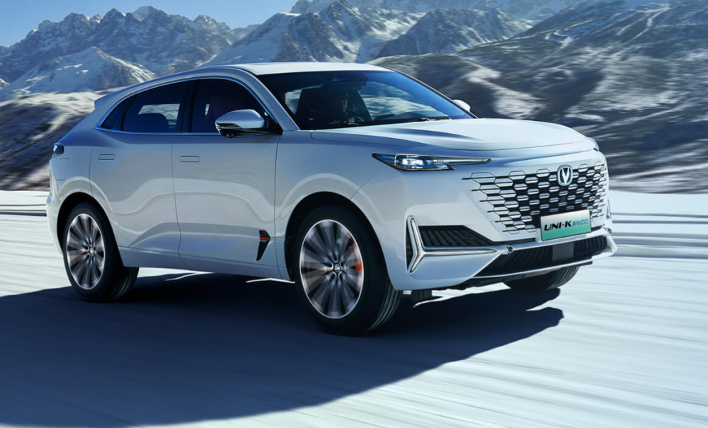
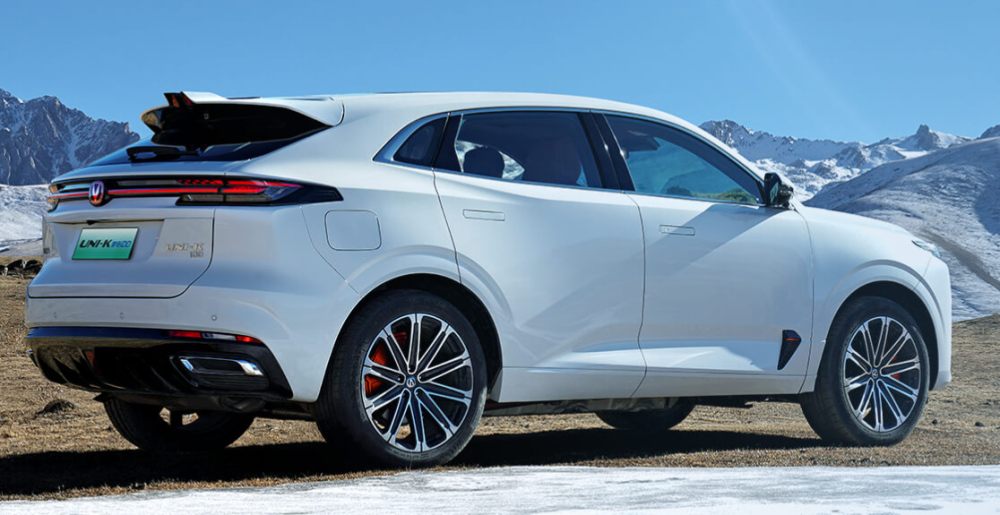

# 长安汽车申请在泰国建厂：投资88亿泰铢，一期年产能达10万辆

IT之家
8月16日消息，泰国投资促进委员会（BOI）发布声明称，长安汽车已申请在泰国建造一座电动汽车和混合动力汽车工厂，投资88亿泰铢（IT之家备注：当前约18.13亿元人民币）的，第一阶段年产能为10万辆。

_▲ 图源长安汽车官网，下同_

IT之家从BOI官网了解到，长安汽车泰国新工厂将生产纯电动汽车（BEV）、增程电动汽车（REEV）和插电式混合动力汽车（PHEV），并在泰国和出口市场销售这些汽车，包括东盟国家，以及澳大利亚、新西兰、英国和南非。此外，长安汽车还计划在这里还将建立一个重要零部件的研发中心，进行未来的汽车开发。

投资委员会秘书长 Narit Therdsteerasukdi
透露，该申请是在6月底率领BOI访问重庆，与长安汽车董事长朱华荣和公司管理团队会面后提出的。Narit表示，长安汽车自2020年开始探索在泰国的投资机会，此后与泰国投资委员会频繁举行会谈。该公司计划在今年年底在泰国市场推出电动汽车车型，然后开始在当地生产。

为了吸引投资，泰国BOI将提供激励措施，涵盖所有类型的电动汽车和更广泛的零排放汽车，从电池、平台到整车等17个关键部件的制造，以及对充电站的投资。

