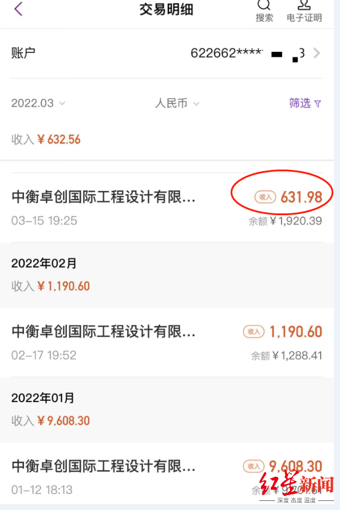
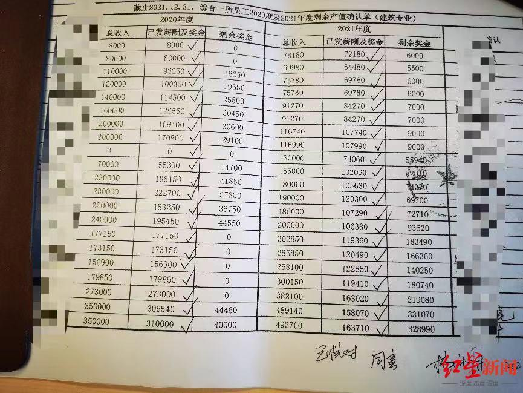
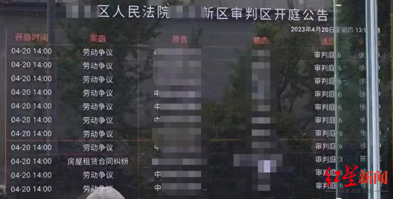
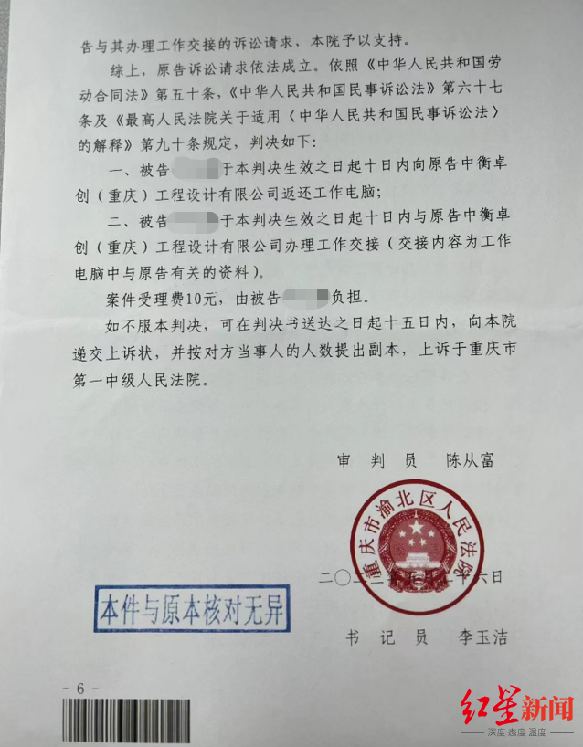

# 97名设计师集体离职，一年后被公司告上法庭称未交接工作 有人离职前月薪已降至600余元

因“降薪太狠”，重庆一设计公司97名建筑设计师选择了离职。令他们没想到的是，随后该公司却以员工离职未交接工作和归还电脑为由，将90多名设计师告上了法庭。

其中一名设计师杨先生向红星新闻记者介绍，2022年2月，该公司在未提前告知的情况下，突然将其工资从1月份正常工资水平的9608.3元降至1190.6元，3月份更是只有631.98元。随后该部门几乎全员提出离职。

 _▲杨先生去年前三个月的工资收入_

今年1月3日，当地仲裁委员支持了他们要求公司支付此前未发放的2021年绩效奖金的请求，但随后，该公司又将离职设计师们告上法庭。杨先生表示，在随后的几次开庭中，一审法院陆续判决97名设计师败诉，他们需在判决生效十日内与原告公司办理工作交接。设计师们不服判决上诉，据悉，该案二审将于近日进行。

**未被通知突然降薪，有人月入仅600余元**

**部门百名员工几乎全部离职**

8月16日，杨先生向红星新闻记者介绍，他此前在中衡卓创国际工程设计有限公司（下称中衡卓创）设计部门工作了5年，当时其所在综合一部有员工100人左右，大多工作5年以上，长的达10年之久。

杨先生称，2022年2月，他发现自己的工资突然从上一个月正常工资水平的9608.3元降至1190.6元，3月份更是只有631.98元，为此“我们部门许多员工就打申请离职。主要是没提前跟员工说，就直接降了”。

天眼查显示，中衡卓创国际工程设计有限公司成立于1994年，位于重庆市，是一家以从事建筑装饰、装修和其他建筑业为主的企业。企业注册资本2000万人民币，实缴资本1000万人民币。大数据分析显示，中衡卓创共对外投资了3家企业，参与招投标项目349次。

杨先生介绍称，中衡卓创的薪资发放要根据员工个人当年做的工程量来算。“比如2021年你做的（工程量）产值是80万，经过他们计算后，整年收入30万，扣去当年工资已发放的部分，剩余的作为奖金，在当年年底和来年再发。一般年底发30%，第二年发70%。”

“我们部门的情况是当年奖金没发完，后面就拖着不发了。”杨先生说，他在公司多年，从没遇到过拖欠奖金的情况，“以前都是年底一次结清。”

杨先生提供的一份奖金单显示，截至2021年12月31日，其所在部门仍有多名员工的2020年度奖金未发放完成。杨先生称，事实上，至今该部门仍有多名员工2020年度和2021年度的奖金未发放完成。此外，据他了解，2022年年初他在职时公司有员工八九百人，但目前只剩下一两百人。

_▲杨先生提供的奖金单显示，截至2021年12月31日，其所在部门仍有多名员工的2020年度奖金未发放完成_

因计时、计件工资、解除劳动关系经济补偿争议，2022年2月底，包括杨先生在内的97名员工选择对中衡卓创提起劳动仲裁，请求公司及时支付2021年和2020年未发放的奖金，并给予N倍赔偿。

2023年1月3日，重庆市渝北区劳动人事争议仲裁委员会作出仲裁决定，对中衡卓创支付申请人2021年绩效奖金的请求予以支持，但驳回了其他请求。杨先生表示，“后来公司对劳动仲裁支持的奖金发放也提起了上诉。”

员工一审败诉，被判回公司交接工作

上诉后二审将于近日开庭

杨先生称，其部门离职了的同事，有些找了其他设计院的工作，有的去了施工单位，有的转行搞起了软件，还有些在家待业。令他们没想到的是，随后，中衡卓创反而将他们告上法庭。

2023年4月至5月，中衡卓创诉员工劳动争议案陆续在当地法院开庭审理。杨先生提供的判决书显示，原告中衡卓创认为，2022年2月22日，被告通知原告解除劳动合同，但被告拒绝办理工作交接手续并返还工作电脑，因此诉至法院。

_▲今年4月至5月，中衡卓创诉员工劳动争议案陆续在当地法院开庭审理_

关于工作电脑问题，被告在庭上称，离职时已将工作电脑留在工作岗位上。庭审中双方共同确认，涉事电脑现存放在案涉办公场所中。原告中衡卓创公司称，办公场所现有两把锁，公司、杨某佳各持有一把，若要进入房屋需原告公司和杨某佳共同开锁。杨先生介绍，杨某佳系他们部门的负责人，“实际上电脑是被杨某佳锁起来了。”

关于工作交接问题，设计师们称，离职时已将工作内容通过原告的OA系统上传，已完成工作交接事项。但中衡卓创诉请需要双方到办公场所检查电脑资料、硬盘是否完整，并进行一对一交接和返还电脑。

法院审理认为，被告在离职时未及时将工作电脑交付返还给原告，未完成和消灭返还电脑的后合同义务。现原告行使电脑回取权存在障碍，在此情形下，被告仍应负有向原告返还工作电脑的义务。其次，尽管被告辩称已通过OA系统上传相关工作资料进行工作交接，但工作交接事项应当是全面的、完整的，且应当是在原告与被告双方之间进行的。

最终，2023年5月26日，一审法院判决被告在判决生效十日内与原告中衡卓创返还工作电脑，并办理工作交接（交接内容为工作电脑中与原告有关的资料）。

_▲一审判决书_

杨先生向红星新闻记者介绍，对于这一判决结果，许多设计师不认可。一方面，大家都已离职一年多，许多人已不在当地；另一方面，当时大家画图、做设计都是通过协同设计平台，根本没有必要回去再交接。电脑被锁也不是员工造成的，离职时已留在工位上。“被迫降薪离职，一年后还要回去交接工作，对我们的生活和现在的工作产生了很大的影响。”

一审宣判后，90多名设计师向重庆市第一中级人民法院提起上诉。记者了解到，该案二审将于8月24日在重庆市第一中级人民法院进行。

红星新闻记者 蔡晓仪 王涵 图据受访者

编辑 何先锋 责编 李彬彬

