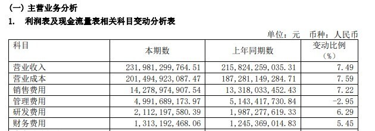
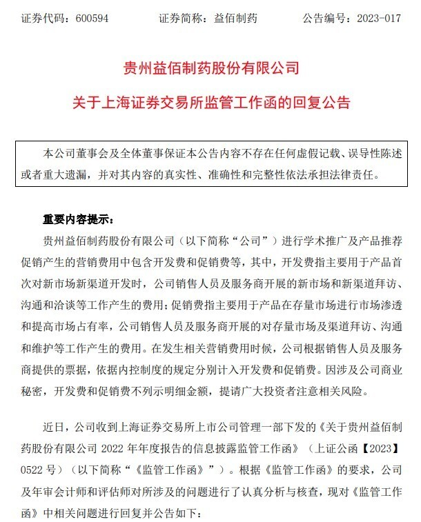
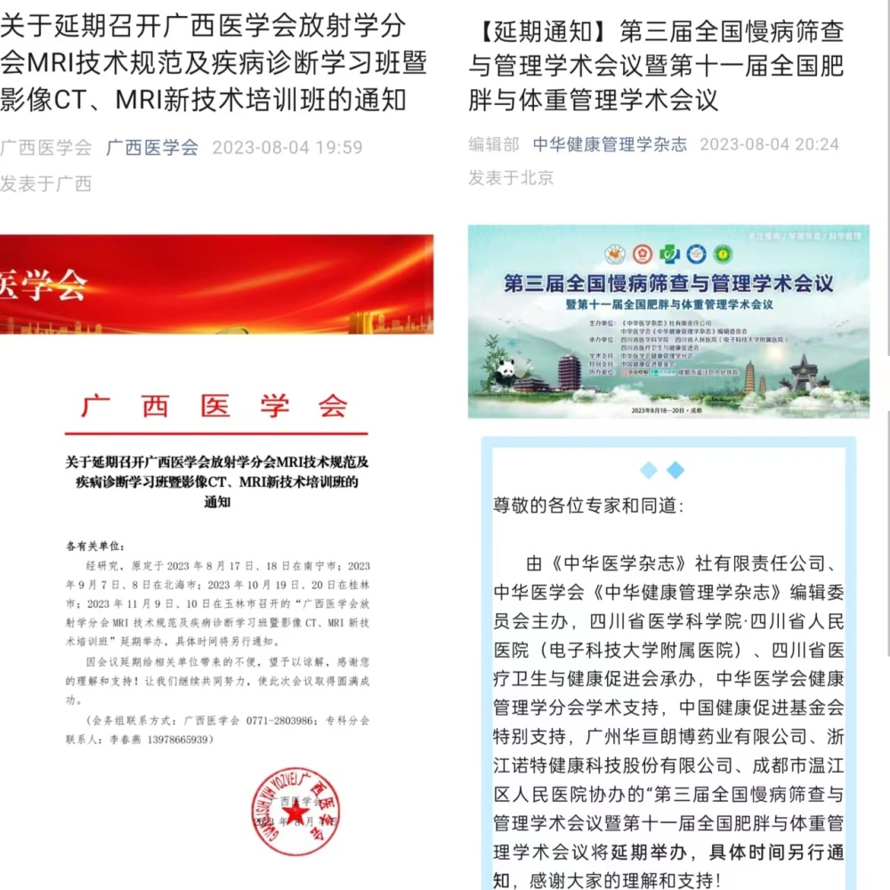

# 一年花掉3200亿元，医药企业的高额销售费用最终去了哪

中新网8月17日电(中新财经
左雨晴)“去年年报显示公司销售模式以学术推广为主，销售费用高达2.67亿。请问其中学术推广会用多少亿？”“如此高的销售费用占比会不会成为反腐重点对象？”

随着医药反腐持续推进，医药企业的高额销售费用受到广泛关注，也成为了高悬在企业头上的“达摩克里斯之剑”。那么，医药企业的销售费用中究竟有什么“猫腻”？最终去了哪？

**一年花掉3200亿元**

**近40家上市医药企业销售费用占总营收比超50%**

中新财经根据公开数据梳理，A股市场中医疗保健类企业共有502家，剔除今年上市的5家，其余497家医疗企业2022年花掉的销售费用为3248.91亿元，平均每家公司花费约6.54亿元，远高于整A股的平均销售费用率。

在这些A股上市医药企业中，近40家2022年的销售费用占营收比重的50%以上。其中亚虹医药、迈威生物、盟科药业销售费用率超过100%。

而在40家待审核的IPO企业中，津同仁、百神药业、科瑞德、赛克赛斯、锦江电子、卓谊生物、欣捷高新7家公司2022年销售费用占营收比例在40%以上。

_上海医药2022年财报显示，报告期内其销售费用为142.79亿元。_

从销售费用总金额来看，超过30亿的公司达到26家。其中，上海医药、复星医药、步长制药、恒瑞医药、华东医药的销售费用位居前列，分别为142.79亿元、91.71亿元、74.84亿元、73.48亿元、63.35亿元。

多家医药企业财报显示，在这些数十亿甚至上百亿的销售费用中，占比最高的是“市场推广费及维护费”、“市场、学术推广费及咨询费”等类似项目。

2022年11月，市场监管总局曾指出，随着对商业贿赂案件查处力度不断加大，一些医药企业采取更为隐蔽、复杂的手段，为其贿赂行为披上“合法外衣”。而赞助科研经费、学术会议费，就是不法利益输送的手段之一。

**一年1300余场会议**

**多家医药企业因销售费用遭问询**

在医药反腐风暴下，广誉远、沃森生物、ST天圣、一品红等多家医药企业近日被投资者询问高额销售费用事宜。

实际上，此前就有多家企业因高额销售费用收到监管函。

2022年，老牌中药企业广誉远收到上交所年报监管函，要求其说明在销售人员人数未有较大变化的情况下，销售费用与营业收入变动方向不一致的原因及合理性等。

广誉远2021年年报显示，其销售费用达7.82亿元，创历史新高。相较2021年半年报时新增5.46亿元，且在全年营业收入同比下滑23%的情况下同比增加35.29%。全年销售费用率为91.57%，同比增加38.92个百分点，远高于中药行业平均水平，而公司销售人员人数同比未有较大变化。销售费用的主要构成为市场推广费、广告费和职工薪酬。

2023年5月，四环生物收到深交所年报问询函，因其报告期内广告宣传推广费金额为1.16亿元，在销售费用中占比达到92.54%，被要求说明广告宣传推广费的明细情况，以及公司是否存在为他方垫付资金、承担费用等变相利益输送情况。

_益佰制药回复上交所年报监管函。_

2023年6月，益佰制药收到上交所年报监管函，被要求补充披露销售费用前五大支付对象；学术推广、营销平台建设等市场费用主要核算内容明细情况；销售费用支付对象中是否涉及公司经销商、关联方或其他利益相关方等相关信息。

益佰制药年报显示，公司2022年销售费用 11.96
亿元，销售费用率为43.72%，处于中药行业较高水平。销售费用的主要构成为学术推广、营销平台建设等市场费用，发生金额8.33亿元，占比为69.65%。

益佰制药在回复中披露，公司2022年通过线上、线下、线上与线下相结合的方式，共开展学术会、科室会、内训会等推广会议1300余场、线下累计参会人数12万余人。其中，学术会(专家、医生等参与的学术交流会议)700
余场，科室会(医药代表与医生交流、介绍公司产品相关信息)600余场；内训会(销售人员内部培训)80场。

值得一提的是，贵州省贵阳市中级人民法院此前公布的判决书显示，原益佰制药实控人窦啟玲曾向原贵州省食药监局医疗器械处副处长、药品注册处处长罗某行贿100多万元。

**争议漩涡中的学术会议：**

**学术回归本质 也不应过度妖魔化**

部分医疗学术会议成为企业不法利益输送的外衣，也让学术会议本身陷入争议。近期，部分学术会议宣布暂停或延期举办，也引发了社会关注。

_部分医药领域学术会议的举办方发布相关学术会议延期的公告。_

此前，有专家向媒体表示，学术会议是除医疗机构和医药企业之外的另一大调查重点，且由于“红线”和“越界”的行为判定标准还不明确，相关学术会议的组织者和拟参与者都不能保证没有任何风险，自然就想着不要在这段时间“抛头露面”了。赞助会议的企业或基金会也会开始退缩，所以就出现了延期现象。

15日，国家卫健委发布全国医药领域腐败问题集中整治工作有关问答。其中提及，注意到了媒体反映一些学术会议在医药领域反腐的形势下宣布暂停、延期，同时也了解到一些学术会议正常进行、未受影响。

答问指出，
**医药行业的学术会议是学术交流、经验分享、促进医药技术进步和创新发展的重要平台，按照国家有关规定，规范开展的学术会议和正常医学活动是要大力支持、积极鼓励的**
。需要整治的是那些无中生有、编造虚假学术会议的名头，进行违法违规利益输送，或者违规将学术会议赞助费私分的不法行为。

在力度空前的医药反腐背景下，外界期盼医疗学术会议正本清源，回归学术的本质与初心；医药企业摆脱销售费用的沉重负担，回归创新能力和产品力的良性竞争。(完)

