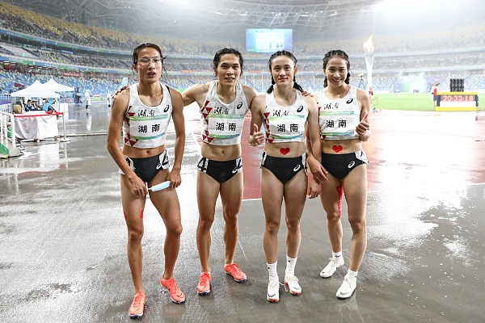
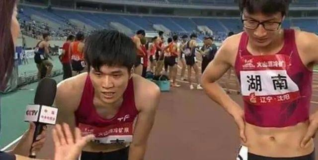
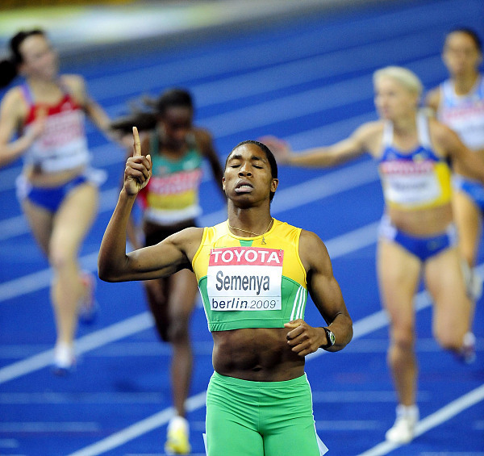

# 世界田联强化性别认定标准 有中国女选手受到牵连

 _童曾欢（左一）、廖孟雪（左二）_

今年3月24日，世界田径联合会召开会议，强化了对变性人、性别不明、性别争议人士参加田径比赛的标准。此外世界田联对女性选手的睾丸激素订立了新标准。这也导致个别中国田径女选手，近期已无缘国家级赛场。

据悉，世界田联理事会决定，从2023年3月31日起，作为男性经历青春期后才变性选手的，即经过第二次性征的MTF（Male to
Female：出生性别变性为男性或女性的人）变性选手，将排除在女子组国际大赛之外。

另外，世界田联还强化了被称为“DSD选手”（性别发育差异）的参赛标准。此前，联盟将400米、400米栏、800米、1500米、1英里（1.61公里）女子组比赛的参赛标准定为睾丸激素5nmol/L以下。这一标准曾被认为是不公平的。因为普通成年女性的睾丸激素水平为0.12~0.179nmol/L，男性则为7.7~29.4nmol/L。

从本月31日开始，新规定要求女子组的所有项目参赛者，必须保持24个月的睾丸激素水平，在2.5nmol/L以下才能参赛。根据世界田联新规定，今年6月，中国田径协会颁发了462号文件，要求各省体育中心严格进行血睾酮检测，超标的运动员不得参加国家级比赛。

世界田联新规让几位中国选手受到牵连。比如曾经在2019年第十九届全国大学生田径锦标赛女子百米比赛中跑出11秒的廖孟雪和女子400米新锐童曾欢，近期未能出现在包括全国田径冠军赛、全国田径锦标赛、亚洲田径赛等大赛舞台。

在2020年全国田径冠军赛上，廖孟雪和童曾欢分别以53秒25和53秒35的成绩获得女子400米的金银牌，两人的成绩比第三名快出了2秒多。在2020年浙江绍兴举行的全国田径锦标赛，廖孟雪以11秒53获得女子百米第二名。廖孟雪和童曾欢还参加了湖南女子接力队，在女子4X400米接力赛中夺得冠军。廖孟雪200米的世界田联最高排名为第200名，400米最高排名为第162名；童曾欢200米最高排名第190名，400米最高排名第114名。单目前两人在世界田联的排名和成绩均已被移除。截至目前，中国田径协会并未对两人因何种原因无缘全国比赛做出说明。

在世界田径界，最具代表性的双性人选手就是南非的塞门娅。塞门娅的睾丸激素水平为7-10nmol/L，接近男子普通人的底线。根据规定，塞门娅可以参加400米以外、超过1英里的项目，但现在要想参加国际比赛，就必须抑制睾丸激素。

塞门娅曾在2012年伦敦奥运会和2016年里约热内卢奥运会上获得女子800米金牌。此后她将项目改为5000米，但未能通过2020年东京奥运会达标资格线。

文/北京青年报记者 褚鹏

编辑/褚鹏

