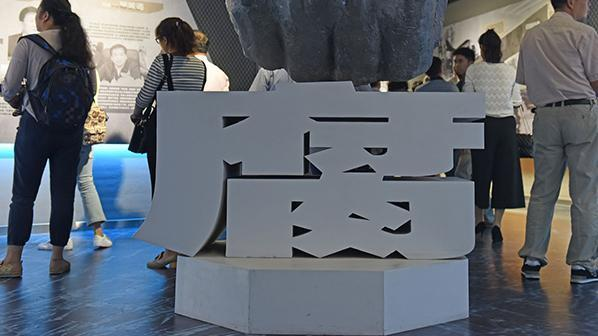
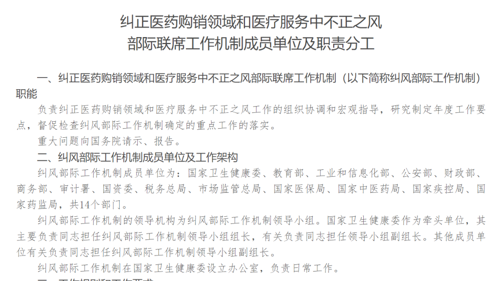

# 从局长死刑、30亿罚单，到史上最强风暴：医药反腐二十年如何走向深入

7月以来，被称为“史上最强”的反腐风暴席卷整个医药行业。而这场风暴的前传，至少可以追溯到近二十年前。

说起印象最早或最深的医药反腐时间节点，多位医药行业人士向澎湃新闻记者提到2005年：这一年的5月，美国德普公司因在中国的子公司向中国的医疗机构和医生行贿，被美国监管部门处以479万美元罚款；同年6月，原国家食药监总局局长郑筱萸被免职，第二年底，这位前局长因涉嫌收受贿赂被“双规”。

如果从2005年算起，十多年以来，药监部门架构几经调整，反腐举措也在不断加码：两票制、药品集中带量采购、国家医保谈判等顶层设计先后落地，不断挤压医药腐败的空间；原食药监局长落马、跨国药企30亿罚单、公立三甲医院骗保被罚6000万等典型案例，至今令业内人士印象深刻。

纵观这些年医药反腐历程，“打老虎”或“拍苍蝇”之外，整个医疗体制的改革也逐步走向深入。有专家向澎湃新闻记者指出，要想解决医疗领域的腐败问题，就必须进行改革，改革医疗体制，完善相关制度和监管机制，从根本上解决问题。

**医药反腐大幕：原食药监局长落马**

医改专家、陕西省山阳县卫生健康局原副局长徐毓才对国内医药反腐的最早印象是在2006年，他向澎湃新闻记者介绍，当时自己在医院分管药品耗材采购等工作，彼时医院开会要求，如果有不当收入，可以主动退还，与当前医院系统的自查自纠颇为相似。

改革开放前，医药产业由政府统一管控，所有药品实行统购统销，所有流通渠道均为国有企业所掌控；改革开放后，医药生产、流通等环节逐渐开启市场化进程，而市场化环境中的反腐行动也逐渐走上前台。

目前，国家药监局官网能搜到的最早医药反腐文件是当时6部门共同发布的《
2000年纠正医药购销中不正之风工作的实施意见》，其中提到，清理整顿药品市场价格，进一步降低企业自主定价药品的“虚高”价格和部分政府定价药品的过高价格。

 _来源：国家药监局官网_

这一时期的经典反腐案例中，不少业内人士对一张美国的罚单印象颇为深刻。2005年5月20日，美国监管部门决定对美国德普公司处以高达479万美元的罚款，原因是从1991年到2002年的11年间，德普公司在中国天津的子公司，向中国的医疗机构及医生进行了现金贿赂，总额达162.3万美元，而德普公司从中赚取200万美元。

德普案一个多月后，另一场真正触动中国医药行业深层次变革的反腐行动也拉开帷幕。2005年6月22日，年满60岁的郑筱萸被免去国家食药监局局长、党组书记职务。2006年12月，因涉嫌受贿，郑筱萸被立案调查；2007年7月10日，受贿649万、滥发药品文号的郑筱萸因受贿罪、玩忽职守罪被执行死刑。

新华社曾发文表示，作为首任国家药品监督管理局局长、国家食品药品监督管理局局长，郑筱萸却以权谋私、收受巨额贿赂，忽视了肩上的千钧重担——十几亿中国人的用药安全。

2005年8月，中央部署开展治理商业贿赂专项工作，并成立中央治理商业贿赂工作领导小组，之后《关于开展治理商业贿赂专项工作的意见》出台，对治理工作作出了总体部署，医药购销就在六个重点领域中。

**法律明确：反腐量刑有依据**

医法汇创始人张勇律师至今印象深刻的国内医药反腐案件，是2013年的葛兰素史克行贿案。他认为，该案当时在国际上也产生了很大影响，不仅开了巨额罚单，相关被告人还被判刑，这个案子放到现在也非常有借鉴意义。

2013年7月，公安部首次向社会公开葛兰素史克（中国）投资有限公司的部分高管涉嫌严重经济犯罪，被湖南长沙、上海和河南郑州等地公安机关依法立案侦查的消息。2014年，GSK因行贿受贿案被判处罚金30亿元，这是当时中国开出的最大罚单，马克锐等被告人被判处有期徒刑二到三年。

GSK天价罚单的另一个背景是医疗反腐逐渐从监管部门行动上升到法律层面。

2008年11月20日，“两高”发布的《关于办理商业贿赂刑事案件适用法律若干问题的意见》第4条规定明确，医疗机构中的国家工作人员，在药品、医疗器械、医用卫生材料等医药产品采购活动中，利用职务上的便利，索取销售方财物，或者非法收受销售方财物，为销售方谋取利益，构成犯罪的，依照刑法第385条规定，以受贿罪定罪处罚。

上述意见还提出，医疗机构中的医务人员，利用开处方的职务便利，以各种名义非法收受药品、医疗器械、医用卫生材料等医药产品销售方财物，为医药产品销售方谋取利益，数额较大的，依照刑法第163条的规定，以非国家工作人员受贿罪定罪处罚。

2023年7月25日，刑法修正案（十二）草案提请十四届全国人大常委会第四次会议审议。张勇向澎湃新闻记者介绍，初次审议的《刑法修正案（十二）》草案加大了对行贿犯罪的惩治力度，草案增加规定，对多次行贿、向多人行贿，在食品药品、教育医疗等领域行贿等六类情形从重处罚。同时，增加了惩治民营企业人员腐败相关犯罪的条款。

“原来的医药反腐只有政策性的文件，但定罪量刑还要在刑法等法律范围内。”张勇认为，医药领域带金销售问题长期存在，如果修正案顺利通过，可以预见对医疗行贿方的处罚力度肯定会加强。

**反腐升级：14个部门联合反腐，医保局加入**

改革开放以来，医药监管部门多次调整，如1978年，我国成立药品监管总局，直属国务院，直到2018年，设立国家药品监督管理局，划归新成立的国家市场监督管理总局，前后历经八次变迁。

监管部门的变化，医药反腐也随之呈现不同的特点。中国贸易促进委员会全国企业合规委员会专家丁继华指出，过去的医药反腐主要由卫生部门来推动，但随着改革的深入，惩治力度的加大，开始联合执法，多头惩治，对处罚对象也采取穿透式的执法方式，医药反腐呈现系统化的治理特点。

从2023年这场反腐风暴来看，参与医药反腐的部门不断增加。5月10日，国家卫健委官网发布的《关于调整纠正医药购销领域和医疗服务中不正之风部际联席工作机制成员单位及职责分工的通知》解读提到，《通知》的重点是对纠风部际工作机制成员单位进行了调整，由原来的9个增加到14个部门，国家卫生健康委为牵头单位，成员单位包括教育部、工业和信息化部、公安部、财政部、商务部、审计署、国资委、税务总局、市场监管总局、国家医保局、国家中医药局、国家疾控局、国家药监局。

 _来源：国家卫健委官网_

张勇向澎湃新闻记者表示，从7月21日卫健委的部门会议到7月28日的中纪委会议部署，各个部门都配合起来，都动起来了，这也是大家认为此次是史上最强的一个重要原因。

在上述部门中，国家医保局挂牌成立于2018年3月，将此前分散在多个部委的城镇职工和城镇居民基本医疗保险、生育保险、新农合等职责整合到国家医保局，负责国家医保基金政策制订、统一管理。北京大学中国健康发展研究中心主任、权威医改专家李玲曾在接受媒体采访时评价，国家医保局成立是医改非常重要的体制机制的改革。

从公开资料来看，医保局的反腐举措更为雷厉风行。

早在2019年，针对药价虚高问题，财政部就会同国家医保局对77家医药企业实施了会计信息质量检查，检查聚焦医药产品成本费用结构，摸清药价虚高成因。2021年4月，财政部发布会计信息质量检查公告称，对财政部有关监管局检查的19家医药企业作出行政处罚，其中涉及步长制药、豪森药业、礼来、赛诺菲等多家知名药企。公告显示，被处罚的19家医药企业存在使用虚假发票、票据套取资金体外使用，虚构业务事项或利用医药推广公司套取资金，账簿设置不规范等违规行为。

2022年4月20日，国家医保局对外发布消息，国家医保局根据举报线索，联合国家卫生健康委、市场监管总局，对华中科技大学同济医学院附属同济医院进行飞行检查，发现2017年1月至2020年9月期间，同济医院存在串换、虚记骨科高值医用耗材问题，骗取医保基金支付2334万元，最终该院被罚合计5924万元。相比30亿的药企罚单，5900万的罚单不算大，但由于处罚对象是公立三甲医院，同样引发行业关注。此次“史上最强”的医药反腐风暴中，国家医保局的飞检工作也在同时进行。

7月15日，国家医保局联合财政部、国家卫生健康委、国家中医药局印发了《2023年医疗保障基金飞行检查工作方案》，明确今年检查范围为2021年1月1日-2022年12月31日期间医保基金使用和管理情况，必要时检查组可追溯检查以前年度或延伸检查至2023年度，计划在2023年8-12月份完成现场检查工作。也就是说，飞行检查工作自8月1日已经正式开始，将至少倒查两年。

**医药反腐如何有效进行？**

8月15日，国家卫健委发布的《全国医药领域腐败问题集中整治工作有关问答》提到，实现医药领域腐败问题治理系统化、规范化、常态化。医药反腐关乎民众健康，关于健康中国战略，但类似近期的反腐是否将常态化延续下去，业内有不同的声音。

张勇向澎湃新闻记者指出，可能还有企业存在侥幸心理，认为此次反腐风暴只是一吹就走的台风，熬过这一阵就好了，实际上，未来医药反腐很可能像集采、医保谈判一样成为行业常态。像近期这样紧张的医药反腐氛围或许很快会过去，但未来反腐或将常态化。

医疗战略咨询公司Latitude
Health创始人赵衡认为，关键还是制度化问题，“一个是药企给医生的收入阳光化，一个是建立明确的规则，确定什么样的费用是不能发生的，监管给医疗机构和医生划线。合规的前提是建立制度化的监管机制，否则合规的边界很模糊。”

“如果反腐败作为一种运动，没有从根本上去思考这个行业里边的问题，就好像这个人发烧以后吃退烧药，实际上可能应该用抗病毒药。”徐毓才向澎湃新闻记者表示，如果能从反腐中去完善和建立医疗系统的长效机制或制度，才更有价值。

北京大健康法商团队负责人邓勇教授指出，医药反腐与医改密切相关，在当前的医疗体制下，由于资源分配不公、监管不力等问题，导致了医疗领域的腐败现象层出不穷。要想解决医疗领域的腐败问题，就必须进行改革，改革医疗体制，完善相关制度和监管机制，从根本上解决问题。

邓勇进一步指出，医改也需要考虑如何防止腐败问题的再次发生。在改革过程中，应该注重制度建设，建立健全的监管机制，提高医疗领域的透明度和公开度，加强对医疗资源的管理和监督，确保资源的公平分配和合理使用。

