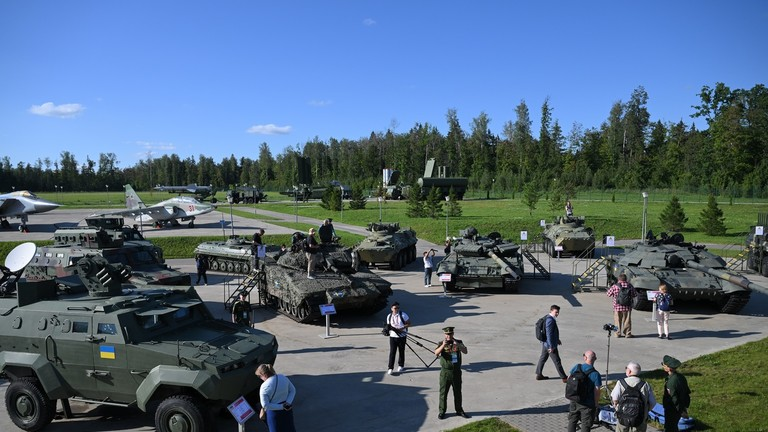
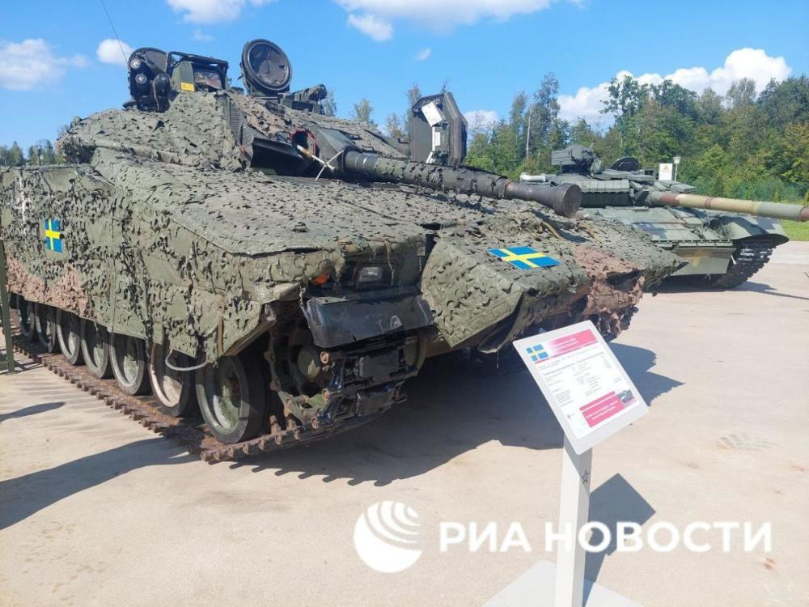
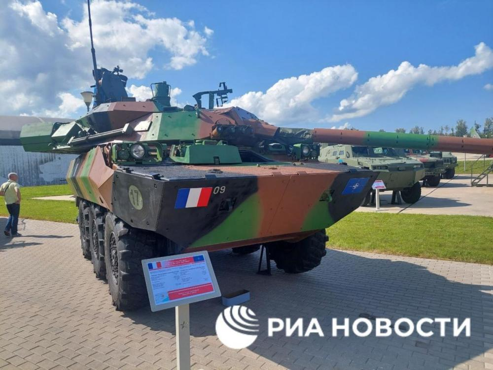

# 俄媒：俄在公园里展示870多种缴获的乌军装备，包括西方装甲车

【环球网报道 见习记者
黄泽佳】据“今日俄罗斯”（RT）网站当地时间16日报道，俄罗斯国防部在莫斯科以西的“爱国者公园”展出了870多种俄军在乌克兰战场上缴获的乌军装备，其中包括美国、英国及瑞典等西方国家制造的装甲车。

 _俄国防部在“军队-2023”上展出的缴获装备 图源：“今日俄罗斯”电视台网站_

报道称，俄国防部展示的这些缴获装备大多为乌军使用的苏制装备及苏联解体后在乌本土制造的装备。除陆军装备外，俄国防部还展示了在黑海港口城市马里乌波尔缴获的几艘巡逻艇。此外，俄国防部还展示了俄军缴获的瑞典制CV90-40步兵战车、美制M113装甲车、澳大利亚“大毒蛇”装甲车、法制AMX-10RC轮式突击炮、英国“獒犬”防雷车及“哈士奇”战术突击装甲车等装备。俄媒称，这一展览是“军队-2023”国际军事技术论坛活动的一部分。

_俄军缴获自乌军的瑞典CV90-40步兵战车与法制AMX-10RC轮式突击炮 图源：俄新社_

 _俄军缴获自乌军的瑞典CV90-40步兵战车与法制AMX-10RC轮式突击炮 图源：俄新社_

“今日俄罗斯”还提到，俄罗斯国防部声称，乌军自6月初发动反攻以来已经损失了约5000件重型军事装备，俄军还多次发布缴获乌军装甲车辆的视频，包括“豹-2”坦克在内的西方军事装备均有被俄军缴获的记录。

