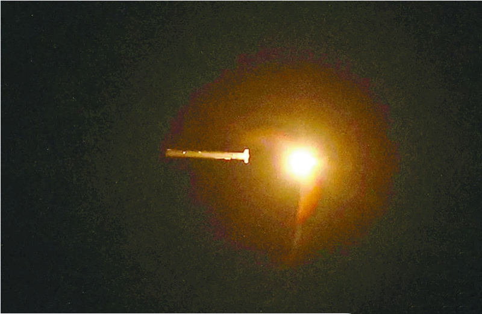

# 号称最大射程1000公里，台“雄风-2E”巡航导弹近20年来首次露面

【环球时报综合报道】“雄风-2E”巡航导弹多年来被台军当作“反击大陆”的撒手锏武器，一直处于高度保密状态，就连外形都从未公布。台湾《联合报》16日称，台军当天在拂晓前的黑暗中试射了一枚“雄风-2E”导弹，这也是它服役近20年来首度曝光。

_“雄风-2E”巡航导弹的飞行场景。（台湾《联合报》）_

报道称，台军16日在屏东九鹏基地实施精准弹药射击测考。清晨4时许，“雄风-2E”巡航导弹从该基地起飞，“在地面可目视其火箭助推器脱落”。据了解，该导弹随后顺利启动涡扇发动机展开巡航，“顺利飞行了一个多小时，达成预期验测目标”。

据介绍，目前台军拥有射程600公里的“雄风-2E”以及射程超过1000公里的增程型“雄风-2E”巡航导弹。两者代号分别为“雄升”及“雄隼”。“但因保密之故，台军将已部署的‘雄升’与‘雄隼’导弹对外都一体称之为‘雄升’”。报道称，台军并未披露本次试射的是否为增程型“雄风-2E”，但这已经是“雄风-2E”巡航导弹服役近20年来，发射画面首度曝光。

台媒此前报道称，早在上世纪90年代，李登辉当局就编列预算开始研发“雄风-2E”巡航导弹，其间还一度因系统整合上的问题导致测试失败，直到2008年该导弹才通过测评开始量产。台军曾宣称，“该导弹使台湾首度具备对大陆纵深战略打击的能力，包括广州到上海一线战略目标都在打击范围内”。但大陆专家认为，该导弹属于亚音速巡航导弹，整体性能已经落后，拦截难度不大。而且“雄风-2E”虽然号称最大射程1000公里，但台军缺乏远程打击需要的战略侦察、中段制导等关键技术，实际威胁很有限。（马俊）

