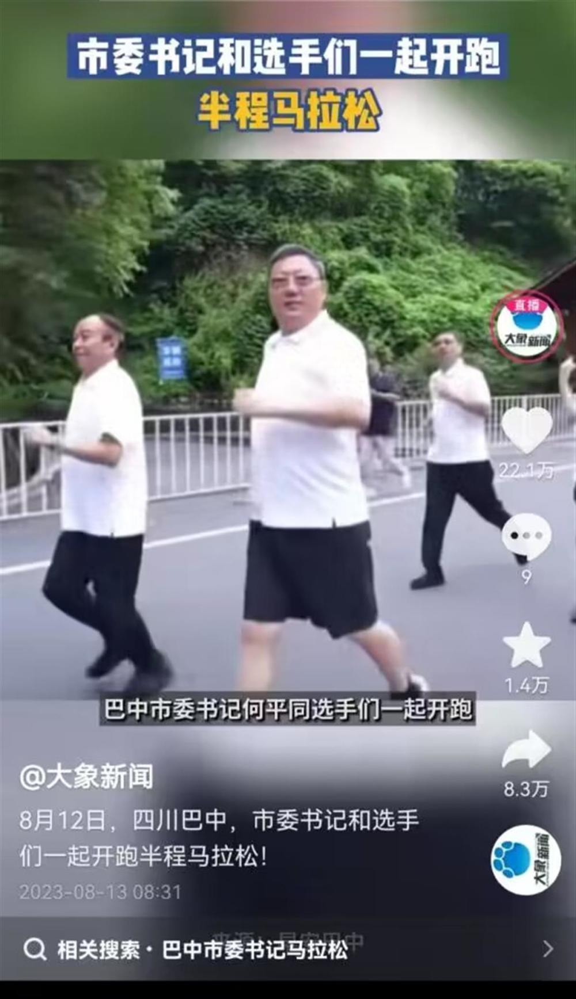

# 四川巴中市委书记跑马拉松视频获评11万条，官方：没有“跟帖任务”

据澎湃新闻8月17日报道，近日，一则四川省巴中市委书记和选手们一起跑马拉松的视频引发关注。网上所传视频截图显示，相关视频下的留言数达11.2万条。有网友怀疑是不是有组织的跟帖行为。对此，当地回应称，没有“跟帖任务”，可能是本地人关心当地发展，自主关注。

 _巴中市委书记跑马拉松视频引发关注（来源：澎湃新闻）_

极目新闻注意到，网络上流传的视频留言截图显示，有留言写道：“领导这一次跑步，不仅仅是跑马拉松，更是跑出了全市前进的方向。”“这一跑，跑的是干净利索，无惧风雨，更是面对困难迎难而上的一场奔跑。”“何书记作风硬朗，步伐沉稳，处处体现了担当精神。”“左顾右盼是对民情的观察，抬头挺胸是对未来有信心。”这类留言引来网络关注，有网友质疑是在吹捧。

_网上所传的视频中留言引发质疑（来源：视频截图）_

在8月13日媒体编发的一则“市委书记和选手们一起开跑半程马拉松”的视频上，极目新闻注意到，该视频的点赞数达22万条，收藏数达1万多条，转发数达8万多条，但公开显示出的留言数仅为10条，推测可能存在删除留言或隐藏留言的现象。

_媒体8月13日编发的一则视频点赞数达22万条，留言数仅为10条（来源：视频截图）_

8月17日上午，当地回应了媒体记者“有网友说是不是下达了什么跟帖任务”的提问。巴中市政府办公室一位工作人员表示，没有下跟帖任务，我们也看到了相关留言与反映，跟帖者多是本地人，应该是关注本地发展，自主点赞关注。

_当地回应称没有下跟帖任务（来源：澎湃新闻）_

巴中市委宣传部办公室一位工作人员同样表示，没有跟帖任务，可能是自发的留言。

另据8月13日《巴中日报》报道，12日，2023第三届“巴山蜀水·运动川渝”体育旅游休闲消费季暨“成渝体育产业联盟杯”四川光雾山夏季森林半程马拉松“跑遍四川”（巴中站）开幕式在光雾山景区举行。8时许，随着发令枪响起，何平等领导、嘉宾领跑了全长约5公里的迷你跑线路，和来自全国各地的5000余名马拉松爱好者一同用脚步丈量光雾山之美。

据介绍，巴中区位优势独特，人文底蕴厚重，生态环境优美。近年来，先后举办了中国龙舟公开赛、全国旅游城市定向系列赛等体育盛会，吸引了社会各界广泛参与，极大地增强了人民群众的获得感、幸福感、认同感。

公开资料显示，何平，男，汉族，1964年1月生，西南财经大学经济学学士，电子科技大学工商管理硕士，现任四川省巴中市委书记。有网友说，何平以年近六旬的年纪，能够与选手们一起跑上一程，算是不错的，不必为此说风凉话。

极目新闻注意到，市委书记跑马拉松也不罕见，近年在四川广安、江苏盐城、河南长垣等地举行的马拉松赛事上，都有当地市委书记现身，与选手们一起跑马拉松。

极目新闻综合澎湃新闻、巴中日报、网友评论

（来源：极目新闻）

