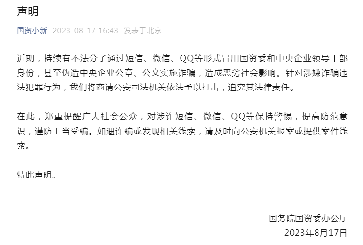

# 国务院国资委声明：有不法分子冒用领导干部身份诈骗，将追究法律责任

来源：国资小新

国务院国资委办公厅发布声明：

近期，持续有不法分子通过短信、微信、QQ等形式冒用国资委和中央企业领导干部身份，甚至伪造中央企业公章、公文实施诈骗，造成恶劣社会影响。针对涉嫌诈骗违法犯罪行为，我们将商请公安司法机关依法予以打击，追究其法律责任。

在此，郑重提醒广大社会公众，对涉诈短信、微信、QQ等保持警惕，提高防范意识，谨防上当受骗。如遇诈骗或发现相关线索，请及时向公安机关报案或提供案件线索。

特此声明。

国务院国资委办公厅

2023年8月17日

