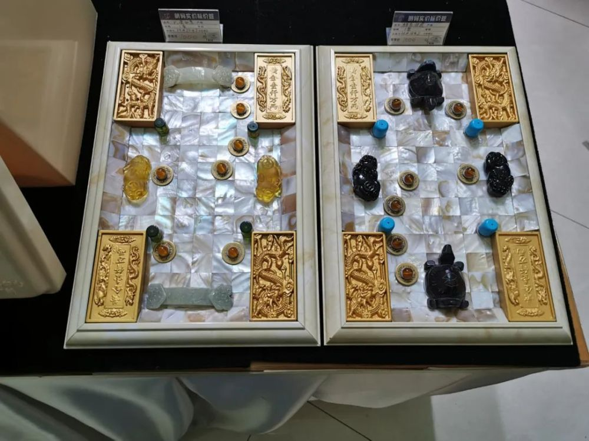
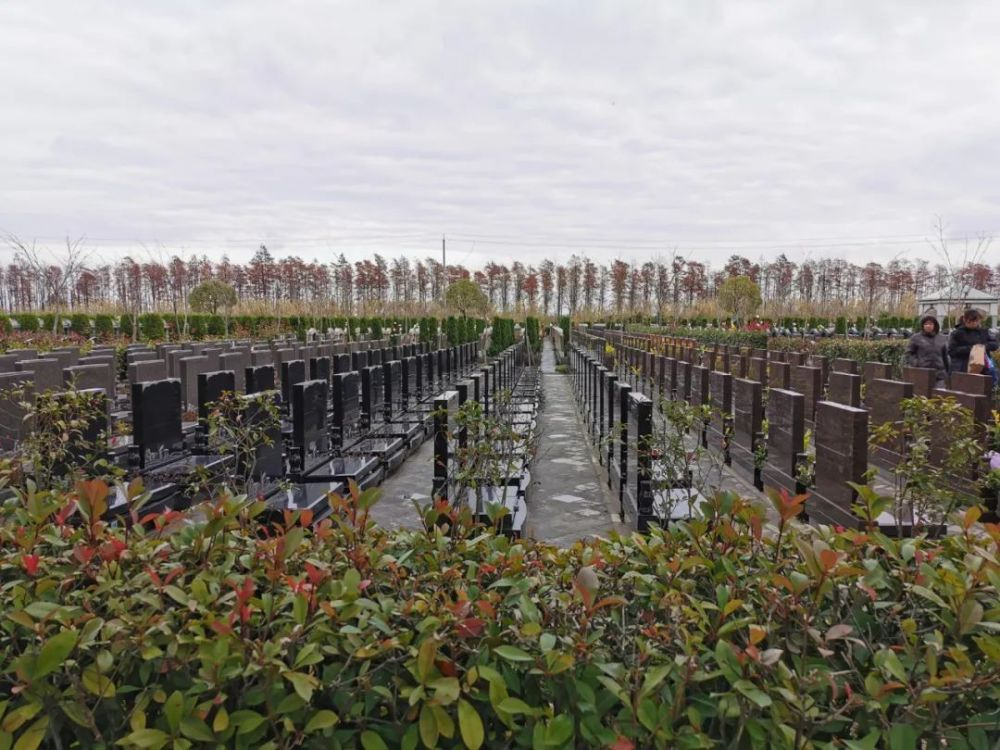

# 太平间里，一门关于遗体的生意

**文|** 张宇

**编辑|** 王一然

**太平间里的生意**

之前，我在崇明老家参加白事，大家都直接在自家宅基地上操办，做道场、吃席。但在上海市区，人一般会在医院去世，遗体从病房转到太平间，然后被运往殡仪馆和墓地。

我实习的这家殡仪公司，在一家三甲医院承包了护工和太平间业务。两个业务分别站在死亡界线的两边，互相配合，这让太平间里的生意，开始于死亡之前。

护工很多时候是种情感劳动，不仅要照顾病患，擦身体、清理排泄物，还要和家属打交道。不能问病人病的多重、什么时候死，而要说“你们对老人很好，专门请了我们照顾”。多谈亲属对临终者的关怀和孝道，对方就会自然而然透露家庭关系、经济状况。

曾有位74岁的上海本地阿婆去世，在太平间工作的同事阿发和徒弟阿财穿上白大褂，拿起医用担架和裹尸袋，前往病房。照顾阿婆的护工告诉阿发，这家有一子二女，儿子在事业单位上班，收入稳定、肯花钱，人也好说话。

阿发找到这家的儿子，说太平间不干净也冷清，给阿婆换身寿衣更显尊重。对方没怎么犹豫，挑好一身红色中式寿衣，接着付款了。等护工给遗体擦身、换衣后，阿发阿财和家属一同将遗体运送到太平间冷藏。然后他们把亲属请到业务洽谈室，推荐购买了一套治丧礼仪用品，其中包括灵堂布置、骨灰盒、鲜花、锡箔等。

当时入职面试时，副总经理说殡葬几乎没人讲价，两万块的一条龙服务基本都是一口价，不然会有些丢脸。

在太平间做生意，技巧就是把对方放在道德高地，（和对方）说家里亲人走了，出于孝道，得（办得）体体面面的。套餐里一个成本价三块的口器（放在死者口中的礼器），只要对方有钱，或者对逝者感情深，那就可以开高一点，当然不能（高得）太夸张。

_●殡仪用具里的随葬品_

家里条件不太好是能直接看出来的。有个外来务工者，大夏天在工地突然生病去世。儿子和儿媳从外地赶过来，对两万块的服务套餐面露难色。推销的同事知道这单生意没什么好做的，宁愿降价快点了事。

告别室也是个盈利点。这家医院太平间环境不好，位于地下一层，毛坯库房风格，光线昏暗没有窗，空气中充斥着福尔马林味，人好像变成了一块肉，被放在冷冻柜里。

很多亲属看到太平间环境，很难把刚去世几小时的亲属放进去，于是公司建了一些环境比较好的告别室。普通停尸房能免费停放24小时，超过后一天收费几十块，豪华告别室一天就要一两千。

所谓豪华其实就是稍微有点“人”的气息：木质装修、打扫整洁，有雕花供桌、椅子，还有仙鹤西去的字画。最重要的是，被放入停尸房的遗体是冷冻状态，人放进去再拿出来，像冰锥一样非常硬，告别室里的冷藏柜能把遗体保存得比较正常。员工会在这时过来道德劝说，强调“太平间不干净，停放着很多遗体，可以再租个告别室清静”。

公司一位高层曾经说，我们需要“获客”，也就是找到遗体。当时这两个字对我冲击非常大，这是完全市场化的思路。

殡仪公司与民政部门的殡仪馆之间有竞争关系，谁先接触到遗体和家属，谁就有优先的商业操作权。城市里的遗体是一种卫生安全隐患，一个人从去世到火化，一般就两三天，医院只照顾生者，管理死者的民政部门短时间内又没法及时衔接。

遗体进入“两不管”的真空地带，承包太平间的殡仪公司就能占据先机，推销产品，垄断后续生意，只给殡仪馆留下追悼会和火化这两个盈利空间。

不是所有家属都信任太平间里的人，但他们有对策，比如在腾挪遗体时，提前把裹尸袋反套在担架四角，做好准备工作，不磕碰、不劳烦遗体，搬运前后都恭敬地三鞠躬。太平间墙上贴着“工作人员坚决不收受红包”的标语，有家属给红包都会拒绝。

这种专业性其实也是种“伪装”。同事和我讲，这个工作有点像酒店里打扫卫生的人，角角落落到底都打扫了没有？肯定没有，但面上的灰要擦掉。把遗体装到袋子里这个动作很直观，在家属看得到的地方，最明显的几个动作不出差池，就能获得信任。

而且民营殡仪公司没有专业资质，严格来讲，擦身和穿衣等专业动作需要殡仪馆专业人士操作。所以太平间里的核心任务其实就是推销生意，这也是专业性服务的目的。

太平间是这家公司最重要、利润最多的业务。但他们很拼，想冲破关系网，去社区、养老院这些地方开拓业务，提前部署。

这是一个隐秘的等待过程，因为这些空间中都是活着的人，你表现出来自己是一个殡仪公司，大家会反感。所以他们到社区推销，就包装成社区志愿者，探望老人，和社区建立联系。

面对潜在客户，他们必须等待，隐藏最直接的动机，长期追踪。这是殡葬行业很重要的点——抹掉与死亡有关的符号，披着“生”的外衣，寻找“死”了的人。

**禁忌与忍耐**

我在公司的职位是经理助理，相当于老板的秘书。入职时，另一位会算命的秘书给我算了生辰八字，这是每位职工入职时都需要有的步骤。他要了我的出生日期和手机号，算出来我命中没什么钱，因为手机号里“0”太多。还说我性格比较认真，适合文字工作。我觉得这是一套话术，我后面被安排到文字工作，后来发现，这也可能是种职场策略。

很多同事没有把殡葬行业作为自己最后的归宿，转行转业的特别多，比如有些人和医院打交道多，过段时间可能就去做医药代表了；有个同事后来还去开了餐饮店，但大多数转行都和卫生部门有关。

在这个行业，他们觉得自己被死亡“污染”，所以迷信很普遍，已经渗透到血液中了。公司里人人都带着祛灾除厄的手串，他们劝我，我就象征性也带了一个普通金镯子。

有时候我好奇同事们在遗体储藏室的工作，跟过去看，和我一起去的两个大哥他们不愿接触遗体，被分配到太平间联络员的工作也很不情愿，希望离得越远越好。

社会一直觉得这是一个充满禁忌和污秽的行业，从业者作为生者要和死者打交道，承受很大心理压力，比如阿财，他刚去太平间的时候饭都吃不下，瘦了二十多斤。有时候晚上有突发情况，觉都睡不好。

 _●某殡仪馆的接灵车_

很多人从事殡葬是因缘际会。有的家里亲戚在卫生部门，被推荐过来；驻扎太平间的同事觉得收入高，就坚持下来了。但相同的是，他们都希望和死亡撇清关系。坐办公室的员工一再强调自己不接触遗体，别人问起来就说是做咨询的，太平间里的就说自己是医院后勤。

和我关系比较好的一个女同事，是太平间的联络人。她是从河南逃婚到上海的，来这儿干了十几年，美容院、养老院都干过，后来流动到殡葬行业做了两三年。但她厌恶这行，也不理解我为什么要研究这个。当时我刚生完孩子，她问：“你做这个调查，不会影响你孩子吗？”我说我是唯物主义者。

有个姐姐在另一个二甲医院的太平间驻扎。那儿的太平间和办公室离得远，她会把办公室收拾得非常生活化，放一支香水时常喷，平时没事也不下到太平间去。她其实在有意识地把生活和工作分开，朋友圈毫无工作痕迹，展示的形象很“干净”，也希望离开这一行。

离遗体越近，逃离殡葬的心思好像就越强。毕竟这种生意需要提前部署，筹划的过程会带来道德紧张，让他们觉得是不是吃死人饭了？会不会有不好的影响？

但更多的人只能隐忍。比如常驻太平间的阿财阿发，吃住都在太平间，每天和遗体共处一室。去病房接人，是为数不多离开地下室，到地面上走一走的机会。正常人这样的生活是很压抑的。因为除了面对遗体，还要面对失去亲人的家属。

大多数家属都比较克制情绪。有一位逝者家属给我留下深刻印象，一个年轻人得绝症去世，还捐献了器官。当时他妈妈真的很悲痛，没人能劝得了。想象中，殡仪员工会心理辅导，特别是这种情绪强烈的家属。但阿发阿财不会，在短促的时间和逼仄的空间里，他们只能用夹杂权威和道德的劝说，干脆利落地推进生意，打断家属在情绪上的拖延。

**生与死**

人非草木，做这项研究，我压力其实很大。有次我做了个梦，梦里有一个人用判官一样、很森冷的口气和我讲：“你做调查，利用了这些死者，你怎么不去给他们烧纸钱？”当时我真的很害怕，因为他一下子说中了我的担忧，一种道德上的紧张。当晚我就立刻烧了两大袋纸钱。

我先生还有学术圈的朋友都很支持我，但去太平间这种事，我就不会和爸妈讲；导师最初也对这项研究有所担忧，毕竟中国人对于陌生人的死亡怀有非常大的恐惧，作为人类学学者，我们也是人，难以脱离大环境的价值观。

最重要的原因是不容易进入田野。殡仪公司我是交简历、面试进去的，但殡仪馆一般需要殡葬专业的人，我很难用制度化身份进入，只能每天到那边去，坐在里面，参加不同人的追悼会，观察家属的反应、追悼会的流程、场景的布置。把殡仪馆的每一层都走一遍、看一遍，问工作人员问题。保安会过来盯着我，但他们没法赶我走，因为我只是个文化观察者。

殡仪馆里冲突多过温情。有些遗体停了很久都没火化，基本都是遗产处理之类的家庭矛盾。殡仪馆需要承担电费这些支出，有时候家属还会借着殡仪馆的服务发泄怒火，带来很多压力。

我也天天去殡仪馆门口，和一条龙商户闲聊。扎进里面，多问多看，时间长了，就会有一些收获。比如有家卖鲜花的商户，我发现他们和殡仪馆里接灵车的司机认识，能第一时间获得业务消息。

殡仪公司的人也不会完全信任我，他们知道我是做研究的，就会很警惕。去太平间调查的机会基本靠自己争取，比如跟联络人说想给老板了解些情况，就跟着他们一起过去；太平间里，年轻的阿财刚入行，很多东西不熟练，人生经历也不丰富，有时候会把礼品单子拿给我看，说那个东西成本就三块，但我们可以卖到什么价格。

太平间是已经确定下来的业务，但怎么找医院的人、怎么走进社区，我作为外围人员接触不到。之前我用“全城猎尸”来形容这个行业，因为我看到其中的目的性和竞争性手段，说实话有些不高兴。这件事需要这么复杂吗？

很多人对于殡葬的基本认知就是殡仪馆，但他们不知道，殡仪公司在看不见的角落里，在死亡发生之前，就把很多事情安排好了。遗体的流动不是一个平滑的过程，里面充满了复杂的控制和算计。

 _●上海某墓地_

有人觉得我说的过分，是要把殡葬人都驱逐掉，这样的话谁来替我们收尸？但我没要站在殡葬行业的对立面。我介绍的主要是市场化的殡仪公司，不包括生命教育、墓地那些。而且市场化是有必要的，是理性化制度的补充。

死亡随时发生，殡仪公司可以随叫随到，不受朝九晚五工作的约束，给家属指导白事，这会带来很强的情绪抚慰。毕竟人对于死亡有朴素的情感，逝者的遗体不单纯是理性层面的细菌炸弹，它的社会文化属性还在。现代社会节奏太快，理性制度不断压缩传统的丧葬仪式，市场化因素就可以趁机填补。

没有仪式，人就没法从中理解死亡发生后的身份变化，审视社会关系的断裂。这其实是一种生命教育的缺失，容易让现代人的精神危机更严重。

公司的副总经理告诉我，他最初进公司的时候想改变这个行业，有种雄心抱负。但时间久了，他觉得还是要现实一点，关键看做生意的门道，去不断适应其中的潜规则。

现在很多年轻人说愿意投身这个行业，做出改变，我觉得很好，像遗体防腐这些技术，还有很大的发展空间。但如果纯粹因为猎奇大可不必。课程中他们没机会接触社会利益层面，之后进入行业能否保持初心很重要。

对我来说，做这个研究，让我从“死”中看到了“生”。当你看到遗体被安置的状态，就会觉得我们每个人其实没有那么重要，都是凡夫肉身，那就像存在主义的想法一样，生活本身无意义，但可以在无意义中体验生命，过好当下的每一天。

（图片均由讲述者提供）

版权声明：本文所有内容著作权归属极昼工作室，未经书面许可，不得转载、摘编或以其他形式使用，另有声明除外。

