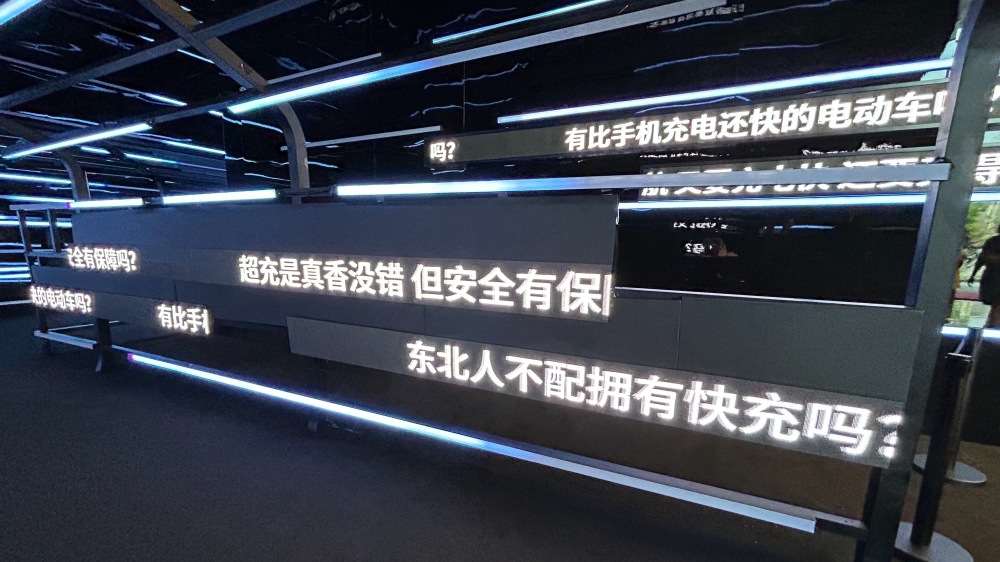
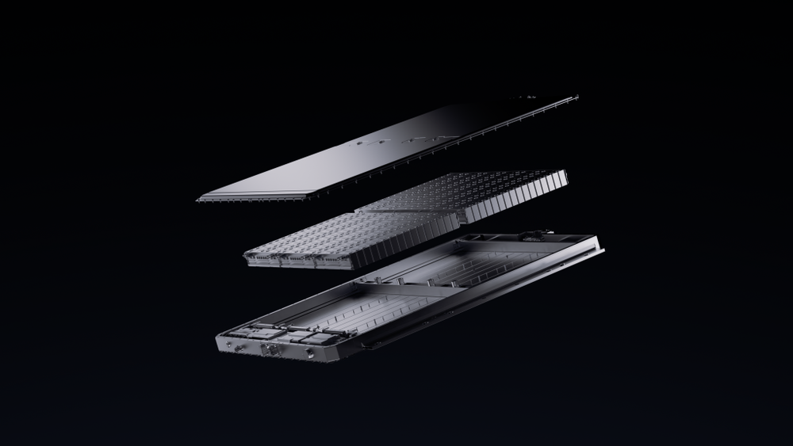
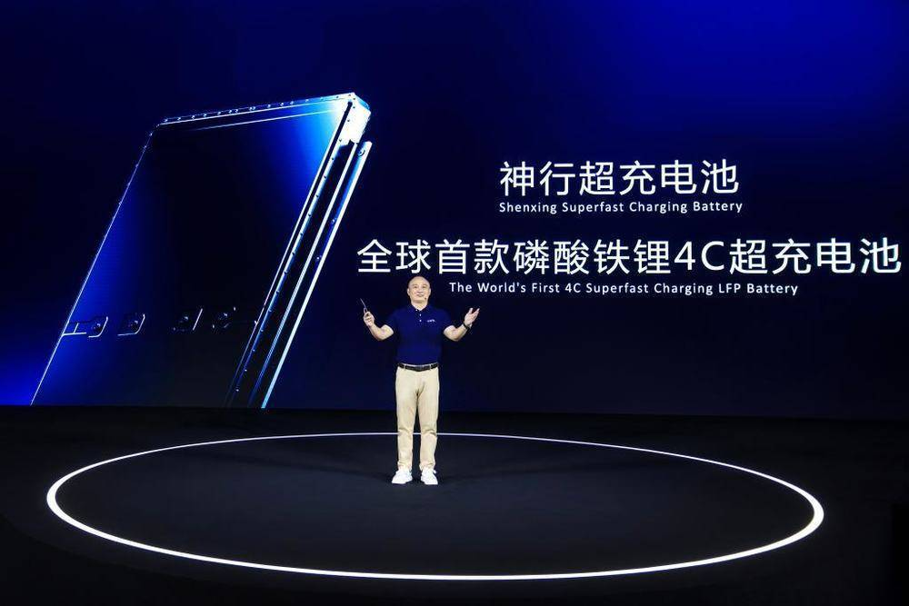
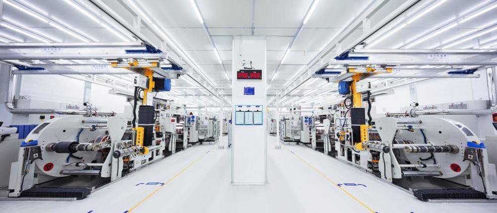

# 宁德时代放“大招”：电池充电10分钟，续航400公里

出品｜虎嗅科技组

作者｜包校千

编辑｜廖影

题图｜宁德时代

“充电10分钟，续航400公里。”多年不开线下发布会的宁德时代，在8月16日召开的首个线下发布会，投掷了一枚“王炸”——超充电池。

为了这个“王炸”，从2023年世界动力电池大会，再到第13届中国汽车论坛，宁德时代首席科学家吴凯剧透了不止一次，甚至提前官宣主机厂的某款车型已具备了超充能力，足见对新产品的重视。

而这场“像超充一样快的发布会”，掐头去尾只有半小时。虽然短促，却被赋予了划时代的意义。一旦超充体系建立起来，充电像加油一样的时候，“再去回顾新能源建设的发展史，你会发现超充时代，从今天开始全面到来。”宁德时代国内乘用车事业部CTO高焕表示。

按照宁德时代的时间表，全新的超充电池将在今年年底量产，预计明年一季度投入终端市场。不过，要让超充电池不再是高端电动车的选配，而成为普惠千家万户的标配，后续的降本和配套如何解决，宁德时代心里或许已经有了答案。

超充时代，真的来临了吗？

**充电10分钟，续航400公里**

充电10分钟，一次性续航400公里，这相当于从北京到济南，从上海到合肥，从宁德到金华，从重庆到贵阳的距离。

正因此，全新的超充电池被命名为“神行”。这款全球首款基于磷酸铁锂的4C超充电池，在续航和补电均实现了突破。用宁德时代国内乘用车事业部CTO高焕的话说，这是一次“续航与补能的双向奔赴”。

和三元锂相比，低温性能不佳是磷酸铁锂材料的天然缺陷之一。特别是冬季“掉电”的现象，被北方用户诟病。而本次发布的超充电池，亮点之一便是突破了低温环境对快充的限制。即使在零下10摄氏度的低温环境下，也可以在30分钟内以全功率充电至80%。

基于宁德时代CTP3.0技术的高集成性、高成组效率，神行超充电池突破了磷酸铁锂的续航上限，续航里程提高至700公里以上，并且在低温亏电状态下零百加速也不衰减。

_神行超充电池_

要让超充电池在性能上得到大幅度升级，就要向每一个锂离子、每一次传导要速度。而电池快充能力主要取决于电芯负极快速嵌锂能力、电解液导电率以及电池系统的热管理等多方面能力。

据吴凯介绍，为实现电池快充，一方面需要电芯层面的性能提升。宁德时代的方法是正极构建高速锂离子传输和超电子网改善温升，提升电芯负极的充电能力、液相锂离子传输速率、隔膜内锂离子传输速率；降低电芯SEI膜阻抗。

另一方面，则需要在电芯成组结构上有所创新。这次宁德时代的麒麟电池的结构设计，将电芯的换热面积扩大了四倍，控温时间缩短一半，有效阻隔电芯内的异常热量传导，对于快充非常友好。

这些方式，在本次发布会上都有体现。比如超电子网正极技术、二代快离子环石墨负极技术、超高导高动力学电解液、多梯度分层极片设计等多维手段，让神行超充电池实现了4C超充，即15分钟将电量充满。

不过提到超充，安全是无法规避的话题。此前发生在充电站的一些自燃事故，让很多人对快充的安全问题心有余悸。更何况充电速度越快，电池的安全风险就越高。这也是为什么，宁德时代一再强调，安全性是超充的重要前提。

在发布会现场，高焕用了较大篇幅来介绍超充电池是如何保证安全的。概括来说，一是改良电解液基因，进一步减少固液界面的反应产热；同时配备高安全的涂层隔膜，更少的产热，更强的耐热。

_宁德时代国内乘用车事业部CTO高焕_

除了这两道保险，团队在电池管理层面，通过智能算法，对电芯内部全局温场进行实时准确的计算和管控。关注电芯超充性能的同时，最大程度保证电池使用的安全。

高焕表示，在超充电池的开发过程中，团队做了400多项的验证，目前在安全标准方面已达到PPB级别（十亿分之一的故障率）。通过故障检测系统对超充电池的实时预警，可以保证“再微小的异常都无所畏惧”。

神行超充电池已投入生产，搭载神行超充电池的电动车也将在明年一季度上市。为了实现年底大规模供应的目前，宁德时代灯塔工厂、零碳工厂都将加足马力。

**超充元年，应用在即**

在电动汽车领域，超充曾是特斯拉的独门技艺。而在国内，小鹏“充电5分钟，续航200公里”的800V超快充平台，曾代表了行业最高水平。去年9月上市的小鹏G9，成为了国内第一款超快充的量产车型。

然而，这项纪录很快被对手超越。

今年4月的上海车展上，理想宣布其首款纯电车型MEGA搭载的是宁德时代4C麒麟电池，并将推出800V超充的解决方案，实现充电10分钟，续航400公里。

在7月底的机构调研中，在介绍4C快充的进展情况以及对公司明年的出货占比预估时，宁德时代称，公司与理想汽车合作搭载的4C快充麒麟电池进展顺利。

去年6月，宁德时代推出了具备4C快充和1000公里长续航的麒麟电池。相比前两代CTP技术，麒麟电池完全取消模组形态设计，并通过冷却结构上的优化，使得电池安全性、寿命、快充性能以及能量密度进一步提升。

_宁德时代极限制造产线_

截至目前，国内实现麒麟电池装车的车型有三款：极氪001和极氪009，以及6月中旬发布的哪吒S。不过，以三元材料为主的麒麟电池成本并不低，很难把价格做到普惠级。但本次发布会上，宁德时代拍胸脯地喊出，要让超快充和长续航不再成为高端车型的专供，而是普惠广大消费者。

之所以要走向C端，和当前新能源汽车在用户侧发生的两个明显变化有关：

一是用户群体的变化，从最初的先锋用户转向了大众用户。2022年，我国的新能源汽车渗透率首次超过16%，达到了25%。按照美国学者埃弗雷特·罗杰斯（E.M.Rogers）的创新扩散理论，渗透率在16%以下是先锋用户主导，渗透率超过16%就开始迈向大众用户。

二是用户需求的变化。随着电池能量密度不断突破，电动汽车的续航问题已基本解决，快速补能成为消费者当下更加关心的问题。

中国电动汽车充电基础设施促进联盟联合能链智电发布的《2022中国电动汽车用户充电行为白皮书》显示，大部分用户对于充电时间较为敏感，96%的用户会选择充电效率高的快充桩，新能源汽车用户对于快充的需求还会进一步提高。

眼下，国内动力电池厂商都在推进动力电池充放电倍率从1-2C向4C发展。除了宁德时代之外，中创新航、蜂巢能源、亿纬锂能等已经推出快充电池解决方案。中信证券认为，快充功能正日渐成为新能源汽车的标配，这项技术正成为动力电池制造商新一轮的竞争焦点。

去年9月，欣旺达就推出了闪充电池的1.0版本，充电5分钟可支持200公里续航。今年4月，欣旺达发布升级后的闪充电池2.0版本，可实现充电5分钟续航250公里，同时拥有1000公里的整车续航能力。

除了电池厂商在较量，4C快充也成为电动汽车的下一个必争之地。目前理想、小鹏、比亚迪等众多厂商已在该领域有一定成果并进行了一定的应用。行业人士预测，随着宁德时代麒麟电池4C超充技术的推广应用，电动汽车市场或将迎来超充元年。

需要注意的是，宁德本次发布的快充电池，材料成本比普通的磷酸铁锂电池更高，势必会导致超充电池电芯整体材料成本的上浮。有产业研究报告显示，超快充电池规模化之后，成本仍然会上升5%。不过，宁德时代的目标是，超充电池最终的成本实现与普通磷酸铁锂电池持平。

_宁德时代总部，首个宁桩超充站落地_

除此之外，超快充网络的基建尚未起步，外界普遍认为800V高电压平台和超快充会推高车型落地成本。当然另一派的观点认为，相较于换电模式，超快充模式下的建设和运营成本更低，不需要储备电池，也不需要花费太多的人力成本去更换和维护电池，能极大地减轻车企的资金负担。如果能将充电效率做到像燃油车加油般的体验一致，用户自然会选择超级快充。

虎嗅获悉，光储充检智能电站服务商上海快卜将在今年年底，联合宁德时代部署一百座超充站，首批超充站将在一二线城市率先落地。

