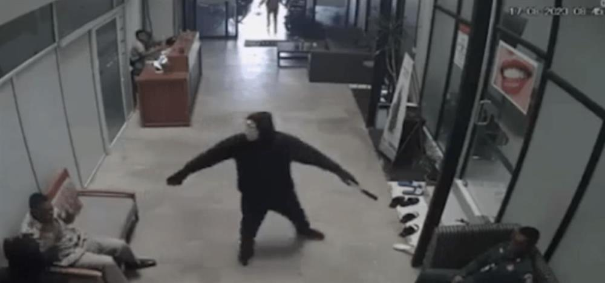
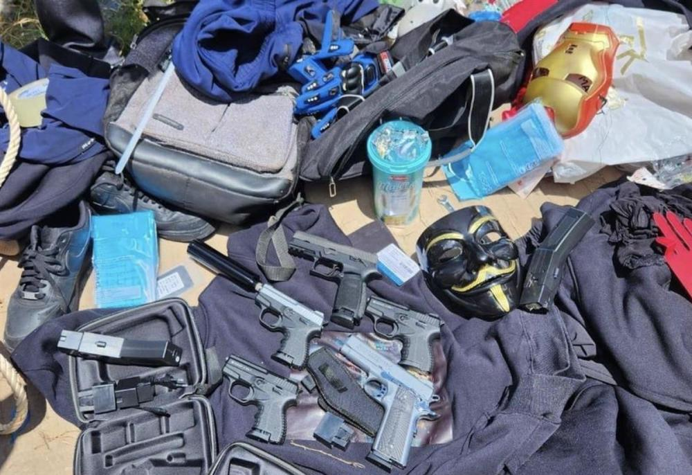

# 柬埔寨吴哥窟所在地突发劫囚事件：蒙面持枪歹徒抢走45岁中国籍毒贩

极目新闻记者 陈俊

据《柬中时报》5月17日晚报道，柬埔寨当天发生劫囚事件。

报道称，一名45岁中国籍陈姓囚犯因重大毒品案被判52年有期徒刑，但陈某近期称牙痛，监狱局批准他前往牙科医院接受治疗。岂料，当日中午多名蒙面武装歹徒突然现身，持枪劫走囚犯。

 _持枪歹徒（图源：柬中时报）_

据报道，事件发生在柬埔寨第二大城市暹粒，这里是吴哥窟所在地。目击者称，当地时间17日上午，多名蒙面武装分子驾驶一辆汽车，停在位于市中心的一家牙科医院。他们手持步枪，来到医院，袭击押送囚犯的狱警，劫走囚犯。该名中国籍囚犯年龄45岁，于2009年2月11日被捕，涉及重大毒品案，被判处52年有期徒刑。

_丢弃的枪支等物品（图源：柬中时报）_

暹粒市警方表示，黑衣人劫走囚犯之后，把犯案车辆、枪械、面具、衣服等丢弃在一处郊区。监狱总局发言人诺索瓦纳已证实有这宗事件。警方正展开调查。

_毒贩陈某（图源：柬中时报）_

报道引述监狱总局发言人诺索万的话证实事件，被劫走的囚犯是一名中国人。目前警方正在展开深入调查。

（来源：极目新闻）

