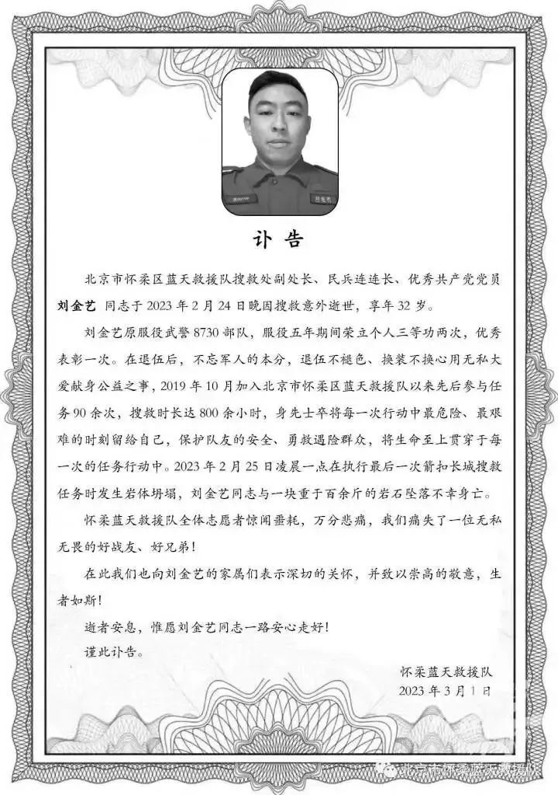
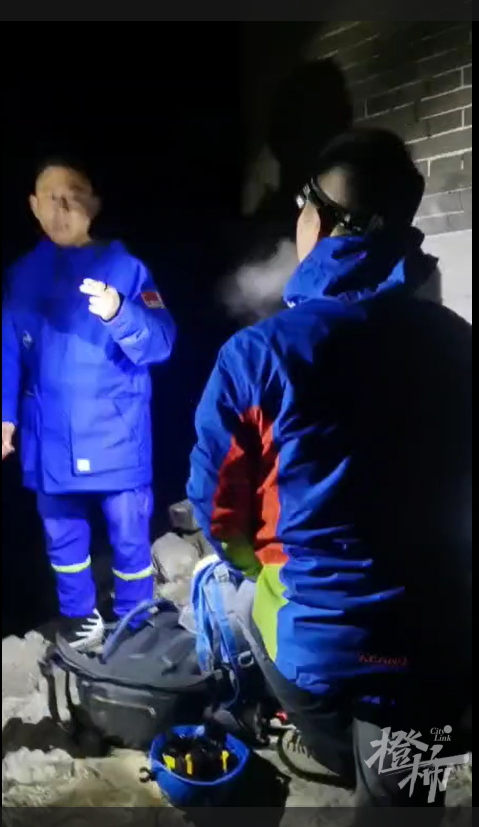
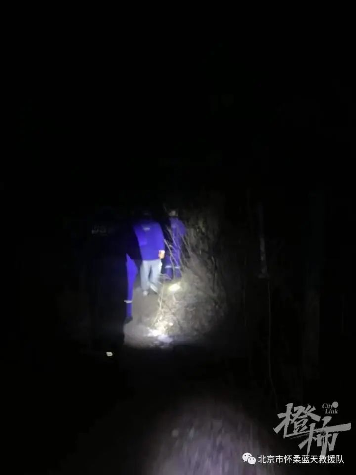

# 没救到人就掉下去，算见义勇为吗？32岁救援队员坠崖牺牲半年未获认定

今年2月24日晚上，北京怀柔蓝天救援队接到求助，去搜救被困箭扣长城的两名驴友，搜救3个多小时后，次日（25日）凌晨1点多，队员刘金艺在往下搜寻时，遭遇岩体坍塌，不幸牺牲，享年32岁。

但过去半年多后，刘金艺的救援行为依然没被评定“见义勇为”。

昨天，他妈妈在刘金艺生前使用的社交平台发了一段视频，反映 **儿子去世半年多后，“见义勇为”迟迟没被认定。**

刘金艺的生日是1991年3月1日，怀柔蓝天救援队在他生日当天在网上发了讣告。

“说我儿子没救到人就掉下去了，不能算见义勇为”

刘金艺是家里独子，儿子去世后，年迈的父母亲承受不住，思念儿子，妈妈眼睛哭得曾一度看不见，尿失禁。

刘金艺的妈妈王桂如回忆说，2月24日晚上7点多，儿子接到救援队电话，饭也没吃就离开了家，没想到成了最后一面。2月25日中午，他们接到救援队电话，得知儿子不在了。

 _（图为刘金艺生前救援时，为被困者包扎伤口）_

王桂如说， **他们和儿子生前所在的怀柔蓝天救援队找有关部门为儿子申请评定见义勇为，但时至今日，没得到结果。**
“民政局一个工作人员之前跟我们说够不上，我儿子没救到人就掉下去了，不能算见义勇为。可是我儿子是去救人的过程中牺牲的，怎么不算呢？”

她发来一段视频，是队友拍摄的，“他们当时发现人在下面，我儿子往下走的时候发生的。”

_（队友拍下的刘金艺参加救援行动视频截图，左为刘金艺）_

事发后，怀柔蓝天救援队也多次向民政等部门提出评定见义勇为的申请，得到的回复是“努力争取”，但至今没有正式书面回复。

民政：经办人不在

北京2000年8月1日施行的《北京市见义勇为人员奖励和保护条例》（2016年11月修订）规定：奖励和保护见义勇为人员的工作由市和区人民政府负责，日常工作由民政部门办理，其他有关部门密切配合。

根据规定要求，北京的民政部门专门设立了“见义勇为”相关业务部门，组织开展见义勇为认定工作。见义勇为基金会的登记管理同时也归口民政部门。

2000年8月1日起施行的《北京市见义勇为人员奖励和保护条例》（2016年11月修订）第二条规定：本条例所称见义勇为，是指为保护国家、集体利益或者他人的人身、财产安全，不顾个人安危，与正在发生的违法犯罪作斗争或者抢险救灾的行为。

2000年8月1日起施行的《〈北京市见义勇为人员奖励和保护条例〉实施办法》（于2014年6月修正）在关于“见义勇为的确认”中，第四条第三款规定：“在抢险救灾中，不顾个人安危，抢救国家、集体财产或者他人生命财产的”，可以确认为见义勇为。

刘金艺的行为，符合上述相关规定吗？

**橙柿互动记者昨天和今天联系怀柔区民政局见义勇为科，工作人员告知经办人不在，“下乡了”，并建议联系区委宣传部。怀柔区委宣传部工作人员说，他们主要负责宣传见义勇为事迹，认定工作应向民政局了解。**

认定见义勇为，难在哪里？

目前，全国各地的见义勇为认定工作，根据各地规定，主管部门各不相同。

全国层面，见义勇为的评定工作是由中央政法委组织开展。

全国层面，还有一个中华见义勇为基金会，于1993年6月成立，是由公安部、中宣部、中央政法委等部委联合发起成立的全国性公益社会团体。公益社会团体组织的登记管理机关属于民政部门。

全国各地，像天津、浙江、江苏、福建、河南等省市，见义勇为的认定工作在公安机关，见义勇为基金会的业务主管部门是公安机关，登记管理机关在民政部门。

刘金艺的行为是不是见义勇为？

这个问题，记者咨询各地经办见义勇为认定工作的有关人士，他们持不同意见。有的地方认为这可以算见义勇为，有的认为不能算。不能确认主要是基于下面几种原因考虑。

一位有关人士分析说， **刘金艺在救援时，在悬崖上走的时候，悬崖石头发生坍塌，把人带落悬崖，是意外。**
这个“意外”和“不像有人在悬崖边上，他去拉人时掉下去”性质上，不一样。一般，悬崖石头不会发生坍塌的，人站在上面或走过，不会掉下去。

另一位有关人士分析说，因为刘金艺救援时，是在往下搜寻目标过程中掉落悬崖，此时还没有真的找到目标，后来，被困的两人是消防队员找到的。所以，不属于发生在真正的救援行为中。

还有一位人士认为， **这次的救援行为没有到“那么危险的地步”，**
举例来说，有人要跳悬崖，救援队员上前去拉，掉下去了；或有人掉下河里，有人跳下去救人，没救上来但自己却溺水了，可以认定为见义勇为。

救援出意外是不专业？

现在，全国各地民间救援队很多。他们参加越来越多的抢险救灾、抢救生命行动中，这些民间救援队成为官方救援力量的有益补充。

一方面，民间救援队是公益组织，资金都是自己募集的，一方面，他们在救援中自身也往往面临风险。8月初，房山蓝天救援队两名队员王宏春和刘建民在抢险救灾行动中落水，不幸牺牲。

现在，民间救援队的救援任务主要有地震灾害救援、山岳救援、城市搜救（比如帮助寻找走失老人、小孩等）、水域救援等。

还有观点认为，民间救援队员牺牲、受伤是因为救援不专业的结果，也因此不能算“见义勇为”。

记者采访多个民间救援队，他们不同意这一说法。

浙江一民间救援队领队说，他们的队员都拿过相关专业救援资质，山岳救援队员要通过绳索（山地）救援技术等级考评等，水域救援中潜水队员必须有潜水等级资质，救生艇操作要考操舟证，救援队还日常组织各种专业训练，救援队员还要去考红十字会的急救证书。

**“只要有救援，就可能面临风险”，** 一资深救援队员说，“无论我们是抢险救灾还是山林搜救，都意味着救援队面临的困难和险情复杂多变，情况紧急。”

“如果要求队员等考虑周全后才去施救，可能会延误救援，造成更多损害。”这名资深救援队员说。

比如刘金艺和队友们一起去救的两名被困箭扣长城的驴友，箭扣长城在北京市怀柔区雁栖镇境内，海拔1141米，属于未开放的长城，禁止攀爬，但还是有驴友冒险挺进。

这些年在箭扣长城遇难的驴友不少。据历史报道，不完全统计：2009年至2018年至少遇难6人：2009年，五人攀爬箭扣长城时遭雷击，其中两人身亡；2010年，箭扣长城发生至少6次户外事故，导致一人死亡；2012年，箭扣长城单日发生两起登山事故，造成一死一伤；2014年，六人攀爬箭扣长城遇险，其中一人遇难；2015年，三名游客被困箭扣长城悬崖边，脱水严重，无法自行下山……

怀柔蓝天救援队多次去搜救被困人员。

就在刘金艺出事前，今年2月初到中旬，发生了3起驴友被困事件：2月17日，北京怀柔蓝天救援队也去箭扣长城救援，和消防救援队员在山里搜救了17个小时，最后找到了一名从悬崖上摔落的女驴友；2月11日，也是箭扣长城，有一个20多岁的年轻小伙去那玩，不幸跌落，当救援队员们找到他时，已遇难。

_（2月11日，救援队上山搜救）_

从这个角度说，如果刘金艺和队友们不去搜救，被困人员可能面临着生命危险。

没救到人就不是救人吗？

“不是接触到被困人员才是救援”，另一位民间救援队队长说，“ **我们在搜救的整个过程都属于救援。**
同样的，对搜救现场，人被困在山上位置无法确定，整个范围都是属于搜救现场，而不是指被困者所站在的地方才算搜救现场。”

这个救援队曾在山上搜救被困人员时，有队员滑倒受伤，“那会还没救到人，但发生在救援过程中，后来，当地公安部门认定是‘见义勇为’”。

救援对象去了明令禁止的地方被困，是不是就不算救援？

浙江一民间救援队领队说，他们接到日常遇到较多的是山岳救援、水域救援，水域救援比如有人落水了；山岳救援，比如有驴友爬山迷路被困山中，他们接到联动指令后，出动队员去救援。“不是说这个河道禁止游泳有人去游溺水了，或者这个山不能爬去爬被困了，我们就不去救了，都要去救的。”

律师：加快立法，有一个可操作的认定标准

目前，关于“见义勇为”，因全国尚未立法，所以对什么是见义勇为行为尚未有明确的法律定义。而各地目前都是按各地出台的《见义勇为管理条例》及《管理条例实施办法》等地方法规开展相关工作。

有的地方，参与反诈的行为也属于见义勇为。最近，江苏省南京市公安局、市见义勇为基金会制定出台《南京市防范打击电信网络诈骗犯罪见义勇为专项奖励办法》，就是针对在南京市行政区域内积极参与阻止、举报电信网络诈骗的公民，按照制止诈骗案件发生、提供涉诈电话卡或银行卡线索等情节和贡献大小，由南京市见义勇为基金会给予100元—5000元不等的奖励。不过，要指出的是，这个奖励，不是政府对见义勇为的记功嘉奖。

“不应严苛对待见义勇为的认定，对这种正能量行为应该予以褒扬、鼓励，弘扬”，浙江五联律师事务所主任缪渭川律师认为。

“像民间救援队去救援，法律术语上称为‘无因管理’。”无因管理，《民法典》解释为：指没有法定的或约定的义务，为避免他人利益受损失，自愿管理他人事务或为他人提供服务的行为。

“救援队出发，就表示已经在行动中了”，他认为，民间救援队的救援是一种公益行为，从他们出发一刻开始就面临危险，不能以结果来论，无论是同违法犯罪作斗争还是在抢险救灾救人过程中，只要是为了积极保护国家、集体利益和他人人身、财产安全为目的的，都是见义勇为，特别是在抢险救灾、救人过程中，不是非要接触到被救援人员才算，“不是说车子撞过来，把人推开让车撞到自己才算见义勇为，如果救援队在救援途中翻车了，队员受伤去世，我认为也是属于见义勇为”。

缪律师还说， **对见义勇为过于严苛，是不符合“弘扬社会正气，加强社会主义精神文明建设”法律精神的。**
他呼吁，国家应该尽快立法，对见义勇为做一个统一的认定标准，“标准要定得细，可操作性强”。

浙江人地律师事务所主任唐丹麒认为，不具有法定或约定义务的公民，为保护国家、社会公共利益或者他人的人身财产安全，同正在实施的违法犯罪作斗争，或者参与抢险、救灾、救人，事迹突出的行为，都属于见义勇为。首先，民间救援队都是个人自愿加入，队员利用自己的业余时间去救援，并非受雇用参与救援；再者，参与搜救都是一个持续性的过程，既包括前期的“搜”，也包括后期的“救”，甚至可以说“搜”才是救援行动成功与否的关键，因此不可否认前期搜索过程属于救援行动的一部分。第三，只要搜救的求援信号或指令达到民间救援队，可以被视为被救助人已经具有人身安全随时遭受损害的危险，此时救援队员已经具备保护他人人身安全的主观因素，不需要以发现被救助人存在现时的、可见的危险为前提条件。

他建议，“根据条例规定，建议救援队员家属可亲自向当地民政部门提出书面申请，民政部门则需要在规定时间内予以书面回复”。他呼吁，“要加快完善制度工作落实，不要让英雄流汗流血又流泪”。

“民间”救援并非认定见义勇为的障碍

《北京青年报》8月4日刊登了评论员史洪举所写文章《应给予民间救援队员更多关爱和保障》。

史洪举提出：褒扬见义勇为重在弘扬和鼓励人们团结互助、乐于救人、舍身忘我、勇于抢险救灾的精神和行为，而非只注重结果。

民间救援团队显然并非对抢险救灾负法定义务的警察、消防等官方救援力量，也并非负约定义务的救援力量。其参与抢险救灾多数是出于个人爱好、热心公益等高尚品质使然。“民间”救援并非认定见义勇为的障碍，参与抢险救灾的民间救援队员牺牲，理当认定为见义勇为。

橙柿互动·都市快报 记者 杨丽

