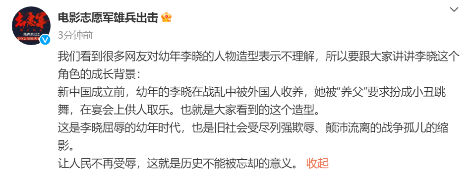
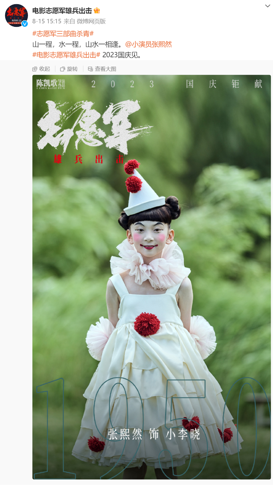
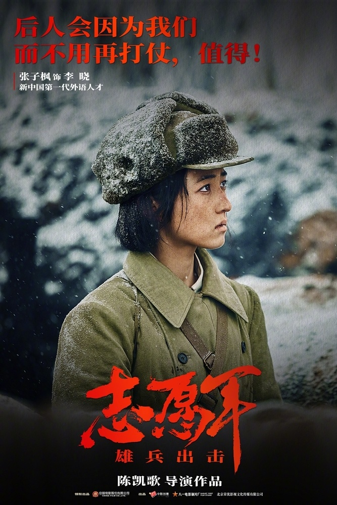

# 电影《志愿军雄兵出击》官方回应人物造型争议：还原屈辱的幼年时代

8月17日，电影《志愿军雄兵出击》官微@电影志愿军雄兵出击 发文回应争议：

我们看到很多网友对幼年李晓的人物造型表示不理解，所以要跟大家讲讲李晓这个角色的成长背景：

新中国成立前，幼年的李晓在战乱中被外国人收养，她被“养父”要求扮成小丑跳舞，在宴会上供人取乐。也就是大家看到的这个造型。

这是李晓屈辱的幼年时代，也是旧社会受尽列强欺辱、颠沛流离的战争孤儿的缩影。

让人民不再受辱，这就是历史不能被忘却的意义。

此前，官微发布的幼年李晓杀青照：

成年李晓由演员张子枫饰演：

