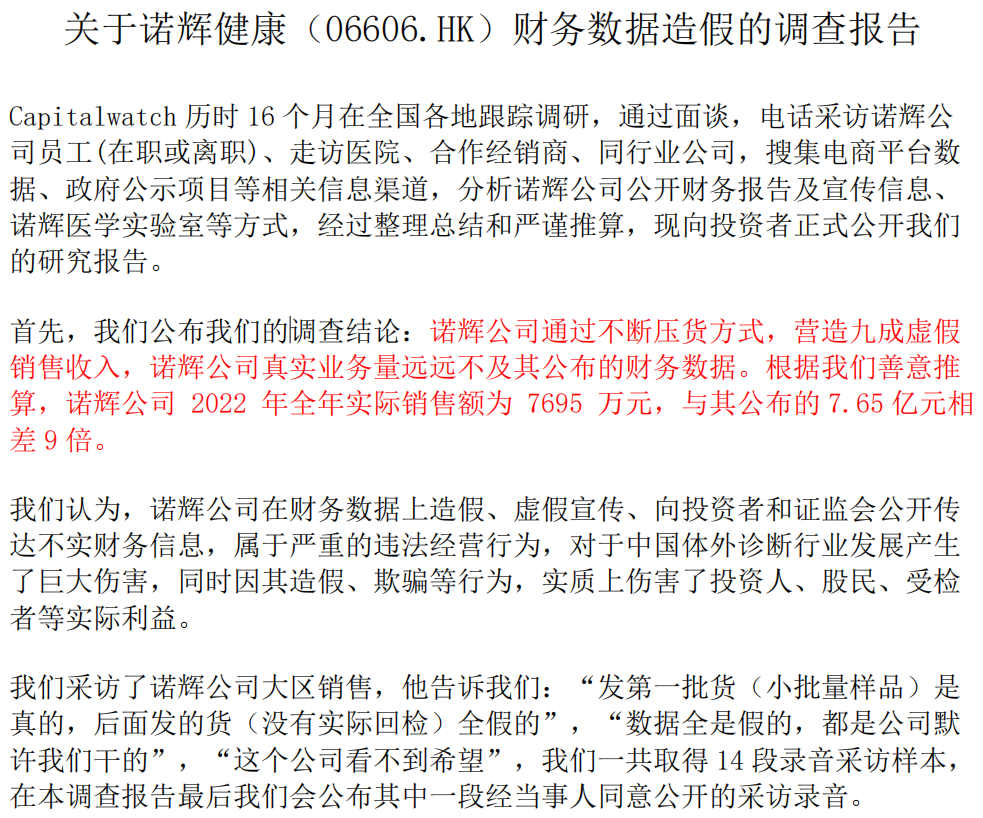

# 癌症早筛龙头被指“九成收入作假”？董事长“秒回”：对方要讹诈

财务造假——一个严重的指控砸向了中国癌症早筛领域头部企业诺辉健康（06606.HK，股价18.42港元，市值84.29亿港元）。

8月16日下午， **中国癌症早筛领域头部企业诺辉健康股价一度急跌20%**
，截至收盘下跌6.88%。消息面上，一封名为《关于诺辉健康（06606.HK）财务数据造假的调查报告》（下称“《报告》”）的文件在媒体群内流传，其出具方显示为Capitalwatch。

该文件称，诺辉健康通过不断压货方式，营造九成虚假销售收入，公司真实业务量远远不及其公布的财务数据。“根据我们善意推算，
**诺辉公司2022年全年实际销售额为7695万元，与其公布的7.65亿元相差9倍** 。”

_图片来源：网传文件_

随后，诺辉健康发布声明称：我们关注到做空机构J Capital
Investment的报告。该报告信息严重歪曲事实，意图伤害我公司声誉。我们将采取法律手段追责并保护公司的合法权益。我们在港交所发布的信息均真实合规。下周一下午港交所盘后，静默期后，我们将会召开系列投资人沟通会和媒体交流会，公开透明沟通公司发展和业绩信息。

被指销售额虚增9倍

根据百家号“Capitalwatch”发布的介绍，这是一家成立22年的财经媒体，从2022年开始，Capitalwatch已经不仅仅面向新兴市场，还为纳斯达克和纽交所全部上市公司提供服务。

《报告》共从12个方面向诺辉健康“开炮”，包括2022年市场背景、专业医疗机构渠道销售情况调研和分析推测、公共卫生筛查项目销售情况调研和分析推测（网上公开产品厂家范畴）、民营体检机构销售渠道调研及情况分析、电商平台销售渠道调研及情况分析、财务报告分析、业界各渠道调研反馈、诺辉公司实际检测量预估、诺辉公司关于销量宣传前后矛盾、调研及推测数据情况汇总、诺辉公司其他违规经营调查事实、2023年618销售数据造假。

概括来说，Capitalwatch认为，在2022年国内体检等市场紧缩的背景下，诺辉健康的居家结直肠癌筛查检测产品“常卫清”“噗噗管”收入额远高于实际。特别地，“电商平台是诺辉公司财务销售数据造假的重灾区，其电商的销售数据违反正常中国电商促销的规律”。

《报告》显示，这些内容是Capitalwatch历时16个月在全国各地跟踪调研，通过面谈、电话采访诺辉公司员工（在职或离职）、走访医院、合作经销商、同行业公司，搜集电商平台数据、政府公示项目等相关信息渠道，分析诺辉公司公开财务报告及宣传信息、诺辉医学实验室等方式，经过整理总结和严谨推算所得，并在末尾附上了12条调查证据，称“一并公布如下链接”。

不过，诺辉健康方面向记者表示，并未收到这些证据。截至发稿记者亦未从公开渠道中找到这些调查证据。

16日下午2点半，公司董事长朱叶青“秒回”《每日经济新闻》记者微信， **称“对方通过公关公司要讹诈我们……被我们拒绝之后昨天中午开始公开分发**
。公司会出一个声明并向对方发放律师函”。

半个小时后，诺辉健康的盘中电话交流会开始。朱叶青及诺辉健康的首席财务官高煜和首席科学官陈一友一起上阵，一连回应了多个《报告》提到的问题。

诺辉健康：《报告》与实际差距较大

针对《报告》对公司产品常卫清、噗噗管各销售渠道收入的质疑，朱叶青表示常卫清以实际到检量作为收入确认的唯一依据，
**并且其在医院端的出价并非《报告》提及的500元/人份，而是远远高于1000元**
；噗噗管的公共筛查项目报价和公立医院体检报价等均没有报价中那么低。两种产品的主要临床端收入来自民营医院而非公立医院。

高煜做了更进一步的明确：常卫清/单人份在临床渠道的出价是1200元~1600元，在DTC渠道（包括保险公司、健康管理公司以及电商的第三方平台）的出价是600元~1200元，在民营企业的出价是300元到500元。医院和体检出厂价相差过大的原因，是进院花费了更多的推广宣传教育投入，由公司承担；体检的这部分费用则由机构自行承担，所以低很多。

诺辉健康方面表示，对比上述内容，不难发现《报告》计算公司销售收入时，以期间销量乘以价格的计算方式有误，且使用的价格偏低。

对于《报告》提出的“（2022年）民营体检机构更是缩水严重。诺辉公司仅靠一两家紧密合作的民营体检机构根本无法真实实现其常卫清销售业务的266%的增长”，朱叶青并未回复，但对“（网店）刷单痕迹明显”“造假水分实际业绩高达2倍以上”的指控，表示自己咨询了几家权威的咨询机构，获悉电商的爬虫数据与真实数据差距较大，原因可能是爬虫速度有限或电商平台的反爬虫机制。

对于公司收入的真实性，高煜表示有双方确认、三方审计机构和药监局飞行检查三个关卡，其中机器上的检测后数据都留存且不可更改。

关于常卫清的专利问题，高煜则表示其与Exact
Sciences的产品没有任何潜在的重叠或者冲突，因为在创投期、公司港股上市时经历过多次审查，如两个甲基化靶点上的检测位点与Exact
Sciences的产品并不相同。

另外，朱叶青认为《报告》提到的公司检测能力、员工人数、常卫清检测量等数据与实际差别较大，并明确了一系列数据：公司北杭广三地实验室每年检测能力达200万人份，公司现有员工数已经超过了1000人；常卫清2021年的检测量为14万份，2022年为36万份，两年累计实际检测量超过50万份，而2023年上半年的检测量已超过40万份，具体数据需以公司半年报为准。

按计划，诺辉健康将于8月21日（下周一）港交所盘后发布2023年中期业绩，这将是诺辉健康自2021年上市以来发布的第6份定期报告。

值得一提的是，在问题围绕《报告》展开时，仍有参会人将焦点指向了近日舆论火热的“医药反腐”。朱叶青认为其对诺辉健康的影响很小。

“目前看来对我们公司的现有的业务，包括未来6到12个月的业务几乎不产生影响……我们也关注到媒体公示的一些医院，我们认真地去核验过，我们跟这些医院都没有任何商业合作。”

有意思的是，晚上7时许，一个IP地址在美国、账号名称为CapitalWatch的账号自称是发布报告的机构，该账号表示目前流传的版本并非正式版本，是该机构向一些机构分析师求证数字真伪而泄露的，其将择机发布正式报告。

**记者|** 林姿辰 **编辑|** 张海妮孙志成 盖源源 杜恒峰

**校对|** 卢祥勇

封面图片来源：视觉中国（图文无关）

｜每日经济新闻 nbdnews 原创文章｜

未经许可禁止转载、摘编、复制及镜像等使用

