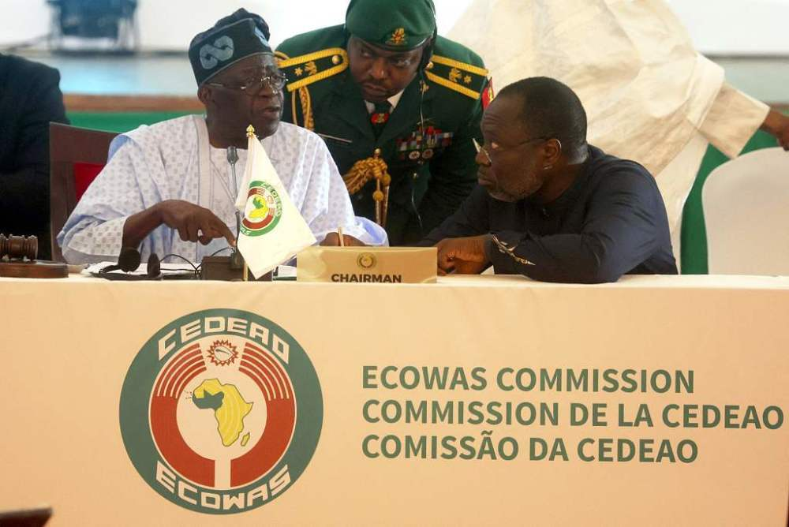

# 美俄在尼日尔暗中角力，美媒渲染尼军政府与瓦格纳之间存“伙伴关系”

【环球时报驻尼日利亚特派记者
姜宣】尼日尔政变发生以来，军政府方面在拒绝了西非国家经济共同体（西共体）等方面多次谈判的努力后，在上周表示愿意进行对话。15日，俄罗斯和美国方面均表达出希望和平解决尼日尔问题的声音，但从两国媒体的报道来看，这两个大国在西非的较劲仍很激烈。

_8月10日，尼日利亚阿布贾，在西非经共体国家元首和政府首脑特别会议上，西非国家经济共同体主席、尼日利亚总统博拉·提努布(左)与西非国家经济共同体主席Omar
Touray(右)对话。_

据俄罗斯卫星通讯社15日报道，俄总统普京和马里过渡总统戈伊塔当天通过电话讨论了尼日尔局势。根据克里姆林宫方面的声明，普京强调，“完全和平的政治和外交手段”对解决当前局势很重要。戈伊塔也重申了普京对“和平解决”尼日尔问题的呼吁。同一天，俄罗斯外长拉夫罗夫在第十一届莫斯科国际安全会议开幕式上表示：“看看西方现在对尼日尔政变做出的反应多么一致，要求恢复民主。”而西方国家对2014年乌克兰通过“血腥政变”更迭合法政权几乎没有做出反应。“这种虚伪和双重标准的例子不胜枚举。”拉夫罗夫补充说。据美媒报道，美国总统拜登曾在8月3日的一份声明中，呼吁维护尼日尔的民主。

俄罗斯卫星通讯社16日援引突尼斯社会和政治活动家阿卜杜拉齐兹·梅萨乌迪的话说，最近几年在尼日尔、马里和布基纳法索发生的一系列军事政变是摆脱对西方依赖的普遍趋势。“在那里发生的积极变化，包括摆脱殖民主义和帝国主义统治，正提供巨大的机会。”

美国有线电视新闻网（CNN）的报道则渲染西方对俄罗斯在西非地区日益增长影响力的担忧。报道称，8月初，马里接待了一个由尼日尔军政府官员组成的大型代表团，这标志着尼日尔军政府和瓦格纳雇佣军集团之间的潜在伙伴关系。报道称，受马里领导人邀请，瓦格纳战士活跃在当地，以镇压在马里、布基纳法索和尼日尔边境附近的极端分子。CNN还称，有人看到瓦格纳创始人普里戈任出现在上月的俄非峰会上，并与非洲政要会面。此前，美国副国务卿维多利亚·纽兰在尼日尔首都尼亚美与政变军方领导人进行了会面。尼日利亚《抨击报》报道称，纽兰警告尼日尔军政府说，如果军政府效仿邻国马里引入瓦格纳雇佣军，他们将面临主权风险，尼日尔与美国的关系也将会受到影响。

另一方面，美国五角大楼副发言人萨布丽娜·辛格证实了美国向尼日尔投资数亿美元用于各种军事目的的报道。据路透社15日报道，她在新闻发布会上对记者说：“尼日尔是伙伴，我们不希望看到这种伙伴关系消失。我们向基地投资了数亿美元，在那里训练了军人。”据辛格说，华盛顿未关闭外交大门，希望和平解决尼日尔局势问题。美国“政治新闻网”15日援引了解该地区局势的消息人士的话报道称，尼日尔对美国来说太重要了，无论谁领导这个国家，美国都不能放弃。自2012年以来，美国已经花费5亿美元训练尼日尔军队，其中包括1亿美元用于阿加德兹基地，该基地部署着美国的无人机。尼日利亚安全问题专家穆罕默德对《环球时报》记者表示，尼日尔局势不断变化，凸显了全球大国力量的触角不断延伸，人们很容易从地区冲突中看到大国的身影。

美俄暗中角力之际，尼日尔军方任命的总理拉明·泽内15日突访邻国乍得。据法新社报道，泽内在会晤乍得总统代比·伊特诺后发表的声明中说，他带去了尼日尔政权负责人睦邻友好的信息。

外界是否军事干预尼日尔仍存悬念。法新社援引当地消息人士的话称，西共体的军事首领们将在本周四和周五在加纳开会讨论对尼日尔可能的军事干预。面临可能的入侵，尼日尔首都尼亚美的居民呼吁大规模招募志愿者，以帮助军方应对西共体军事干预的威胁。此前，非盟和平与安全理事会在非盟总部所在地亚的斯亚贝巴召开会议，就尼日尔局势进行磋商。

