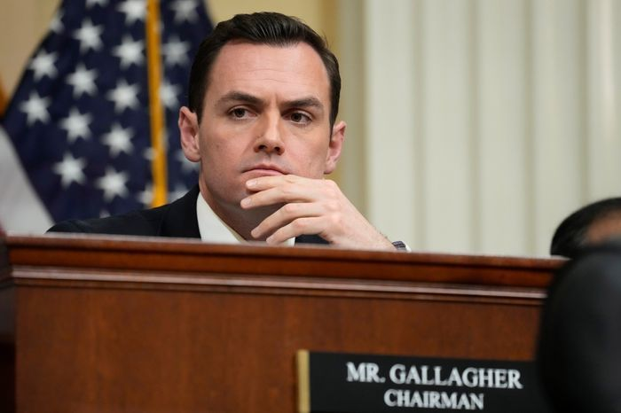
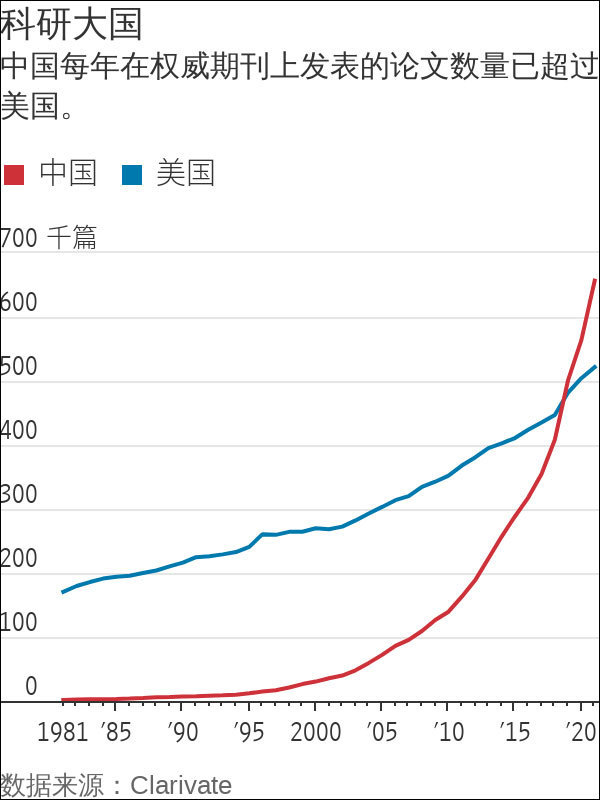
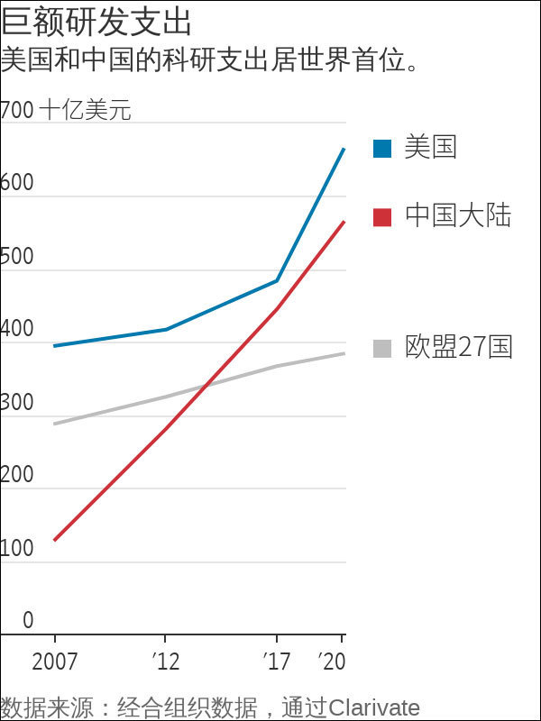

# 美国对华科研“脱钩”引美科学界担忧：可能拖慢自身在关键领域的发展

（观察者网讯）8月27日，有着44年历史的《中美科技合作协定》即将到期，这份互惠互利的协定能否如往常一样续签引发关注。而美国国会数名共和党议员6月曾致信美国国务卿布林肯，建议美政府不要续签，此类试图阻挠中美正常交流机制的举动引发了美国科学界的担忧。

8月16日，美国《华尔街日报》发文称，美国正在背弃其最大的科研合作伙伴——中国，此举或伤及美国自身发展。许多美国科学家发出警告，美国出于所谓“安全”担忧切断中美科研联系，可能拖慢美国在生物科技、清洁能源和电信等关键领域的发展。

有美国专家直言：“感觉美国的政策制定者，即最高行政部门的人，对于谁从与中国的合作中获益的认识比较落后。”

_2018-2022年，在美国发表的关键领域的论文的合作构成（图源：《华尔街日报》，数据来源：科睿唯安）_

文章称，近几十年来，中国已经成为科学发现领域的一个强大引擎，但这引发了美国政客的担忧。有人声称，除非美国采取果断措施切断科研合作，否则中国可能会在安全和军事上获得优势地位。

文章提到了美国国会对华鹰派团体的最新动作。近期，一直对华充满敌意的美国国会“美中战略竞争特别委员会”主席、共和党议员迈克·加拉格尔（Mike
Gallagher）正在牵头，试图让《中美科技合作协定》到期失效。

作为1979年中美建交后签署的首批政府间协定之一，《中美科技合作协定》一直被视为两国科技合作的重要象征。该协定每5年续签一次，40余年来从未间断，到期续签在很长时间里都被认为是理所应当的事情。

据路透社报道，今年6月，包括加拉格尔在内的10位美国共和党籍国会议员给美国国务卿布林肯写了封公开信，“强烈建议”美政府不要续签将于今年8月27日到期的《中美科技合作协定》。这些政客炒作“威胁论”，声称中国会因此在关键技术上取得优势，有助于中国实现军事现代化，宣称“美国必须停止助攻自己的毁灭”。

_美国共和党议员迈克·加拉格尔（图源：美联社）_

实际上，《中美科技合作协定》确立的是一种平等合作关系，对中美两国和世界都带来了好处，且该协定并非致力于“高精尖”前沿科技合作，主要是涵盖环境、农业科学、物理和化学在内的基础研究。对于是否续签这份协定，白宫暂未回应。

文章称，毫无疑问，中国科学界已经取得长足进步，目前在很多方面都与美国不相上下，但部分美国政客却对此表示担忧。随着人工智能、生物科技和量子等新兴技术领域发展步伐的加快，这些担忧也与日俱增，理由是这些技术很难明确区分军用和民用。

根据追踪全球科学研究的数据公司科睿唯安（Clarivate）的报告，中国每年在权威期刊上发表的论文数量已超过美国。

 _图源：《华尔街日报》_

美国俄亥俄州立大学公共政策教授卡罗琳·瓦格纳（Caroline
Wagner）对科睿唯安数据进行分析后表示，2019年，在被引用次数前1%的顶尖论文（通常被称为诺贝尔奖级论文）中，中国论文数量的占比首次超过美国；2020年，中国论文在被引用次数前10%的论文中的占比也超过了美国。

文章援引科睿唯安的数据称，虽然美国仍然是“全球第一科技强国”，但在全球化时代，美国四成以上的科研成果都有外国研究人员的参与（这些成果以在美国的科学家发表的高质量论文数量来计算）。中美在科学研究领域互为第一大合作伙伴，两国的合作研究论文一直在各领域被广泛引用。

科睿唯安的研究还发现， **在某些战略领域，美国对中国的依赖程度要高于中国对美国的依赖** 。

例如，2017-2021年，在纳米科学领域，中美合作成果占美国科学家高质量研究的27%，但只占中国科学家此类研究的13%；电信领域的差距更大，中美合作成果占中国此类研究的10%，但占美国此类研究的33%以上。

根据美国政府2021年的一份报告，中国研究人员在储能领域已经领先于美国同行。此外，科睿唯安的分析显示，中国在其他战略领域也推动了科学产出，包括围绕半导体的基础科学，美国这方面论文中有20%都有中方参与。

对此，美国维拉诺瓦大学政治学助理教授、曾任美国驻华大使馆环境科技卫生参赞的德布拉·塞利格松（Deborah
Seligsohn）直言：“感觉美国的政策制定者，即最高行政部门的人，对于谁从与中国的合作中获益的认识比较落后。”

《华尔街日报》就此问题采访了十余位美国科学家，他们表示，自己与中国实验室进行了富有成效的合作，中国实验室提供了大量有用的资源，包括庞大的研究生团队、海量且往往独一无二的数据集以及尖端设备。他们还提到，中国科学家提出了越来越多非常具有创新性的想法和方法来解决科学问题。

 _图源：《华尔街日报》_

但随着美国频繁对华裔科学家展开调查，双方许多科研合作已经止步。与此同时，在一些领域，中国正通过对外国合作伙伴关系依赖程度较低的研究取得新进展，比如纳米毒理学领域。

美国加州大学洛杉矶分校医学教授Tian
Xia曾与中国科学家合作开展了数十项关于微小纳米颗粒会如何损害人体的研究，研究对象包括一种常用于玩具、化妆品和烹饪锅的抗菌涂层，他和其他研究人员发现这种涂层有可能导致出生缺陷。

Tian
Xia介绍称，在这个需要测试大量微粒的领域，中国科学家的优势不仅在于新思路，他们还拥有资金充足的大型实验室。而因为美方启动对与中国“有关联”的在美学者的调查，上述研究的大部分工作止步不前，他无奈地表示：“我们基本上已经被远远地甩在了后面。”

他称自己已经停止了对出生缺陷的研究，因为他并不擅长胚胎干细胞研究，这是之前合作的中国学者的专长。

“这是一件憾事，”Xia表示，“在科学界，我们努力为人类发现自然界的真相，而不是为哪个国家或某些势力。现在，你有可能取得更多进展，但代价是被审查。那就真的不值得了。”

文章提到，美国司法部和美国国立卫生研究院针对华裔科学家和身处美国、与中国有联系的科学家展开了多项调查，这些针对中国的行动“基本上都没有发现犯罪行为，但给科学合作带来了寒意”。

特朗普政府曾在美国学术界启动了臭名昭著的“中国行动计划”（China
Initiative），虽然拜登政府上台后宣布终止，但仍有大量美国华裔科学家因此担惊受怕，这也加速了华裔科学家的回流。

文章称，“切断美中科学联系给人类进步带来的损失将难以估量”。许多美国科学家都反对美方进一步与中国“脱钩”，很多人担心，随着他们接触中国研究的机会减少，他们将失去对中国研究人员研究内容的了解。

德尼·西蒙（Denis
Simon）本月辞去了北卡罗来纳大学教堂山分校教授的职务，以抗议美国对中美科学合作日益敌视的态度。他说：“没有任何一个全球性问题不需要中美密切合作。”

中国驻美国大使谢锋7月19日应邀出席阿斯彭安全论坛时表示，当前中美关系面临严重困难和严峻挑战。近期，美国内围绕对华政策进行了一些反思，中美开展了一系列高层交往，进行了坦诚、深入、建设性沟通，特别是双方同意落实两国元首巴厘岛会晤共识，这为两国关系止跌企稳提供了契机，但基础仍然脆弱，前路依然坎坷。契机来之不易，值得珍惜更需要巩固。

谢锋强调，美方应拉长正面清单，用诚意加强对话、拓展合作，从一点一滴做起，为中美关系发展增添正能量。包括增加客运航班，调整赴华旅行提醒，续签《中美科技合作协定》，恢复“相互教育和文化交流法”项下国会议员和助手访华项目，举办中美旅游高层对话会，在入境、签证等方面为对方国家学生、学者、游客、企业家等各界人士互访提供便利。中美曾建立100多对各类对话交流机制，但自2018年起被美方冻结，两国人民等待的时间太久了。

**本文系观察者网独家稿件，未经授权，不得转载。**

