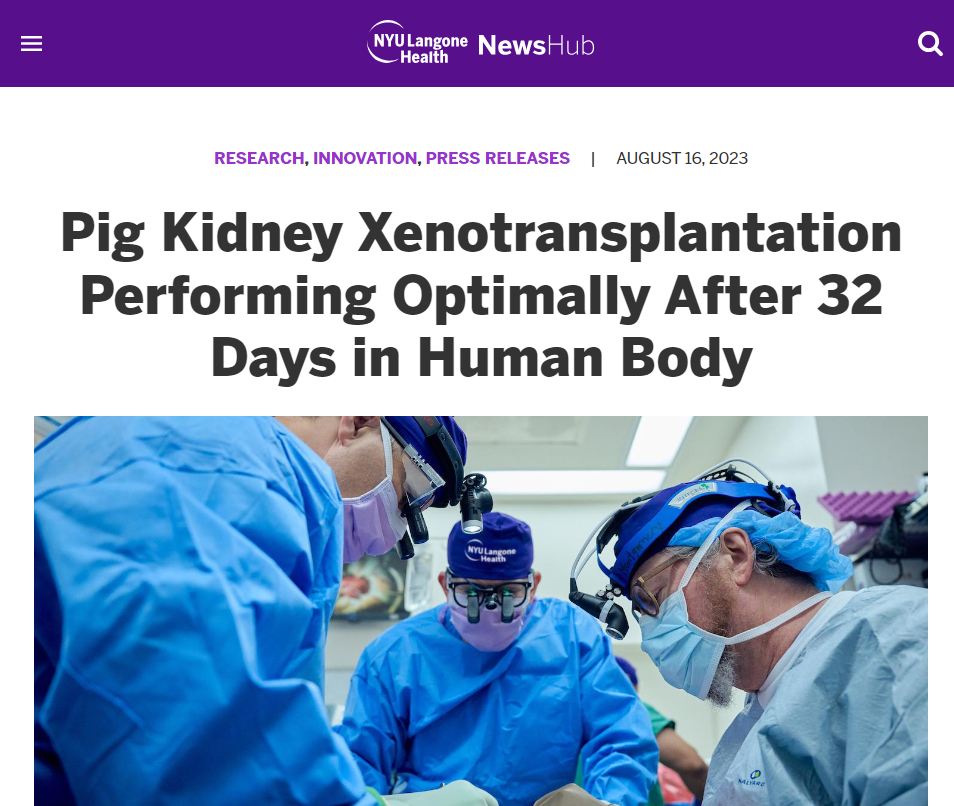
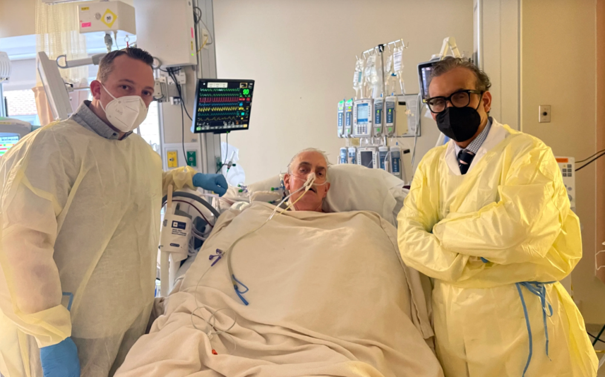

# 美国的猪肾人体移植试验成功撑过1个月，打破该项实验记录时长

**财联社8月17日讯（编辑 史正丞）**
众所周知，器官移植作为诸多终末期器官疾病的最后治疗手段，长期处于需求远远大于供给（器官捐赠）的客观情况。因此，诸多科研团队也把突破的希望放在异种移植领域——尝试着让猪心、猪肾和猪肝在人体中发挥作用。在这方面，本周也出现了一个小小的里程碑事件。

据美联社、华尔街日报等多家媒体周三报道， **纽约大学朗格尼医学中心宣布，在7月14日移植进入一名57岁脑死亡男性Maurice
Miller体内的基因编辑猪肾已经成功撑过1个月，目前仍在正常运作。**

_（来源：纽约大学朗格尼医学中心）_

试验到此并没有结束，经过与Miller家族协商后， **研究人员将继续跟踪猪肾在第2个月的运作情况**
。这也有助于观察现有的抗排异药物，是否对猪肾一样有用。

虽然看上去1个月的时间并不长， **但这已经是有史以来猪肾在人体内持续运作最长的时间了，而且这个纪录还在不断延长。**
此前这家医院曾进行过将猪心、猪肾移植进入人体的试验，但持续时间都在72小时以内，主要目的是为了观察人体免疫系统是否会立即开始攻击猪肾。另外，此前在狒狒身上的猪肾移植试验也显示，手术后14-30天是另一个危险窗口。

朗格尼移植研究所主管罗伯特·蒙哥马利博士对媒体表示：“ **这个（猪的）器官真的能像人类器官一样运作吗？到现在为止看上去像那么回事。** ”

**距离实质性突破的障碍仍有不少**

研究人员也希望，越来越多的特批案例数据能够说服FDA放行这种疗法进入正经的临床试验阶段。但在监管眼里，这种突破性的疗法仍有诸多风险和争议。

目前FDA正在要求各个研究团队补充狒狒试验的额外证据，
**同时监管也认为从脑死亡患者身上得来的数据很难解读，因为造成脑死亡的缘由和诸多生命支持手段都可能影响试验结果**
。FDA发言人表示，承认这种异种移植产品展现出极大的前景，但仍有潜在的风险。

需要说明的是，异种移植是建立在Crispr基因编辑技术上的发展，医学界正在努力为人类定向生产适合用来移植的猪。以蒙哥马利团队为例，他们对试验用猪的基因作出一个修改，该基因能够在猪细胞的表面产生糖分子，可以触发人类免疫系统的攻击。

顺便一提，这个试验跟资本市场也有一点关系。提供基因编辑猪器官的公司叫做Revivicor，是美股上市公司联合治疗（UTHR）的子公司。2020年美国FDA批准基因改造猪作为潜在人类治疗手段的来源，除了器官移植外，这种猪也能作为肉类过敏症患者的食物来源。

_（来源：FDA）_

**早些年科学家曾经将黑猩猩和狒狒视作异种移植的目标，但近年来越来越多的研究都转到猪的身上**
。除了器官大小和功能都与人类接近外，猪还有繁殖能力强的优点，也不太容易将奇奇怪怪的病毒传染给人类。

另外，现有的人体试验也存在伦理和道德的疑问。以今天的案例而言，为了测试异种器官在人体内工作的时间，需要延长脑死亡受体的生命体征。对于试验对象和他们的家庭而言，也是一种长时间的折磨。而且为了证明这种器官有临床使用的价值，试验的时间势必会变得更长。

与此同时，人类对于猪器官移植的认知也存在各种盲区。去年一月，马里兰大学为一名末期心脏病患者David
Bennett完成人类首次基因编辑猪心移植，但他在术后只存活了两个月。

 _（David Bennett资料图，来源：社交媒体）_

研究团队在《柳叶刀》期刊上发布的研究显示， **移植用的心脏感染了猪巨细胞病毒和猪玫瑰疹病毒，这种病毒不会感染人类细胞，但会引发人体炎症反应。**
研究人员表示，已经改进了对猪器官病毒的检测手段，将用于未来移植进入人体的基因编辑器官。

负责猪心移植手术的穆罕默德·莫希丁教授也对纽约同行的试验提出了自己的见解。他认为，
**目前并不清楚脑死亡状态下的人体，能否充分展现真实人体对猪器官的应答，不过这项研究教育了大众有关异种移植的知识，这样未来就不会对类似的事情感到震惊。**

（财联社 史正丞）

