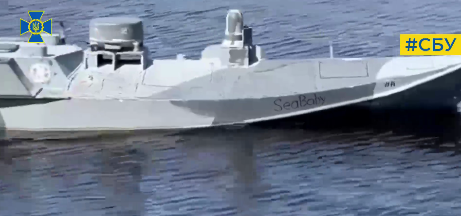
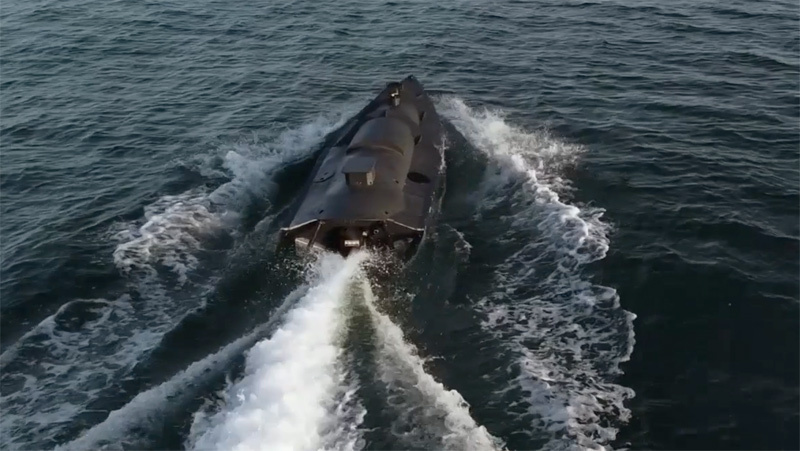

# 美媒：乌方公布袭击克里米亚大桥的新型无人艇，可载850公斤炸药

【环球网报道 见习记者
黄泽佳】美国“动力”网站当地时间16日报道称，乌克兰国家安全局（SBU）16日首次通过社交媒体Telegram公开曾在上月17日袭击克里米亚大桥的“海婴”无人艇的画面。

_“海婴”自杀无人艇 图源：乌克兰国家安全局社交媒体_

报道称，根据乌国家安全局局长马柳克的说法，“海婴”无人艇于2022年2月乌克兰危机爆发后开始研发，全部在乌克兰本土设计和制造。这种无人艇采用深V船型，带有可全向观察的光学传感器，并配备了卫星通信系统，可在后方人员控制下展开超视距打击。美国有线电视新闻网（CNN）15日也曾报道称，“海婴”无人艇可携带850公斤炸药，用于攻击桥梁等加固目标。其炸药装载量明显高于乌方此前通过CNN发布的另一款可装载450公斤炸药的小型无人艇。

_乌军自杀无人艇正在进行测试 图源：美国“动力”网站_

此外，乌国家安全局局长马柳克表示，乌方近期使用新研发的无人艇，打击了克里米亚大桥、“奥列涅戈尔斯克矿工”号登陆舰以及“白鲑鱼”号油轮。他还宣布乌方对去年10月克里米亚大桥首次遭袭事件负责。

