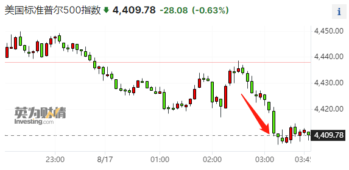

# 美联储会议纪要：通胀存在“上行风险” 可能需要进一步加息

**财联社8月17日讯（编辑 赵昊）** 当地时间周三（8月16日），美联储公布了联邦公开市场委员会（FOMC）7月25日至26日的货币政策会议纪要。

会议纪要写道，大多数与会者继续认为， **通胀存在显著的上行风险，可能需要央行进一步收紧货币政策。**
一些与会者评论道，“美国经济活动具有韧性，劳动力市场保持强劲，但经济活动仍存在下行风险，失业率则存在上行风险。”

纪要发布后，美国国债收益率继续走高，美元进一步上涨。标普500指数扩大跌幅，现货黄金价格跌破每盎司1900美元的关口。

回顾三周前的那场会议，美联储于7月26日宣布加息25个基点，将联邦基金利率目标区间升至5.25%-5.5%，为2001年以来的最高水平。这是美联储自去年启动本轮加息进程以来的第11次加息，累计幅度达到了525个基点。

纪要显示，FOMC的11名票委一致同意了加息，但 **这一决定并没有获得所有与会者的支持**
，其中有两人更倾向于维持利率不变。整体来看，与会者普遍强调，过去一系列货币紧缩政策对经济的累积影响存在高度不确定性。

与会者一致认为 **通胀“高得令人无法接受**
”，但也有“一些初步步迹象表明通胀压力可能正在减弱”。他们还预计，经济增长将放缓，失业率可能会有所上升。不过好消息是，
**经济学家们撤回了早些时候“今年将陷入温和衰退”的预测。**

日内，得益于新屋开工数和工业产出数据双双强于预期，亚特兰大联储GDPNow模型再次上调了对美国第三季度实际GDP的增速预期——年化环比增速有望达到5.8%，昨日的增速预期为5.0%。

纪要还写道，未来的决策将根据数据来确定。这与鲍威尔在新闻发布会上说法相呼应，当时他强调，“尚未就任何一次未来会议做出决定，我们可能会在9月份加息，但也有可能维持利率不变。”

当时，委员们强调了紧缩政策松动过快（降息）和通胀上升的双重风险，担心“过早宣布胜利”可能会重蹈过去的严重错误。而另一方面，他们也看到了由于政策过度紧缩可能导致经济收缩的风险。

与会者还预计，未来几年总体和核心个人消费支出价格通胀将下降，其中大部分降幅预计将发生在今年下半年。随着供需失衡继续得到解决，预计2024年通胀将进一步缓解，到2025年，PCE涨幅预计为2.2%，核心PCE预计为2.3%。

信贷方面总体而言，大多数企业和家庭的信贷质量仍然稳固。虽然一些部门的信贷质量出现恶化迹象，例如商业地产的办公部门，但拖欠率总体上仍接近疫情前的低点。截至一季度末，银行资产负债表上的信贷质量仍然良好。

“美联储传声筒”Nick
Timiraos最新撰文称，大多数美联储官员上个月支持加息，但一些人担心可能会将利率提高得过高，凸显出美联储对进一步加息的谨慎态度。

Timiraos认为，一些美联储官员担心，在劳动力市场紧张使工人能够谈判获得较高工资之下，潜在价格压力可能会变得更持久，从而使进一步减少通胀变得更加困难。

（财联社 赵昊）

